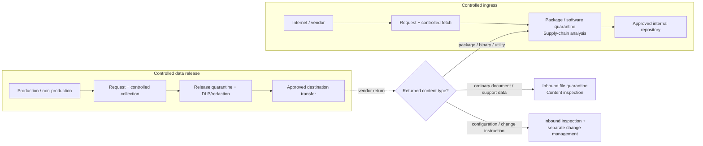

# Enterprise Controlled Artifact Intake and Operational Data Release — Reference Architecture

> **Status: draft reference architecture and POC design, not a deployed control environment.** This repository documents proposed designs for two related enterprise control problems: **controlled software/artifact ingress** and **controlled operational-data release/cross-domain transfer**. Nothing in this repository should be treated as a production control until it has been implemented, tested, approved, and operated under the organisation's governance processes.
>
> The original package-intake architecture still has **9 open package/security architecture decisions**. Three additional proposed decisions now cover the new repository/data-release domain: [ADR-0013](adr/0013-separate-ingress-and-data-release-control-planes.md) (control-plane relationship), [ADR-0014](adr/0014-controlled-data-release-sourcing-strategy.md) (data-release sourcing strategy), and [ADR-0015](adr/0015-data-release-evidence-store-boundary.md) (evidence-store boundary). That makes **12 open architecture/sourcing decisions repository-wide**. See [`adr/README.md`](adr/README.md).

This repository describes a broader **controlled cross-boundary file movement** architecture with two distinct security directions.

## Domain 1 — Controlled software and artifact ingress

The package-intake architecture covers enterprises that need to download packages, binaries, libraries, containers, installers, models, firmware, vendor updates, and related artifacts from the internet while reducing supply-chain risk.

The target model uses a restricted egress path, request and approval workflow, quarantine repository, integrity and provenance verification, malware screening, cooling-off delay, isolated testing, promotion to a final approved repository, and continuous re-evaluation after approval.

The architecture enforces a single controlled intake path for artifact types used by desktop, server, developer, and AI/ML teams. Endpoints and pipelines consume approved artifacts from internal distribution points rather than retrieving them directly from arbitrary internet sources.

Three analysis paths are defined:

- open-source packages and container images, using SBOM and vulnerability analysis;
- proprietary binaries, installers, firmware, and vendor updates, using vendor evidence and platform-specific verification;
- AI/ML model artifacts, using immutable revision capture, safe-format rules, model evidence, and resource-limited checks.

A cross-cutting post-approval re-evaluation process addresses newly discovered supply-chain compromise, updated detections, signature or publisher concerns, and mutable-source-reference drift.

## Domain 2 — Controlled operational-data release and cross-domain transfer

Operational troubleshooting creates the inverse problem: internal logs, traces, diagnostic bundles, crash dumps, packet captures, configuration extracts, database extracts, and other support data may need to move from production or non-production environments to:

- an internal operational-assurance/support file location;
- a test, development, laboratory, or other lower-trust network;
- an external vendor support portal or managed partner endpoint.

This control plane is primarily concerned with **confidentiality, data minimisation, destination authorisation, redaction, and trust-boundary integrity** rather than software supply-chain provenance.

The proposed model uses:

- request and approval to collect;
- least-privilege controlled collection;
- release quarantine;
- file/archive and malware inspection;
- secrets detection and DLP/data classification;
- redaction, sanitisation, and minimisation where required;
- a separate final release approval bound to the exact final hash and destination;
- Managed File Transfer / transfer-broker semantics with no general network routing;
- transfer receipts, expiry, and purge;
- an explicit rule that **transfer authorisation is not change authorisation**.

A transferred script, configuration, infrastructure-as-code file, SQL script, network configuration, or other change-capable content must remain inert in the destination staging location and require a separate privileged/change-management process before it can be applied.

Files returned by a vendor after an outbound support interaction do **not** inherit trust from that support case. The return path is selected by content type: package/software/binaries return through package intake; ordinary documents/support data require secure inbound file quarantine/content inspection; configuration or change-capable content additionally requires the normal change-management and privileged-access process. If a generic secure-file-ingress capability has not yet been implemented, ordinary returned files must remain blocked in inbound quarantine rather than being treated as trusted.

## High-level relationship

The two domains can share identity, workflow, evidence, object storage, malware scanning, monitoring, and policy infrastructure, but they use different lifecycle states and approval semantics.

## Documents in this repository

### Core architecture

| Document | Purpose |
|---|---|
| [`package-intake-architecture.md`](package-intake-architecture.md) | **Ingress architecture.** The control-focused target architecture for packages/software/models: stages, control objectives, data flows, artifact paths, and the artifact lifecycle state machine. Product-neutral where possible. |
| [`controlled-data-release-architecture.md`](controlled-data-release-architecture.md) | **Outbound/cross-domain architecture.** Functional and non-functional security requirements for operational logs/data, controlled collection, release quarantine, DLP/secrets inspection, redaction, destination binding, cross-domain transfer, audit, and prevention of catastrophic changes through the transfer channel. |
| [`solution-architecture-tooling.md`](solution-architecture-tooling.md) | Detailed implementation guide for the package-intake architecture: specific tools, licensing/edition trade-offs, deployment commands, and phased rollout plan. |
| [`controlled-data-release-tooling.md`](controlled-data-release-tooling.md) | **Implementation/procurement companion.** Capability categories and build/buy/hybrid patterns for controlled collection, DLP, secrets detection, redaction, release quarantine, Managed File Transfer, destination-side protections, and integration with existing package-intake platform services. Its working sourcing direction is tracked in ADR-0014. |
| [`architecture-tooling-review.md`](architecture-tooling-review.md) | Independent review of the package-intake architecture/tooling documents, tracked as a living document with resolution and outstanding-work status. |
| [`enterprise-build-vs-buy-evaluation.md`](enterprise-build-vs-buy-evaluation.md) | Enterprise requirements and build/buy/hybrid analysis for **controlled software and file ingress**. It remains intentionally ingress-scoped; controlled-data-release sourcing is tracked separately in ADR-0014 and `controlled-data-release-tooling.md`. |
| [`adr/README.md`](adr/README.md) | **The decision register.** Architecture Decision Records — one file per undecided or settled cross-cutting architecture/sourcing decision. |

### Proof of concept and demonstration

| Document | Purpose |
|---|---|
| [`poc-deployment-plan.md`](poc-deployment-plan.md) | The deliberately reduced package-intake POC scope: identity model, container/VM topologies, sizing, use cases, failure simulations, acceptance criteria, and alternatives considered. |
| [`poc-build-runbook.md`](poc-build-runbook.md) | Package-intake POC build procedure, service layout, safe test fixtures, operating runbook, demo script, troubleshooting, reset, and shutdown actions. |
| [`controlled-data-release-poc.md`](controlled-data-release-poc.md) | **POC extension and demo runbook.** Adds a synthetic production log source, release quarantine, deterministic secrets/DLP findings, redaction, destination binding, mock OA/vendor destinations, hash/destination substitution tests, vendor-return routing, and a demonstration that file transfer cannot automatically execute a change. |

## Supporting materials

| Material | Purpose |
|---|---|
| [`slide-decks/`](slide-decks/) | Management-level briefing slide decks derived from the package-intake documents. Presentation aids, not authoritative documentation; the markdown architecture documents are the source of truth and take precedence if the two ever diverge. |

## Recommended reading order

### To understand the full repository

1. Read this README for the two-domain model.
2. Read [ADR-0013](adr/0013-separate-ingress-and-data-release-control-planes.md) to understand why ingress and data release are proposed as sibling control planes rather than one generic file lifecycle.
3. Read the architecture relevant to the use case:
   - [`package-intake-architecture.md`](package-intake-architecture.md) for external packages/software/artifacts entering the enterprise;
   - [`controlled-data-release-architecture.md`](controlled-data-release-architecture.md) for internal operational data leaving a trust zone or crossing to another network.
4. Check [`adr/README.md`](adr/README.md) for open architecture/sourcing decisions before treating any working assumption as final.

### For package/software ingress

1. `package-intake-architecture.md` — target control model.
2. `architecture-tooling-review.md` — review findings and resolution status.
3. `enterprise-build-vs-buy-evaluation.md` — ingress sourcing strategy and commercial/open-source/hybrid options.
4. ADR-0012 — confirm the ingress build/buy/hybrid direction.
5. `solution-architecture-tooling.md` — detailed implementation options.
6. `poc-deployment-plan.md` then `poc-build-runbook.md` — demonstration implementation.

### For operational-data release / troubleshooting

1. `controlled-data-release-architecture.md` — functional and security requirements, lifecycle, and cross-domain boundaries.
2. ADR-0013 — confirm the sibling-control-plane structure.
3. ADR-0014 — confirm the data-release build/buy/hybrid sourcing strategy.
4. ADR-0015 — confirm the evidence-store/schema boundary.
5. `controlled-data-release-tooling.md` — implementation and procurement capability map.
6. `controlled-data-release-poc.md` — deterministic demo design and runbook.

## POC recommendation in one paragraph

Keep the existing containerized package-intake POC as the first demonstration: Keycloak, a small request/approval portal, PostgreSQL, an S3-compatible object store, a hardened fetch worker, ClamAV, YARA, and optional Syft/Grype, using a local mock source for deterministic happy and failure paths. Then add the controlled-data-release POC as a second workflow using the same identity/evidence foundations: a mock production log source, controlled collector, release-quarantine bucket, deterministic secrets/DLP scanner, redaction worker, fixed destination profiles, a mock OA destination, and a mock vendor portal. Demonstrate both directions back-to-back: **dangerous/untrusted bytes coming in** and **sensitive internal bytes going out**, including a negative test proving that a transferred script remains inert and cannot automatically apply a network/system change.

## Architectural boundary to preserve

The most important cross-domain rule introduced by the new use case is:

> **Authorisation to move a file is not authorisation to execute it, deploy it, import it, or apply a configuration change.**

Collection accounts, transfer accounts, platform administrators, business approvers, and destination privileged administrators should remain separate roles with separate permissions. The transfer platform must not create general routed connectivity or an interactive administrative bridge between security zones.
