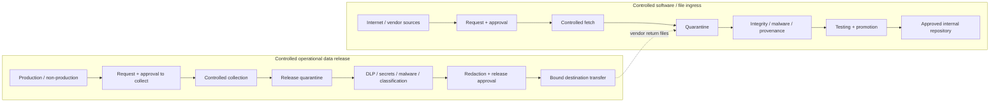
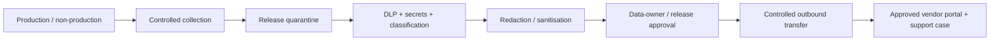
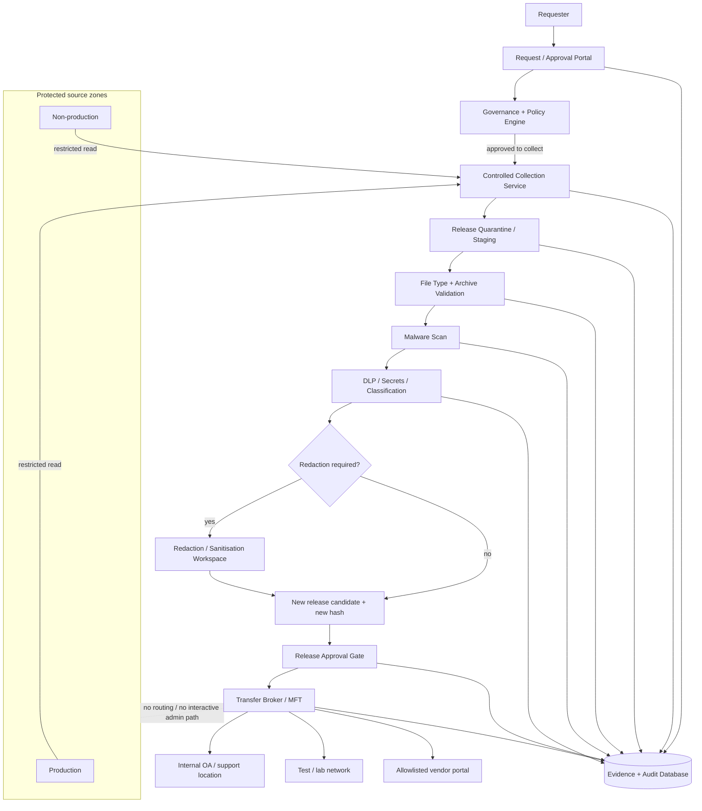
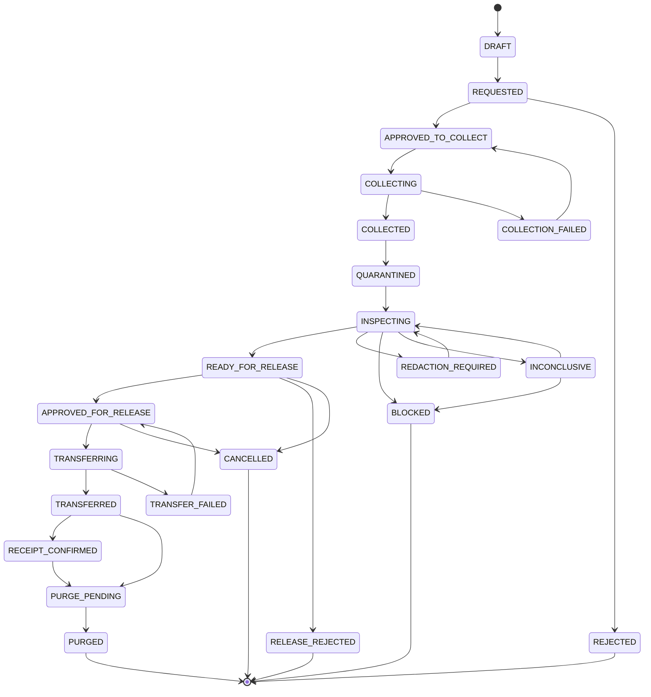
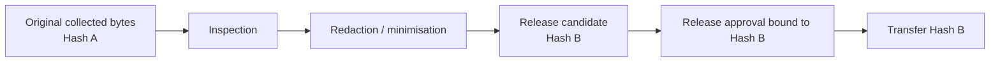

# Controlled Operational Data Release and Cross-Domain Transfer — Reference Architecture

## Document control

| Field | Value |
|---|---|
| Document title | Controlled Operational Data Release and Cross-Domain Transfer — Reference Architecture |
| Version | 0.1 |
| Status | Draft for architecture and security review |
| Owner | Security Architecture |
| Last updated | 2026-08-10 |
| Related documents | [`package-intake-architecture.md`](package-intake-architecture.md), [`solution-architecture-tooling.md`](solution-architecture-tooling.md), [`controlled-data-release-poc.md`](controlled-data-release-poc.md), [`adr/0013-separate-ingress-and-data-release-control-planes.md`](adr/0013-separate-ingress-and-data-release-control-planes.md) |

> **Status: draft reference architecture, not a deployed control environment.** This document defines a sibling control plane to the package/software intake architecture. It covers outbound and cross-domain movement of operational data such as logs, traces, crash dumps, packet captures, configuration extracts, diagnostic bundles, database extracts, and troubleshooting files. It does not authorise a transfer merely by describing it; implementation, policy approval, data classification, legal/privacy requirements, and operational ownership remain required.

---

## 1. Purpose

The existing package intake architecture controls **untrusted-to-trusted ingress**: packages, binaries, libraries, models, installers, updates, and other external artifacts are requested, acquired through a controlled path, quarantined, inspected, approved, and distributed internally.

Operational troubleshooting creates the inverse problem. Engineers and support teams may need to move internal data:

- from production to an internal operational-assurance or support network;
- from production to a lower-trust test, development, laboratory, or vendor-support network;
- from non-production to another segmented network;
- from an internal environment to an external vendor support portal;
- from an external vendor back into the enterprise after analysis or remediation.

The primary risks are therefore different. The principal questions are:

1. **Is the requester authorised to collect these bytes from the source environment?**
2. **What sensitive information is present?**
3. **Is the proposed destination permitted to receive it?**
4. **Has the release bundle been inspected, redacted, sanitised, and approved?**
5. **Can the transfer occur without creating an administrative or routable bridge between security zones?**
6. **Can transferred content be prevented from automatically executing or applying a catastrophic change?**
7. **Can the organisation prove exactly what was released, by whom, to where, and under which business purpose?**

This architecture answers those questions through a dedicated **controlled data release** lifecycle rather than treating logs and diagnostic files as another package-intake artifact class.

---

## 2. Architectural principle: ingress and egress are sibling control planes



The two control planes may share identity, request workflow, audit, object storage, evidence database, security monitoring, and policy engines. They must not share assumptions about what constitutes approval.

**Transfer authorisation is not change authorisation.** Moving a file into another network must never, by itself, permit software installation, script execution, configuration import, firewall changes, infrastructure-as-code execution, database changes, or privileged administration.

---

## 3. Scope

### 3.1 Included data classes

This architecture applies to controlled movement of:

- application, middleware, operating-system, network, database, and security logs;
- traces and diagnostic bundles;
- crash dumps and memory dumps;
- packet captures;
- configuration exports and command output;
- database extracts and diagnostic query results;
- support bundles generated by enterprise products;
- screenshots and diagnostic documents where they contain operational data;
- archives containing any of the above;
- files produced for vendor support, internal troubleshooting, testing, or incident investigation.

### 3.2 Out of scope

This document does not define:

- general-purpose user file sharing;
- enterprise records-management policy;
- ordinary email attachments;
- bulk data-platform replication;
- backup replication;
- software/package acquisition from the internet, which remains governed by `package-intake-architecture.md`;
- implementation of a change into a destination environment after a file has been transferred.

Where an outbound support interaction results in a vendor returning a script, patch, executable, configuration package, diagnostic utility, or other file, the returned content enters the existing ingress/quarantine process. An outbound approval never creates a trusted inbound path.

---

## 4. Primary use cases

### UC-DR-01 — Production to internal OA/support network

An application owner or support engineer needs selected production logs or a diagnostic bundle on an internal operational-assurance, troubleshooting, or file-services network.


Expected controls:

- business justification and case/ticket reference;
- source-system owner approval where required;
- least-privilege collection;
- DLP/secrets inspection;
- malware and file-type inspection;
- release manifest and hashes;
- approved internal destination binding;
- automatic expiry/purge of staging copies.

### UC-DR-02 — Production to test/lab/alternative network

Production data is required to reproduce a fault in a lower-trust test, development, laboratory, or isolated troubleshooting environment.

The key additional requirement is **data minimisation**. Production data should not be copied wholesale merely because the destination is internal. The requester must explain why synthetic data, existing lower-environment data, or a reduced/redacted sample is insufficient.

Additional controls should include:

- elevated approval for production-to-lower-trust movement;
- mandatory redaction or pseudonymisation where feasible;
- scope and record-count limits for structured extracts;
- restricted destination retention;
- destination access limited to the named support/test group;
- prohibition on reusing the released bundle for unrelated testing.

### UC-DR-03 — Internal data to external vendor support portal

Operational data must be uploaded to an external vendor to investigate an incident or fault.



The release must be bound to:

- named vendor;
- approved destination endpoint or managed transfer route;
- support case/reference;
- specific release bundle and its hash;
- time-limited release approval;
- approved retention or deletion expectation where contractually available.

### UC-DR-04 — Vendor return path

A vendor may provide a diagnostic utility, script, configuration file, patch, package, modified binary, or troubleshooting output back to the organisation.

The return path is **not covered by the outbound release approval**. Returned files must follow the appropriate existing ingress process:

- package/software/binary content → package intake/quarantine;
- ordinary documents/data → secure file ingress/content inspection;
- configuration/change instructions → separate change-management and privileged-access process.

---

## 5. High-level architecture



### 5.1 Shared platform services

The data-release control plane may reuse components from the package-intake platform where appropriate:

- enterprise identity provider;
- request/approval portal;
- policy engine;
- evidence database;
- immutable object storage;
- malware scanning;
- YARA/file-type validation;
- audit and SIEM integration;
- workflow orchestration.

It adds data-release-specific capabilities:

- controlled collectors;
- DLP/content classification;
- secrets detection;
- redaction/sanitisation;
- managed file transfer or transfer broker;
- destination binding;
- transfer receipts and confirmation;
- release-specific retention and purge.

---

## 6. Roles and segregation of duties

| Role | Primary responsibility | Must not implicitly receive |
|---|---|---|
| Requester | State business need, source, data type, destination, case/reference | Approval authority or source admin rights |
| Source owner | Confirm collection is permitted from the source system | Release approval merely because they own the source |
| Data owner / release approver | Approve disclosure to the stated destination | Platform administration |
| Security/privacy reviewer | Review elevated-risk findings, sensitive data, exceptions | Ability to alter source logs or silently bypass evidence |
| Collection service | Read only the approved source scope and write release quarantine | Interactive shell, broad domain admin, destination administration |
| Transfer service | Read only approved release bundles and write to approved destination | Source-system administration or arbitrary internet access |
| Platform administrator | Operate the transfer platform | Default right to approve business releases |
| Auditor | Read evidence and history | Workflow mutation |

For sensitive or external releases, the requester, release approver, and transfer-platform administrator should be distinct identities. Emergency workflows may compress roles only under a documented break-glass process with retrospective review.

---

## 7. Functional requirements

The requirements below are deliberately written as testable statements so they can later feed a traceability matrix and POC acceptance tests.

| ID | Functional requirement |
|---|---|
| FR-DR-001 | The solution shall authenticate human requesters through enterprise identity before a release request can be submitted. |
| FR-DR-002 | The solution shall support non-human collection and transfer identities using individually attributable service identities rather than shared accounts. |
| FR-DR-003 | Every request shall record requester, business purpose, source system, source environment, intended destination, expected data type, owner, and expiry/review date. |
| FR-DR-004 | Requests for external vendor transfer shall capture vendor name, support case/reference, approved destination endpoint or transfer route, and expected receiving party where known. |
| FR-DR-005 | The workflow shall distinguish approval to collect from approval to release. |
| FR-DR-006 | Policy shall be able to require additional approval when data originates from production, contains sensitive classifications, is a memory dump/packet capture, or is destined for a lower-trust or external network. |
| FR-DR-007 | Collection shall occur through an authorised collector or constrained service account rather than requiring the requester to receive broad source-system privileges. |
| FR-DR-008 | The collector shall be restricted to the approved source system, path/query/scope, time window, and maximum transfer size where technically feasible. |
| FR-DR-009 | Collected content shall first be written to a controlled release-quarantine location inaccessible to normal consumers. |
| FR-DR-010 | The solution shall calculate and record SHA-256 for each collected file and for the final released bundle. |
| FR-DR-011 | The solution shall identify file type independently of filename extension and shall validate archives recursively to a configured depth. |
| FR-DR-012 | The solution shall scan release candidates for malware before release. |
| FR-DR-013 | The solution shall inspect release candidates for secrets including passwords, API keys, tokens, private keys, certificates with private material, connection strings, and cloud credentials. |
| FR-DR-014 | The solution shall support inspection for PII, customer information, commercially sensitive data, security-sensitive information, and other organisation-defined data classes. |
| FR-DR-015 | The solution shall support explicit `PASS`, `FAIL`, `INCONCLUSIVE`, and `UNAVAILABLE` outcomes for mandatory inspection controls. |
| FR-DR-016 | Policy shall define whether an `INCONCLUSIVE` or `UNAVAILABLE` mandatory control blocks release; the default for external release shall be fail-closed unless an approved exception exists. |
| FR-DR-017 | The workflow shall support redaction, sanitisation, pseudonymisation, record reduction, and removal of individual files from a release bundle. |
| FR-DR-018 | Any redaction or content change shall create a new release-candidate identity and new hash; approval shall apply to the final bytes, not the pre-redaction bytes. |
| FR-DR-019 | The solution shall generate a release manifest identifying files, sizes, hashes, inspection outcomes, redactions, requester, approvers, purpose, and destination. |
| FR-DR-020 | Release approval shall be cryptographically or transactionally bound to the final release-bundle hash and intended destination. |
| FR-DR-021 | The transfer service shall send content only to destinations allowed by the approved request and policy. |
| FR-DR-022 | External destinations shall be allowlisted or represented by managed transfer connectors; arbitrary user-supplied internet destinations shall not be available to the transfer worker. |
| FR-DR-023 | The solution shall support internal destinations such as controlled file shares, object stores, support zones, and test/lab staging locations. |
| FR-DR-024 | The solution shall record transfer time, transfer identity, destination, byte count, outcome, and receipt/confirmation where the destination provides one. |
| FR-DR-025 | Release approvals shall expire and shall not create permanent open transfer permissions. |
| FR-DR-026 | Temporary release-quarantine and transfer-staging copies shall expire and be purged according to policy. |
| FR-DR-027 | Rejected and blocked releases shall retain decision evidence while restricting access to the rejected bytes. |
| FR-DR-028 | The solution shall support an emergency incident workflow with elevated authorisation, explicit reason, time-limited access, and retrospective review. |
| FR-DR-029 | A file returned by an external vendor shall be routed to the appropriate ingress/quarantine process and shall never be treated as trusted solely because a related outbound support case was approved. |
| FR-DR-030 | The solution shall expose an auditable history of every state transition, actor, decision, policy version, scanner version, evidence reference, and exception. |
| FR-DR-031 | The workflow shall allow a release to be suspended or cancelled before transfer when new risk is identified. |
| FR-DR-032 | For structured extracts, the workflow should support limits on record count, query scope, columns/fields, and sampling so data minimisation can be enforced rather than documented only as prose. |
| FR-DR-033 | The requester shall be able to see release status and required remediation without being granted access to other requesters' sensitive release bundles. |
| FR-DR-034 | The system shall support policy-defined legal/privacy/export-control review routing where jurisdiction, contract, classification, or destination requires it. |

---

## 8. Non-functional security requirements

### 8.1 Network and trust-boundary controls

| ID | Security requirement |
|---|---|
| NFR-SEC-DR-001 | The transfer architecture shall not provide general IP routing between source and destination security zones. |
| NFR-SEC-DR-002 | A transfer broker shall not operate as a generic proxy, jump host, SSH bastion, RDP gateway, or SMB bridge between zones. |
| NFR-SEC-DR-003 | Source-side collectors shall initiate only the minimum connections required for collection and evidence submission. |
| NFR-SEC-DR-004 | Destination-side transfer services shall initiate only allowlisted destination protocols and endpoints. |
| NFR-SEC-DR-005 | The source environment shall not be able to use the transfer service as an unrestricted internet-egress path. |
| NFR-SEC-DR-006 | The destination environment shall not gain a routable return path into production through the transfer service. |

### 8.2 Privilege and catastrophic-change prevention

| ID | Security requirement |
|---|---|
| NFR-SEC-DR-010 | Collection identities shall have read-only access to only the approved data scope wherever technically feasible. |
| NFR-SEC-DR-011 | Transfer identities shall not possess source-system administrative permissions. |
| NFR-SEC-DR-012 | Transfer-platform administrators shall not automatically receive business release-approval authority. |
| NFR-SEC-DR-013 | Release destinations shall use non-executable staging locations where the destination platform supports them. |
| NFR-SEC-DR-014 | Transferred files shall not automatically execute, install, import, apply, deploy, or trigger configuration changes solely because they arrived at a destination. |
| NFR-SEC-DR-015 | PowerShell, shell scripts, configuration packages, infrastructure-as-code, SQL, registry files, device configurations, and similar change-capable content shall require a separate change-management and privileged-execution process after transfer. |
| NFR-SEC-DR-016 | A transfer approval shall not be accepted as evidence of approval to deploy or execute the transferred content. |
| NFR-SEC-DR-017 | Shared domain-administrator, root, or equivalent broad administrative credentials shall not be used as the normal mechanism for file collection or transfer. |
| NFR-SEC-DR-018 | Privileged break-glass collection shall be time-limited, strongly authenticated, separately audited, and reviewed after use. |

**Control objective DR-C08 — prevent transfer capability from becoming a change channel:** file-transfer functions must not provide a path for privileged administrative change across security boundaries. Defence in depth should combine no general routing, separate service identities, least privilege, non-executable staging, explicit release destination binding, separate change approval, and full audit.

### 8.3 Data-loss prevention and confidentiality

| ID | Security requirement |
|---|---|
| NFR-SEC-DR-020 | Release candidates shall be scanned for credentials, secrets, keys, tokens, sensitive identifiers, and organisation-defined data classifications. |
| NFR-SEC-DR-021 | Production-to-lower-trust and external-vendor releases shall apply data-minimisation policy by default. |
| NFR-SEC-DR-022 | Memory dumps, core dumps, packet captures, database exports, authentication logs, and identity-system diagnostics shall be classified as elevated-risk data types by default. |
| NFR-SEC-DR-023 | Encrypted/password-protected archives that cannot be inspected shall not receive a clean verdict; they shall be `INCONCLUSIVE` or blocked according to policy. |
| NFR-SEC-DR-024 | Nested archives, archive bombs, excessive compression ratios, malformed files, and parser abuse shall be constrained with maximum depth, size, expansion ratio, and processing time. |
| NFR-SEC-DR-025 | Redaction workspaces shall protect originals from normal consumers and preserve evidence of which transformation produced the final release bytes. |
| NFR-SEC-DR-026 | External release shall be restricted to the minimum data necessary for the stated support purpose. |

### 8.4 Integrity and non-repudiation

| ID | Security requirement |
|---|---|
| NFR-SEC-DR-030 | Exact bytes shall be identified with SHA-256 at collection and again after any transformation. |
| NFR-SEC-DR-031 | The final release approval shall reference the final release hash, destination, request ID, and approval identity. |
| NFR-SEC-DR-032 | Evidence and lifecycle transitions shall be append-only or otherwise tamper-evident. |
| NFR-SEC-DR-033 | The organisation shall be able to demonstrate that the bytes transferred match the bytes approved for release. |

### 8.5 Encryption and key management

| ID | Security requirement |
|---|---|
| NFR-SEC-DR-040 | Data shall be encrypted in transit using organisation-approved protocols. |
| NFR-SEC-DR-041 | Release-quarantine and staging storage shall be encrypted at rest. |
| NFR-SEC-DR-042 | Encryption keys shall be managed through enterprise key-management controls appropriate to the data classification. |
| NFR-SEC-DR-043 | Where file-level encryption is required, key/password exchange shall use an approved channel distinct from an uncontrolled file-sharing path. |

### 8.6 Availability, recoverability, and safe failure

| ID | Security requirement |
|---|---|
| NFR-SEC-DR-050 | Failure of DLP, malware scanning, secrets detection, destination validation, or evidence recording shall not silently downgrade to an allow decision. |
| NFR-SEC-DR-051 | Retries shall be idempotent and shall not create duplicate releases or bypass approval state. |
| NFR-SEC-DR-052 | Evidence records shall survive restart and partial platform outage. |
| NFR-SEC-DR-053 | The platform shall expose sufficient operational metrics to identify stuck requests, scan backlog, transfer failures, purge failures, and policy bypass attempts. |

### 8.7 Audit and monitoring

| ID | Security requirement |
|---|---|
| NFR-SEC-DR-060 | All collection, inspection, redaction, approval, transfer, purge, and exception actions shall produce timestamped audit events. |
| NFR-SEC-DR-061 | Audit events shall record human or service identity, request ID, source, destination, final hash, action, outcome, and policy/evidence references. |
| NFR-SEC-DR-062 | Security monitoring shall alert on repeated blocked releases, attempts to use unauthorised destinations, bypassed inspection, unexpected privileged account use, and failed purge/retention controls. |

---

## 9. Elevated-risk data types

Some diagnostic artifacts should not be treated as ordinary log files.

| Data type | Why risk is elevated | Default handling |
|---|---|---|
| Memory/core dump | May contain passwords, tokens, keys, customer data, decrypted content, process memory | Elevated approval, secrets/DLP scan, strict destination and retention |
| Packet capture | Can contain credentials, payloads, session data, internal topology | Data-owner/security review; protocol/content inspection where feasible |
| Database extract | Often contains bulk regulated or customer data | Minimise fields/rows, pseudonymise, controlled query and retention |
| Identity/authentication logs | May expose usernames, tokens, IPs, authentication patterns | Security review and targeted redaction |
| Configuration export | Can include secrets, SNMP strings, cloud keys, network topology | Secrets scan, remove credentials, separate change control on destination |
| Support bundle | Frequently mixes logs, config, dumps, certificates, and environment data | Treat as compound archive; recursively inspect every member |

---

## 10. Destination binding

An approval should be represented as the conjunction of:

```text
RELEASE BYTES / HASH
        +
SOURCE AND BUSINESS PURPOSE
        +
NAMED DESTINATION
        +
TIME WINDOW / EXPIRY
        +
APPROVAL IDENTITIES
```

An approval to send `support-bundle-123.zip` to Vendor A support case `INC-456` must not authorise the same bundle to be emailed, uploaded to a personal cloud drive, sent to another vendor, or copied into an unrelated test environment.

Destination controls should therefore support:

- allowlisted hostname/URL patterns for vendor portals;
- managed SFTP/MFT partner profiles;
- approved internal file-share or object-store targets;
- destination-side service identities scoped to a specific drop location;
- expiry and revocation of temporary destination authorisation;
- prevention of user-specified arbitrary destinations by the automated transfer service.

---

## 11. Data release lifecycle

The outbound lifecycle is intentionally distinct from the package-intake artifact lifecycle.



### State principles

- `APPROVED_TO_COLLECT` is not approval to disclose.
- `COLLECTED` means exact source bytes were obtained and hashed.
- `QUARANTINED` means the requester cannot yet release the data.
- `REDACTION_REQUIRED` means inspection found releasable data mixed with content requiring removal/transformation.
- `READY_FOR_RELEASE` refers to the final candidate bytes after transformation.
- `APPROVED_FOR_RELEASE` is bound to final hash and destination.
- `TRANSFERRED` means the transfer service completed its operation; it does not mean the vendor actually processed the file.
- `RECEIPT_CONFIRMED` records a destination receipt where available.
- `PURGED` means temporary staging copies have been deleted in accordance with retention policy; audit/evidence records remain according to policy.

### Required evidence by key transition

| Transition | Required evidence |
|---|---|
| `REQUESTED -> APPROVED_TO_COLLECT` | Requester, source, purpose, target data scope, destination, risk classification, distinct approver where required |
| `COLLECTING -> COLLECTED` | Collector identity, source path/query/scope, timestamps, file list, sizes, hashes |
| `QUARANTINED -> INSPECTING` | Job identity, policy version, scanner versions |
| `INSPECTING -> REDACTION_REQUIRED` | Findings and affected files/locations |
| `REDACTION_REQUIRED -> INSPECTING` | Transformation record, new candidate hash, operator/service identity |
| `INSPECTING -> READY_FOR_RELEASE` | Malware, secrets, DLP/classification results and final manifest |
| `READY_FOR_RELEASE -> APPROVED_FOR_RELEASE` | Release approver, destination, final hash, expiry, exception references |
| `TRANSFERRING -> TRANSFERRED` | Transfer identity, endpoint/profile, timestamp, byte count, remote transaction/receipt ID where available |
| `TRANSFERRED -> RECEIPT_CONFIRMED` | Vendor/internal receipt or case reference update |
| `PURGE_PENDING -> PURGED` | Purge job identity, object/version IDs deleted, timestamp, failure-free confirmation |

The evidence database should use an append-only transition history or equivalent tamper-evident model, following the same general rationale as the package-intake lifecycle state machine.

---

## 12. Redaction and transformation model

Redaction must not mutate an already approved object in place.



The organisation should preserve enough evidence to explain:

- what the original collection contained;
- which finding required redaction;
- what transformation was performed;
- who or what performed it;
- which final bytes were approved;
- whether the original bytes were retained, for how long, and under what access controls.

---

## 13. Preventing catastrophic change through the transfer channel

This architecture treats **file movement** and **privileged change** as separate security capabilities.

A file landing in a destination network should behave as inert content. For example, a transferred `disable-firewall.ps1`, `terraform.tf`, `router-config.txt`, `schema.sql`, `registry.reg`, or Kubernetes manifest must not execute or apply merely because it has been transferred.

Recommended design controls:

1. destination is a staging/drop location, not a live configuration directory;
2. staging locations are non-executable where feasible;
3. transfer service has no deployment/orchestration privileges;
4. no hooks automatically execute newly arrived files;
5. destination administrators use separate privileged identities;
6. actual implementation requires the destination's normal change-management process;
7. code/configuration content remains subject to local security validation before execution;
8. audit clearly distinguishes `TRANSFERRED` from `DEPLOYED` or `APPLIED` — the latter states do not belong to this lifecycle.

This separation is intended to limit the blast radius of both operator error and a compromised transfer platform.

---

## 14. File and archive handling

The release-inspection stage should implement:

- MIME/magic-based type identification;
- archive recursion with bounded depth;
- maximum compressed and expanded size;
- maximum file count;
- compression-ratio limits;
- parser timeouts and memory limits;
- detection of extension/type mismatch;
- policy for encrypted/password-protected content;
- duplicate-file/hash handling;
- quarantine of malformed or unsupported content;
- malware scanning;
- YARA/signature scanning where appropriate;
- secrets and DLP inspection.

An uninspectable file is not equivalent to a clean file.

---

## 15. Business process requirements

A technically secure transfer can still leak data if business ownership and release accountability are weak. The process should therefore require:

- a named business/technical owner for the source system;
- a stated reason why the data is required;
- confirmation that a smaller or synthetic dataset is insufficient where production data is moving to lower-trust environments;
- a named destination and support case/project/reference;
- a defined recipient group;
- classification/privacy/legal routing where required;
- release expiry and retention expectations;
- a record of the data owner/release approver;
- evidence that the final release candidate is the object actually approved;
- closure or purge action after the troubleshooting activity completes.

### Emergency troubleshooting

Incident response may require faster handling, but the process should remain controlled. A break-glass release should require:

- incident number;
- named incident commander or delegated approver;
- narrowly scoped collection;
- time-limited approval;
- full logging;
- no bypass of mandatory malware/DLP controls unless an explicitly recorded exception is authorised;
- retrospective review within an organisation-defined period.

---

## 16. Audit record example

A completed transfer should be reconstructable from evidence similar to:

```text
Release ID:        DR-2026-001482
Requester:         user@example
Source:            PROD-APP-17
Source scope:      /var/log/app/* 10:00-11:00 UTC
Purpose:           Vendor troubleshooting
Vendor:            ExampleVendor
Vendor case:       INC-928211

Original files:    7
Original bytes:    143,219,118
Original bundle:   SHA256:...

Inspection:
  Malware:         PASS
  Secrets:         3 findings
  DLP:             12 customer identifiers
  Archive:         PASS

Transformation:
  Files removed:   2
  Redactions:      43
  Final bundle:    support-bundle-redacted.zip
  Final SHA256:    ...

Collection approver: ...
Release approver:    ...
Transfer identity:   svc-transfer-vendor-a
Destination profile: vendor-a-support
Transferred at:      ...
Remote receipt:       ...
Purge completed:      ...
```

---

## 17. Security monitoring and abuse cases

Monitoring should explicitly detect or investigate:

- repeated requests for unusually broad production data;
- attempts to bypass redaction by renaming or encrypting archives;
- requests to send data to destinations not associated with the stated vendor/project;
- attempts to use transfer workers as arbitrary internet proxies;
- privileged interactive logins using service identities;
- files changed after approval but before transfer;
- transfer of a hash that does not match the approved hash;
- requests created and approved by the same identity where separation is required;
- unusually large or repeated memory dumps/packet captures;
- purge jobs that fail or leave staging data behind;
- vendor-return files copied directly into production without ingress review;
- executable/configuration files placed into auto-run or live configuration directories.

---

## 18. Retention and purge

Retention should distinguish **evidence** from **released bytes**.

- Audit and approval evidence may require long retention for investigation, legal, or compliance reasons.
- Release-quarantine originals should be retained only as long as necessary for review/investigation and according to data classification.
- Final transfer staging copies should expire after the support/test need is complete.
- Vendor-retention expectations should be captured where contracts or portal capabilities provide them.
- Purge failures must be visible and retried; expiry should not be a metadata-only state while bytes remain broadly accessible.

---

## 19. Technology capability categories

This architecture is product-neutral. A production implementation typically needs capabilities from several categories:

| Capability | Purpose |
|---|---|
| Identity / SSO / MFA | Human and service identity, role mapping, strong authentication |
| ITSM / request workflow | Business justification, approvals, case linkage, expiry |
| Controlled collection | Least-privilege source extraction without broad administrator access |
| Release quarantine / object storage | Isolated staging with immutable/versioned objects and encryption |
| Malware / file inspection | Malware, archive, file-type, YARA/signature checks |
| DLP / content classification | Detect regulated, customer, confidential, or security-sensitive content |
| Secrets detection | Tokens, passwords, keys, connection strings, credentials |
| Redaction / sanitisation | Transform content to the minimum releasable form |
| Managed File Transfer / transfer broker | Bound, auditable transfer across zones and to vendors |
| Policy engine | Risk-based routing and fail-closed decisions |
| Evidence database | Canonical state, findings, hashes, approvals, exceptions |
| SIEM / monitoring | Abuse detection, operational monitoring, investigations |
| Key management | Encryption at rest/in transit and file-level encryption where required |

A build-versus-buy evaluation should treat secure data release / managed cross-domain transfer as a capability domain distinct from package repository and secure file ingress.

---

## 20. Relationship to package intake

The existing package intake architecture remains authoritative for external software and artifact ingress. This document deliberately does not duplicate its supply-chain controls.

Shared principles include:

- explicit request and approval;
- separation of duties;
- immutable hashes and evidence;
- quarantine before release;
- explicit lifecycle states;
- fail-safe handling of inconclusive controls;
- auditable service identities;
- prevention of uncontrolled internet paths;
- separate systems of record for bytes and evidence where appropriate.

The key difference is the security objective:

| Package intake | Controlled data release |
|---|---|
| Prevent malicious/untrusted external bytes entering trusted environments | Prevent sensitive internal bytes leaving authorised trust boundaries |
| Validate provenance, integrity, malware, supply-chain risk | Validate classification, secrets, DLP, destination, minimisation, malware |
| Promote to approved internal repository | Release only to a specifically approved destination |
| Recall unsafe software | Cancel/revoke untransferred release; purge staging; investigate disclosure if already transferred |
| Deployment may be a later separate process | Execution/change is explicitly a later separate process and never implied by transfer |

---

## 21. POC recommendation

The existing package-intake POC can be extended without building a production MFT or DLP estate. The companion [`controlled-data-release-poc.md`](controlled-data-release-poc.md) defines a deterministic demonstration using:

- the existing IdP/request portal pattern;
- a mock production log source;
- a release-quarantine bucket;
- a small secrets/DLP inspection worker using synthetic patterns;
- a redaction step;
- a mock internal destination and mock vendor portal;
- a release approval bound to the final hash and destination;
- explicit proof that a transferred script remains inert and cannot automatically change the destination environment.

The POC should prove the control model and evidence flow, not claim production-grade DLP accuracy or cross-domain certification.

---

## 22. Open decisions

This document introduces several decisions that should be resolved before production implementation:

1. Which data-classification/DLP engine is authoritative for automated release policy?
2. Which source environments require separate source-owner approval before collection?
3. Which data types require mandatory security/privacy review regardless of destination?
4. What destination classes are permitted: OA, test/lab, partner, vendor portal, managed SFTP, removable media?
5. Which Managed File Transfer/cross-domain technology becomes the standard transfer broker?
6. What retention periods apply to original collected bytes, final release bytes, and evidence?
7. What constitutes acceptable redaction for structured data, logs, PCAPs, and memory dumps?
8. Which controls may be bypassed under emergency incident authority, by whom, and for how long?
9. What additional controls apply if a transfer crosses regulatory, national, contractual, or sovereignty boundaries?
10. Should the controlled data-release lifecycle share the existing evidence database schema or use a separate bounded schema with shared identity/audit primitives?

The top-level architectural choice to keep ingress and data release as sibling control planes is tracked in [`ADR-0013`](adr/0013-separate-ingress-and-data-release-control-planes.md).
