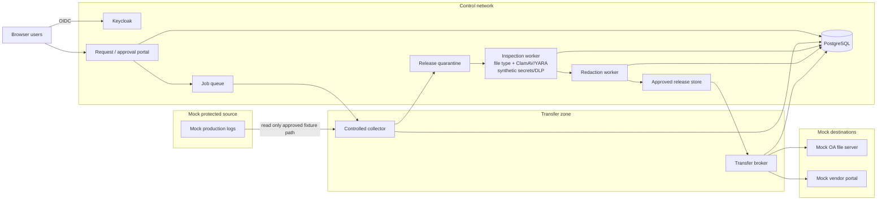

# Controlled Data Release — POC Extension and Demo Runbook

## Document control

| Field | Value |
|---|---|
| Document title | Controlled Data Release — POC Extension and Demo Runbook |
| Version | 0.1 |
| Status | Draft POC extension |
| Owner | Security Architecture |
| Last updated | 2026-08-10 |
| Related documents | [`controlled-data-release-architecture.md`](controlled-data-release-architecture.md), [`poc-deployment-plan.md`](poc-deployment-plan.md), [`poc-build-runbook.md`](poc-build-runbook.md) |

> This document extends the existing package-intake POC with a second, deliberately small workflow for **outbound/cross-domain operational data release**. It is a demonstration design, not a production DLP, Managed File Transfer, or cross-domain solution.

---

## 1. POC objectives

The extension should demonstrate that:

1. a requester must authenticate before requesting an operational-data release;
2. approval to collect is distinct from approval to release;
3. the collector can read only a defined mock source scope;
4. collected bytes are staged in release quarantine and hashed;
5. secrets/sensitive synthetic patterns are detected before release;
6. an unsafe original bundle can be rejected or routed to redaction;
7. redaction creates a new release candidate and new hash;
8. release approval is bound to the final hash and destination;
9. the transfer worker can send only to an approved destination profile;
10. the same approval cannot be reused for a different destination or modified file;
11. a transferred script remains inert in the destination staging area and cannot automatically execute or change the destination environment;
12. vendor-return files are routed back into the existing ingress/quarantine process;
13. audit evidence shows the complete request-to-purge lifecycle.

---

## 2. POC scope

### Included

- existing Keycloak/OIDC pattern or equivalent local IdP;
- existing lightweight request/approval portal pattern;
- PostgreSQL evidence/workflow records;
- a synthetic `mock-production` file source;
- a controlled collection worker;
- separate release-quarantine and release-approved buckets/directories;
- SHA-256 hashing;
- file-type detection;
- ClamAV/YARA where already available in the package POC;
- simple synthetic secrets/DLP detection;
- deterministic redaction;
- destination profiles rather than arbitrary URLs;
- a mock OA/internal destination;
- a mock vendor portal;
- transfer receipt evidence;
- staging expiry/purge;
- a negative test proving that transferred change-capable content is inert.

### Deliberately out of scope

- production-grade DLP classification accuracy;
- real customer or production data;
- real vendor support portals;
- real cross-domain guards;
- production Managed File Transfer HA/DR;
- real privileged production collection;
- legal/privacy workflow integrations;
- full content-disarm-and-reconstruction;
- production memory-dump or PCAP parsing;
- real malware or credentials.

All test fixtures must be synthetic.

---

## 3. Suggested POC topology



### Network intent

The demonstration should visibly enforce these properties:

- `mock-production` cannot use the transfer broker as a general internet proxy;
- the vendor portal cannot route back to `mock-production`;
- the broker does not expose SSH/RDP or an interactive shell between zones;
- the collector and broker use separate service identities;
- only the collector can access the mock source;
- only the broker can access destination profiles;
- normal users cannot read release-quarantine storage directly.

---

## 4. Demonstration users and identities

Reuse the existing POC identity pattern where possible.

| Identity | Role | Allowed actions |
|---|---|---|
| `requester1` | Requester | Submit release request; view own request/evidence summary |
| `sourceowner1` | Source owner | Approve collection from mock production where policy requires it |
| `approver1` | Release approver | Approve/reject final release candidate created by another user |
| `analyst1` | Security analyst | Review findings and approve redaction disposition/exception |
| `admin1` | Platform admin | Operate/reset POC; not a normal business release approver |
| `auditor1` | Auditor | Read workflow/evidence only |
| `svc-collector` | Collection service | Read approved mock source scope; write release quarantine |
| `svc-inspector` | Inspection service | Read quarantine; write findings only |
| `svc-redactor` | Redaction service | Read flagged candidate; write new candidate |
| `svc-transfer` | Transfer service | Read only approved release candidate; write approved destination profile |

The POC should reject self-approval where the same human identity attempts to create and approve the final release.

---

## 5. Suggested synthetic fixtures

Create deterministic fixtures in a `mock-production` directory or container volume.

### `app-clean.log`

Contains only ordinary synthetic log entries.

```text
2026-08-10T08:00:00Z INFO order-service started
2026-08-10T08:01:01Z WARN retrying mock dependency
2026-08-10T08:01:03Z INFO request_id=REQ-0001 result=ok
```

Expected result: `PASS` for the simple secrets/DLP rules.

### `app-sensitive.log`

Contains deliberately fake credentials and fake customer identifiers.

```text
2026-08-10T08:00:00Z INFO user=synthetic.user@example.invalid
2026-08-10T08:00:01Z DEBUG api_key=FAKE-DEMO-API-KEY-DO-NOT-USE-123456
2026-08-10T08:00:02Z DEBUG connection_string=Server=demo;User=demo;Password=FAKE-PASSWORD;
2026-08-10T08:00:03Z INFO customer_id=SYNTHETIC-CUSTOMER-0001
```

Expected result: `REDACTION_REQUIRED`.

### `support-config.txt`

Contains a fake configuration secret.

```text
endpoint=https://example.invalid
client_secret=FAKE-DEMO-SECRET-987654
```

Expected result: `REDACTION_REQUIRED`.

### `disable-firewall.ps1`

Use a harmless text fixture rather than an effective administrative command. For example:

```powershell
Write-Output "DEMO ONLY - this file must remain inert after transfer"
```

Expected result: it may be transferred only to a test destination under an explicit fixture request, and no component automatically executes it. The purpose of the test is to prove **transfer is not execution**, not to test destructive commands.

### `vendor-return-demo.txt`

A harmless file served by the mock vendor portal as a response attachment.

Expected result: direct copying into the approved destination is blocked by process; it is instead submitted to the existing ingress/quarantine workflow.

---

## 6. Simple synthetic DLP/secrets rules

The POC does not need a production DLP engine. Use deterministic patterns sufficient to prove policy routing.

Example finding types:

- `FAKE-DEMO-API-KEY-*` → `SECRET_API_KEY`;
- `Password=FAKE-*` → `SECRET_PASSWORD`;
- `client_secret=FAKE-*` → `SECRET_CLIENT`;
- `SYNTHETIC-CUSTOMER-*` → `CUSTOMER_IDENTIFIER`;
- email addresses ending in `.invalid` → `SYNTHETIC_EMAIL`.

Each finding should record:

- file name;
- finding type;
- severity;
- line/offset where practical;
- policy version;
- scanner version;
- disposition (`redact`, `remove file`, `approved exception`, `block`).

Do not store the full secret value in normal audit logs. A short masked preview or finding fingerprint is enough for the demo.

---

## 7. Minimal workflow states for the POC

Use a reduced form of the reference lifecycle:

```text
DRAFT
  -> REQUESTED
  -> APPROVED_TO_COLLECT | REJECTED
  -> COLLECTING
  -> COLLECTED | COLLECTION_FAILED
  -> INSPECTING
  -> REDACTION_REQUIRED | READY_FOR_RELEASE | BLOCKED | INCONCLUSIVE
  -> READY_FOR_RELEASE
  -> APPROVED_FOR_RELEASE | RELEASE_REJECTED
  -> TRANSFERRING
  -> TRANSFERRED | TRANSFER_FAILED
  -> RECEIPT_CONFIRMED
  -> PURGED
```

### Minimum evidence

| State/transition | Evidence |
|---|---|
| Request | requester, purpose, source fixture/path, destination profile, case/reference |
| Approval to collect | source/release policy decision and distinct actor where configured |
| Collection | collector identity, source path, file list, size, SHA-256 |
| Inspection | file type, malware result, synthetic secrets/DLP findings, policy/scanner versions |
| Redaction | transformation ID, affected files, new SHA-256 |
| Release approval | final hash, destination profile, approver, expiry |
| Transfer | service identity, destination profile, bytes, timestamp, transaction/receipt ID |
| Purge | object IDs removed, purge worker identity, completion timestamp |

---

## 8. Destination profiles

The POC should expose a small fixed set of destination profiles rather than accepting arbitrary URLs.

| Profile | Type | Intended test |
|---|---|---|
| `oa-support` | Internal file/object destination | Production-to-internal support release |
| `test-lab` | Lower-trust internal destination | Data-minimisation and inert-file test |
| `vendor-a-support` | Mock external vendor portal | External release and case binding |

A request for `vendor-a-support` should not be editable after final approval to point at a different host. Changing the destination should invalidate the approval and require a new release decision.

---

## 9. Demo scenarios

### Scenario A — Happy path: clean logs to OA support

1. Sign in as `requester1`.
2. Create a request for `app-clean.log` from the mock production source.
3. Choose destination `oa-support` and provide a synthetic troubleshooting ticket.
4. Approve collection with a distinct approver/source owner.
5. Run collection.
6. Show SHA-256 and quarantine object ID.
7. Run inspection; show all mandatory controls `PASS`.
8. Approve the final hash for `oa-support`.
9. Run transfer.
10. Show the destination receipt and matching hash.
11. Run purge and show that release staging bytes are removed while audit evidence remains.

**Expected result:** complete happy path with no direct user access to quarantine.

### Scenario B — Sensitive log requires redaction

1. Request `app-sensitive.log` for `vendor-a-support`.
2. Approve collection.
3. Inspect the file.
4. Show fake API key/password/customer identifier findings.
5. Confirm that release cannot be approved while the flagged original is the current candidate.
6. Run redaction to remove/mask the synthetic sensitive values.
7. Show that the redacted output has a new hash.
8. Re-run inspection and show `PASS` or an approved residual finding.
9. Approve the **new** hash for `vendor-a-support` and support case `CASE-DEMO-001`.
10. Transfer and show receipt.

**Expected result:** approval applies only to the post-redaction bytes.

### Scenario C — Destination substitution is blocked

1. Prepare and approve a clean final candidate for `vendor-a-support`.
2. Attempt to change the destination to an arbitrary URL or a different destination profile after approval.
3. The transfer API should reject the operation or invalidate the approval.

**Expected result:** release is bound to destination and cannot be replayed to another endpoint.

### Scenario D — Hash substitution is blocked

1. Approve a final candidate hash.
2. Modify the candidate file or substitute another object before transfer.
3. Attempt transfer.
4. Broker re-hashes or verifies object identity and blocks because the current bytes do not match the approved hash.

**Expected result:** transferred bytes must equal approved bytes.

### Scenario E — Transfer does not execute change-capable content

1. Request the harmless `disable-firewall.ps1` fixture for `test-lab`.
2. Complete inspection and explicit release approval.
3. Transfer the file to a read-only/non-executable staging path.
4. Show that no process executes the file automatically.
5. Show that `svc-transfer` has no shell/deployment permission on the destination.

**Expected result:** `TRANSFERRED` is visibly not `EXECUTED` or `APPLIED`.

### Scenario F — Encrypted/uninspectable archive fails closed

1. Submit a password-protected or intentionally unsupported synthetic archive fixture.
2. Inspection returns `INCONCLUSIVE`.
3. Attempt external release without exception.

**Expected result:** release is blocked; uninspectable does not mean clean.

### Scenario G — Vendor return follows ingress controls

1. Complete an outbound vendor-support release.
2. Mock vendor portal presents `vendor-return-demo.txt` or a harmless mock utility as a response attachment.
3. Attempt to use the outbound transaction to place the returned file directly in an approved internal repository/location.
4. Workflow rejects direct trust and creates/submits a new inbound intake request.

**Expected result:** outbound approval never authorises inbound content.

### Scenario H — Self-approval is blocked

1. Sign in as `requester1` and create a release request.
2. Attempt final release approval using the same identity.

**Expected result:** policy denies the action and records the denied attempt.

---

## 10. Demo script

A concise management/security demonstration can be run in this order:

### Part 1 — Show the two control planes

Explain:

- package intake controls dangerous/untrusted data coming **in**;
- controlled data release protects sensitive operational data going **out** or crossing into a lower-trust zone;
- both share identity, audit, quarantine, and evidence concepts;
- the approval semantics differ.

### Part 2 — Happy-path internal troubleshooting

Run Scenario A and show:

- request;
- distinct approval;
- controlled collection;
- inspection;
- final hash;
- destination binding;
- receipt;
- purge.

### Part 3 — Sensitive vendor-support case

Run Scenario B and emphasise:

- original file is not releasable;
- secrets/DLP findings drive redaction;
- transformation creates a new hash;
- only the new bytes are approved;
- transfer is tied to the vendor case/profile.

### Part 4 — Catastrophic-change protection

Run Scenario E and show:

- the transfer service can move the text file;
- it has no ability to execute it;
- destination staging is separate from live configuration/deployment paths;
- a separate privileged/change process would be required to apply any change.

### Part 5 — Return-path control

Run Scenario G to show that a vendor response is treated as new inbound content.

---

## 11. Acceptance criteria

The POC is successful when all of the following are demonstrated:

| ID | Acceptance criterion |
|---|---|
| AC-DR-01 | User authentication and role mapping are enforced. |
| AC-DR-02 | A requester cannot self-approve a protected final release. |
| AC-DR-03 | Collection can access only the configured mock source scope. |
| AC-DR-04 | Collected bytes are hashed before inspection. |
| AC-DR-05 | Release-quarantine content is unavailable to ordinary consumers. |
| AC-DR-06 | Synthetic secrets/DLP findings block or route release to redaction. |
| AC-DR-07 | Redaction creates a new file identity/hash. |
| AC-DR-08 | Final approval records the exact hash and destination profile. |
| AC-DR-09 | Changing the file or destination invalidates/blocks transfer. |
| AC-DR-10 | The transfer broker cannot route traffic between source and destination networks. |
| AC-DR-11 | The transfer service does not have source-system administrative rights. |
| AC-DR-12 | Change-capable content remains inert after transfer. |
| AC-DR-13 | Mandatory `INCONCLUSIVE` inspection blocks external release by default. |
| AC-DR-14 | Transfer outcome and receipt are auditable. |
| AC-DR-15 | Staging bytes can be purged without deleting required audit evidence. |
| AC-DR-16 | Vendor-return files are sent through inbound quarantine rather than trusted automatically. |

---

## 12. Suggested implementation increments

### Increment 1 — Workflow and evidence

- add release request type to the POC portal;
- add release lifecycle tables/state transitions;
- create destination-profile table;
- create audit events;
- create mock source and quarantine buckets.

### Increment 2 — Inspection and redaction

- add file-type check;
- reuse ClamAV/YARA where available;
- add deterministic secrets/DLP patterns;
- add redaction worker;
- ensure redaction produces a new hash/evidence record.

### Increment 3 — Transfer broker

- add `oa-support`, `test-lab`, and `vendor-a-support` connectors;
- enforce destination binding;
- record transfer receipt;
- prohibit arbitrary destination URLs.

### Increment 4 — Negative/security tests

- hash substitution;
- destination substitution;
- self-approval;
- unsupported archive;
- transfer-worker privilege check;
- inert script fixture;
- vendor-return ingress routing;
- purge failure/retry.

---

## 13. Suggested data model additions

A small POC can model the release workflow with tables or equivalent objects such as:

### `release_request`

- `id`
- `requester_subject`
- `business_purpose`
- `source_environment`
- `source_system`
- `source_scope`
- `destination_profile_id`
- `external_case_reference`
- `risk_tier`
- `state`
- `created_at`
- `expires_at`

### `release_object`

- `id`
- `request_id`
- `parent_object_id` for transformed/redacted lineage
- `object_store_key`
- `sha256`
- `size_bytes`
- `file_type`
- `candidate_type` (`original`, `redacted`, `final`)
- `created_at`

### `release_finding`

- `id`
- `release_object_id`
- `scanner`
- `scanner_version`
- `policy_version`
- `finding_type`
- `severity`
- `masked_preview_or_fingerprint`
- `disposition`

### `release_approval`

- `id`
- `request_id`
- `release_object_id`
- `approved_sha256`
- `destination_profile_id`
- `approver_subject`
- `decision`
- `reason`
- `expires_at`

### `transfer_event`

- `id`
- `request_id`
- `release_object_id`
- `destination_profile_id`
- `service_identity`
- `bytes_sent`
- `remote_receipt`
- `started_at`
- `completed_at`
- `outcome`

---

## 14. Troubleshooting guide

### Release stuck in `INSPECTING`

Check:

- scanner worker health;
- queue/job status;
- quarantine object accessibility;
- file size/decompression limits;
- policy version availability.

Do not manually set the request to `READY_FOR_RELEASE` without a recorded disposition.

### Redacted file still produces findings

- show the remaining findings;
- fix the synthetic transformation rule;
- create another transformed candidate with a new hash;
- re-run inspection;
- never edit the approved candidate in place.

### Transfer fails after approval

Check:

- approval expiry;
- destination profile enabled state;
- final object hash still matches approval;
- broker connectivity to the fixed destination;
- service identity permissions.

A retry should reuse the same approved object/destination and idempotency key rather than creating an untracked duplicate release.

### Purge fails

- record the failure;
- keep the request in `PURGE_PENDING`;
- retry with an idempotent purge job;
- alert if the object remains after the retention deadline.

---

## 15. Reset procedure

A demo reset should:

1. delete mock destination files;
2. purge release-quarantine and approved-release fixtures;
3. reset release workflow/evidence records only for the demo namespace;
4. recreate deterministic fixture hashes if fixtures are regenerated;
5. preserve the package-intake POC data unless a full environment reset is explicitly requested;
6. verify mock source files are restored to known-safe synthetic contents.

---

## 16. Production follow-up

The POC is intentionally not a product-selection exercise. A production design should separately evaluate:

- enterprise DLP/content-classification integration;
- secrets detection suitable for logs and diagnostic bundles;
- Managed File Transfer/cross-domain transfer technology;
- source-side collection mechanisms for Windows/Linux/network/database platforms;
- redaction and structured-data minimisation capabilities;
- vendor support portal integrations;
- legal/privacy/export-control routing;
- data residency and sovereignty;
- operational HA/DR and retention;
- SIEM and incident-response integration;
- privileged access boundaries between collection, transfer, and administration.

The reference requirements in [`controlled-data-release-architecture.md`](controlled-data-release-architecture.md) should remain the evaluation baseline even if individual products or implementation patterns change.
