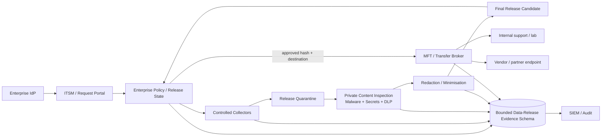

# Controlled Data Release — Tooling and Implementation Guide

## Document control

| Field | Value |
|---|---|
| Document title | Controlled Data Release — Tooling and Implementation Guide |
| Version | 0.2 |
| Status | Draft for architecture and procurement review |
| Owner | Security Architecture |
| Last updated | 2026-08-10 |
| Related documents | [`controlled-data-release-architecture.md`](controlled-data-release-architecture.md), [`solution-architecture-tooling.md`](solution-architecture-tooling.md), [`enterprise-build-vs-buy-evaluation.md`](enterprise-build-vs-buy-evaluation.md), [ADR-0013](adr/0013-separate-ingress-and-data-release-control-planes.md), [ADR-0014](adr/0014-controlled-data-release-sourcing-strategy.md), [ADR-0015](adr/0015-data-release-evidence-store-boundary.md) |

### Revision history

| Version | Date | Author | Summary of changes |
|---|---|---|---|
| 0.1 | 2026-08-10 | Security Architecture | Initial controlled-data-release capability and implementation guide |
| 0.2 | 2026-08-10 | Security Architecture | Reconciled sourcing/evidence decisions with ADRs; strengthened private inspection, human-assisted vendor uploads, disconnected transfer, destination protections, and vendor-return handling |

> This is a companion to the existing package-intake tooling and build-versus-buy documents. It introduces the additional capability domain required for controlled operational-data release, cross-domain transfer, and vendor-support upload. It does not select a production product.
>
> **Decision boundary:** the hybrid pattern described below is a working recommendation, not a ratified sourcing decision. See [ADR-0014](adr/0014-controlled-data-release-sourcing-strategy.md). The evidence-store integration pattern is separately tracked in [ADR-0015](adr/0015-data-release-evidence-store-boundary.md).

---

## 1. Capability model

A production controlled-data-release solution normally spans several product or platform categories. No single category should be assumed to solve the complete problem.

| Capability | What it must provide |
|---|---|
| Request / ITSM workflow | Business justification, source/destination, owner, case reference, risk routing, collection approval, release approval, expiry |
| Identity and privileged access | SSO/MFA, human roles, service identities, least privilege, break-glass controls |
| Controlled collection | Read only approved source scope without granting the requester broad administrative access |
| Release quarantine | Isolated encrypted storage, object immutability/versioning, no normal consumer access |
| File/content inspection | File type, archive recursion, malware, malformed-file handling, parser isolation |
| Secrets detection | Passwords, API keys, tokens, private keys, certificates, cloud credentials, connection strings |
| DLP / classification | PII, customer data, regulated data, confidential data, security-sensitive information |
| Redaction / sanitisation | Mask/remove sensitive content, drop files, minimise structured data, preserve lineage |
| Managed File Transfer / transfer broker | Destination profiles, protocol mediation, audit, receipts, no general routing |
| Secure browser / controlled upload | Restricted human-assisted upload to approved vendor portals when automation is unavailable |
| Policy engine | Risk-based fail-closed decisions, exception handling, destination/classification policy |
| Evidence and lifecycle store | Canonical state, immutable hashes, findings, approvals, transformation lineage, receipts |
| Monitoring / SIEM | Operational health, abuse detection, policy bypass alerts, investigations |
| Encryption / key management | At-rest, in-transit, optional file-level encryption and controlled key exchange |
| Retention / legal hold | Purge, preservation hold, evidence retention, case closure and deletion workflow |

---

## 2. Additional enterprise capability domain

The existing `enterprise-build-vs-buy-evaluation.md` is intentionally scoped to three **ingress** domains: package-manager ingress, general file/software ingress, and business software onboarding. Controlled operational-data release is a separate repository-level capability domain rather than a fourth type of ingress.

### Secure operational-data release and cross-domain transfer

This covers data moving from protected enterprise systems to another internal trust zone or external support party.

Examples:

- production logs copied to an operational-assurance/support network;
- diagnostic bundles copied from production to a test or lab network;
- packet captures or crash dumps supplied to specialist support teams;
- redacted database extracts used to reproduce a fault;
- support bundles uploaded to an external vendor portal;
- partner/vendor exchanges where the outbound data must be inspected and destination-bound;
- transfers to disconnected or highly segmented environments through an approved cross-domain or removable-media process.

**Key requirement:** the organisation must control collection, inspect and minimise the data, bind release approval to exact bytes and an approved destination, transfer through a non-routable audited mechanism, and prevent transfer from becoming an administrative change channel.

This domain is not satisfied by a package repository, antivirus scanner, ordinary file share, generic browser upload, or ITSM approval workflow alone.

---

## 3. Build, buy, and hybrid patterns

The choice between the patterns below is tracked in [ADR-0014](adr/0014-controlled-data-release-sourcing-strategy.md).

### Pattern A — Build a thin release workflow using existing enterprise platforms

Typical composition:

- existing IdP;
- existing ITSM/workflow;
- hardened collection workers;
- object storage for release quarantine;
- existing malware scanner;
- secrets detection and DLP APIs/engines;
- custom policy/orchestration service;
- managed SFTP/HTTPS connectors;
- controlled browser-upload path for unsupported vendor portals;
- evidence database;
- SIEM integration.

**Strengths:** aligns closely to enterprise policy and existing infrastructure; avoids creating another user-facing platform.

**Weaknesses:** integration, evidence correlation, transformation lineage, destination binding, lifecycle correctness, secure human-upload handling, and transfer operations become custom engineering responsibilities.

### Pattern B — Buy Managed File Transfer / secure file exchange and integrate governance

Use a mature MFT/secure exchange platform for transfer, partner profiles, protocol handling, receipts, encryption, and operations; integrate it with enterprise workflow, DLP, secrets inspection, redaction, and evidence storage.

**Strengths:** mature protocol/security operations; strong partner/destination administration; supported transfer features.

**Weaknesses:** MFT alone may not provide source-data minimisation, deep DLP/secrets inspection, redaction workflow, a canonical release lifecycle, or safe collection from protected source systems.

### Pattern C — Buy/reuse secure content inspection/DLP plus MFT, retain a thin control plane

This is the **working recommendation pending ADR-0014**:

- ITSM/identity remain enterprise standards;
- content/DLP/security scanning comes from mature private-processing security platforms where available;
- MFT/cross-domain transfer comes from a supported transfer platform;
- secure-browser or managed-upload controls handle vendor portals that cannot be integrated directly;
- the enterprise owns the policy bindings, canonical release state, evidence correlation, exception model, transformation lineage, and source/destination integrations.

This mirrors the existing repository's ingress analysis without assuming the two domains must choose identical products: buy mature specialist capabilities and avoid rebuilding malware intelligence, file-transfer engines, DLP classification, or repository functions without a strong reason.

---

## 4. Collection tooling requirements

The collection component should be designed separately from the transfer component.

### Required properties

- dedicated service identity;
- source-specific least privilege;
- read-only collection wherever possible;
- explicit allowed path/query/scope;
- maximum bytes/files/records;
- time-window constraints;
- no arbitrary command execution exposed to requesters;
- no use as a general administration proxy;
- hash while collecting;
- capture source-system identity, collection method/query, source timestamps/timezone where available, and collector timestamp;
- write only to release quarantine;
- complete evidence of source scope and collection result;
- support a preservation/legal-hold flag when collected material is incident or forensic evidence.

### Platform patterns

| Source | Preferred collection pattern |
|---|---|
| Linux application/server | Restricted service account, allowlisted paths, agent/API/export job; avoid general root shell |
| Windows server | Restricted service/account access to approved logs/paths; event-log export or application support bundle where feasible |
| Network/security appliance | Vendor/API export, syslog/log archive, restricted support bundle generation |
| Database | Pre-approved read-only diagnostic query/export with field/row limits |
| Kubernetes/container platform | Namespace/workload-scoped log export through platform API/service identity |
| SaaS/cloud service | Provider export/API using scoped service identity and case-specific request |

Collection for ordinary troubleshooting should prefer the smallest useful time range and source scope. Collection for incident/forensic purposes may instead require preservation of an immutable original; the releasable derivative can still be minimised/redacted without overwriting the preserved source copy.

---

## 5. Release-quarantine storage

Release quarantine is conceptually similar to package quarantine but serves a confidentiality objective.

Required controls:

- encryption at rest;
- object versioning or immutable identity;
- deny ordinary requester/consumer direct access;
- separate original and transformed candidate objects;
- malware/DLP workers receive read access only to required objects;
- transfer worker can read only objects in `APPROVED_FOR_RELEASE` state;
- automatic retention/expiry;
- preservation/legal-hold override that prevents purge when required;
- purge evidence;
- storage keys/object IDs linked to canonical SHA-256.

For a POC, separate S3-compatible buckets or filesystem-backed object stores are sufficient. For production, use the organisation's approved secure object-storage platform or an MFT product's secure staging capability only if it can enforce the same lifecycle/evidence requirements.

The working evidence pattern is a shared database platform with bounded sibling schemas and service roles, pending [ADR-0015](adr/0015-data-release-evidence-store-boundary.md). Do not reuse package-intake tables merely because both workflows store state transitions.

---

## 6. Content inspection stack

### 6.1 File and archive inspection

Minimum functions:

- MIME/magic detection;
- extension mismatch;
- archive recursion;
- expansion limits;
- encrypted archive detection;
- malware scan;
- YARA or equivalent pattern scan where useful;
- parser isolation/timeouts.

### 6.2 Secrets detection

A secrets engine should detect, at minimum:

- passwords and common credential assignments;
- cloud access keys;
- API tokens;
- OAuth/JWT/session tokens;
- private keys;
- certificate/private-key bundles;
- database and service connection strings;
- vendor/application-specific secret formats defined by the organisation.

Production selection should prioritise low false-negative risk, support for custom detectors, masking in evidence, and on-prem/private processing for sensitive data.

### 6.3 DLP / data classification

A DLP/classification capability should support policy decisions based on:

- regulated personal data;
- customer identifiers;
- financial/payment data where relevant;
- source code and intellectual property;
- security-sensitive infrastructure information;
- organisation labels/classifications;
- custom dictionaries/patterns;
- destination risk class.

Hash-only public reputation services are not appropriate for DLP because the security question is the content itself, not only whether a file is known-malicious. **Sensitive operational files, extracted text, archive members, or DLP evidence must not be sent to public scanning/AI/content services by default.** Any external processing service requires explicit policy, contractual, residency, and data-classification approval.

Inspection findings and audit events should store masked values or finding fingerprints rather than copying full credentials, tokens, customer records, or sensitive text into logs and evidence systems unnecessarily.

---

## 7. Redaction and sanitisation tooling

Different data types require different techniques.

| Data type | Example minimisation approach |
|---|---|
| Text logs | Pattern masking, field removal, selected time range, selected component only |
| JSON/XML | Remove or transform named fields, preserve schema where needed |
| CSV/database extract | Column/row reduction, pseudonymisation, sampling, tokenisation |
| Support archive | Remove unnecessary members, redact text/config members, rebuild archive |
| Packet capture | Capture filters, time/protocol/host reduction; specialised sanitisation where available |
| Memory/core dump | Prefer targeted diagnostic alternatives; if essential, elevated review and specialised tooling |
| Screenshots/documents | Manual or tool-assisted redaction with verification |

The transformation engine must produce a new object and new SHA-256. Never overwrite an already inspected/approved original in place. When the original is subject to incident-response, forensic, legal, or regulatory preservation, retain that original under restricted immutable hold and release only a separately derived candidate.

---

## 8. Managed File Transfer / transfer broker requirements

The broker is the enforcement point between approved release storage and the destination.

### Mandatory properties

- destination profiles administered separately from requesters;
- no arbitrary user-supplied destination URL at transfer time;
- allowlisted protocol/host/path;
- strong service identity and secret management;
- encryption in transit;
- optional file-level encryption;
- transaction ID/receipt where protocol supports it;
- retry with idempotency;
- maximum transfer size/time;
- no general IP routing;
- no SSH/RDP jump-host role;
- no source-system administrative permissions;
- transfer only when canonical workflow state is `APPROVED_FOR_RELEASE` and hash/destination still match.

### Internal destination examples

- secure object-storage bucket;
- controlled support file share;
- lab/test staging service;
- dedicated troubleshooting enclave.

### External destination examples

- managed vendor SFTP profile;
- vendor HTTPS support upload connector;
- enterprise-managed secure exchange portal;
- partner MFT endpoint.

### Human-assisted vendor portal upload

Some vendor support portals expose only an interactive browser upload and no safe API/MFT integration. That should be treated as a **controlled exception path**, not as permission for a requester to download approved production data to an ordinary workstation and browse freely.

A production human-assisted path should, where practical:

- use a managed upload workstation, VDI/session, secure browser, or equivalent restricted environment;
- allow only the approved vendor hostname/path and required identity-provider endpoints;
- expose only the final `APPROVED_FOR_RELEASE` object to the upload operator;
- re-verify the final hash immediately before upload;
- prevent arbitrary local persistence, re-sharing, clipboard/export, or browsing where the platform supports those controls;
- record the human upload operator, vendor case, destination, timestamp, final hash, and portal receipt/reference;
- remove temporary local/session copies after completion;
- require a new approval if the bundle or destination changes.

Browser upload from an unrestricted endpoint should not become the default architecture simply because it is convenient.

### Disconnected / highly segmented destinations

Where no online transfer path is permitted, use an approved cross-domain guard, transfer appliance, or managed removable-media process rather than ad hoc USB copying. The process should retain the same release semantics: exact approved hash, encryption where required, media/transfer asset identity, chain-of-custody, malware/content inspection before export and after import, destination binding, no auto-execution, and sanitisation/return of reusable media according to enterprise policy.

---

## 9. Destination-side protections

The destination should receive data into a staging location, not a live execution/configuration path.

Required or strongly preferred:

- non-executable mount/location;
- no automatic post-upload hooks;
- no package install/deploy triggers;
- read access limited to the support/test group;
- separate privileged identity required for any later change;
- normal destination change-management controls remain in force;
- local malware/content controls may re-scan on arrival;
- retention/cleanup policy for the destination copy;
- where the destination is intended only for logs/data, deny or separately quarantine executable and change-capable file types by default rather than relying only on "do not execute" procedure.

This is the primary technical control preventing the transfer channel from becoming a catastrophic-change mechanism.

---

## 10. Integration with the existing package-intake platform

Reuse is encouraged where the semantics match.

| Existing capability | Reuse for data release? | Notes |
|---|---|---|
| IdP / OIDC | Yes | Same human/service identity foundation |
| Request portal | Yes, with a separate request type/workflow | Do not reuse package states or fields blindly |
| Evidence database platform | Yes, subject to ADR-0015 | Prefer bounded sibling schemas/service roles rather than shared lifecycle tables |
| Object store | Yes, using separate buckets/policies | Release quarantine has different access/retention semantics |
| ClamAV/YARA | Yes | Malware remains relevant for cross-zone files |
| Package SBOM/SCA | Generally no | Not the primary confidentiality control for logs/data |
| Controlled downloader | No | Outbound release uses controlled collector + transfer broker instead |
| Approved repository | No | Use release-approved staging/destination, not a consumable package repository |
| Recheck/recall | Different | Outbound release focuses on cancel-before-transfer, disclosure response, preservation/purge, and audit |

### Vendor-return content

Do not map every vendor return directly into the package repository workflow. Route by content type:

- package, binary, installer, script utility, patch → package/software intake and quarantine as applicable;
- ordinary document, log, support output, archive → enterprise secure-file ingress/content inspection;
- configuration or change instruction → inbound content inspection **plus** a separate change-management/privileged execution process.

If the enterprise has not yet implemented a generic secure-file-ingress path for ordinary vendor data, hold that content in inbound quarantine and block use rather than treating a support-case association as trust.

---

## 11. Evaluation criteria for procurement

A procurement exercise should score products/integrations against at least:

### Governance

- enterprise SSO/MFA and granular RBAC;
- separation of requester, approver, platform admin;
- API/webhook integration with ITSM/workflow;
- time-limited approvals and exceptions;
- external case/vendor metadata;
- tamper-evident audit;
- legal hold/preservation and evidence retention.

### Content security

- file-type/archive processing;
- malware scanning;
- custom secrets detectors;
- enterprise DLP/classification integration;
- on-prem/private processing options;
- redaction/sanitisation support;
- handling of encrypted/unsupported content;
- large file, PCAP, dump, and archive limits;
- masking/minimisation of findings written to logs/evidence.

### Transfer security

- fixed destination profiles;
- SFTP/HTTPS/object-store/partner connectors as required;
- secure human-assisted browser upload for portals without APIs;
- disconnected/cross-domain/removable-media support where required;
- no general routing requirement;
- encryption and key management;
- retries/receipts/idempotency;
- destination access controls;
- ability to verify exact transferred hash/object;
- support for non-executable staging and destination file-type policy.

### Operations

- HA/DR;
- monitoring and SIEM export;
- retention, preservation hold, and purge;
- API quality;
- upgrade/rollback;
- vendor support;
- data residency/sovereignty;
- throughput and maximum file size;
- predictable licensing/cost at expected transfer volume.

### Vendor / data-processing governance

- where inspection or storage occurs geographically;
- whether content, extracted text, metadata, hashes, or findings are retained by the provider;
- whether provider data may be used for threat intelligence, model training, or service improvement;
- contractual deletion and support-case retention behavior;
- subprocessor and cross-border processing model;
- ability to keep sensitive production files fully on-premises/private when required.

---

## 12. Suggested production architecture pattern

The **working recommendation**, pending ADR-0014, is hybrid: retain enterprise identity, ITSM, policy, canonical release state, and evidence ownership; buy or reuse mature private DLP/content-security and MFT capabilities; build only the orchestration and enterprise-specific control bindings that are not available off the shelf. The working evidence model, pending ADR-0015, is a bounded data-release schema/service role on a shared database platform rather than reuse of package lifecycle tables.

---

## 13. POC mapping

The companion POC uses deliberately simple substitutes:

| Production capability | POC substitute |
|---|---|
| Enterprise IdP | Existing Keycloak POC |
| ITSM workflow | Existing purpose-built POC portal |
| Production source collectors | Mock-production file container + restricted worker |
| Secure object storage | Existing S3-compatible store/separate buckets |
| Malware inspection | Existing ClamAV/YARA |
| Secrets/DLP | Deterministic synthetic pattern scanner |
| Redaction | Simple text transformation worker |
| MFT | Small transfer service with fixed destination profiles |
| Vendor portal | Mock HTTP upload endpoint |
| SIEM | Structured audit events / optional existing observability stack |

This keeps the demonstration deterministic and safe while preserving the architectural boundaries that matter. The POC choices do not resolve ADR-0014 or ADR-0015.
