# Enterprise Package Intake and Approved Repository Architecture

## Document control

| Field | Value |
|---|---|
| Document title | Enterprise Package Intake and Approved Repository Architecture |
| Version | 1.4 |
| Status | Draft for review |
| Owner | Security Architecture |
| Last updated | 2026-04-23 |

### Revision history

| Version | Date | Author | Summary of changes |
|---|---|---|---|
| 1.0 | 2026-04-01 | Security Architecture | Initial draft — core intake workflow and eleven control stages |
| 1.1 | 2026-04-08 | Security Architecture | Added dependency-confusion prevention, sandbox data-handling policy, exception expiry, emergency recall, and metrics |
| 1.2 | 2026-04-15 | Security Architecture | Aligned stage labels to process flow; added artifact-type-specific policy paths |
| 1.3 | 2026-04-22 | Security Architecture | Added proprietary binary intake path (Path B); added inventory data mapping tables per artifact type; clarified that Dependency-Track applies to open-source only |
| 1.4 | 2026-04-23 | Security Architecture | Added Stage 11b retroactive binary recheck; added binary authentication controls (Authenticode, NSRL, MalwareBazaar); updated both flowchart and sequence diagram to show recheck loop; added control objective for post-approval supply chain compromise detection |

---

## Overview

This document describes a controlled software acquisition architecture for enterprises that need to download packages, binaries, libraries, containers, installers, and related artifacts from the internet while reducing supply-chain risk. The target model uses a restricted egress proxy, request and approval workflow, quarantine repository, integrity and provenance verification, malware screening, cooling-off delay, isolated testing, promotion to a final approved repository, and continuous re-evaluation after approval.

The architecture enforces a single controlled intake path for all artifact types across desktop, server, and developer teams. No endpoint, CI system, or pipeline may retrieve packages directly from the internet. Approved tools consume artifacts only from the internal approved repository after each stage of validation, testing, and review has completed and been recorded.

**Two analysis paths exist within this architecture.** Open-source packages and container images support full SBOM generation and continuous CVE re-evaluation via Dependency-Track. Proprietary closed-source binaries — including Microsoft patches, third-party commercial software, firmware, and hardware drivers — cannot yield meaningful SBOMs and follow a vendor-advisory intake path instead. Both paths use the same request portal, quarantine repository, approval gate, and approved repository.

**A third concern — post-approval supply chain compromise — requires controls that neither path above addresses.** SBOM-based tools such as Dependency-Track detect known CVEs in component versions, but they cannot detect a trojanised binary where the version string is correct and no CVE has been published. A backdoored Notepad++ 8.6.4 or a compromised Trivy binary will show as clean in Dependency-Track because the component name and version match a legitimate release. The same is true for any binary that was clean at intake and later identified as part of a supply chain attack campaign. Stage 11b in this architecture addresses this gap through retroactive hash rechecks, updated YARA scans, and binary authentication controls applied periodically against the entire approved artifact inventory.

---

## High-level architecture

```mermaid
flowchart TB
    A[Internet Sources\nPublic registries, vendor sites, Git releases\nMicrosoft Update Catalog, vendor portals] --> B[Restricted Egress Proxy\nAllowlisted outbound access only]
    U[Requesters\nDesktop, Server, Developer teams] --> R[Request and Approval Portal\nTicket, owner, business need, package metadata\nArtifact type declared at intake]
    R --> G[Governance Engine\nApproval rules, policy, risk scoring, separation of duties]
    G -->|Approved fetch request| Q[Quarantine / Intake Repository\nImmutable staging area — all artifact types]
    B --> Q

    Q --> AT{Artifact type?}
    AT -->|Open source / container| V1[Stage 4a · Integrity and Authenticity\nTLS, checksum, signature, provenance\nDep-confusion checks\nAuthenticode verification for PE binaries]
    AT -->|Proprietary binary / firmware| V1B[Stage 4b · Vendor Hash Verification\nCompare against vendor-published checksum\nAuthenticode cert thumbprint check\nNSRL positive-assertion lookup]

    V1 --> V2[Stage 5a · SBOM and SCA\nSyft SBOM generation\nGrype SCA, license scan, secrets scan\nUpload SBOM to Dependency-Track]
    V1B --> V2B[Stage 5b · Vendor Advisory Capture\nRecord KB number, CVEs addressed, vendor severity\nStore in Nexus metadata and CMDB\nNo SBOM — do not create empty DT entry]

    V2 --> V3[Stage 6 · Malware and Sandbox Analysis\nClamAV and YARA — all artifact types\nNSRL and MalwareBazaar hash lookup\nOpen source: VirusTotal hash lookup if policy permits\nProprietary: private CAPE sandbox only]
    V2B --> V3

    V3 --> D[Stage 7 · Cooling-off Delay\n7 to 30 days by risk tier\nEmergency override requires signed risk acceptance]
    D --> T[Stage 8 · Test Pipeline\nIsolated environment, no internet\nSigned test evidence required for promotion]
    T --> P[Stage 9 · Promotion Review\nSecurity and owner sign-off\nExpiry date confirmed\nCMDB entry required for proprietary artifacts]
    P --> F[Final Approved Repository\nNexus Pro — all artifact types\nAll metadata tags and advisory records preserved]

    F --> C[Consumers\nCI/CD, build tools, deployment tools, desktop and server estates]

    F --> I[Inventory and Metadata Store\nOpen source: Nexus plus Dependency-Track\nProprietary: Nexus metadata plus CMDB plus WSUS or SCCM]

    I --> M[Stage 11a · Continuous CVE Recheck\nOpen source: Dependency-Track against updated feeds\nProprietary: vendor bulletin and NVD CPE watches]
    I --> R2[Stage 11b · Retroactive Binary Recheck\nAll artifact types: scheduled hash recheck\nVirusTotal hash API and MalwareBazaar queries\nUpdated YARA re-scan of stored binaries\nNSRL positive-assertion recheck\nAuthenticode recheck for Windows PE binaries\nCAPE targeted recheck on specific IOC alerts]

    M --> N[Notification and Recall\nTickets, owner alerts, blocklist, emergency recall]
    R2 --> N
    N --> C
```



---

## Sequence diagram

```mermaid

sequenceDiagram
    autonumber
    participant Team as Team
    participant Portal as Request Portal (GitLab CE)
    participant Gov as Governance / Approval
    participant Proxy as Restricted Proxy (Squid)
    participant Intake as Quarantine Repo (Nexus Pro)
    participant Scan as Analysis Pipeline
    participant Delay as Delay Policy Gate
    participant Test as Test Pipeline
    participant Repo as Final Approved Repo (Nexus Pro)
    participant Monitor11a as CVE Monitor (Dependency-Track)
    participant Monitor11b as Binary Recheck (scheduled job)

    Team->>Portal: Submit request — name, version, artifact type, owner, justification, environment
    Portal->>Gov: Evaluate policy, risk tier, artifact type path
    Gov-->>Portal: Approve or reject with expiry date
    Portal->>Proxy: Authorised fetch order with source URL
    Proxy->>Intake: Download from allowlisted source only; write intake metadata tags
    Note over Intake,Scan: Path diverges by artifact type
    Intake->>Scan: Open source — checksum, dep-confusion, Authenticode, SBOM, SCA, license, malware
    Intake->>Scan: Proprietary — vendor hash, Authenticode thumbprint, NSRL lookup, advisory capture, ClamAV, YARA, private CAPE
    Scan-->>Intake: Attach metadata, verdicts, SBOM or advisory record, sandbox report to Nexus artifact
    Intake->>Delay: Enforce cooling-off window by risk tier
    Delay->>Test: Release to isolated test environment after hold expires
    Test-->>Gov: Report test results and signed evidence
    Gov->>Repo: Promote artifact and all metadata; create CMDB entry for proprietary artifacts
    Team->>Repo: Consume from internal approved repository only
    Monitor11a->>Repo: Open source — re-evaluate SBOMs against updated CVE feeds (continuous)
    Monitor11a-->>Team: Notify owners of new CVE matches
    Monitor11b->>Repo: Scheduled recheck — extract all hashes from Nexus inventory
    Monitor11b->>Monitor11b: Query VirusTotal hash API for all stored hashes
    Monitor11b->>Monitor11b: Query MalwareBazaar for all stored hashes
    Monitor11b->>Monitor11b: Re-scan stored binaries with updated YARA rulesets
    Monitor11b->>Monitor11b: Recheck NSRL for positive-assertion validation
    Monitor11b->>Monitor11b: Recheck Authenticode signatures for Windows PE binaries
    Monitor11b-->>Gov: Flag any hits — create GitLab recall issue tagged recall::binary-recheck
    Monitor11b-->>Team: Notify named owners of flagged artifacts
    Gov-->>Repo: Block compromised artifact on confirmed hit (403 all requests)
```

---

## Control objectives

- Stop direct internet downloads by enterprise endpoints and pipelines.
- Verify authenticity through hashes, Authenticode signatures, certificate thumbprints, and provenance before any use. For proprietary binaries the primary authenticity controls are vendor hash verification, Authenticode validity, and NSRL positive-assertion lookup.
- Prevent dependency-confusion and namespace-spoofing attacks at the proxy and quarantine layers (open-source path).
- Apply distinct analysis paths based on artifact type: SBOM-based analysis for open-source and container artifacts; vendor-advisory capture for proprietary closed-source binaries.
- Generate SBOM and SCA data for open-source and container artifacts; maintain vendor advisory records for proprietary artifacts.
- Detect malware and suspicious behavior at intake using ClamAV, YARA, MalwareBazaar hash lookup, NSRL lookup, and private sandbox detonation. Use private sandboxing exclusively for all proprietary artifacts.
- Detect post-approval supply chain compromise through a scheduled retroactive recheck job (Stage 11b) that re-queries threat intelligence sources against every stored artifact hash, re-scans with updated YARA rules, and rechecks binary authentication. This controls the threat class that SBOM-based tools cannot see: trojanised binaries where the version string is correct and no CVE has been published.
- Delay risky new releases to reduce exposure to zero-day and short-lived malicious packages.
- Apply license review so open-source artifacts comply with enterprise policy before reaching production.
- Preserve a complete inventory and continuously re-evaluate approved artifacts through the appropriate channel for each artifact type.
- Enforce exception expiry so temporary approvals do not become permanent without re-review.
- Support emergency recall procedures that can be triggered by both CVE feeds (Stage 11a) and binary recheck hits (Stage 11b), with affected-system identification using Dependency-Track (open source) or CMDB (proprietary).

---

## Artifact intake paths

All artifacts enter through the same request portal, egress proxy, and quarantine repository. They diverge at the analysis stage and converge at the promotion gate and approved repository. The artifact type must be declared by the requestor at intake so the pipeline selects the correct path automatically.

### Path A — Open-source packages and container images

Applies to: npm, PyPI, Maven, NuGet, Go modules, Ruby gems, apt/yum packages from public registries, container images from public registries, and any open-source release with published source.

Controls applied in sequence: dependency-confusion check at proxy and quarantine; full checksum and signature verification; Authenticode verification where applicable; SBOM generation in CycloneDX or SPDX format; SCA against NVD, GitHub Advisories, OSV, and Sonatype intelligence; license analysis and legal review gate; secrets scan; ClamAV static scan; YARA pattern matching; MalwareBazaar hash lookup; NSRL positive-assertion lookup; optional VirusTotal hash lookup where policy permits; cooling-off delay; isolated test pipeline; promotion sign-off; SBOM stored in Dependency-Track for continuous CVE re-evaluation after promotion.

### Path B — Proprietary closed-source binaries, commercial software, and firmware

Applies to: Microsoft patches (.msu, .exe, .cab), Windows Update packages, Adobe installers, Oracle database software, SAP components, hardware drivers, firmware updates, commercial ISV software, and any binary where the vendor does not publish source or a machine-readable SBOM.

Syft and similar tools cannot produce meaningful SBOM data from a closed-source binary. An empty SBOM uploaded to Dependency-Track creates false coverage and is worse than no record. This path replaces SBOM generation with vendor advisory capture.

Controls applied in sequence: vendor-published hash verification — mismatch is a hard block; Authenticode signature validity check; Authenticode certificate thumbprint verification against the expected publisher cert stored in the CMDB; NSRL positive-assertion lookup; vendor advisory record capture (KB number, CVEs addressed, vendor severity, affected product versions); ClamAV static scan; YARA pattern matching; MalwareBazaar hash lookup; mandatory private CAPE sandbox detonation regardless of hash match; cooling-off delay; isolated test pipeline; promotion sign-off; CMDB entry created as the ongoing deployment and monitoring record. Dependency-Track is not used for this path.

---

## Binary authentication controls

This section defines the additional authentication controls applied to Windows PE binaries and other signed artifacts at intake (Stages 4 and 6) and during the retroactive recheck (Stage 11b). These controls address the supply chain attack scenario where a trojanised binary has the correct version string but has been tampered with.

### Authenticode signature verification

All Windows PE binaries (.exe, .dll, .msi, .msu) must have their Authenticode signatures verified at intake. Verification checks two things: that the signature is cryptographically valid (the file has not been modified since signing), and that the signing certificate belongs to the expected publisher.

The pipeline stores the expected certificate thumbprint for each approved publisher in the CMDB. At intake, the pipeline extracts the actual signing certificate thumbprint and compares it against the stored expected value. A valid signature from an unexpected certificate is treated as a failure — it may indicate re-signing after tampering.

```powershell
# Verify Authenticode signature and extract thumbprint
$sig = Get-AuthenticodeSignature -FilePath $artifactPath
if ($sig.Status -ne "Valid") {
    throw "Authenticode signature invalid: $($sig.Status)"
}
$actualThumbprint = $sig.SignerCertificate.Thumbprint
$expectedThumbprint = Get-ExpectedThumbprint -Publisher $publisherName
if ($actualThumbprint -ne $expectedThumbprint) {
    throw "Certificate thumbprint mismatch. Expected: $expectedThumbprint Got: $actualThumbprint"
}
```

Known expected thumbprints for common publishers:
- Notepad++ releases are signed by the author's personal code-signing certificate.
- Microsoft patches are signed by a Microsoft certificate chain rooted in the Microsoft Root Certificate Authority.
- Any deviation from the expected thumbprint blocks the artifact.

### NSRL positive-assertion lookup

The NIST National Software Reference Library (NSRL) is a database of known-good hash values for legitimate software releases. Querying the NSRL provides a positive assertion that the specific file being ingested is a known authentic release, not merely that it has not been flagged as malicious.

The NSRL dataset is available for free download as a bulk database and can be loaded into a local PostgreSQL instance for offline queries. This avoids any external API dependency.

```python
def check_nsrl(sha256_hash: str, nsrl_db) -> dict:
    cursor = nsrl_db.execute(
        "SELECT FileName, ProductName, ProductVersion FROM NSRLFile WHERE SHA256 = ?",
        (sha256_hash.upper(),)
    )
    result = cursor.fetchone()
    if result:
        return {"known_good": True, "product": result[1], "version": result[2]}
    return {"known_good": False}
    # Not in NSRL does not mean malicious — novel/niche software may not be indexed
    # Absence of a match requires fallback to other controls, not automatic rejection
```

NSRL coverage is strongest for widely distributed commercial software and well-known open-source releases. Niche tools and internal builds may not be indexed.

### MalwareBazaar hash lookup

MalwareBazaar (abuse.ch, free API) is a database of known-malicious file hashes crowdsourced from the security research community. Querying it at intake and during the retroactive recheck catches files that have been identified as malicious after you approved them.

```python
import requests

def check_malwarebazaar(sha256_hash: str) -> bool:
    response = requests.post(
        "https://mb-api.abuse.ch/api/v1/",
        data={"query": "get_info", "hash": sha256_hash},
        timeout=10
    )
    data = response.json()
    return data.get("query_status") == "hash_found"
    # hash_found means the file is known malicious
    # no_results means not in database — not a clean bill of health
```

### VirusTotal hash lookup

VirusTotal aggregates results from 70+ AV engines. Hash-only lookups do not upload the file and are safe for proprietary binaries. The free API allows 500 lookups per day; the paid API supports bulk queries.

```python
def check_virustotal_hash(sha256_hash: str, api_key: str) -> int:
    url = f"https://www.virustotal.com/api/v3/files/{sha256_hash}"
    headers = {"x-apikey": api_key}
    response = requests.get(url, headers=headers, timeout=10)
    if response.status_code == 404:
        return -1  # Not in VT database — unknown, not confirmed clean
    data = response.json()
    return data["data"]["attributes"]["last_analysis_stats"]["malicious"]
    # Returns count of AV engines flagging the hash as malicious
    # 0 = not flagged, but does not guarantee clean — novel attacks may not be indexed
```

Important: a hash not found in VirusTotal means no one has submitted that file to VT. It does not mean the file is clean. Novel or targeted attacks may never appear. This control catches known campaigns and widely distributed malware, not targeted attacks against your specific organisation.

---

## Inventory and metadata — where data is stored

### System responsibilities

**GitLab CE** is the system of record for the intake request, approval workflow, and audit trail. It holds who requested the artifact, when, why, what approvals were given, when they expire, and all transitions and comments. The GitLab issue number is written as a tag to the Nexus artifact at intake, linking the binary permanently to its approval record.

**Nexus Repository Pro** is the system of record for the artifact itself and its intake provenance metadata. It holds the binary, the hashes, the source URL, the intake timestamp, and the custom metadata tags written during the pipeline run. Every artifact — open-source or proprietary — is stored here. Nexus custom tags carry the requestor name, approver, approval expiry, risk tier, KB number, CVE list, vendor severity, Authenticode thumbprint verified, NSRL result, and MalwareBazaar result directly on the component record.

**OWASP Dependency-Track** is the system of record for SBOM contents, component vulnerability findings, policy violations, and where-used analysis. It is used exclusively for artifacts where a meaningful SBOM exists: open-source packages and container images. Proprietary binaries must not be represented in Dependency-Track with empty SBOMs — an empty entry creates false assurance of coverage.

**CMDB** (ServiceNow, GitLab-hosted database, or Ralph) is the system of record for the deployment inventory of proprietary software and the publisher certificate thumbprint register. It records what commercial software is approved, at what version, which systems have it deployed, the expected Authenticode certificate thumbprint for each publisher, and the vendor advisory subscription reference for ongoing monitoring.

**WSUS / SCCM / Intune** provides deployment tracking and patch compliance reporting for Microsoft Windows updates. It records which machines have which KB applied and flags non-compliant machines.

**Recheck job datastore** (PostgreSQL table or equivalent): stores the results of each Stage 11b retroactive recheck run — artifact hash, recheck date, VirusTotal result, MalwareBazaar result, YARA result, NSRL result, and any recall actions taken. This provides a queryable history of recheck verdicts for audit purposes.

### Data mapping: open-source packages and container images

| Data point | Authoritative store | Notes |
|---|---|---|
| Binary or package file | Nexus Pro | Immutable, hash-verified storage |
| SHA-256 and SHA-512 hashes | Nexus Pro | Stored as component attributes |
| Source URL | Nexus Pro | Original upstream URL from registry or Git release |
| Download timestamp | Nexus Pro | Set at quarantine intake by pipeline |
| Requestor name | Nexus Pro (tag) | Written from GitLab issue at intake |
| Approver name and approval date | Nexus Pro (tag) | Written from GitLab issue at intake |
| Approval expiry date | Nexus Pro (tag) and GitLab issue due date | Both must agree; mismatch flags for review |
| GitLab intake ticket reference | Nexus Pro (tag) | Links artifact to approval record permanently |
| Risk tier | Nexus Pro (tag) | Tier 1, 2, or 3 |
| Target environment | Nexus Pro (tag) | Dev, Test, or Production |
| Lifecycle state | Nexus Pro (repository group) | Quarantine, Dev-approved, or Prod-approved |
| SBOM (CycloneDX or SPDX) | Dependency-Track (primary) and Nexus (attached file) | Generated by Syft or IQ Server at Stage 5a |
| CVE and vulnerability findings | Dependency-Track | Continuously re-evaluated as new CVEs are published |
| Policy violations | Dependency-Track | License, vulnerability severity, and age policies |
| Where-used (which projects use this component) | Dependency-Track | Cross-referenced via SBOM component PURLs |
| MalwareBazaar result at intake | Nexus Pro (tag) | Recorded at Stage 6; updated by Stage 11b recheck |
| NSRL lookup result at intake | Nexus Pro (tag) | known_good / not_indexed — recorded at Stage 6 |
| YARA scan verdict | Nexus Pro (tag and attached JSON) | Updated by Stage 11b re-scan with new rulesets |
| VirusTotal hash result at intake | Nexus Pro (tag) | Engine count; updated by Stage 11b recheck |
| Sandbox detonation report | Nexus Pro (attached file) | CAPE private sandbox for high-risk open-source |
| Stage 11b recheck history | Recheck job datastore | Queryable history of all periodic recheck verdicts |
| Cosign attestation and in-toto link | Nexus (attached) and Rekor (transparency log) | Signs the pipeline steps |

### Data mapping: proprietary binaries, commercial software, and Microsoft patches

| Data point | Authoritative store | Notes |
|---|---|---|
| Binary or installer file | Nexus Pro | Immutable storage |
| SHA-256 and SHA-512 hashes | Nexus Pro | Stored as component attributes |
| Vendor-published hash | Nexus Pro (tag) | From Microsoft Update Catalog, vendor download portal |
| Hash verification result | Nexus Pro (tag) | Pass or Fail — mismatch blocks pipeline immediately |
| Source URL | Nexus Pro | e.g. catalog.update.microsoft.com download URL |
| Download timestamp | Nexus Pro | Set at quarantine intake |
| Authenticode validity result | Nexus Pro (tag) | Valid / Invalid / No signature |
| Authenticode certificate thumbprint (actual) | Nexus Pro (tag) | Extracted at intake, compared against CMDB expected value |
| Expected Authenticode thumbprint | CMDB (publisher certificate register) | Maintained per publisher; updated when publisher rotates cert |
| Thumbprint match result | Nexus Pro (tag) | Match / Mismatch — mismatch blocks pipeline |
| NSRL lookup result | Nexus Pro (tag) | known_good / not_indexed |
| MalwareBazaar result at intake | Nexus Pro (tag) | Recorded at Stage 6; updated by Stage 11b recheck |
| YARA scan verdict | Nexus Pro (tag and attached JSON) | Updated by Stage 11b re-scan |
| VirusTotal hash result | Nexus Pro (tag) | Hash-only lookup; safe for proprietary artifacts |
| Requestor name | Nexus Pro (tag) | Written from GitLab issue |
| Approver name and approval date | Nexus Pro (tag) | Written from GitLab issue |
| Approval expiry date | Nexus Pro (tag) and GitLab issue due date | Both must agree |
| GitLab intake ticket reference | Nexus Pro (tag) | Links artifact to approval record |
| Risk tier | Nexus Pro (tag) | Proprietary binaries default to Tier 1 or 2 |
| KB article or vendor reference number | Nexus Pro (tag) and CMDB | e.g. KB5034441 |
| CVEs addressed by this artifact | Nexus Pro (tag) and CMDB | Sourced from vendor advisory |
| Vendor severity rating | Nexus Pro (tag) and CMDB | Critical, Important, Moderate, or Low |
| Affected product scope | CMDB | Which product versions apply |
| SBOM | Not applicable | Cannot be generated from closed-source binary |
| Ongoing CVE monitoring | CMDB and vendor bulletin subscription and NVD CPE watch | Not Dependency-Track |
| Deployment inventory | WSUS, SCCM, or Intune (Microsoft patches) or CMDB | Records which systems have the artifact installed |
| Private sandbox detonation report | Nexus Pro (attached file) | CAPE private sandbox only — mandatory |
| Stage 11b recheck history | Recheck job datastore | Queryable history of all periodic recheck verdicts |

### Data mapping: firmware and hardware drivers

| Data point | Authoritative store | Notes |
|---|---|---|
| Firmware or driver file | Nexus Pro | Stored as generic binary artifact |
| SHA-256 and SHA-512 hashes | Nexus Pro | Verified against vendor-published hash |
| Vendor advisory or release notes | Nexus Pro (attached) and CMDB | Describes CVEs addressed and affected hardware |
| Authenticode validity | Nexus Pro (tag) | Where applicable for signed drivers |
| NSRL lookup result | Nexus Pro (tag) | known_good / not_indexed |
| MalwareBazaar result | Nexus Pro (tag) | Recorded at intake and updated by Stage 11b |
| Target hardware model and version | CMDB | Which device types and hardware revisions apply |
| Deployment status | CMDB (device inventory) | Which physical devices have been updated |
| Stage 11b recheck history | Recheck job datastore | Queryable history of periodic recheck verdicts |

---

## Security controls by stage

### Stage 1 · Request and approval

- Require package name, exact version, checksum if available, source URL, artifact type declaration (open-source, proprietary binary, firmware, or other), business justification, named owner, intended environment (dev, test, or production), and a scheduled review date.
- The artifact type declaration determines which analysis path the artifact follows, which inventory system holds the ongoing risk record, and which recheck controls apply in Stage 11b.
- Enforce separation of duties so the requestor is not the sole approver for production use.
- Apply different risk tiers based on artifact type and intended use.
- Set an explicit expiry on every approval. No approval persists indefinitely.
- Assign a named owner to every approved artifact. Ownership transfer must be an explicit workflow step.

### Stage 2 · Restricted proxy and egress layer

- Use deny-by-default outbound access with allowlists by domain, path, protocol, and package ecosystem.
- For proprietary binary downloads, allowlist specific vendor domains individually rather than broad ranges.
- Block direct package downloads from endpoints, CI systems, and servers.
- Apply dependency-confusion prevention rules for open-source ecosystems.
- Log every fetch attempt including failures so unauthorised download attempts are visible in the SIEM.

### Stage 3 · Quarantine repository

- Store all newly downloaded artifacts in immutable staging before any team can consume them.
- Preserve original source URL, intake timestamp, transport metadata, and canonical hashes.
- Tag each artifact at intake with its artifact type, risk tier, and GitLab intake ticket reference.
- Store the SHA-256 hash as a searchable component attribute — this is the key used by the Stage 11b retroactive recheck job to query threat intelligence sources.

### Stage 4 · Authenticity and integrity checks

**Path A (open source):** Validate vendor checksums, signatures, certificate chains, notarisation, and provenance data. Check for dependency-confusion indicators. For Windows PE binaries, verify Authenticode signature validity and compare the signing certificate thumbprint against the expected publisher value. Fail closed when integrity claims do not validate.

**Path B (proprietary binary):** Compare the SHA-256 of the downloaded file against the vendor's published catalog hash. Verify Authenticode signature validity. Compare the actual signing certificate thumbprint against the expected publisher thumbprint stored in the CMDB. Perform NSRL positive-assertion lookup. Any of the following blocks the artifact: hash mismatch, invalid Authenticode signature, certificate thumbprint mismatch against the expected publisher. Do not attempt SBOM generation on proprietary binaries.

### Stage 5 · Security analysis

**Path A (open source):** Generate SBOMs in SPDX or CycloneDX format. Run SCA for direct and transitive dependencies. Conduct license analysis. Scan for embedded secrets. Upload SBOM and findings to Dependency-Track.

**Path B (proprietary binary):** Capture the vendor advisory record — KB number or equivalent, CVEs addressed, vendor severity, affected product versions. Store as a structured JSON attachment in Nexus and write summary fields as Nexus component metadata tags. Write the full advisory record to the CMDB entry. Do not create an empty SBOM entry in Dependency-Track.

### Stage 6 · Malware and sandbox screening

- Apply ClamAV static scanning and YARA pattern matching to all artifacts regardless of type.
- Perform MalwareBazaar hash lookup for all artifacts. A positive match (hash found in MalwareBazaar) is a hard block.
- Perform NSRL lookup as a positive-assertion check. Record the result in Nexus metadata regardless of outcome — absence from NSRL is not a block but is noted.
- For open-source packages: VirusTotal hash-only lookup where policy permits.
- For proprietary binaries: VirusTotal hash-only lookup (safe — hash reveals no file content). Submit exclusively to private CAPE sandbox for dynamic analysis. No external file submission.
- Mandatory private CAPE sandbox detonation for all proprietary binaries, drivers, and firmware regardless of hash match, Authenticode validity, or vendor reputation. A hash match proves the binary matches the vendor release; it does not prove the vendor release is clean.
- Record and attach sandbox detonation reports to the artifact record in Nexus. Record all hash lookup results as Nexus component tags.

### Stage 7 · Cooling-off delay

- Hold newly published versions for 7, 14, or 30 days depending on risk tier.
- Proprietary binaries from vendors with a documented release cycle may qualify for the 7-day tier by explicit policy decision only, not as a default.
- Allow emergency override only with explicit signed risk acceptance including a named approver, justification, and mandatory expiry date.

### Stage 8 · Test pipeline

- Use isolated, reproducible environments with no internet access.
- For proprietary installers: capture and log all install-time file system changes, registry modifications, network connection attempts, and service registrations.
- Capture signed test evidence. Block promotion if evidence cannot be produced.

### Stage 9 · Promotion review

- Promote the already-verified artifact — not a re-download from the internet. Chain of custody must be unbroken.
- Require sign-off from both a security reviewer and the named artifact owner.
- For proprietary path: confirm vendor advisory record is complete, CMDB entry created with expected Authenticode thumbprint recorded, and vendor bulletin subscription reference documented before promotion.
- Confirm the governing approval has not expired.

### Stage 10 · Consumption and inventory

- Configure all consumers to use only the internal Nexus approved repository. Block and alert on external source access.
- For open-source: enforce lockfiles and digest pinning. Dependency-Track provides deployment inventory.
- For proprietary: deployment tracked through WSUS, SCCM, or Intune (patches) and CMDB (ISV software and firmware).
- CMDB entries for proprietary artifacts must include: artifact name and version, Nexus reference, intake ticket reference, named owner, approval expiry, expected Authenticode thumbprint, vendor bulletin subscription reference, deployment scope, and next review date.

### Stage 11a · Continuous CVE recheck

**Open-source artifacts:** OWASP Dependency-Track continuously re-evaluates stored SBOMs against updating vulnerability intelligence from NVD, GitHub Advisories, OSV, and other feeds. New CVE matches trigger notifications to named owners and create GitLab recall workflow issues.

**Proprietary artifacts:** Monitoring relies on vendor channels — Microsoft MSRC RSS feed, vendor security bulletins, and NVD CPE watches registered to the specific product. WSUS and Intune provide patch compliance status.

### Stage 11b · Retroactive binary recheck

This stage addresses the specific threat of post-approval supply chain compromise. It runs as a scheduled job (recommended frequency: nightly for high-risk artifacts, weekly for all others) and operates against the complete inventory of approved artifacts stored in Nexus, regardless of how long ago they were approved.

The recheck job performs the following steps:

**Step 1 — Extract inventory hashes from Nexus.** Query the Nexus REST API to retrieve SHA-256 hashes and artifact metadata for all components in the approved repository groups.

**Step 2 — VirusTotal hash recheck.** Submit each SHA-256 to the VirusTotal hash lookup API. Flag any hash returning detections from two or more AV engines for human review. A single engine detection may be a false positive; two or more is a meaningful signal.

**Step 3 — MalwareBazaar hash recheck.** Submit each hash to the MalwareBazaar API. Any positive match (hash_found) immediately triggers a recall workflow without waiting for human review — MalwareBazaar only indexes confirmed malicious files.

**Step 4 — YARA re-scan with updated rulesets.** Pull each artifact binary from Nexus and re-scan with the current YARA ruleset. Update the YARA ruleset from community feeds (Elastic, VirusTotal community rules) on a scheduled basis. New rules published in response to newly discovered campaigns will match artifacts that passed the original intake scan. The XZ Utils supply chain attack is an example: a YARA rule published after discovery would have flagged the compromised package in any organisation's inventory that ran periodic re-scans.

**Step 5 — NSRL recheck.** Recheck hashes against the NSRL database. Flag any artifact where the NSRL database has been updated to add a known-bad status for that hash (rare, but possible when NIST updates the dataset).

**Step 6 — Authenticode recheck for Windows PE binaries.** Re-verify the Authenticode signature chain for all Windows PE binaries in the approved inventory. Verify that the signing certificate has not been revoked using OCSP or CRL checks. A revoked certificate on a previously approved binary is a strong signal of a compromised build infrastructure or signing key.

**Step 7 — Targeted CAPE recheck on IOC alerts.** When a new threat intelligence report publishes indicators of compromise (file hashes, process behaviour patterns, C2 domains), cross-reference the IoCs against the Nexus inventory and trigger a CAPE sandbox re-detonation for any matching artifacts.

**Recheck result handling:**

| Signal | Action |
|---|---|
| MalwareBazaar positive match | Immediate automated block in Nexus; GitLab recall issue opened; named owner notified |
| VirusTotal 2+ engine detections | GitLab recall issue opened for human review; artifact not automatically blocked |
| YARA rule match on updated ruleset | GitLab recall issue opened for human review; risk tier determines urgency |
| Authenticode certificate revoked | Immediate automated block; GitLab recall issue opened |
| Certificate thumbprint changed | GitLab recall issue opened for human review |
| NSRL status changed | Note recorded; human review triggered |
| CAPE IOC match on recheck | Immediate automated block; GitLab recall issue opened |

All recheck verdicts are written to the recheck job datastore with artifact hash, recheck timestamp, signal type, and disposition. This provides a full audit history of when each artifact was last checked and what the result was.

---

## Required proxy and repository features

| Capability | Why it matters |
|---|---|
| Multi-ecosystem proxy support | Must support npm, PyPI, Maven, NuGet, apt/yum, containers, and generic binaries. |
| Deny-by-default egress | Allowlisted outbound access reduces unsanctioned downloads for all artifact types. |
| Dependency-confusion prevention | Must detect and block requests where an internal package name resolves to a public registry artifact. Open-source path only. |
| Custom metadata tags on artifacts | Must support arbitrary key-value metadata so intake provenance, Authenticode results, NSRL results, MalwareBazaar results, and approval references can be stored alongside the binary. |
| Quarantine and promotion workflow | Staging and promotion must create auditable state transitions applicable to both paths. |
| Strong identity controls | SSO, MFA, RBAC, and API-driven approvals across all systems. |
| Tamper-evident audit logs | All package decisions and actions must be reviewable for audits and incident response. |
| Metadata and file retention | Hashes, SBOMs, vendor advisory records, provenance, scan verdicts, recheck results, and exception records must remain attached to the artifact throughout its lifecycle. |
| Policy engine | Must evaluate vulnerability, malware, publisher trust, package age, license compatibility, and exception expiry before allowing promotion. |
| Immutable storage | WORM or immutable retention preserves chain of custody and enables retroactive re-analysis. |
| Private sandbox integration | All proprietary artifacts must use a private detonation path. No public sandbox submission for closed-source binaries. |
| Hash-queryable inventory API | The recheck job requires a REST API that returns all stored component hashes in bulk. Nexus Pro provides this via the component search API. |
| Exception and expiry management | Exceptions must carry mandatory expiry dates and trigger renewal workflows. |
| Emergency recall workflow | Rapid blocking, owner notification, and where-used lookup for both paths. Must be triggerable by automated recheck jobs as well as human analysts. |
| API and webhook integrations | SIEM, ticketing, CI/CD, CMDB, WSUS, and ChatOps integration. |
| High availability and replication | The repository is a core enterprise dependency and must be resilient across zones or sites. |
| Metrics and reporting | Operational dashboards covering both artifact paths and recheck coverage rates. |

---

## Artifact-type-specific policy paths

| Artifact type | SBOM path | Vulnerability monitoring | Binary recheck (11b) | Primary inventory | Deployment tracking |
|---|---|---|---|---|---|
| Open-source library (npm, PyPI, Maven) | Yes — Syft full SBOM | Dependency-Track continuous | VT hash + MalwareBazaar + YARA | Nexus + Dependency-Track | Dependency-Track where-used |
| Container image | Yes — Syft per-layer SBOM | Dependency-Track continuous | VT hash + MalwareBazaar + YARA | Nexus + Dependency-Track | Dependency-Track where-used |
| OS packages (apt, yum, rpm) | Yes — partial via Syft | Dependency-Track + distro feeds | VT hash + MalwareBazaar + YARA | Nexus + Dependency-Track | Package manager and CMDB |
| Microsoft patches (.msu, .exe, .cab) | No — closed binary | MSRC RSS + NVD CPE watch | VT hash + MalwareBazaar + YARA + Authenticode OCSP | Nexus tags + CMDB | WSUS / SCCM / Intune |
| Commercial ISV software | No — closed binary | Vendor bulletins + NVD CPE | VT hash + MalwareBazaar + YARA + Authenticode OCSP | Nexus tags + CMDB | CMDB |
| Hardware drivers | No — closed binary | Vendor advisories | VT hash + MalwareBazaar + YARA + Authenticode OCSP | Nexus tags + CMDB | CMDB |
| Firmware updates | No — closed binary | Vendor advisories | VT hash + MalwareBazaar + YARA | Nexus tags + CMDB | CMDB (device inventory) |
| Developer toolchain (compilers, SDKs) | Partial — if open source | DT or vendor advisory | Full recheck suite — highest priority | Nexus + DT or CMDB | CMDB (privileged tools) |
| IaC modules and plugins | Yes — via Syft | Dependency-Track + secrets scan | VT hash + MalwareBazaar + YARA | Nexus + Dependency-Track | CI/CD pipeline config |
| Internal or vendored packages | Yes — generated at build | Dependency-Track | VT hash + MalwareBazaar + YARA | Nexus + Dependency-Track | Dependency-Track where-used |

Additional policy guidance per type:

**Developer toolchain components** (compilers, linkers, SDKs, build agents, linters): apply the highest recheck frequency — nightly — because compromise of a build tool affects every artifact that tool produces. Run the full recheck suite on every toolchain component at every scheduled interval. Require re-testing of dependent build pipelines after any toolchain update.

**Microsoft patches:** Capture KB number, addressed CVEs, and vendor severity at Stage 5b. Verify SHA-256 against the Microsoft Update Catalog and verify Authenticode against the Microsoft certificate chain at Stage 4b. Recheck Authenticode certificate validity via OCSP in Stage 11b — revocation of a Microsoft signing certificate is a strong signal of a compromise event.

**Commercial ISV software:** Create a CMDB entry before promotion including the expected Authenticode thumbprint for that vendor. Subscribe to the vendor's security advisory programme and record the subscription reference in the CMDB. Run Stage 11b recheck weekly minimum.

**Firmware and drivers:** Require private CAPE detonation. Apply the 30-day Tier 1 cooling-off unless the vendor marks the release as a critical security fix. Apply strictest egress controls — firmware source domains must be individually allowlisted.

**Container base images:** Require SBOM generation at the layer level. Re-scan automatically when the upstream digest changes. Full Dependency-Track coverage.

**Internal or vendored packages:** Must be distinguished from public registry packages at the proxy layer to prevent dependency-confusion attacks. Never fetched from a public registry.

---

## Prompt to recreate this document

```text
Create a GitHub-Flavored Markdown architecture document for an enterprise software package intake
and approved-repository workflow with two artifact paths and a retroactive binary recheck stage.

Requirements:
- Document control table with version 1.4, revision history table covering all changes.
- Overview explaining three distinct concerns: (1) open-source SBOM path, (2) proprietary binary
  vendor-advisory path, (3) post-approval supply chain compromise detection via retroactive recheck,
  and why SBOM tools like Dependency-Track cannot detect trojanised binaries with correct version strings.
- High-level flowchart Mermaid diagram showing path split at Stage 4 (4a/4b), path convergence at
  Stage 6, and Stage 11 split into 11a (CVE recheck via Dependency-Track) and 11b (retroactive
  binary recheck — VirusTotal hash, MalwareBazaar, YARA re-scan, NSRL, Authenticode OCSP, targeted CAPE).
- Sequence diagram with two separate monitor participants: Monitor11a (CVE) and Monitor11b (binary
  recheck), showing the scheduled recheck loop steps.
- Control objectives that include post-approval supply chain compromise detection.
- Artifact intake paths section covering Path A and Path B.
- Binary authentication controls section covering Authenticode verification with thumbprint comparison,
  NSRL positive-assertion lookup, MalwareBazaar lookup, and VirusTotal hash lookup, with code examples.
- Inventory and metadata section with system responsibilities including a recheck job datastore,
  plus data mapping tables for open-source, proprietary binary, and firmware — each including
  Authenticode result, NSRL result, MalwareBazaar result, and Stage 11b recheck history rows.
- Security controls by stage for all eleven stages, with Stage 11 split into 11a and 11b.
  Stage 11b must describe all seven recheck steps and a result-handling table.
- Required features table including hash-queryable inventory API row.
- Artifact-type table with a binary recheck column describing which Stage 11b controls apply
  per artifact type.
- Write for an enterprise security and architecture audience.
- Use Markdown, tables, code blocks, and Mermaid only; no HTML.
```
