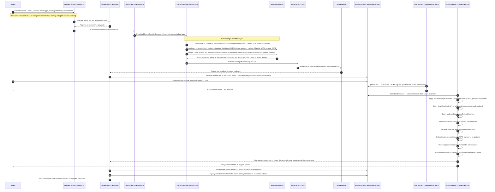

# Enterprise Package Intake and Approved Repository Architecture

## Document control

| Field | Value |
|---|---|
| Document title | Enterprise Package Intake and Approved Repository Architecture |
| Version | 1.6 |
| Status | Draft for review |
| Owner | Security Architecture |
| Last updated | 2026-08-02 |

### Revision history

| Version | Date | Author | Summary of changes |
|---|---|---|---|
| 1.0 | 2026-04-01 | Security Architecture | Initial draft — core intake workflow and eleven control stages |
| 1.1 | 2026-04-08 | Security Architecture | Added dependency-confusion prevention, sandbox data-handling policy, exception expiry, emergency recall, and metrics |
| 1.2 | 2026-04-15 | Security Architecture | Aligned stage labels to process flow; added artifact-type-specific policy paths |
| 1.3 | 2026-04-22 | Security Architecture | Added proprietary binary intake path (Path B); added inventory data mapping tables per artifact type; clarified that Dependency-Track applies to open-source only |
| 1.4 | 2026-04-23 | Security Architecture | Added Stage 11b retroactive binary recheck; added binary authentication controls (Authenticode, NSRL, MalwareBazaar); updated both flowchart and sequence diagram to show recheck loop; added control objective for post-approval supply chain compromise detection |
| 1.5 | 2026-08-01 | Security Architecture | Added Path C for AI/ML model artifacts (Stages 4c/5c); added cross-platform binary authentication (macOS, Linux) alongside Authenticode; added pipeline tooling supply-chain trust-root controls; added consumer-side remediation on recall; added recheck-job rate-limit and false-positive-suppression handling; added segregation-of-duties controls for pipeline administrators; added non-human/agentic requestor identity controls; added disaster-recovery requirements for systems of record; added "Open issues for internal review" section |
| 1.6 | 2026-08-02 | Security Architecture | Scoped macOS binary authentication as optional/on-demand rather than a baseline requirement, based on confirmed enterprise estate composition (Windows desktops, mixed Windows/Linux servers, Linux developer IDEs — no confirmed macOS fleet); Windows and Linux platform signature verification remain baseline requirements |

---

## Overview

This document describes a controlled software acquisition architecture for enterprises that need to download packages, binaries, libraries, containers, installers, and related artifacts from the internet while reducing supply-chain risk. The target model uses a restricted egress proxy, request and approval workflow, quarantine repository, integrity and provenance verification, malware screening, cooling-off delay, isolated testing, promotion to a final approved repository, and continuous re-evaluation after approval.

The architecture enforces a single controlled intake path for all artifact types across desktop, server, and developer teams. No endpoint, CI system, or pipeline may retrieve packages directly from the internet. Approved tools consume artifacts only from the internal approved repository after each stage of validation, testing, and review has completed and been recorded.

**Three analysis paths exist within this architecture.** Open-source packages and container images support full SBOM generation and continuous CVE re-evaluation via Dependency-Track. Proprietary closed-source binaries — including Microsoft patches, third-party commercial software, firmware, and hardware drivers — cannot yield meaningful SBOMs and follow a vendor-advisory intake path instead. AI/ML model artifacts — model weights, adapters, and tokenizer bundles pulled from model hubs — are neither source-available packages nor vendor-supported binaries, and follow a third intake path built around serialization-format safety and hub revision pinning rather than SBOM or code signing. All three paths use the same request portal, quarantine repository, approval gate, and approved repository.

**A fourth concern — post-approval supply chain compromise — requires controls that none of the three paths above fully addresses.** SBOM-based tools such as Dependency-Track detect known CVEs in component versions, but they cannot detect a trojanised binary where the version string is correct and no CVE has been published. A backdoored Notepad++ 8.6.4 or a compromised Trivy binary will show as clean in Dependency-Track because the component name and version match a legitimate release. The same is true for any binary that was clean at intake and later identified as part of a supply chain attack campaign, and for a model checkpoint that was clean when pinned but whose upstream revision was quietly repointed. Stage 11b in this architecture addresses this gap through retroactive hash rechecks, updated YARA scans, and binary authentication controls applied periodically against the entire approved artifact inventory.

**A fifth concern — the integrity of the pipeline itself — is addressed by a dedicated trust-root control set.** Every control described above depends on tools (Syft, Grype, YARA, CAPE, NSRL client libraries, model-format scanners) that are themselves internet-sourced software with their own supply chain. A compromise of the scanning tooling could produce false "clean" verdicts across the entire inventory without tripping any control described elsewhere in this document. See "Pipeline tooling supply chain" below.

---

## High-level architecture


```mermaid
flowchart TB
    A[Internet Sources\nPublic registries, vendor sites, Git releases\nMicrosoft Update Catalog, vendor portals] --> B[Restricted Egress Proxy\nAllowlisted outbound access only]
    U[Requesters\nDesktop, Server, Developer teams] --> R[Request and Approval Portal\nTicket, owner, business need, package metadata\nArtifact type declared at intake]
    R --> G[Governance Engine\nApproval rules, policy, risk scoring, separation of duties]
    G -->|Approved fetch request| Q[Quarantine / Intake Repository\nImmutable staging area — all artifact types]
    B --> Q

    Q --> AT{Artifact type?}
    AT -->|Open source / container| V1[Stage 4a · Integrity and Authenticity\nTLS, checksum, signature, provenance\nDep-confusion checks\nAuthenticode verification for PE binaries]
    AT -->|Proprietary binary / firmware| V1B[Stage 4b · Vendor Hash Verification\nCompare against vendor-published checksum\nAuthenticode cert thumbprint check\nNSRL positive-assertion lookup]
    AT -->|AI/ML model artifact| V1C[Stage 4c · Model Provenance Verification\nHub revision hash pinning\nSerialization format check\nPublisher/org identity check on hub]

    V1 --> V2[Stage 5a · SBOM and SCA\nSyft SBOM generation\nGrype SCA, license scan, secrets scan\nUpload SBOM to Dependency-Track]
    V1B --> V2B[Stage 5b · Vendor Advisory Capture\nRecord KB number, CVEs addressed, vendor severity\nStore in Nexus metadata and CMDB\nNo SBOM — do not create empty DT entry]
    V1C --> V2C[Stage 5c · Model Safety and Disclosure Capture\nPickle/unsafe-format static scan\nModel card, license, and dataset provenance capture\nNo SBOM — do not create empty DT entry]

    V2 --> V3[Stage 6 · Malware and Sandbox Analysis\nClamAV and YARA — all artifact types\nNSRL and MalwareBazaar hash lookup\nOpen source: VirusTotal hash lookup if policy permits\nProprietary: private CAPE sandbox only\nModel: isolated load-test in no-egress sandbox]
    V2B --> V3
    V2C --> V3

    V3 --> D[Stage 7 · Cooling-off Delay\n7 to 30 days by risk tier\nEmergency override requires signed risk acceptance]
    D --> T[Stage 8 · Test Pipeline\nIsolated environment, no internet\nSigned test evidence required for promotion]
    T --> P[Stage 9 · Promotion Review\nSecurity and owner sign-off\nExpiry date confirmed\nCMDB entry required for proprietary and model artifacts]
    P --> F[Final Approved Repository\nNexus Pro — all artifact types\nAll metadata tags and advisory records preserved]

    F --> C[Consumers\nCI/CD, build tools, deployment tools, desktop and server estates]

    F --> I[Inventory and Metadata Store\nOpen source: Nexus plus Dependency-Track\nProprietary: Nexus metadata plus CMDB plus WSUS or SCCM\nModel: Nexus metadata plus CMDB plus model registry]

    I --> M[Stage 11a · Continuous CVE Recheck\nOpen source: Dependency-Track against updated feeds\nProprietary: vendor bulletin and NVD CPE watches\nModel: hub revision-drift and advisory watch]
    I --> R2[Stage 11b · Retroactive Binary Recheck\nAll artifact types: scheduled hash recheck\nVirusTotal hash API and MalwareBazaar queries\nUpdated YARA re-scan of stored binaries\nNSRL positive-assertion recheck\nAuthenticode / codesign / GPG recheck by platform\nCAPE targeted recheck on specific IOC alerts\nRate-limited and false-positive-suppression aware]

    M --> N[Notification and Recall\nTickets, owner alerts, blocklist, emergency recall\nPush remediation to known-deployed consumers]
    R2 --> N
    N --> C

    TR[Pipeline Tooling Trust Root\nPinned scanner versions, signed updates only\nPeriodic tooling self-audit] -.->|integrity-gates| V1
    TR -.->|integrity-gates| V2
    TR -.->|integrity-gates| V3
    TR -.->|integrity-gates| R2
```

---

## Sequence diagram


```mermaid

sequenceDiagram
    autonumber
    participant Team as "Team"
    participant Portal as "Request Portal (GitLab CE)"
    participant Gov as "Governance / Approval"
    participant Proxy as "Restricted Proxy (Squid)"
    participant Intake as "Quarantine Repo (Nexus Pro)"
    participant Scan as "Analysis Pipeline"
    participant Delay as "Delay Policy Gate"
    participant Test as "Test Pipeline"
    participant Repo as "Final Approved Repo (Nexus Pro)"
    participant Monitor11a as "CVE Monitor (Dependency-Track)"
    participant Monitor11b as "Binary Recheck (scheduled job)"

    Team->>Portal: Submit request — name, version, artifact type, owner, justification, environment
    Note over Team,Portal: Requestor may be human or a registered non-human identity (CI/agent service account)
    Portal->>Gov: Evaluate policy, risk tier, artifact type path
    Gov-->>Portal: Approve or reject with expiry date
    Portal->>Proxy: Authorised fetch order with source URL
    Proxy->>Intake: Download from allowlisted source only, write intake metadata tags
    Note over Intake,Scan: Path diverges by artifact type
    Intake->>Scan: Open source — checksum, dep-confusion, Authenticode/codesign/GPG, SBOM, SCA, license, malware
    Intake->>Scan: Proprietary — vendor hash, platform signature thumbprint, NSRL lookup, advisory capture, ClamAV, YARA, private CAPE
    Intake->>Scan: Model — hub revision pin, serialization format check, pickle/unsafe-format scan, model card capture, isolated load-test
    Scan-->>Intake: Attach metadata, verdicts, SBOM/advisory/model-card record, sandbox report to Nexus artifact
    Intake->>Delay: Enforce cooling-off window by risk tier
    Delay->>Test: Release to isolated test environment after hold expires
    Test-->>Gov: Report test results and signed evidence
    Gov->>Repo: Promote artifact and all metadata, create CMDB entry for proprietary and model artifacts
    Team->>Repo: Consume from internal approved repository only
    Monitor11a->>Repo: Open source — re-evaluate SBOMs against updated CVE feeds (continuous)
    Monitor11a-->>Team: Notify owners of new CVE matches
    Monitor11b->>Repo: Scheduled recheck — extract all hashes from Nexus inventory
    Monitor11b->>Monitor11b: Apply rate-limit budget across VT/MalwareBazaar queries, prioritise by risk tier
    Monitor11b->>Monitor11b: Query VirusTotal hash API for all stored hashes (within daily budget)
    Monitor11b->>Monitor11b: Query MalwareBazaar for all stored hashes
    Monitor11b->>Monitor11b: Re-scan stored binaries with updated YARA rulesets
    Monitor11b->>Monitor11b: Recheck NSRL for positive-assertion validation
    Monitor11b->>Monitor11b: Recheck Authenticode/codesign/GPG signatures by platform
    Monitor11b->>Monitor11b: Recheck pinned model hub revision for silent repoint
    Monitor11b->>Monitor11b: Suppress hits already dispositioned as confirmed false positive
    Monitor11b-->>Gov: Flag unsuppressed hits — create GitLab recall issue tagged recall::binary-recheck
    Monitor11b-->>Team: Notify named owners of flagged artifacts
    Gov-->>Repo: Block compromised artifact on confirmed hit (403 all requests)
    Gov->>Repo: Query CMDB/WSUS/Intune for known-deployed instances of blocked artifact
    Gov-->>Team: Push remediation task to named owners of deployed instances

```

---

## Control objectives

- Stop direct internet downloads by enterprise endpoints and pipelines.
- Verify authenticity through hashes, platform code-signing verification (Authenticode and GPG/RPM signatures as baseline controls; Apple codesign/notarization as an optional control, built only if a macOS artifact or endpoint population enters scope), certificate or key trust registers, and provenance before any use. For proprietary binaries the primary authenticity controls are vendor hash verification, platform signature validity, and NSRL positive-assertion lookup. For model artifacts the primary control is hub revision-hash pinning combined with a mandatory safe-serialization format.
- Prevent dependency-confusion and namespace-spoofing attacks at the proxy and quarantine layers (open-source path).
- Apply distinct analysis paths based on artifact type: SBOM-based analysis for open-source and container artifacts; vendor-advisory capture for proprietary closed-source binaries; serialization-safety and provenance capture for AI/ML model artifacts.
- Generate SBOM and SCA data for open-source and container artifacts; maintain vendor advisory records for proprietary artifacts; maintain model card, license, and hub-provenance records for model artifacts.
- Detect malware and suspicious behavior at intake using ClamAV, YARA, MalwareBazaar hash lookup, NSRL lookup, and private sandbox detonation. Use private sandboxing exclusively for all proprietary artifacts. For model artifacts, detonation means loading the model inside a no-egress, syscall-monitored sandbox to catch pickle-triggered code execution or unexpected network calls, not Windows guest sandboxing.
- Detect post-approval supply chain compromise through a scheduled retroactive recheck job (Stage 11b) that re-queries threat intelligence sources against every stored artifact hash, re-scans with updated YARA rules, rechecks binary authentication across platforms, and rechecks pinned model hub revisions for silent repoint. This controls the threat class that SBOM-based tools cannot see: trojanised binaries or repointed model weights where the version string is correct and no CVE has been published. Recheck queries against rate-limited external services are budgeted and prioritised by risk tier so coverage degrades predictably rather than silently as inventory grows; dispositioned false positives are suppressed from re-alerting until the artifact or ruleset changes.
- Protect the pipeline's own integrity: the scanning and verification tooling (Syft, Grype, YARA, CAPE, model-format scanners, hash-lookup clients) is itself internet-sourced software and is pinned, provenance-checked, and periodically self-audited so a compromise of the tooling cannot silently produce false "clean" verdicts.
- Enforce segregation of duties not only on artifact approval but on administrative access to the pipeline itself — Nexus tag editing, CMDB thumbprint/key registers, YARA ruleset sources, and recheck-job configuration require change control separate from the requestor/approver role.
- Delay risky new releases to reduce exposure to zero-day and short-lived malicious packages.
- Apply license review so open-source and model artifacts comply with enterprise policy before reaching production.
- Preserve a complete inventory and continuously re-evaluate approved artifacts through the appropriate channel for each artifact type.
- Enforce exception expiry so temporary approvals do not become permanent without re-review.
- Support emergency recall procedures that can be triggered by both CVE feeds (Stage 11a) and binary recheck hits (Stage 11b), with affected-system identification using Dependency-Track (open source), CMDB (proprietary and model), and automated push remediation to known-deployed instances rather than notification alone.
- Preserve the systems of record themselves: Nexus, the CMDB, and the recheck-job datastore carry defined backup and recovery expectations so an incident cannot also erase the evidence needed to investigate it.
- Verify the identity of non-human requestors (CI pipelines, agentic tooling) to the same separation-of-duties standard as human requestors before an automated intake request can be approved.

---

## Artifact intake paths

All artifacts enter through the same request portal, egress proxy, and quarantine repository. They diverge at the analysis stage and converge at the promotion gate and approved repository. The artifact type must be declared by the requestor at intake so the pipeline selects the correct path automatically.

### Path A — Open-source packages and container images

Applies to: npm, PyPI, Maven, NuGet, Go modules, Ruby gems, apt/yum packages from public registries, container images from public registries, and any open-source release with published source.

Controls applied in sequence: dependency-confusion check at proxy and quarantine; full checksum and signature verification; Authenticode verification where applicable; SBOM generation in CycloneDX or SPDX format; SCA against NVD, GitHub Advisories, OSV, and Sonatype intelligence; license analysis and legal review gate; secrets scan; ClamAV static scan; YARA pattern matching; MalwareBazaar hash lookup; NSRL positive-assertion lookup; optional VirusTotal hash lookup where policy permits; cooling-off delay; isolated test pipeline; promotion sign-off; SBOM stored in Dependency-Track for continuous CVE re-evaluation after promotion.

### Path B — Proprietary closed-source binaries, commercial software, and firmware

Applies to: Microsoft patches (.msu, .exe, .cab), Windows Update packages, Adobe installers, Oracle database software, SAP components, hardware drivers, firmware updates, commercial ISV software, and any binary where the vendor does not publish source or a machine-readable SBOM.

Syft and similar tools cannot produce meaningful SBOM data from a closed-source binary. An empty SBOM uploaded to Dependency-Track creates false coverage and is worse than no record. This path replaces SBOM generation with vendor advisory capture.

Controls applied in sequence: vendor-published hash verification — mismatch is a hard block; Authenticode signature validity check; Authenticode certificate thumbprint verification against the expected publisher cert stored in the CMDB; NSRL positive-assertion lookup; vendor advisory record capture (KB number, CVEs addressed, vendor severity, affected product versions); ClamAV static scan; YARA pattern matching; MalwareBazaar hash lookup; mandatory private CAPE sandbox detonation regardless of hash match; cooling-off delay; isolated test pipeline; promotion sign-off; CMDB entry created as the ongoing deployment and monitoring record. Dependency-Track is not used for this path.

### Path C — AI/ML model artifacts

Applies to: model weight checkpoints, quantised model files (GGUF, GGML), `safetensors` and legacy PyTorch (`.pt`, `.pth`, `.bin`) checkpoints, LoRA and other adapter weights, tokenizer and processor config bundles, and any artifact pulled from a model hub (Hugging Face Hub, Ollama registry, Civitai, ModelScope, or an internal model registry).

Model artifacts fit neither Path A nor Path B. They are rarely accompanied by publishable source in the sense Syft or Grype can consume, so SBOM generation does not apply — but unlike a proprietary binary, they are also not code-signed by a vendor, and the analog of a "hash" is a mutable hub reference (a branch or tag) rather than a fixed release artifact. The threat model is also different in kind: the primary risk at intake is not a modified binary evading signature checks, it is **arbitrary code execution during deserialization**. The default PyTorch checkpoint format is a Python pickle, and unpickling untrusted data can execute arbitrary code as a documented property of the format, not a bug in it. A checkpoint can therefore be "clean" under ClamAV and YARA and still compromise the host the moment an engineer runs `torch.load()` on it locally instead of through this pipeline.

**Format policy is the primary control for this path.** `safetensors` (Hugging Face, Apache 2.0) stores only tensor data with no executable payload and is the required format for all new model intake. GGUF (llama.cpp ecosystem) is accepted on the same basis — it is a flat tensor-and-metadata container with no code execution surface. Legacy pickle-based checkpoints (`.pt`, `.pth`, `.bin`, `.ckpt`) are accepted only under a signed exception, and only after passing a static pickle opcode scan that rejects any checkpoint referencing `__reduce__`, `eval`, `exec`, `os.system`, `subprocess`, or other code-execution opcodes rather than plain tensor-construction calls.

Controls applied in sequence: capture the exact hub revision (commit SHA, not a mutable branch or tag) requested and pin the fetch to that revision; verify the download's SHA-256 against the hub's own recorded file hash where the hub publishes one (Hugging Face does, via its LFS/OID metadata); verify the format is `safetensors` or GGUF, or route to the pickle static-scan exception path; run the static opcode/pickle scan on any non-`safetensors` file regardless of extension, since a malicious payload can be disguised with any file extension; capture model card, license, and dataset-provenance metadata (base model lineage, fine-tune source, declared training data, license class — including non-commercial and research-only variants); capture the publisher/organisation identity as verified by the hub (verified-org badge, or absence of one, recorded as a risk signal); ClamAV static scan; YARA pattern matching tuned for embedded-script indicators inside archive-based formats; MalwareBazaar hash lookup; mandatory isolated load-test — the model is loaded inside a no-egress, syscall-monitored sandbox and the pipeline confirms it did not spawn a child process, write outside its working directory, or attempt an outbound connection during load; cooling-off delay; isolated test pipeline for the consuming application; promotion sign-off; CMDB entry created recording the pinned hub revision as the ongoing drift-detection baseline. Dependency-Track is not used for this path.

---

## Binary authentication controls

This section defines the additional authentication controls applied to signed artifacts at intake (Stages 4 and 6) and during the retroactive recheck (Stage 11b). These controls address the supply chain attack scenario where a trojanised binary has the correct version string but has been tampered with.

Earlier versions of this architecture treated Authenticode as the sole signature control, which covers Windows PE binaries but leaves a gap for the Linux proprietary binaries this architecture explicitly scopes in (Oracle, SAP, and other vendor tooling ship Linux builds, and the enterprise estate includes a mix of Windows and Linux servers plus Linux developer IDEs alongside Windows desktops). The controls below are organised by platform; the CMDB publisher trust register (Authenticode thumbprint, Apple Team ID, or GPG key fingerprint) is the common mechanism across all three.

**Platform scope caveat:** Windows (Authenticode) and Linux (GPG/RPM/DEB) signature verification are baseline requirements for this architecture, matching the confirmed enterprise estate — Windows desktops, Windows and Linux servers, and Linux developer tooling. **macOS code signing and notarization verification is documented below for completeness and is scoped as optional / build-on-demand**, not a baseline rollout requirement, since no macOS fleet has been confirmed in scope. If a macOS binary genuinely needs to enter the pipeline (e.g. a cross-platform vendor tool with a Mac build, or a future Mac endpoint population), implement the macOS control at that time rather than building it into the initial rollout. Until then, any macOS artifact submitted for intake defaults to Tier 1 cooling-off with hash verification as the sole authenticity control — the same fallback this architecture already applies to any vendor that doesn't publish a signature at all.

### Authenticode signature verification

All Windows PE binaries (.exe, .dll, .msi, .msu) must have their Authenticode signatures verified at intake. Verification checks two things: that the signature is cryptographically valid (the file has not been modified since signing), and that the signing certificate belongs to the expected publisher.

The pipeline stores the expected certificate thumbprint for each approved publisher in the CMDB. At intake, the pipeline extracts the actual signing certificate thumbprint and compares it against the stored expected value. A valid signature from an unexpected certificate is treated as a failure — it may indicate re-signing after tampering.

```powershell
# Verify Authenticode signature and extract thumbprint
$sig = Get-AuthenticodeSignature -FilePath $artifactPath
if ($sig.Status -ne "Valid") {
    throw "Authenticode signature invalid: $($sig.Status)"
}
$actualThumbprint = $sig.SignerCertificate.Thumbprint
$expectedThumbprint = Get-ExpectedThumbprint -Publisher $publisherName
if ($actualThumbprint -ne $expectedThumbprint) {
    throw "Certificate thumbprint mismatch. Expected: $expectedThumbprint Got: $actualThumbprint"
}
```

Known expected thumbprints for common publishers:
- Notepad++ releases are signed by the author's personal code-signing certificate.
- Microsoft patches are signed by a Microsoft certificate chain rooted in the Microsoft Root Certificate Authority.
- Any deviation from the expected thumbprint blocks the artifact.

### macOS code signing and notarization (optional — build on demand)

> This control is not part of the baseline rollout. Include it only once a macOS artifact or endpoint population is actually confirmed in scope.

macOS proprietary installers (`.pkg`, `.dmg`, `.app` bundles) use Apple's code-signing and notarization system rather than Authenticode. Verification checks three things: the code signature is valid and covers the entire bundle, the signing identity's Team ID matches the expected publisher stored in the CMDB, and the artifact has been notarized by Apple — meaning Apple's own automated scan has not flagged it.

```bash
# Verify code signature validity and print the signing identity
codesign --verify --deep --strict --verbose=2 /path/to/App.app
codesign -dv --verbose=4 /path/to/App.app 2>&1 | grep "TeamIdentifier"

# Verify notarization ticket is stapled and valid
spctl --assess --type execute --verbose /path/to/App.app
```

The pipeline extracts the actual Team ID and compares it against the expected value in the CMDB publisher register, identically to the Authenticode thumbprint comparison. A valid signature under an unexpected Team ID, or a signature that is valid but not notarized, is treated as a failure.

### Linux package and binary signing

Linux proprietary artifacts (RPM, DEB, or standalone ELF binaries and installers) do not have a single OS-native signing mechanism equivalent to Authenticode. This architecture requires GPG signature verification against a per-publisher key stored in the CMDB key register, with RPM/DEB-native verification used where the artifact is packaged that way.

```bash
# RPM: verify package signature against imported publisher public key
rpm --checksig vendor-package.rpm

# DEB: verify signature against imported publisher public key
dpkg-sig --verify vendor-package.deb

# Standalone ELF binary or tarball distributed with a detached GPG signature
gpg --verify vendor-binary.tar.gz.sig vendor-binary.tar.gz
```

Where a vendor does not provide any signature (common for smaller ISVs and some firmware), the artifact is not eligible for the fast-track Tier 3 cooling-off and defaults to Tier 1, since hash verification against a vendor-published checksum page is the only remaining authenticity control.

### NSRL positive-assertion lookup

The NIST National Software Reference Library (NSRL) is a database of known-good hash values for legitimate software releases. Querying the NSRL provides a positive assertion that the specific file being ingested is a known authentic release, not merely that it has not been flagged as malicious.

The NSRL dataset is available for free download as a bulk database and can be loaded into a local PostgreSQL instance for offline queries. This avoids any external API dependency.

```python
def check_nsrl(sha256_hash: str, nsrl_db) -> dict:
    cursor = nsrl_db.execute(
        "SELECT FileName, ProductName, ProductVersion FROM NSRLFile WHERE SHA256 = ?",
        (sha256_hash.upper(),)
    )
    result = cursor.fetchone()
    if result:
        return {"known_good": True, "product": result[1], "version": result[2]}
    return {"known_good": False}
    # Not in NSRL does not mean malicious — novel/niche software may not be indexed
    # Absence of a match requires fallback to other controls, not automatic rejection
```

NSRL coverage is strongest for widely distributed commercial software and well-known open-source releases. Niche tools and internal builds may not be indexed.

### MalwareBazaar hash lookup

MalwareBazaar (abuse.ch, free API) is a database of known-malicious file hashes crowdsourced from the security research community. Querying it at intake and during the retroactive recheck catches files that have been identified as malicious after you approved them.

```python
import requests

def check_malwarebazaar(sha256_hash: str) -> bool:
    response = requests.post(
        "https://mb-api.abuse.ch/api/v1/",
        data={"query": "get_info", "hash": sha256_hash},
        timeout=10
    )
    data = response.json()
    return data.get("query_status") == "hash_found"
    # hash_found means the file is known malicious
    # no_results means not in database — not a clean bill of health
```

### VirusTotal hash lookup

VirusTotal aggregates results from 70+ AV engines. Hash-only lookups do not upload the file and are safe for proprietary binaries. The free API allows 500 lookups per day; the paid API supports bulk queries.

```python
def check_virustotal_hash(sha256_hash: str, api_key: str) -> int:
    url = f"https://www.virustotal.com/api/v3/files/{sha256_hash}"
    headers = {"x-apikey": api_key}
    response = requests.get(url, headers=headers, timeout=10)
    if response.status_code == 404:
        return -1  # Not in VT database — unknown, not confirmed clean
    data = response.json()
    return data["data"]["attributes"]["last_analysis_stats"]["malicious"]
    # Returns count of AV engines flagging the hash as malicious
    # 0 = not flagged, but does not guarantee clean — novel attacks may not be indexed
```

Important: a hash not found in VirusTotal means no one has submitted that file to VT. It does not mean the file is clean. Novel or targeted attacks may never appear. This control catches known campaigns and widely distributed malware, not targeted attacks against your specific organisation.

---

## Pipeline tooling supply chain

Every control described so far assumes the scanning and verification tooling is trustworthy. That assumption is itself a supply chain dependency: Syft, Grype, YARA, CAPE, the NSRL and MalwareBazaar client code, and the model-format scanners used in Path C are all internet-sourced software, several of them updated frequently from community rule feeds. A compromise of any of these — not the artifacts they scan, but the scanners themselves — could produce false "clean" verdicts across the entire inventory without triggering any control described elsewhere in this document. This document already cites one real precedent: Trivy's own supply chain compromises, which is why Syft is the recommended SBOM generator instead.

This is treated as a distinct control surface rather than folded into Stage 4/5/6, because it protects the integrity of the controls rather than the integrity of an artifact.

- **Pin scanner and sandbox tool versions explicitly.** No pipeline stage pulls `latest` for Syft, Grype, YARA, CAPE, or any client library. Version bumps go through the same change-control process as a production dependency upgrade, including a diff review of the changelog.
- **Verify provenance on every tooling update**, not just the first install. Syft and Grype publish signed releases (cosign) — the pipeline verifies the signature before installing an updated binary. Where a tool does not publish signed releases, pin to a specific commit hash and diff-review changes before bumping.
- **Treat YARA and CAPE rule feeds as a separate, lower-trust update channel from the tools themselves.** Ruleset updates (Elastic, VirusTotal community rules) are pulled into a staging area and diffed before being promoted into the production ruleset, since a malicious or careless rule contribution could be used to suppress detection of a specific artifact rather than only to add detection.
- **Run a periodic tooling self-audit**, independent of the vendor/community supply chain, using a small fixed set of known-malicious and known-clean reference samples (an internal "canary set") re-run through the full Stage 6 and Stage 11b pipeline on a schedule. A canary sample that stops flagging as malicious is a signal the scanning tooling itself has regressed or been tampered with, not that the sample changed.
- **Isolate tool execution from artifact execution.** Static scanners (Syft, Grype, YARA, ClamAV) run with no network egress and least-privilege file access to the artifact being scanned, so a maliciously crafted artifact designed to exploit the scanner itself has a reduced blast radius.

---

## Inventory and metadata — where data is stored

### System responsibilities

**GitLab CE** is the system of record for the intake request, approval workflow, and audit trail. It holds who requested the artifact, when, why, what approvals were given, when they expire, and all transitions and comments. The GitLab issue number is written as a tag to the Nexus artifact at intake, linking the binary permanently to its approval record.

**Nexus Repository Pro** is the system of record for the artifact itself and its intake provenance metadata. It holds the binary, the hashes, the source URL, the intake timestamp, and the custom metadata tags written during the pipeline run. Every artifact — open-source or proprietary — is stored here. Nexus custom tags carry the requestor name, approver, approval expiry, risk tier, KB number, CVE list, vendor severity, Authenticode thumbprint verified, NSRL result, and MalwareBazaar result directly on the component record.

**OWASP Dependency-Track** is the system of record for SBOM contents, component vulnerability findings, policy violations, and where-used analysis. It is used exclusively for artifacts where a meaningful SBOM exists: open-source packages and container images. Proprietary binaries must not be represented in Dependency-Track with empty SBOMs — an empty entry creates false assurance of coverage.

**CMDB** (ServiceNow, GitLab-hosted database, or Ralph) is the system of record for the deployment inventory of proprietary software and the publisher certificate thumbprint register. It records what commercial software is approved, at what version, which systems have it deployed, the expected Authenticode certificate thumbprint for each publisher, and the vendor advisory subscription reference for ongoing monitoring.

**WSUS / SCCM / Intune** provides deployment tracking and patch compliance reporting for Microsoft Windows updates. It records which machines have which KB applied and flags non-compliant machines.

**Recheck job datastore** (PostgreSQL table or equivalent): stores the results of each Stage 11b retroactive recheck run — artifact hash, recheck date, VirusTotal result, MalwareBazaar result, YARA result, NSRL result, platform signature recheck result, disposition (blocked, flagged, confirmed false positive, clean), and any recall actions taken. A confirmed-false-positive disposition suppresses future alerts on that specific hash/signal combination until the artifact hash or the matching rule changes, so the same reviewed finding does not re-open on every scheduled run. This provides a queryable history of recheck verdicts for audit purposes.

**Model registry metadata** (Nexus custom tags plus CMDB, or a dedicated model registry such as MLflow if already deployed): holds the pinned hub revision SHA, source hub and namespace, model card contents, license classification, base-model lineage, and pickle-scan result for every model artifact. The pinned revision SHA is the field Stage 11b rechecks against the hub to detect silent repoint.

**Remediation tracking**: the CMDB deployment records (for proprietary and model artifacts) and Dependency-Track where-used analysis (for open source) are queried by the recall workflow to identify systems with a recalled artifact already deployed, not only systems that could fetch it. Where WSUS, SCCM, Intune, or a configuration management tool (Ansible, etc.) is available, the recall workflow triggers a push remediation task against those identified systems rather than relying on the owner to act on a notification alone.

### Data mapping: open-source packages and container images

| Data point | Authoritative store | Notes |
|---|---|---|
| Binary or package file | Nexus Pro | Immutable, hash-verified storage |
| SHA-256 and SHA-512 hashes | Nexus Pro | Stored as component attributes |
| Source URL | Nexus Pro | Original upstream URL from registry or Git release |
| Download timestamp | Nexus Pro | Set at quarantine intake by pipeline |
| Requestor name | Nexus Pro (tag) | Written from GitLab issue at intake |
| Approver name and approval date | Nexus Pro (tag) | Written from GitLab issue at intake |
| Approval expiry date | Nexus Pro (tag) and GitLab issue due date | Both must agree; mismatch flags for review |
| GitLab intake ticket reference | Nexus Pro (tag) | Links artifact to approval record permanently |
| Risk tier | Nexus Pro (tag) | Tier 1, 2, or 3 |
| Target environment | Nexus Pro (tag) | Dev, Test, or Production |
| Lifecycle state | Nexus Pro (repository group) | Quarantine, Dev-approved, or Prod-approved |
| SBOM (CycloneDX or SPDX) | Dependency-Track (primary) and Nexus (attached file) | Generated by Syft or IQ Server at Stage 5a |
| CVE and vulnerability findings | Dependency-Track | Continuously re-evaluated as new CVEs are published |
| Policy violations | Dependency-Track | License, vulnerability severity, and age policies |
| Where-used (which projects use this component) | Dependency-Track | Cross-referenced via SBOM component PURLs |
| MalwareBazaar result at intake | Nexus Pro (tag) | Recorded at Stage 6; updated by Stage 11b recheck |
| NSRL lookup result at intake | Nexus Pro (tag) | known_good / not_indexed — recorded at Stage 6 |
| YARA scan verdict | Nexus Pro (tag and attached JSON) | Updated by Stage 11b re-scan with new rulesets |
| VirusTotal hash result at intake | Nexus Pro (tag) | Engine count; updated by Stage 11b recheck |
| Sandbox detonation report | Nexus Pro (attached file) | CAPE private sandbox for high-risk open-source |
| Stage 11b recheck history | Recheck job datastore | Queryable history of all periodic recheck verdicts |
| Cosign attestation and in-toto link | Nexus (attached) and Rekor (transparency log) | Signs the pipeline steps |

### Data mapping: proprietary binaries, commercial software, and Microsoft patches

| Data point | Authoritative store | Notes |
|---|---|---|
| Binary or installer file | Nexus Pro | Immutable storage |
| SHA-256 and SHA-512 hashes | Nexus Pro | Stored as component attributes |
| Vendor-published hash | Nexus Pro (tag) | From Microsoft Update Catalog, vendor download portal |
| Hash verification result | Nexus Pro (tag) | Pass or Fail — mismatch blocks pipeline immediately |
| Source URL | Nexus Pro | e.g. catalog.update.microsoft.com download URL |
| Download timestamp | Nexus Pro | Set at quarantine intake |
| Authenticode validity result | Nexus Pro (tag) | Valid / Invalid / No signature |
| Authenticode certificate thumbprint (actual) | Nexus Pro (tag) | Extracted at intake, compared against CMDB expected value |
| Expected Authenticode thumbprint | CMDB (publisher certificate register) | Maintained per publisher; updated when publisher rotates cert |
| Thumbprint match result | Nexus Pro (tag) | Match / Mismatch — mismatch blocks pipeline |
| NSRL lookup result | Nexus Pro (tag) | known_good / not_indexed |
| MalwareBazaar result at intake | Nexus Pro (tag) | Recorded at Stage 6; updated by Stage 11b recheck |
| YARA scan verdict | Nexus Pro (tag and attached JSON) | Updated by Stage 11b re-scan |
| VirusTotal hash result | Nexus Pro (tag) | Hash-only lookup; safe for proprietary artifacts |
| Requestor name | Nexus Pro (tag) | Written from GitLab issue |
| Approver name and approval date | Nexus Pro (tag) | Written from GitLab issue |
| Approval expiry date | Nexus Pro (tag) and GitLab issue due date | Both must agree |
| GitLab intake ticket reference | Nexus Pro (tag) | Links artifact to approval record |
| Risk tier | Nexus Pro (tag) | Proprietary binaries default to Tier 1 or 2 |
| KB article or vendor reference number | Nexus Pro (tag) and CMDB | e.g. KB5034441 |
| CVEs addressed by this artifact | Nexus Pro (tag) and CMDB | Sourced from vendor advisory |
| Vendor severity rating | Nexus Pro (tag) and CMDB | Critical, Important, Moderate, or Low |
| Affected product scope | CMDB | Which product versions apply |
| SBOM | Not applicable | Cannot be generated from closed-source binary |
| Ongoing CVE monitoring | CMDB and vendor bulletin subscription and NVD CPE watch | Not Dependency-Track |
| Deployment inventory | WSUS, SCCM, or Intune (Microsoft patches) or CMDB | Records which systems have the artifact installed |
| Private sandbox detonation report | Nexus Pro (attached file) | CAPE private sandbox only — mandatory |
| Stage 11b recheck history | Recheck job datastore | Queryable history of all periodic recheck verdicts |

### Data mapping: firmware and hardware drivers

| Data point | Authoritative store | Notes |
|---|---|---|
| Firmware or driver file | Nexus Pro | Stored as generic binary artifact |
| SHA-256 and SHA-512 hashes | Nexus Pro | Verified against vendor-published hash |
| Vendor advisory or release notes | Nexus Pro (attached) and CMDB | Describes CVEs addressed and affected hardware |
| Authenticode validity | Nexus Pro (tag) | Where applicable for signed drivers |
| NSRL lookup result | Nexus Pro (tag) | known_good / not_indexed |
| MalwareBazaar result | Nexus Pro (tag) | Recorded at intake and updated by Stage 11b |
| Target hardware model and version | CMDB | Which device types and hardware revisions apply |
| Deployment status | CMDB (device inventory) | Which physical devices have been updated |
| Stage 11b recheck history | Recheck job datastore | Queryable history of periodic recheck verdicts |

### Data mapping: AI/ML model artifacts

| Data point | Authoritative store | Notes |
|---|---|---|
| Model weight file | Nexus Pro | Immutable storage; `safetensors`/GGUF preferred |
| SHA-256 hash | Nexus Pro | Stored as component attribute |
| Source hub and namespace | Nexus Pro (tag) | e.g. `huggingface.co/org/model-name` |
| Pinned hub revision (commit SHA) | Nexus Pro (tag) and Model registry metadata | Not a mutable branch/tag reference — this is the Stage 11b drift-detection baseline |
| Hub-published file hash (if available) | Nexus Pro (tag) | Compared against downloaded SHA-256 at intake |
| Serialization format | Nexus Pro (tag) | `safetensors` / GGUF / legacy-pickle-under-exception |
| Pickle static-scan result | Nexus Pro (tag) and attached JSON | Required for any non-`safetensors`/GGUF format; hard block on unsafe opcodes |
| Publisher/org verification status | Nexus Pro (tag) | Hub verified-org badge present or absent |
| Model card, license, dataset provenance | Model registry metadata and Nexus (attached) | Captured at Stage 5c |
| Base model lineage (for fine-tunes/adapters) | Model registry metadata | Declared upstream base model and revision |
| Isolated load-test result | Nexus Pro (attached report) | No-egress sandbox: process spawn, filesystem, and network activity during load |
| MalwareBazaar result at intake | Nexus Pro (tag) | Recorded at Stage 6; updated by Stage 11b recheck |
| Requestor name, approver, expiry | Nexus Pro (tag) and GitLab issue | Same pattern as Path A/B |
| Risk tier | Nexus Pro (tag) | Model artifacts default to Tier 1 or 2 |
| Stage 11b recheck history | Recheck job datastore | Includes hub-revision-drift check outcome |

---

## Backup and recovery for systems of record

Nexus, the CMDB, and the recheck job datastore are systems of record, not caches — losing them loses the evidence base for every approval, advisory, and recheck verdict this architecture depends on, which matters most exactly when an incident is already in progress. Each requires an explicit backup and recovery posture:

- **Nexus Pro**: blob store and metadata database backed up on a schedule that meets the organisation's RPO for approval records; immutable/WORM retention on the blob store protects against in-place tampering but is not a substitute for offline backup.
- **CMDB**: standard database backup for whichever platform is chosen (ServiceNow, PostgreSQL-backed GitLab table, or Ralph); the publisher certificate/key thumbprint register is small but critical — losing it degrades every platform signature recheck to "cannot verify" until restored.
- **Recheck job datastore**: backed up alongside the CMDB; this table is the primary audit evidence during a post-approval compromise investigation, so its retention window should match or exceed the organisation's incident-investigation lookback requirement.

Specific RPO/RTO targets and backup tooling are an implementation decision for Phase 1 rollout — see "Open issues for internal review" below.

---

## Security controls by stage

### Stage 1 · Request and approval

- Require package name, exact version, checksum if available, source URL, artifact type declaration (open-source, proprietary binary, firmware, AI/ML model, or other), business justification, named owner, intended environment (dev, test, or production), and a scheduled review date.
- The artifact type declaration determines which analysis path the artifact follows, which inventory system holds the ongoing risk record, and which recheck controls apply in Stage 11b.
- Enforce separation of duties so the requestor is not the sole approver for production use.
- Apply different risk tiers based on artifact type and intended use.
- Set an explicit expiry on every approval. No approval persists indefinitely.
- Assign a named owner to every approved artifact. Ownership transfer must be an explicit workflow step.
- Requestors may be human or a registered non-human identity (a CI pipeline or agentic tooling service account). Non-human requestors authenticate with a distinct credential type (short-lived service token, not a shared secret), are subject to the same separation-of-duties rule as human requestors — the automation that submits a request may not also hold the approver role — and every non-human-submitted request carries a named human owner accountable for it, identical to a human-submitted request.

### Stage 2 · Restricted proxy and egress layer

- Use deny-by-default outbound access with allowlists by domain, path, protocol, and package ecosystem.
- For proprietary binary downloads, allowlist specific vendor domains individually rather than broad ranges.
- Block direct package downloads from endpoints, CI systems, and servers.
- Apply dependency-confusion prevention rules for open-source ecosystems.
- Log every fetch attempt including failures so unauthorised download attempts are visible in the SIEM.

### Stage 3 · Quarantine repository

- Store all newly downloaded artifacts in immutable staging before any team can consume them.
- Preserve original source URL, intake timestamp, transport metadata, and canonical hashes.
- Tag each artifact at intake with its artifact type, risk tier, and GitLab intake ticket reference.
- Store the SHA-256 hash as a searchable component attribute — this is the key used by the Stage 11b retroactive recheck job to query threat intelligence sources.

### Stage 4 · Authenticity and integrity checks

**Path A (open source):** Validate vendor checksums, signatures, certificate chains, notarisation, and provenance data. Check for dependency-confusion indicators. For Windows PE binaries, verify Authenticode signature validity and compare the signing certificate thumbprint against the expected publisher value. Fail closed when integrity claims do not validate.

**Path B (proprietary binary):** Compare the SHA-256 of the downloaded file against the vendor's published catalog hash. Verify the platform signature: Authenticode on Windows, GPG/RPM/DEB signature on Linux — both baseline controls for this estate. `codesign`/notarization on macOS is available for the rare case a macOS artifact is submitted, but is not a baseline requirement (see "Platform scope caveat" under Binary authentication controls); until built, a macOS submission falls back to hash verification plus Tier 1 cooling-off. Compare the actual signing identity (certificate thumbprint or GPG key fingerprint) against the expected publisher value stored in the CMDB. Perform NSRL positive-assertion lookup. Any of the following blocks the artifact: hash mismatch, invalid or missing platform signature where one is expected, signing identity mismatch against the expected publisher. Do not attempt SBOM generation on proprietary binaries.

**Path C (AI/ML model artifact):** Resolve and pin the exact hub commit SHA for the requested model — reject requests pinned only to a mutable branch or tag. Compare the downloaded SHA-256 against the hub's own published file hash where available. Verify the file is `safetensors` or GGUF format; route any other format to the mandatory pickle static-scan exception path. Record the hub publisher/organisation verification status. A pickle static scan that finds code-execution opcodes is a hard block, not an exception-eligible finding.

### Stage 5 · Security analysis

**Path A (open source):** Generate SBOMs in SPDX or CycloneDX format. Run SCA for direct and transitive dependencies. Conduct license analysis. Scan for embedded secrets. Upload SBOM and findings to Dependency-Track.

**Path B (proprietary binary):** Capture the vendor advisory record — KB number or equivalent, CVEs addressed, vendor severity, affected product versions. Store as a structured JSON attachment in Nexus and write summary fields as Nexus component metadata tags. Write the full advisory record to the CMDB entry. Do not create an empty SBOM entry in Dependency-Track.

**Path C (AI/ML model artifact):** Capture the model card, license classification (including non-commercial/research-only variants that block production use), declared training data provenance where published, and base-model lineage for fine-tunes and adapters. Store as a structured JSON attachment in Nexus and write summary fields as Nexus component metadata tags, mirroring the Stage 5b pattern. Write the full record to the model registry metadata store. Do not create an empty SBOM entry in Dependency-Track.

### Stage 6 · Malware and sandbox screening

- Apply ClamAV static scanning and YARA pattern matching to all artifacts regardless of type.
- Perform MalwareBazaar hash lookup for all artifacts. A positive match (hash found in MalwareBazaar) is a hard block.
- Perform NSRL lookup as a positive-assertion check. Record the result in Nexus metadata regardless of outcome — absence from NSRL is not a block but is noted.
- For open-source packages: VirusTotal hash-only lookup where policy permits.
- For proprietary binaries: VirusTotal hash-only lookup (safe — hash reveals no file content). Submit exclusively to private CAPE sandbox for dynamic analysis. No external file submission.
- Mandatory private CAPE sandbox detonation for all proprietary binaries, drivers, and firmware regardless of hash match, platform signature validity, or vendor reputation. A hash match proves the binary matches the vendor release; it does not prove the vendor release is clean.
- For AI/ML model artifacts: load the model inside a no-egress, syscall-monitored sandbox (not CAPE's Windows-guest design). Fail the artifact if the load spawns a child process, writes outside the working directory, or attempts an outbound network connection. This is the primary dynamic control for the pickle-deserialization threat that static scanning can only partially catch, since obfuscated opcode sequences can evade a pattern-based static scan.
- Where static analysis cannot fully unpack a sample — commercial packers/protectors (Themida, VMProtect) on proprietary installers, or archive-based model bundles with nested compression — record the scan as inconclusive rather than clean, and require CAPE/load-test detonation regardless of static scan outcome. An inconclusive static result does not, by itself, block promotion, but it removes static scanning as a basis for reducing sandbox scrutiny.
- Record and attach sandbox detonation or load-test reports to the artifact record in Nexus. Record all hash lookup results as Nexus component tags.

### Stage 7 · Cooling-off delay

- Hold newly published versions for 7, 14, or 30 days depending on risk tier.
- Proprietary binaries from vendors with a documented release cycle may qualify for the 7-day tier by explicit policy decision only, not as a default.
- Model artifacts default to Tier 1 (30 days) on first intake of a given model family; subsequent point-release fine-tunes or quantisations of an already-approved base model may qualify for Tier 2 by explicit policy decision.
- Allow emergency override only with explicit signed risk acceptance including a named approver, justification, and mandatory expiry date.

### Stage 8 · Test pipeline

- Use isolated, reproducible environments with no internet access.
- For proprietary installers: capture and log all install-time file system changes, registry modifications, network connection attempts, and service registrations.
- Capture signed test evidence. Block promotion if evidence cannot be produced.

### Stage 9 · Promotion review

- Promote the already-verified artifact — not a re-download from the internet. Chain of custody must be unbroken.
- Require sign-off from both a security reviewer and the named artifact owner.
- For proprietary path: confirm vendor advisory record is complete, CMDB entry created with expected platform signing identity recorded, and vendor bulletin subscription reference documented before promotion.
- For model path: confirm model card, license, and lineage record is complete, pinned hub revision SHA recorded as the drift-detection baseline, and CMDB entry created before promotion.
- Confirm the governing approval has not expired.

### Stage 10 · Consumption and inventory

- Configure all consumers to use only the internal Nexus approved repository. Block and alert on external source access.
- For open-source: enforce lockfiles and digest pinning. Dependency-Track provides deployment inventory.
- For proprietary: deployment tracked through WSUS, SCCM, or Intune (patches) and CMDB (ISV software and firmware).
- For model artifacts: deployment tracked through CMDB, keyed to the pinned hub revision so a consuming application can be distinguished from one running an unpinned or later revision of the same model.
- CMDB entries for proprietary artifacts must include: artifact name and version, Nexus reference, intake ticket reference, named owner, approval expiry, expected platform signing identity, vendor bulletin subscription reference, deployment scope, and next review date.
- CMDB entries for model artifacts must include: model name and pinned hub revision, Nexus reference, intake ticket reference, named owner, approval expiry, license classification, and deployment scope.
- Recall workflows query the CMDB/WSUS/Intune deployment records (proprietary and model) or Dependency-Track where-used analysis (open source) to identify systems where a recalled artifact is already deployed, and trigger a push remediation task through the available deployment tool rather than relying on notification alone. Where no push mechanism exists for a given artifact type or environment, that gap is tracked explicitly — see "Open issues for internal review."

### Stage 11a · Continuous CVE recheck

**Open-source artifacts:** OWASP Dependency-Track continuously re-evaluates stored SBOMs against updating vulnerability intelligence from NVD, GitHub Advisories, OSV, and other feeds. New CVE matches trigger notifications to named owners and create GitLab recall workflow issues.

**Proprietary artifacts:** Monitoring relies on vendor channels — Microsoft MSRC RSS feed, vendor security bulletins, and NVD CPE watches registered to the specific product. WSUS and Intune provide patch compliance status.

**AI/ML model artifacts:** Monitoring relies on the source hub's own advisory or model-card update channel where one exists, plus the hub revision-drift check described in Stage 11b Step 8. There is no CVE-style feed for model weights; a new disclosure about a model family (e.g. a discovered backdoor in a popular fine-tune lineage) typically surfaces through the hub's community discussion, the model card's own revision history, or general security research rather than NVD.

### Stage 11b · Retroactive binary recheck

This stage addresses the specific threat of post-approval supply chain compromise. It runs as a scheduled job (recommended frequency: nightly for high-risk artifacts, weekly for all others) and operates against the complete inventory of approved artifacts stored in Nexus, regardless of how long ago they were approved.

The recheck job performs the following steps:

**Step 1 — Extract inventory hashes from Nexus.** Query the Nexus REST API to retrieve SHA-256 hashes and artifact metadata for all components in the approved repository groups.

**Step 2 — VirusTotal hash recheck.** Submit each SHA-256 to the VirusTotal hash lookup API. Flag any hash returning detections from two or more AV engines for human review. A single engine detection may be a false positive; two or more is a meaningful signal.

**Step 3 — MalwareBazaar hash recheck.** Submit each hash to the MalwareBazaar API. Any positive match (hash_found) immediately triggers a recall workflow without waiting for human review — MalwareBazaar only indexes confirmed malicious files.

**Step 4 — YARA re-scan with updated rulesets.** Pull each artifact binary from Nexus and re-scan with the current YARA ruleset. Update the YARA ruleset from community feeds (Elastic, VirusTotal community rules) on a scheduled basis. New rules published in response to newly discovered campaigns will match artifacts that passed the original intake scan. The XZ Utils supply chain attack is an example: a YARA rule published after discovery would have flagged the compromised package in any organisation's inventory that ran periodic re-scans.

**Step 5 — NSRL recheck.** Recheck hashes against the NSRL database. Flag any artifact where the NSRL database has been updated to add a known-bad status for that hash (rare, but possible when NIST updates the dataset).

**Step 6 — Authenticode recheck for Windows PE binaries.** Re-verify the Authenticode signature chain for all Windows PE binaries in the approved inventory. Verify that the signing certificate has not been revoked using OCSP or CRL checks. A revoked certificate on a previously approved binary is a strong signal of a compromised build infrastructure or signing key.

**Step 7 — Targeted CAPE recheck on IOC alerts.** When a new threat intelligence report publishes indicators of compromise (file hashes, process behaviour patterns, C2 domains), cross-reference the IoCs against the Nexus inventory and trigger a CAPE sandbox re-detonation for any matching artifacts.

**Step 8 — Model hub revision drift recheck.** For Path C artifacts, re-query the source hub for the current commit SHA on the reference the artifact was originally pinned from. If the hub's current SHA no longer matches the pinned SHA recorded at intake, this does not by itself mean the pinned artifact in Nexus has changed — Nexus stores the immutable file — but it is a signal that anything still resolving the model by branch/tag name outside this pipeline (a developer running `from_pretrained()` directly against the hub) would now receive a different, unreviewed file. Flag for human review.

**Rate-limit and coverage budgeting.** External lookup services are rate-limited (VirusTotal's free tier is 500 lookups/day; MalwareBazaar and NSRL have their own practical limits at bulk-query volume). As the approved inventory grows, a nightly full-inventory recheck can exceed these budgets. The recheck job allocates its daily query budget by risk tier — Tier 1 and developer-toolchain artifacts are rechecked every scheduled run; Tier 2 and Tier 3 artifacts are queued and rechecked on a rotating schedule sized to fit the remaining budget — so that coverage degrades predictably (a defined, reported staleness window per tier) rather than silently (some artifacts never getting rechecked without anyone noticing). The coverage rotation schedule and the paid-tier upgrade threshold are implementation decisions — see "Open issues for internal review."

**False-positive suppression.** A finding that a human analyst reviews and dispositions as a confirmed false positive is recorded in the recheck job datastore with that disposition. Subsequent recheck runs suppress alerting on that specific hash/signal combination — they still record the check occurred, but do not re-open a GitLab issue — until either the artifact hash changes (a new version) or the matching YARA rule/detection signature itself changes, at which point the suppression no longer applies and the finding re-evaluates fresh.

**Recheck result handling:**

| Signal | Action |
|---|---|
| MalwareBazaar positive match | Immediate automated block in Nexus; GitLab recall issue opened; named owner notified |
| VirusTotal 2+ engine detections | GitLab recall issue opened for human review; artifact not automatically blocked |
| YARA rule match on updated ruleset | GitLab recall issue opened for human review; risk tier determines urgency |
| Authenticode certificate revoked (or macOS/Linux signing identity equivalent) | Immediate automated block; GitLab recall issue opened |
| Certificate thumbprint / Team ID / GPG key changed | GitLab recall issue opened for human review |
| NSRL status changed | Note recorded; human review triggered |
| CAPE IOC match on recheck | Immediate automated block; GitLab recall issue opened |
| Model hub pinned revision no longer matches current hub HEAD on reference | GitLab recall issue opened for human review; not an automatic block, since the pinned Nexus artifact itself is unchanged |
| Finding matches a prior confirmed-false-positive disposition | Suppressed — recheck timestamp updated, no new alert |

All recheck verdicts are written to the recheck job datastore with artifact hash, recheck timestamp, signal type, and disposition. This provides a full audit history of when each artifact was last checked and what the result was.

**Administrative access to the recheck job itself** (scheduling configuration, rate-limit budget allocation, false-positive disposition authority, YARA ruleset promotion from staging) is restricted to a role distinct from artifact approvers, and changes to that configuration go through the same change-control process as a production pipeline change — see "Segregation of duties for pipeline administration" under Stage 1 control objectives and "Open issues for internal review" for enforcement mechanics still to be decided.

---

## Required proxy and repository features

| Capability | Why it matters |
|---|---|
| Multi-ecosystem proxy support | Must support npm, PyPI, Maven, NuGet, apt/yum, containers, and generic binaries. |
| Deny-by-default egress | Allowlisted outbound access reduces unsanctioned downloads for all artifact types. |
| Dependency-confusion prevention | Must detect and block requests where an internal package name resolves to a public registry artifact. Open-source path only. |
| Custom metadata tags on artifacts | Must support arbitrary key-value metadata so intake provenance, Authenticode results, NSRL results, MalwareBazaar results, and approval references can be stored alongside the binary. |
| Quarantine and promotion workflow | Staging and promotion must create auditable state transitions applicable to both paths. |
| Strong identity controls | SSO, MFA, RBAC, and API-driven approvals across all systems. |
| Tamper-evident audit logs | All package decisions and actions must be reviewable for audits and incident response. |
| Metadata and file retention | Hashes, SBOMs, vendor advisory records, provenance, scan verdicts, recheck results, and exception records must remain attached to the artifact throughout its lifecycle. |
| Policy engine | Must evaluate vulnerability, malware, publisher trust, package age, license compatibility, and exception expiry before allowing promotion. |
| Immutable storage | WORM or immutable retention preserves chain of custody and enables retroactive re-analysis. |
| Private sandbox integration | All proprietary artifacts must use a private detonation path. No public sandbox submission for closed-source binaries. |
| Hash-queryable inventory API | The recheck job requires a REST API that returns all stored component hashes in bulk. Nexus Pro provides this via the component search API. |
| Exception and expiry management | Exceptions must carry mandatory expiry dates and trigger renewal workflows. |
| Emergency recall workflow | Rapid blocking, owner notification, and where-used lookup for all three paths. Must be triggerable by automated recheck jobs as well as human analysts, and must be able to trigger push remediation to known-deployed systems, not notification alone. |
| API and webhook integrations | SIEM, ticketing, CI/CD, CMDB, WSUS, deployment/configuration-management tooling, and ChatOps integration. |
| High availability and replication | The repository is a core enterprise dependency and must be resilient across zones or sites. |
| Backup and recovery | Nexus, CMDB, and the recheck job datastore each need defined RPO/RTO and a tested restore process — see "Backup and recovery for systems of record." |
| Metrics and reporting | Operational dashboards covering all three artifact paths, recheck coverage rates, recheck rate-limit budget utilisation, and false-positive suppression counts. |
| Multi-format pickle/serialization scanning | Static scanner capable of detecting code-execution opcodes in pickle-based model checkpoints. Required for Path C exception handling. |
| Non-human identity support | SSO/RBAC layer must support service-account requestors distinct from human accounts, with the same separation-of-duties enforcement. |

---

## Artifact-type-specific policy paths

| Artifact type | SBOM path | Vulnerability monitoring | Binary recheck (11b) | Primary inventory | Deployment tracking |
|---|---|---|---|---|---|
| Open-source library (npm, PyPI, Maven) | Yes — Syft full SBOM | Dependency-Track continuous | VT hash + MalwareBazaar + YARA | Nexus + Dependency-Track | Dependency-Track where-used |
| Container image | Yes — Syft per-layer SBOM | Dependency-Track continuous | VT hash + MalwareBazaar + YARA | Nexus + Dependency-Track | Dependency-Track where-used |
| OS packages (apt, yum, rpm) | Yes — partial via Syft | Dependency-Track + distro feeds | VT hash + MalwareBazaar + YARA | Nexus + Dependency-Track | Package manager and CMDB |
| Microsoft patches (.msu, .exe, .cab) | No — closed binary | MSRC RSS + NVD CPE watch | VT hash + MalwareBazaar + YARA + Authenticode OCSP | Nexus tags + CMDB | WSUS / SCCM / Intune |
| Commercial ISV software | No — closed binary | Vendor bulletins + NVD CPE | VT hash + MalwareBazaar + YARA + Authenticode OCSP | Nexus tags + CMDB | CMDB |
| Hardware drivers | No — closed binary | Vendor advisories | VT hash + MalwareBazaar + YARA + Authenticode OCSP | Nexus tags + CMDB | CMDB |
| Firmware updates | No — closed binary | Vendor advisories | VT hash + MalwareBazaar + YARA | Nexus tags + CMDB | CMDB (device inventory) |
| Developer toolchain (compilers, SDKs) | Partial — if open source | DT or vendor advisory | Full recheck suite — highest priority | Nexus + DT or CMDB | CMDB (privileged tools) |
| IaC modules and plugins | Yes — via Syft | Dependency-Track + secrets scan | VT hash + MalwareBazaar + YARA | Nexus + Dependency-Track | CI/CD pipeline config |
| Internal or vendored packages | Yes — generated at build | Dependency-Track | VT hash + MalwareBazaar + YARA | Nexus + Dependency-Track | Dependency-Track where-used |
| AI/ML model weights (safetensors/GGUF) | No — model card + lineage record | Hub advisory watch + revision-drift recheck | MalwareBazaar + YARA + hub-revision-drift | Nexus tags + Model registry + CMDB | CMDB (pinned revision) |
| AI/ML model checkpoints (legacy pickle, exception path) | No — model card + lineage record | Hub advisory watch + revision-drift recheck | MalwareBazaar + YARA + pickle re-scan + hub-revision-drift — highest priority | Nexus tags + Model registry + CMDB | CMDB (pinned revision) |
| LoRA / adapter weights | No — model card + base-model lineage | Hub advisory watch + revision-drift recheck | MalwareBazaar + YARA + hub-revision-drift | Nexus tags + Model registry + CMDB | CMDB (pinned revision) |

Additional policy guidance per type:

**Developer toolchain components** (compilers, linkers, SDKs, build agents, linters): apply the highest recheck frequency — nightly — because compromise of a build tool affects every artifact that tool produces. Run the full recheck suite on every toolchain component at every scheduled interval. Require re-testing of dependent build pipelines after any toolchain update.

**Microsoft patches:** Capture KB number, addressed CVEs, and vendor severity at Stage 5b. Verify SHA-256 against the Microsoft Update Catalog and verify Authenticode against the Microsoft certificate chain at Stage 4b. Recheck Authenticode certificate validity via OCSP in Stage 11b — revocation of a Microsoft signing certificate is a strong signal of a compromise event.

**Commercial ISV software:** Create a CMDB entry before promotion including the expected Authenticode thumbprint for that vendor. Subscribe to the vendor's security advisory programme and record the subscription reference in the CMDB. Run Stage 11b recheck weekly minimum.

**Firmware and drivers:** Require private CAPE detonation. Apply the 30-day Tier 1 cooling-off unless the vendor marks the release as a critical security fix. Apply strictest egress controls — firmware source domains must be individually allowlisted.

**Container base images:** Require SBOM generation at the layer level. Re-scan automatically when the upstream digest changes. Full Dependency-Track coverage.

**Internal or vendored packages:** Must be distinguished from public registry packages at the proxy layer to prevent dependency-confusion attacks. Never fetched from a public registry.

**AI/ML model artifacts:** Require `safetensors` or GGUF format by default; legacy pickle checkpoints require a signed exception and a passing static opcode scan. Pin to an exact hub commit SHA, never a mutable branch or tag. Apply the 30-day Tier 1 cooling-off on first intake of a new model family. Recheck the pinned revision against current hub HEAD in every Stage 11b run to detect silent upstream repoint. Legacy-pickle exception artifacts get the highest Stage 11b recheck priority alongside developer toolchain components, since the residual risk after intake is structurally similar — arbitrary code execution on load.

---

## Open issues for internal review

The controls above resolve most of the gaps identified against v1.4, but the following items involve organisational trade-offs — cost, staffing, or risk appetite — that this document should not silently decide on the architecture's behalf. Each is stated as a concrete question with options, for the review meeting to debate and close out with a decision recorded in the next revision.

### 1. Stage 11b coverage at scale — when does the paid VirusTotal tier become mandatory?

VirusTotal's free tier caps at 500 hash lookups/day. The rate-limit budgeting in Stage 11b keeps this from failing silently, but a rotation schedule is a mitigation, not a fix — as the inventory grows, Tier 2/3 artifacts get rechecked less often by design.

- **Option A:** Set a fixed inventory-size threshold (e.g. 2,000 approved artifacts) that triggers automatic budget approval for the VT paid tier, decided now so it isn't a surprise procurement request later.
- **Option B:** Accept degraded Tier 2/3 recheck frequency indefinitely and rely on MalwareBazaar (no meaningful rate limit) plus YARA re-scan as the primary Stage 11b signal for lower tiers, treating VT as a Tier 1-only control.
- **Option C:** Replace VT with a commercial threat-intel feed (ReversingLabs TitaniumCloud, Recorded Future) sized for bulk queries from the start, avoiding the free-tier ceiling entirely at higher fixed cost.

### 2. Push remediation — how far does automated recall reach?

Stage 10/11b now call for push remediation to known-deployed systems, not just notification. This is straightforward where WSUS/Intune/SCCM or a configuration management tool already manages the endpoint. It is not solved for environments outside that reach — unmanaged developer workstations, contractor laptops, or air-gapped/isolated network segments.

- **Option A:** Scope automated push remediation to managed fleets only; unmanaged endpoints remain notification-plus-manual-follow-up, with a defined SLA for owner action and an escalation path if the SLA is missed.
- **Option B:** Require enrollment in a management tool as a precondition for approval to consume from the repository at all, closing the gap by policy rather than tooling.
- **Option C:** Accept the gap for a defined class of exception (e.g. air-gapped environments) with compensating controls (manual periodic audit) instead of push remediation.

### 3. Segregation of duties for pipeline administrators — enforcement mechanism

The architecture now states that Nexus tag editing, CMDB trust registers, YARA ruleset promotion, and recheck-job configuration require a role distinct from artifact approval. It does not yet specify how that separation is technically enforced (as opposed to just documented as policy).

- **Option A:** RBAC roles enforced natively in each tool (Nexus roles, GitLab CODEOWNERS on the recheck-job repo, CMDB access groups), audited quarterly.
- **Option B:** All pipeline-admin changes (ruleset promotion, trust register edits, recheck config) routed through a GitLab merge request requiring a second approver, giving a uniform audit trail across tools regardless of each tool's native RBAC granularity.
- **Option C:** Defer full enforcement to Phase 6 hardening and accept policy-only separation (documented, not technically enforced) for the initial rollout, with a stated date to revisit.

### 4. Model registry tooling — dedicated platform or Nexus tags plus CMDB?

Path C's data mapping currently piggybacks model card and lineage metadata on Nexus tags and the CMDB, matching the existing Path B pattern. A dedicated model registry (MLflow, or a model-specific module in an existing MLOps platform) would give richer lineage graphs and native integration with training/fine-tuning pipelines, at the cost of a new system of record to secure and back up.

- **Option A:** Start with Nexus tags plus CMDB (no new system) and revisit if model volume or lineage complexity outgrows it.
- **Option B:** Stand up a dedicated model registry from the start if the organisation already does meaningful in-house fine-tuning, since lineage tracking is core to that workflow rather than an add-on.

### 5. Export control and legal review for cryptographic and firmware artifacts

Neither this document nor the tooling guide currently routes firmware, cryptographic libraries, or certain commercial software through an export-control (ITAR/EAR) or legal review gate. This may already be handled by an existing legal process outside this architecture's scope, or it may be a genuine gap.

- **Option A:** Confirm an existing legal/export-control process already covers artifacts entering through this pipeline, and add a pointer/webhook from Stage 1 intake into that process rather than duplicating it.
- **Option B:** If no such process exists, add an explicit export-control classification field at Stage 1 intake and a legal-review gate before Stage 9 promotion for artifact categories that require it.

### 6. Alert-tuning ownership and cadence

Phase 6 of the tooling guide calls for tuning YARA rules and Grype thresholds "to reduce noise," but doesn't assign ownership or a review cadence, which is how alert fatigue quietly erodes a control's effectiveness over time.

- **Option A:** Assign alert-tuning as a standing responsibility of a named role (e.g. the security architecture team lead) with a monthly review of Stage 11b false-positive rates.
- **Option B:** Track false-positive suppression counts (now recorded per the recheck datastore disposition field) as a formal metric with a target ceiling, reviewed at the same cadence as the CMDB quarterly review.

---

## Prompt to recreate this document

```text
Create a GitHub-Flavored Markdown architecture document for an enterprise software package intake
and approved-repository workflow with three artifact paths, a retroactive binary recheck stage,
and a pipeline-tooling trust-root control set.

Requirements:
- Document control table with version 1.5, revision history table covering all changes.
- Overview explaining five distinct concerns: (1) open-source SBOM path, (2) proprietary binary
  vendor-advisory path, (3) AI/ML model artifact path built around serialization-format safety and
  hub revision pinning instead of SBOM or code signing, (4) post-approval supply chain compromise
  detection via retroactive recheck, and (5) integrity of the pipeline tooling itself. Explain why
  SBOM tools like Dependency-Track cannot detect trojanised binaries or repointed model weights with
  correct version strings, and why pickle-based model checkpoints are a code-execution risk at
  deserialization time rather than a signature-verification problem.
- High-level flowchart Mermaid diagram showing a three-way path split at Stage 4 (4a/4b/4c), path
  convergence at Stage 6, Stage 11 split into 11a (CVE recheck) and 11b (retroactive binary recheck —
  VirusTotal hash, MalwareBazaar, YARA re-scan, NSRL, platform signature recheck by OS, model hub
  revision-drift recheck, targeted CAPE), a push-remediation step after recall, and a dashed
  pipeline-tooling-trust-root node gating the scanning stages.
- Sequence diagram with two separate monitor participants: Monitor11a (CVE) and Monitor11b (binary
  recheck), showing rate-limit budgeting, false-positive suppression, the model hub-revision-drift
  check, and a push-remediation step after a confirmed block.
- Control objectives that include post-approval supply chain compromise detection, pipeline tooling
  integrity, segregation of duties for pipeline administrators, non-human requestor identity, and
  backup/recovery of systems of record.
- Artifact intake paths section covering Path A, Path B, and Path C (AI/ML model artifacts — format
  policy requiring safetensors/GGUF, pickle static-scan exception path, hub revision-SHA pinning).
- Binary authentication controls section covering Authenticode (Windows) and GPG/RPM/DEB signing
  (Linux) as baseline platform verification with thumbprint/key-fingerprint comparison, plus NSRL
  positive-assertion lookup, MalwareBazaar lookup, and VirusTotal hash lookup, with code examples
  for each platform. Include codesign/notarization (macOS) as a documented but explicitly optional,
  build-on-demand control, scoped to the confirmed enterprise estate (Windows desktops, Windows/Linux
  servers, Linux developer IDEs — no confirmed macOS fleet).
- Pipeline tooling supply chain section covering version pinning, signed-release verification,
  separate trust handling for YARA/CAPE rule feeds, a periodic canary-sample self-audit, and
  execution isolation for static scanners.
- Inventory and metadata section with system responsibilities including a recheck job datastore with
  false-positive disposition tracking, a model registry metadata store, and remediation tracking,
  plus data mapping tables for open-source, proprietary binary, firmware, and AI/ML model artifacts —
  each including platform signature result, NSRL result, MalwareBazaar result, and Stage 11b recheck
  history rows.
- A backup and recovery section for Nexus, CMDB, and the recheck job datastore.
- Security controls by stage for all eleven stages, with Stage 4/5 split into a/b/c per path, Stage 11
  split into 11a and 11b, and Stage 1/10 covering non-human requestor identity and push remediation
  respectively. Stage 11b must describe all eight recheck steps (including model hub-revision drift),
  rate-limit budgeting, false-positive suppression, and a result-handling table.
- Required features table including hash-queryable inventory API, backup/recovery, pickle-scanning,
  and non-human-identity rows.
- Artifact-type table with a binary recheck column describing which Stage 11b controls apply per
  artifact type, including AI/ML model rows.
- An "Open issues for internal review" section stating unresolved organisational trade-offs as
  numbered questions with 2-3 labeled options each, for a review meeting to debate and decide —
  covering at minimum: recheck coverage economics at scale, how far automated push remediation
  reaches, how segregation of duties is technically enforced, model registry tooling choice, export
  control/legal review routing, and alert-tuning ownership.
- Write for an enterprise security and architecture audience.
- Use Markdown, tables, code blocks, and Mermaid only; no HTML.
```
