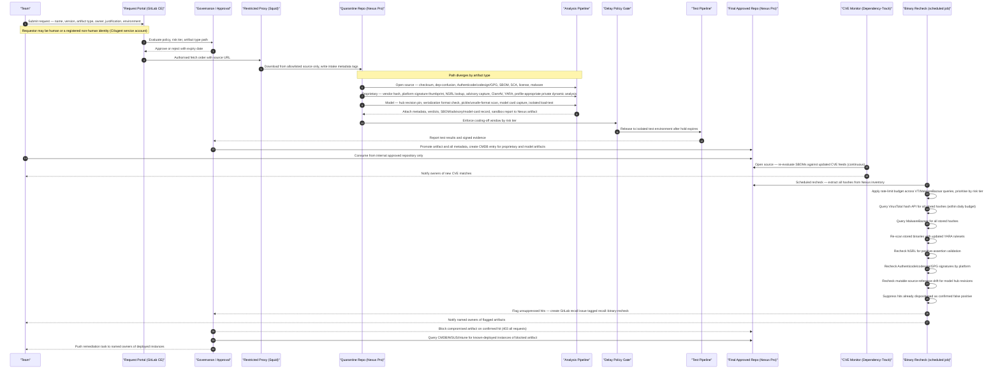
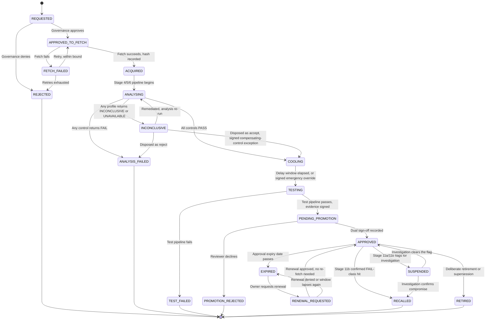

# Enterprise Package Intake and Approved Repository Architecture

## Document control

| Field | Value |
|---|---|
| Document title | Enterprise Package Intake and Approved Repository Architecture |
| Version | 1.8 |
| Status | Draft for review |
| Owner | Security Architecture |
| Last updated | 2026-08-02 |

### Revision history

| Version | Date | Author | Summary of changes |
|---|---|---|---|
| 1.0 | 2026-04-01 | Security Architecture | Initial draft — core intake workflow and eleven control stages |
| 1.1 | 2026-04-08 | Security Architecture | Added dependency-confusion prevention, sandbox data-handling policy, exception expiry, emergency recall, and metrics |
| 1.2 | 2026-04-15 | Security Architecture | Aligned stage labels to process flow; added artifact-type-specific policy paths |
| 1.3 | 2026-04-22 | Security Architecture | Added proprietary binary intake path (Path B); added inventory data mapping tables per artifact type; clarified that Dependency-Track applies to open-source only |
| 1.4 | 2026-04-23 | Security Architecture | Added Stage 11b retroactive binary recheck; added binary authentication controls (Authenticode, NSRL, MalwareBazaar); updated both flowchart and sequence diagram to show recheck loop; added control objective for post-approval supply chain compromise detection |
| 1.5 | 2026-08-01 | Security Architecture | Added Path C for AI/ML model artifacts (Stages 4c/5c); added cross-platform binary authentication (macOS, Linux) alongside Authenticode; added pipeline tooling supply-chain trust-root controls; added consumer-side remediation on recall; added recheck-job rate-limit and false-positive-suppression handling; added segregation-of-duties controls for pipeline administrators; added non-human/agentic requestor identity controls; added disaster-recovery requirements for systems of record; added "Open issues for internal review" section |
| 1.6 | 2026-08-02 | Security Architecture | Scoped macOS binary authentication as optional/on-demand rather than a baseline requirement, based on confirmed enterprise estate composition (Windows desktops, mixed Windows/Linux servers, Linux developer IDEs — no confirmed macOS fleet); Windows and Linux platform signature verification remain baseline requirements |
| 1.7 | 2026-08-02 | Security Architecture | Addressed `architecture-tooling-review.md` findings: corrected NSRL to RDSv3/reference-corpus semantics; corrected VirusTotal Public API ToS and rate-limit-at-scale framing; split Repository Firewall quarantine from the generic intake evidence store and introduced the evidence database; replaced blanket "mandatory CAPE" with per-platform analysis profiles and PASS/FAIL/INCONCLUSIVE/UNAVAILABLE outcomes; corrected WSUS/Update Catalog and Dependency-Track where-used claims; added CycloneDX ML-BOM for models; softened proprietary-SBOM absolutism; added model-sandbox resource-abuse limits; added SSRF hardening to Stage 2; added signature-verification nuance (per-source Linux verification, OCSP timestamp handling); renamed "silent repoint" to "mutable-source-reference drift" |
| 1.8 | 2026-08-02 | Security Architecture | Added the formal artifact lifecycle state machine (state table, `stateDiagram-v2`, transitions/actors/evidence table, idempotency and cross-system reconciliation rules) per ADR-0003; replaced the inline "Open issues for internal review" section with a pointer to the new `adr/` directory per ADR-0002 |

> **8 architecture decisions are still open** and are not yet reflected as final in this document — controls described below may change once they're resolved. See [`adr/README.md`](adr/README.md) for the full register (what's decided, what isn't, and why), or jump to [Open decisions](#open-decisions) at the bottom of this document for the list scoped to this file.

---

## Overview

This document describes a controlled software acquisition architecture for enterprises that need to download packages, binaries, libraries, containers, installers, and related artifacts from the internet while reducing supply-chain risk. The target model uses a restricted egress proxy, request and approval workflow, quarantine repository, integrity and provenance verification, malware screening, cooling-off delay, isolated testing, promotion to a final approved repository, and continuous re-evaluation after approval.

The architecture enforces a single controlled intake path for all artifact types across desktop, server, and developer teams. No endpoint, CI system, or pipeline may retrieve packages directly from the internet. Approved tools consume artifacts only from the internal approved repository after each stage of validation, testing, and review has completed and been recorded.

**Three analysis paths exist within this architecture.** Open-source packages and container images support full SBOM generation and continuous CVE re-evaluation via Dependency-Track. Proprietary closed-source binaries — including Microsoft patches, third-party commercial software, firmware, and hardware drivers — cannot yield meaningful SBOMs and follow a vendor-advisory intake path instead. AI/ML model artifacts — model weights, adapters, and tokenizer bundles pulled from model hubs — are neither source-available packages nor vendor-supported binaries, and follow a third intake path built around serialization-format safety and hub revision pinning rather than SBOM or code signing. All three paths use the same request portal, quarantine repository, approval gate, and approved repository.

**A fourth concern — post-approval supply chain compromise — requires controls that none of the three paths above fully addresses.** SBOM-based tools such as Dependency-Track detect known CVEs in component versions, but they cannot detect a trojanised binary where the version string is correct and no CVE has been published. A backdoored Notepad++ 8.6.4 or a compromised Trivy binary will show as clean in Dependency-Track because the component name and version match a legitimate release. The same is true for any binary that was clean at intake and later identified as part of a supply chain attack campaign, and for a model checkpoint that was clean when pinned but whose mutable upstream reference (a branch or tag, not the pinned commit itself) has since drifted to point at different, unreviewed content. Stage 11b in this architecture addresses this gap through retroactive hash rechecks, updated YARA scans, and binary authentication controls applied periodically against the entire approved artifact inventory.

**A fifth concern — the integrity of the pipeline itself — is addressed by a dedicated trust-root control set.** Every control described above depends on tools (Syft, Grype, YARA, CAPE, NSRL client libraries, model-format scanners) that are themselves internet-sourced software with their own supply chain. A compromise of the scanning tooling could produce false "clean" verdicts across the entire inventory without tripping any control described elsewhere in this document. See "Pipeline tooling supply chain" below.

---

## High-level architecture


```mermaid
flowchart TB
    A[Internet Sources\nPublic registries, vendor sites, Git releases\nMicrosoft Update Catalog, vendor portals] --> B[Restricted Egress Proxy\nAllowlisted outbound access only]
    U[Requesters\nDesktop, Server, Developer teams] --> R[Request and Approval Portal\nTicket, owner, business need, package metadata\nArtifact type declared at intake]
    R --> G[Governance Engine\nApproval rules, policy, risk scoring, separation of duties]
    G -->|Approved fetch request| Q[Quarantine / Intake Repository\nImmutable staging area — all artifact types]
    B --> Q

    Q --> AT{Artifact type?}
    AT -->|Open source / container| V1[Stage 4a · Integrity and Authenticity\nTLS, checksum, signature, provenance\nDep-confusion checks\nAuthenticode verification for PE binaries]
    AT -->|Proprietary binary / firmware| V1B[Stage 4b · Vendor Hash Verification\nCompare against vendor-published checksum\nAuthenticode cert thumbprint check\nNSRL positive-assertion lookup]
    AT -->|AI/ML model artifact| V1C[Stage 4c · Model Provenance Verification\nHub revision hash pinning\nSerialization format check\nPublisher/org identity check on hub]

    V1 --> V2[Stage 5a · SBOM and SCA\nSyft SBOM generation\nGrype SCA, license scan, secrets scan\nUpload SBOM to Dependency-Track]
    V1B --> V2B[Stage 5b · Vendor Advisory Capture\nRecord KB number, CVEs addressed, vendor severity\nStore in Nexus metadata and CMDB\nNo SBOM — do not create empty DT entry]
    V1C --> V2C[Stage 5c · Model Safety, Disclosure, and ML-BOM Capture\nPickle/unsafe-format static scan\nCycloneDX ML-BOM, model card, license, dataset provenance\nNot represented in Dependency-Track — no meaningful CVE mapping]

    V2 --> V3[Stage 6 · Malware and Sandbox Analysis\nClamAV and YARA — all artifact types\nNSRL and MalwareBazaar hash lookup\nOpen source: VirusTotal hash lookup if policy permits\nProprietary: per-platform analysis profile — CAPE, Linux VM, or firmware analysis\nModel: isolated load-test in no-egress sandbox]
    V2B --> V3
    V2C --> V3

    V3 --> D[Stage 7 · Cooling-off Delay\n7 to 30 days by risk tier\nEmergency override requires signed risk acceptance]
    D --> T[Stage 8 · Test Pipeline\nIsolated environment, no internet\nSigned test evidence required for promotion]
    T --> P[Stage 9 · Promotion Review\nSecurity and owner sign-off\nExpiry date confirmed\nCMDB entry required for proprietary and model artifacts]
    P --> F[Final Approved Repository\nNexus Pro — all artifact types\nAll metadata tags and advisory records preserved]

    F --> C[Consumers\nCI/CD, build tools, deployment tools, desktop and server estates]

    F --> I[Inventory and Metadata Store\nOpen source: Nexus plus Dependency-Track\nProprietary: Nexus metadata plus CMDB plus WSUS or SCCM\nModel: Nexus metadata plus CMDB plus model registry]

    I --> M[Stage 11a · Continuous CVE Recheck\nOpen source: Dependency-Track against updated feeds\nProprietary: vendor bulletin and NVD CPE watches\nModel: hub revision-drift and advisory watch]
    I --> R2[Stage 11b · Retroactive Binary Recheck\nAll artifact types: scheduled hash recheck\nVirusTotal hash API and MalwareBazaar queries\nUpdated YARA re-scan of stored binaries\nNSRL positive-assertion recheck\nAuthenticode / codesign / GPG recheck by platform\nCAPE targeted recheck on specific IOC alerts\nRate-limited and false-positive-suppression aware]

    M --> N[Notification and Recall\nTickets, owner alerts, blocklist, emergency recall\nPush remediation to known-deployed consumers]
    R2 --> N
    N --> C

    TR[Pipeline Tooling Trust Root\nPinned scanner versions, signed updates only\nPeriodic tooling self-audit] -.->|integrity-gates| V1
    TR -.->|integrity-gates| V2
    TR -.->|integrity-gates| V3
    TR -.->|integrity-gates| R2
```

---

## Sequence diagram


```mermaid

sequenceDiagram
    autonumber
    participant Team as "Team"
    participant Portal as "Request Portal (GitLab CE)"
    participant Gov as "Governance / Approval"
    participant Proxy as "Restricted Proxy (Squid)"
    participant Intake as "Quarantine Repo (Nexus Pro)"
    participant Scan as "Analysis Pipeline"
    participant Delay as "Delay Policy Gate"
    participant Test as "Test Pipeline"
    participant Repo as "Final Approved Repo (Nexus Pro)"
    participant Monitor11a as "CVE Monitor (Dependency-Track)"
    participant Monitor11b as "Binary Recheck (scheduled job)"

    Team->>Portal: Submit request — name, version, artifact type, owner, justification, environment
    Note over Team,Portal: Requestor may be human or a registered non-human identity (CI/agent service account)
    Portal->>Gov: Evaluate policy, risk tier, artifact type path
    Gov-->>Portal: Approve or reject with expiry date
    Portal->>Proxy: Authorised fetch order with source URL
    Proxy->>Intake: Download from allowlisted source only, write intake metadata tags
    Note over Intake,Scan: Path diverges by artifact type
    Intake->>Scan: Open source — checksum, dep-confusion, Authenticode/codesign/GPG, SBOM, SCA, license, malware
    Intake->>Scan: Proprietary — vendor hash, platform signature thumbprint, NSRL lookup, advisory capture, ClamAV, YARA, profile-appropriate private dynamic analysis
    Intake->>Scan: Model — hub revision pin, serialization format check, pickle/unsafe-format scan, model card capture, isolated load-test
    Scan-->>Intake: Attach metadata, verdicts, SBOM/advisory/model-card record, sandbox report to Nexus artifact
    Intake->>Delay: Enforce cooling-off window by risk tier
    Delay->>Test: Release to isolated test environment after hold expires
    Test-->>Gov: Report test results and signed evidence
    Gov->>Repo: Promote artifact and all metadata, create CMDB entry for proprietary and model artifacts
    Team->>Repo: Consume from internal approved repository only
    Monitor11a->>Repo: Open source — re-evaluate SBOMs against updated CVE feeds (continuous)
    Monitor11a-->>Team: Notify owners of new CVE matches
    Monitor11b->>Repo: Scheduled recheck — extract all hashes from Nexus inventory
    Monitor11b->>Monitor11b: Apply rate-limit budget across VT/MalwareBazaar queries, prioritise by risk tier
    Monitor11b->>Monitor11b: Query VirusTotal hash API for all stored hashes (within daily budget)
    Monitor11b->>Monitor11b: Query MalwareBazaar for all stored hashes
    Monitor11b->>Monitor11b: Re-scan stored binaries with updated YARA rulesets
    Monitor11b->>Monitor11b: Recheck NSRL for positive-assertion validation
    Monitor11b->>Monitor11b: Recheck Authenticode/codesign/GPG signatures by platform
    Monitor11b->>Monitor11b: Recheck mutable-source-reference drift for model hub revisions
    Monitor11b->>Monitor11b: Suppress hits already dispositioned as confirmed false positive
    Monitor11b-->>Gov: Flag unsuppressed hits — create GitLab recall issue tagged recall::binary-recheck
    Monitor11b-->>Team: Notify named owners of flagged artifacts
    Gov-->>Repo: Block compromised artifact on confirmed hit (403 all requests)
    Gov->>Repo: Query CMDB/WSUS/Intune for known-deployed instances of blocked artifact
    Gov-->>Team: Push remediation task to named owners of deployed instances

```

---

## Control objectives

- Stop direct internet downloads by enterprise endpoints and pipelines.
- Verify authenticity through hashes, platform code-signing verification (Authenticode and GPG/RPM signatures as baseline controls; Apple codesign/notarization as an optional control, built only if a macOS artifact or endpoint population enters scope), certificate or key trust registers, and provenance before any use. For proprietary binaries the primary authenticity controls are vendor hash verification, platform signature validity, and NSRL positive-assertion lookup. For model artifacts the primary control is hub revision-hash pinning combined with a mandatory safe-serialization format.
- Prevent dependency-confusion and namespace-spoofing attacks at the proxy and quarantine layers (open-source path).
- Apply distinct analysis paths based on artifact type: SBOM-based analysis for open-source and container artifacts; vendor-advisory capture for proprietary closed-source binaries; serialization-safety and provenance capture for AI/ML model artifacts.
- Generate SBOM and SCA data for open-source and container artifacts; maintain vendor advisory records for proprietary artifacts; maintain model card, license, and hub-provenance records for model artifacts.
- Detect malware and suspicious behavior at intake using ClamAV, YARA, MalwareBazaar hash lookup, NSRL lookup, and private dynamic analysis. Select the dynamic analysis method by artifact platform and format (see the Stage 6 analysis profiles table) rather than assuming one sandbox technology fits every proprietary artifact — CAPE for Windows binaries, a disposable syscall-monitored Linux VM for Linux binaries, firmware extraction/emulation for firmware, and a no-egress syscall-monitored load harness for model artifacts, all kept private with no external file submission.
- Detect post-approval supply chain compromise through a scheduled retroactive recheck job (Stage 11b) that re-queries threat intelligence sources against every stored artifact hash, re-scans with updated YARA rules, rechecks binary authentication across platforms, and rechecks model hub mutable-source-references for drift against the pinned commit SHA. This controls the threat class that SBOM-based tools cannot see: trojanised binaries, or models resolved through a drifted mutable reference, where the version string is correct and no CVE has been published. Recheck queries against rate-limited external services are budgeted and prioritised by risk tier so coverage degrades predictably rather than silently as inventory grows; dispositioned false positives are suppressed from re-alerting until the artifact or ruleset changes.
- Protect the pipeline's own integrity: the scanning and verification tooling (Syft, Grype, YARA, CAPE, model-format scanners, hash-lookup clients) is itself internet-sourced software and is pinned, provenance-checked, and periodically self-audited so a compromise of the tooling cannot silently produce false "clean" verdicts.
- Enforce segregation of duties not only on artifact approval but on administrative access to the pipeline itself — Nexus tag editing, CMDB thumbprint/key registers, YARA ruleset sources, and recheck-job configuration require change control separate from the requestor/approver role.
- Delay risky new releases to reduce exposure to zero-day and short-lived malicious packages.
- Apply license review so open-source and model artifacts comply with enterprise policy before reaching production.
- Preserve a complete inventory and continuously re-evaluate approved artifacts through the appropriate channel for each artifact type.
- Enforce exception expiry so temporary approvals do not become permanent without re-review.
- Support emergency recall procedures that can be triggered by both CVE feeds (Stage 11a) and binary recheck hits (Stage 11b), with affected-system identification using Dependency-Track (open source), CMDB (proprietary and model), and automated push remediation to known-deployed instances rather than notification alone.
- Preserve the systems of record themselves: Nexus, the CMDB, and the recheck-job datastore carry defined backup and recovery expectations so an incident cannot also erase the evidence needed to investigate it.
- Verify the identity of non-human requestors (CI pipelines, agentic tooling) to the same separation-of-duties standard as human requestors before an automated intake request can be approved.

---

## Artifact intake paths

All artifacts enter through the same request portal, egress proxy, and quarantine repository. They diverge at the analysis stage and converge at the promotion gate and approved repository. The artifact type must be declared by the requestor at intake so the pipeline selects the correct path automatically.

### Path A — Open-source packages and container images

Applies to: npm, PyPI, Maven, NuGet, Go modules, Ruby gems, apt/yum packages from public registries, container images from public registries, and any open-source release with published source.

Controls applied in sequence: dependency-confusion check at proxy and quarantine; full checksum and signature verification; Authenticode verification where applicable; SBOM generation in CycloneDX or SPDX format; SCA against NVD, GitHub Advisories, OSV, and Sonatype intelligence; license analysis and legal review gate; secrets scan; ClamAV static scan; YARA pattern matching; MalwareBazaar hash lookup; NSRL positive-assertion lookup; optional VirusTotal hash lookup where policy permits; cooling-off delay; isolated test pipeline; promotion sign-off; SBOM stored in Dependency-Track for continuous CVE re-evaluation after promotion.

### Path B — Proprietary closed-source binaries, commercial software, and firmware

Applies to: Microsoft patches (.msu, .exe, .cab), Windows Update packages, Adobe installers, Oracle database software, SAP components, hardware drivers, firmware updates, commercial ISV software, and any binary where the vendor does not publish source or a machine-readable SBOM.

Syft and similar source/package-manifest-driven tools cannot *generate* meaningful SBOM data from a closed-source binary — but "closed-source" does not always mean "zero available component data." Some vendors publish their own SBOM (a growing practice under regulatory and procurement pressure); some installers embed extractable package metadata (.NET assembly manifests, some installer formats' embedded file lists); and even where neither exists, a partial component inventory is sometimes technically derivable from the binary itself (e.g., detecting statically linked open-source libraries via binary composition analysis). The distinction that matters is **completeness and evidence quality, not open- versus closed-source status**: accept and verify a vendor-provided SBOM where one exists; generate a partial inventory where technically feasible and label it as partial; and fall back to vendor advisory capture, which remains the primary control for this path regardless. An empty or fabricated-complete SBOM uploaded to Dependency-Track creates false coverage and is worse than no record — that principle holds whether the emptiness comes from "no SBOM tooling applies" or from silently dropping a partial result down to nothing.

Controls applied in sequence: vendor-published hash verification — mismatch is a hard block; Authenticode signature validity check; Authenticode certificate thumbprint verification against the expected publisher cert stored in the CMDB; NSRL positive-assertion lookup; vendor advisory record capture (KB number, CVEs addressed, vendor severity, affected product versions); ClamAV static scan; YARA pattern matching; MalwareBazaar hash lookup; mandatory profile-appropriate dynamic analysis regardless of hash match (see the analysis profiles table under Stage 6 — Windows binaries go to CAPE, Linux binaries to a disposable syscall-monitored VM, firmware to extraction/emulation analysis); cooling-off delay; isolated test pipeline; promotion sign-off; CMDB entry created as the ongoing deployment and monitoring record. Dependency-Track is not used for this path.

### Path C — AI/ML model artifacts

Applies to: model weight checkpoints, quantised model files (GGUF, GGML), `safetensors` and legacy PyTorch (`.pt`, `.pth`, `.bin`) checkpoints, LoRA and other adapter weights, tokenizer and processor config bundles, and any artifact pulled from a model hub (Hugging Face Hub, Ollama registry, Civitai, ModelScope, or an internal model registry).

Model artifacts fit neither Path A nor Path B. They are rarely accompanied by publishable source in the sense Syft or Grype can consume, so SBOM generation does not apply — but unlike a proprietary binary, they are also not code-signed by a vendor, and the analog of a "hash" is a mutable hub reference (a branch or tag) rather than a fixed release artifact. The threat model is also different in kind: the primary risk at intake is not a modified binary evading signature checks, it is **arbitrary code execution during deserialization**. The default PyTorch checkpoint format is a Python pickle, and unpickling untrusted data can execute arbitrary code as a documented property of the format, not a bug in it. A checkpoint can therefore be "clean" under ClamAV and YARA and still compromise the host the moment an engineer runs `torch.load()` on it locally instead of through this pipeline.

**Format policy is the primary control for this path.** `safetensors` (Hugging Face, Apache 2.0) stores only tensor data with no executable payload and is the required format for all new model intake. GGUF (llama.cpp ecosystem) is accepted on the same basis — it is a flat tensor-and-metadata container with no code execution surface. Legacy pickle-based checkpoints (`.pt`, `.pth`, `.bin`, `.ckpt`) are accepted only under a signed exception, and only after passing a static pickle opcode scan that rejects any checkpoint referencing `__reduce__`, `eval`, `exec`, `os.system`, `subprocess`, or other code-execution opcodes rather than plain tensor-construction calls.

Controls applied in sequence: capture the exact hub revision (commit SHA, not a mutable branch or tag) requested and pin the fetch to that revision; verify the download's SHA-256 against the hub's own recorded file hash where the hub publishes one (Hugging Face does, via its LFS/OID metadata); verify the format is `safetensors` or GGUF, or route to the pickle static-scan exception path; run the static opcode/pickle scan on any non-`safetensors` file regardless of extension, since a malicious payload can be disguised with any file extension; capture model card, license, and dataset-provenance metadata (base model lineage, fine-tune source, declared training data, license class — including non-commercial and research-only variants); capture the publisher/organisation identity as verified by the hub (verified-org badge, or absence of one, recorded as a risk signal); ClamAV static scan; YARA pattern matching tuned for embedded-script indicators inside archive-based formats; MalwareBazaar hash lookup; mandatory isolated load-test — the model is loaded inside a no-egress, syscall-monitored sandbox with hard resource limits (maximum total bytes, maximum declared tensor dimensions, maximum RAM/CPU/GPU allocation and time, maximum temporary disk use, and maximum archive depth/compression ratio for any nested-archive formats), since a malicious or malformed model file can be a resource-exhaustion vector — a decompression bomb or an absurd declared tensor shape — independent of whether it also triggers code execution; the pipeline confirms the load did not spawn a child process, write outside its working directory, attempt an outbound connection, or exceed any resource limit during load; cooling-off delay; isolated test pipeline for the consuming application; promotion sign-off; CMDB entry created recording the pinned hub revision as the ongoing drift-detection baseline. Dependency-Track is not used for this path.

---

## Binary authentication controls

This section defines the additional authentication controls applied to signed artifacts at intake (Stages 4 and 6) and during the retroactive recheck (Stage 11b). These controls address the supply chain attack scenario where a trojanised binary has the correct version string but has been tampered with.

Earlier versions of this architecture treated Authenticode as the sole signature control, which covers Windows PE binaries but leaves a gap for the Linux proprietary binaries this architecture explicitly scopes in (Oracle, SAP, and other vendor tooling ship Linux builds, and the enterprise estate includes a mix of Windows and Linux servers plus Linux developer IDEs alongside Windows desktops). The controls below are organised by platform; the CMDB publisher trust register (Authenticode thumbprint, Apple Team ID, or GPG key fingerprint) is the common mechanism across all three.

**Platform scope caveat:** Windows (Authenticode) and Linux (GPG/RPM/DEB) signature verification are baseline requirements for this architecture, matching the confirmed enterprise estate — Windows desktops, Windows and Linux servers, and Linux developer tooling. **macOS code signing and notarization verification is documented below for completeness and is scoped as optional / build-on-demand**, not a baseline rollout requirement, since no macOS fleet has been confirmed in scope. If a macOS binary genuinely needs to enter the pipeline (e.g. a cross-platform vendor tool with a Mac build, or a future Mac endpoint population), implement the macOS control at that time rather than building it into the initial rollout. Until then, any macOS artifact submitted for intake defaults to Tier 1 cooling-off with hash verification as the sole authenticity control — the same fallback this architecture already applies to any vendor that doesn't publish a signature at all.

### Authenticode signature verification

All Windows PE binaries (.exe, .dll, .msi, .msu) must have their Authenticode signatures verified at intake. Verification checks two things: that the signature is cryptographically valid (the file has not been modified since signing), and that the signing certificate belongs to the expected publisher.

The pipeline stores the expected certificate thumbprint for each approved publisher in the CMDB. At intake, the pipeline extracts the actual signing certificate thumbprint and compares it against the stored expected value. A valid signature from an unexpected certificate is treated as a failure — it may indicate re-signing after tampering.

```powershell
# Verify Authenticode signature and extract thumbprint
$sig = Get-AuthenticodeSignature -FilePath $artifactPath
if ($sig.Status -ne "Valid") {
    throw "Authenticode signature invalid: $($sig.Status)"
}
$actualThumbprint = $sig.SignerCertificate.Thumbprint
$expectedThumbprint = Get-ExpectedThumbprint -Publisher $publisherName
if ($actualThumbprint -ne $expectedThumbprint) {
    throw "Certificate thumbprint mismatch. Expected: $expectedThumbprint Got: $actualThumbprint"
}
```

Known expected thumbprints for common publishers:
- Notepad++ releases are signed by the author's personal code-signing certificate.
- Microsoft patches are signed by a Microsoft certificate chain rooted in the Microsoft Root Certificate Authority.
- Any deviation from the expected thumbprint blocks the artifact.

### macOS code signing and notarization (optional — build on demand)

> This control is not part of the baseline rollout. Include it only once a macOS artifact or endpoint population is actually confirmed in scope.

macOS proprietary installers (`.pkg`, `.dmg`, `.app` bundles) use Apple's code-signing and notarization system rather than Authenticode. Verification checks three things: the code signature is valid and covers the entire bundle, the signing identity's Team ID matches the expected publisher stored in the CMDB, and the artifact has been notarized by Apple — meaning Apple's own automated scan has not flagged it.

```bash
# Verify code signature validity and print the signing identity
codesign --verify --deep --strict --verbose=2 /path/to/App.app
codesign -dv --verbose=4 /path/to/App.app 2>&1 | grep "TeamIdentifier"

# Verify notarization ticket is stapled and valid
spctl --assess --type execute --verbose /path/to/App.app
```

The pipeline extracts the actual Team ID and compares it against the expected value in the CMDB publisher register, identically to the Authenticode thumbprint comparison. A valid signature under an unexpected Team ID, or a signature that is valid but not notarized, is treated as a failure.

### Linux package and binary signing

Linux proprietary artifacts (RPM, DEB, or standalone ELF binaries and installers) do not have a single OS-native signing mechanism equivalent to Authenticode, and the verification mechanism that actually matters depends on *how the artifact was obtained* — this architecture requires per-source verification rather than treating one tool as universal:

- **RPM packages:** the package's own embedded signature, verified with `rpm --checksig` against an imported publisher public key. This is genuinely RPM-native and reliable.
- **DEB packages fetched from a repository** (the normal Debian/Ubuntu trust model): trust comes from the repository's signed `InRelease`/`Release.gpg` metadata, not from a per-package signature — most DEB packages are not individually signed at all. Verify the repository metadata signature (`apt-key`/modern keyring-based verification against the configured repo) rather than relying on `dpkg-sig`, which is an optional, lightly used tool that most Debian-family packages don't carry a signature for in the first place.
- **DEB packages distributed standalone** (not through a repository, e.g. a vendor's direct `.deb` download): `dpkg-sig --verify` only applies if the vendor actually signed the package with it, which is uncommon — check for a detached GPG signature distributed alongside the file instead, and treat an unsigned standalone DEB the same as any other unsigned vendor artifact (see below).
- **Standalone ELF binaries or tarballs:** verify against a detached GPG signature where the vendor provides one.

```bash
# RPM: verify the package's own embedded signature
rpm --checksig vendor-package.rpm

# APT repository metadata (the actual DEB trust root in the normal case)
apt-key verify /etc/apt/sources.list.d/vendor.list  # or modern keyring-based equivalent
gpg --verify InRelease

# Standalone DEB, ELF binary, or tarball distributed with a detached GPG signature
gpg --verify vendor-binary.tar.gz.sig vendor-binary.tar.gz
```

Store the expected publisher key/repository-signing-key fingerprint in the CMDB key register per publisher, as a **managed trust policy that supports planned key rotation** — not a single value expected to never change. A publisher legitimately rotating their signing key is a normal event, not itself a compromise signal; the CMDB record should carry a rotation history and an expected-transition window, and a Stage 11b thumbprint/key mismatch should route to human review to distinguish a legitimate rotation from an actual compromise, rather than auto-blocking on any change.

Where a vendor does not provide any signature (common for smaller ISVs and some firmware), the artifact is not eligible for the fast-track Tier 3 cooling-off and defaults to Tier 1, since hash verification against a vendor-published checksum page is the only remaining authenticity control.

### NSRL reference-corpus lookup

The NIST National Software Reference Library (NSRL) is a reference corpus of hash values collected from software releases submitted to NIST, currently distributed as the RDSv3 dataset in SQLite format. A match tells the pipeline that a file with this hash was previously catalogued as belonging to a known, identifiable software release — that is evidence supporting identification and provenance, **not proof that the file is currently safe, authorised for use, or uncompromised**. NSRL was built for digital forensics (filtering known files out of an investigation), not as a malware or authorisation signal, and this architecture uses it accordingly: as one input to a broader confidence assessment, never as a standalone approval or rejection basis.

NIST distributes the current RDS as RDSv3 SQLite files, downloadable in full or as incremental "minimal" sets. The pipeline queries the SQLite file directly, or — if consolidating NSRL alongside other reference data in a shared operational database — ETLs it into PostgreSQL through a documented, versioned import job rather than treating Postgres as the native format. Either way, the exact table and column names must be verified against NIST's current RDSv3 schema documentation at implementation time, since the schema has changed across NSRL releases.

```python
def check_nsrl(sha256_hash: str, nsrl_db, dataset_version: str) -> dict:
    # Schema (table/column names) must be verified against the current RDSv3
    # SQLite schema for the NSRL release in use — do not assume this literally.
    cursor = nsrl_db.execute(
        "SELECT file_name, product_name, product_version FROM file_entry WHERE sha256 = ?",
        (sha256_hash.upper(),)
    )
    result = cursor.fetchone()
    if result:
        return {
            "status": "present_in_nsrl",
            "product": result[1],
            "version": result[2],
            "dataset_version": dataset_version,
        }
    return {"status": "not_present", "dataset_version": dataset_version}
    # not_present does not mean malicious — novel/niche/internal software is routinely absent
    # present_in_nsrl does not mean currently safe — it is provenance evidence, not a safety verdict
```

NSRL coverage is strongest for widely distributed commercial software and well-known open-source releases. Niche tools and internal builds may not be indexed. Record `dataset_version` alongside every result so a later reinterpretation of a match can be traced to the specific NSRL release that produced it.

### MalwareBazaar hash lookup

MalwareBazaar (abuse.ch, free API) is a database of known-malicious file hashes crowdsourced from the security research community. Querying it at intake and during the retroactive recheck catches files that have been identified as malicious after you approved them.

```python
import requests

def check_malwarebazaar(sha256_hash: str) -> bool:
    response = requests.post(
        "https://mb-api.abuse.ch/api/v1/",
        data={"query": "get_info", "hash": sha256_hash},
        timeout=10
    )
    data = response.json()
    return data.get("query_status") == "hash_found"
    # hash_found means the file is known malicious
    # no_results means not in database — not a clean bill of health
```

### VirusTotal hash lookup

VirusTotal aggregates results from 70+ AV engines. Hash-only lookups do not upload the file and are safe for proprietary binaries. The free (Public) API allows 500 lookups per day; the paid (Premium) API supports bulk queries and is licensed for commercial/business-workflow automation.

**Flagged for capacity planning, not removed from the architecture:** this architecture uses the VirusTotal Public API as the default for both Stage 6 intake lookups and Stage 11b retroactive recheck. Two things make the 500/day free-tier limit a growing constraint rather than a fixed one:

- **Stage 11b is not a one-time scan — it is a recurring scan of the entire approved inventory.** Every artifact promoted through this pipeline adds a permanent line item to future recheck runs. A 500-lookup daily budget that comfortably covers a few hundred artifacts today will be exhausted well before the inventory reaches a few thousand, purely from the Tier 1 nightly rotation described in Stage 11b — independent of Stage 6 intake volume on top of it.
- **VirusTotal's Public API terms restrict use in commercial products, services, or automated business workflows.** An enterprise intake pipeline that runs unattended, nightly, against production infrastructure is exactly the kind of automated business workflow the Public API terms are written to exclude. This is a licensing question the organisation needs to resolve, independent of whether the rate limit itself is ever hit — sustained automated use of the Public API in this architecture should be treated as a compliance gap to close, not a cost-optimisation choice to defer indefinitely.

Track inventory size and daily lookup volume from the day this goes live, and treat "does the recheck job still fit inside the free tier, and are we still within the Public API's permitted use, today" as a standing question for the Stage 11b rate-limit budgeting described below and the licensing decision in [ADR-0004](adr/0004-virustotal-public-api-usage-and-licensing.md).

```python
def check_virustotal_hash(sha256_hash: str, api_key: str) -> int:
    url = f"https://www.virustotal.com/api/v3/files/{sha256_hash}"
    headers = {"x-apikey": api_key}
    response = requests.get(url, headers=headers, timeout=10)
    if response.status_code == 404:
        return -1  # Not in VT database — unknown, not confirmed clean
    data = response.json()
    return data["data"]["attributes"]["last_analysis_stats"]["malicious"]
    # Returns count of AV engines flagging the hash as malicious
    # 0 = not flagged, but does not guarantee clean — novel attacks may not be indexed
```

Important: a hash not found in VirusTotal means no one has submitted that file to VT. It does not mean the file is clean. Novel or targeted attacks may never appear. This control catches known campaigns and widely distributed malware, not targeted attacks against your specific organisation.

---

## Pipeline tooling supply chain

Every control described so far assumes the scanning and verification tooling is trustworthy. That assumption is itself a supply chain dependency: Syft, Grype, YARA, CAPE, the NSRL and MalwareBazaar client code, and the model-format scanners used in Path C are all internet-sourced software, several of them updated frequently from community rule feeds. A compromise of any of these — not the artifacts they scan, but the scanners themselves — could produce false "clean" verdicts across the entire inventory without triggering any control described elsewhere in this document. This document already cites one real precedent: Trivy's own supply chain compromises, which is why Syft is the recommended SBOM generator instead.

This is treated as a distinct control surface rather than folded into Stage 4/5/6, because it protects the integrity of the controls rather than the integrity of an artifact.

- **Pin scanner and sandbox tool versions explicitly.** No pipeline stage pulls `latest` for Syft, Grype, YARA, CAPE, or any client library. Version bumps go through the same change-control process as a production dependency upgrade, including a diff review of the changelog.
- **Verify provenance on every tooling update**, not just the first install. Syft and Grype publish signed releases (cosign) — the pipeline verifies the signature before installing an updated binary. Where a tool does not publish signed releases, pin to a specific commit hash and diff-review changes before bumping.
- **Treat YARA and CAPE rule feeds as a separate, lower-trust update channel from the tools themselves.** Ruleset updates (Elastic, VirusTotal community rules) are pulled into a staging area and diffed before being promoted into the production ruleset, since a malicious or careless rule contribution could be used to suppress detection of a specific artifact rather than only to add detection.
- **Run a periodic tooling self-audit**, independent of the vendor/community supply chain, using a small fixed set of known-malicious and known-clean reference samples (an internal "canary set") re-run through the full Stage 6 and Stage 11b pipeline on a schedule. A canary sample that stops flagging as malicious is a signal the scanning tooling itself has regressed or been tampered with, not that the sample changed.
- **Isolate tool execution from artifact execution.** Static scanners (Syft, Grype, YARA, ClamAV) run with no network egress and least-privilege file access to the artifact being scanned, so a maliciously crafted artifact designed to exploit the scanner itself has a reduced blast radius.

---

## Inventory and metadata — where data is stored

### System responsibilities

**GitLab CE** is the system of record for the intake request, approval workflow, and audit trail. It holds who requested the artifact, when, why, what approvals were given, when they expire, and all transitions and comments. The GitLab issue number is written as a tag to the Nexus artifact at intake, linking the binary permanently to its approval record.

**Nexus Repository Pro** is the system of record for the artifact bytes themselves, canonical hashes, source URL, and intake timestamp. Every artifact — open-source, proprietary, or model — is stored here.

**Evidence database** (a schema the organisation stands up separately, not a Nexus built-in) is the system of record for the rich, per-artifact provenance and verdict data this architecture generates: requestor name, approver, approval expiry, risk tier, KB number, CVE list, vendor severity, platform signature verification results, NSRL result, MalwareBazaar result, and every other data point the tables below list against a given artifact. **Nexus's own Tags API applies tags at the component level** — a compact set of key-value labels intended for search and lifecycle filtering, not a substitute for a strongly typed per-artifact record, and it does not cleanly distinguish between multiple assets that can exist under one Nexus component (for example, a Maven component's jar, pom, and sources assets, or a multi-architecture container image). Use Nexus tags for compact lookup identifiers and lifecycle state (e.g. `intake-ticket-ref`, `lifecycle-state`, `risk-tier`); use the evidence database, keyed by repository, format, component coordinates, asset path, and SHA-256, for everything else. Throughout the data-mapping tables below, "Nexus Pro (tag)" refers to a compact lookup/lifecycle value stored as an actual Nexus tag; the authoritative full record for that data point lives in the evidence database and is only mirrored into Nexus as a short tag where useful for search.

**OWASP Dependency-Track** is the system of record for SBOM contents, component vulnerability findings, policy violations, and where-used analysis. It is used exclusively for artifacts where a meaningful SBOM exists: open-source packages and container images. Proprietary binaries must not be represented in Dependency-Track with empty SBOMs — an empty entry creates false assurance of coverage. **"Where-used" in Dependency-Track means which projects and BOM relationships reference a component** — a build-time/release-manifest relationship, not proof that the component is installed and running on a specific host today. Do not treat a Dependency-Track where-used result as equivalent to a runtime deployment inventory; use it to scope which project teams to notify of a CVE, and use CMDB, EDR, container orchestration, or deployment telemetry (see Stage 10) to identify actual deployed instances for recall.

**CMDB** (ServiceNow, GitLab-hosted database, or Ralph) is the system of record for the deployment inventory of proprietary software and the publisher certificate thumbprint register. It records what commercial software is approved, at what version, which systems have it deployed, the expected Authenticode certificate thumbprint for each publisher, and the vendor advisory subscription reference for ongoing monitoring.

**WSUS / SCCM / Intune** provides deployment tracking and patch compliance reporting for Microsoft Windows updates. It records which machines have which KB applied and flags non-compliant machines.

**Recheck job datastore** (PostgreSQL table or equivalent): stores the results of each Stage 11b retroactive recheck run — artifact hash, recheck date, VirusTotal result, MalwareBazaar result, YARA result, NSRL result, platform signature recheck result, disposition (blocked, flagged, confirmed false positive, clean), and any recall actions taken. A confirmed-false-positive disposition suppresses future alerts on that specific hash/signal combination until the artifact hash or the matching rule changes, so the same reviewed finding does not re-open on every scheduled run. This provides a queryable history of recheck verdicts for audit purposes.

**Model registry metadata** (Nexus custom tags plus CMDB, or a dedicated model registry such as MLflow if already deployed): holds the pinned hub revision SHA, source hub and namespace, model card contents, license classification, base-model lineage, and pickle-scan result for every model artifact. The pinned revision SHA itself is immutable and never changes once stored — what Stage 11b rechecks is whether the mutable branch/tag reference the artifact was originally requested against (the **mutable-source-reference**) has since drifted to a different commit than the one pinned in Nexus.

**Remediation tracking**: the CMDB deployment records (for proprietary and model artifacts) and Dependency-Track where-used analysis (for open source) are queried by the recall workflow to identify systems with a recalled artifact already deployed, not only systems that could fetch it. Where WSUS, SCCM, Intune, or a configuration management tool (Ansible, etc.) is available, the recall workflow triggers a push remediation task against those identified systems rather than relying on the owner to act on a notification alone.

### Data mapping: open-source packages and container images

| Data point | Authoritative store | Notes |
|---|---|---|
| Binary or package file | Nexus Pro | Immutable, hash-verified storage |
| SHA-256 and SHA-512 hashes | Nexus Pro | Stored as component attributes |
| Source URL | Nexus Pro | Original upstream URL from registry or Git release |
| Download timestamp | Nexus Pro | Set at quarantine intake by pipeline |
| Requestor name | Nexus Pro (tag) | Written from GitLab issue at intake |
| Approver name and approval date | Nexus Pro (tag) | Written from GitLab issue at intake |
| Approval expiry date | Nexus Pro (tag) and GitLab issue due date | Both must agree; mismatch flags for review |
| GitLab intake ticket reference | Nexus Pro (tag) | Links artifact to approval record permanently |
| Risk tier | Nexus Pro (tag) | Tier 1, 2, or 3 |
| Target environment | Nexus Pro (tag) | Dev, Test, or Production |
| Lifecycle state | Nexus Pro (repository group) | Quarantine, Dev-approved, or Prod-approved |
| SBOM (CycloneDX or SPDX) | Dependency-Track (primary) and Nexus (attached file) | Generated by Syft or IQ Server at Stage 5a |
| CVE and vulnerability findings | Dependency-Track | Continuously re-evaluated as new CVEs are published |
| Policy violations | Dependency-Track | License, vulnerability severity, and age policies |
| Where-used (which projects use this component) | Dependency-Track | Cross-referenced via SBOM component PURLs |
| MalwareBazaar result at intake | Nexus Pro (tag) | Recorded at Stage 6; updated by Stage 11b recheck |
| NSRL lookup result at intake | Nexus Pro (tag) | present_in_nsrl / not_present, plus dataset_version — recorded at Stage 6; a match is provenance evidence, not a safety verdict |
| YARA scan verdict | Nexus Pro (tag and attached JSON) | Updated by Stage 11b re-scan with new rulesets |
| VirusTotal hash result at intake | Nexus Pro (tag) | Engine count; updated by Stage 11b recheck |
| Sandbox detonation report | Nexus Pro (attached file) | CAPE private sandbox for high-risk open-source |
| Stage 11b recheck history | Recheck job datastore | Queryable history of all periodic recheck verdicts |
| Cosign attestation and in-toto link | Nexus (attached) and Rekor (transparency log) | Signs the pipeline steps |

### Data mapping: proprietary binaries, commercial software, and Microsoft patches

| Data point | Authoritative store | Notes |
|---|---|---|
| Binary or installer file | Nexus Pro | Immutable storage |
| SHA-256 and SHA-512 hashes | Nexus Pro | Stored as component attributes |
| Vendor-published hash | Nexus Pro (tag) | From Microsoft Update Catalog, vendor download portal |
| Hash verification result | Nexus Pro (tag) | Pass or Fail — mismatch blocks pipeline immediately |
| Source URL | Nexus Pro | e.g. catalog.update.microsoft.com download URL |
| Download timestamp | Nexus Pro | Set at quarantine intake |
| Authenticode validity result | Nexus Pro (tag) | Valid / Invalid / No signature |
| Authenticode certificate thumbprint (actual) | Nexus Pro (tag) | Extracted at intake, compared against CMDB expected value |
| Expected Authenticode thumbprint | CMDB (publisher certificate register) | Maintained per publisher; updated when publisher rotates cert |
| Thumbprint match result | Nexus Pro (tag) | Match / Mismatch — mismatch blocks pipeline |
| NSRL lookup result | Nexus Pro (tag) | present_in_nsrl / not_present, plus dataset_version — a match is provenance evidence, not a safety verdict |
| MalwareBazaar result at intake | Nexus Pro (tag) | Recorded at Stage 6; updated by Stage 11b recheck |
| YARA scan verdict | Nexus Pro (tag and attached JSON) | Updated by Stage 11b re-scan |
| VirusTotal hash result | Nexus Pro (tag) | Hash-only lookup; safe for proprietary artifacts |
| Requestor name | Nexus Pro (tag) | Written from GitLab issue |
| Approver name and approval date | Nexus Pro (tag) | Written from GitLab issue |
| Approval expiry date | Nexus Pro (tag) and GitLab issue due date | Both must agree |
| GitLab intake ticket reference | Nexus Pro (tag) | Links artifact to approval record |
| Risk tier | Nexus Pro (tag) | Proprietary binaries default to Tier 1 or 2 |
| KB article or vendor reference number | Nexus Pro (tag) and CMDB | e.g. KB5034441 |
| CVEs addressed by this artifact | Nexus Pro (tag) and CMDB | Sourced from vendor advisory |
| Vendor severity rating | Nexus Pro (tag) and CMDB | Critical, Important, Moderate, or Low |
| Affected product scope | CMDB | Which product versions apply |
| SBOM (full, tool-generated) | Not applicable | Syft-class tools cannot generate one from a closed-source binary |
| Partial/vendor BOM (if available) | Nexus Pro (attached) and evidence database | Accepted when the vendor publishes one; generated where binary composition analysis is technically feasible. Record `coverage`, `generator`, `source`, and `confidence` fields — never presented as complete when it isn't |
| Ongoing CVE monitoring | CMDB and vendor bulletin subscription and NVD CPE watch | Not Dependency-Track |
| Deployment inventory | WSUS, SCCM, or Intune (Microsoft patches) or CMDB | Records which systems have the artifact installed |
| Dynamic/specialised analysis report | Nexus Pro (attached file) | Profile-appropriate private analysis — mandatory; tool depends on platform (CAPE, disposable Linux VM, firmware extraction/emulation) per the Stage 6 analysis profiles table |
| Stage 11b recheck history | Recheck job datastore | Queryable history of all periodic recheck verdicts |

### Data mapping: firmware and hardware drivers

| Data point | Authoritative store | Notes |
|---|---|---|
| Firmware or driver file | Nexus Pro | Stored as generic binary artifact |
| SHA-256 and SHA-512 hashes | Nexus Pro | Verified against vendor-published hash |
| Vendor advisory or release notes | Nexus Pro (attached) and CMDB | Describes CVEs addressed and affected hardware |
| Authenticode validity | Nexus Pro (tag) | Where applicable for signed drivers |
| NSRL lookup result | Nexus Pro (tag) | present_in_nsrl / not_present, plus dataset_version — a match is provenance evidence, not a safety verdict |
| MalwareBazaar result | Nexus Pro (tag) | Recorded at intake and updated by Stage 11b |
| Target hardware model and version | CMDB | Which device types and hardware revisions apply |
| Deployment status | CMDB (device inventory) | Which physical devices have been updated |
| Stage 11b recheck history | Recheck job datastore | Queryable history of periodic recheck verdicts |

### Data mapping: AI/ML model artifacts

| Data point | Authoritative store | Notes |
|---|---|---|
| Model weight file | Nexus Pro | Immutable storage; `safetensors`/GGUF preferred |
| SHA-256 hash | Nexus Pro | Stored as component attribute |
| Source hub and namespace | Nexus Pro (tag) | e.g. `huggingface.co/org/model-name` |
| Pinned hub revision (commit SHA) | Nexus Pro (tag) and Model registry metadata | Not a mutable branch/tag reference — this is the Stage 11b drift-detection baseline |
| Hub-published file hash (if available) | Nexus Pro (tag) | Compared against downloaded SHA-256 at intake |
| Serialization format | Nexus Pro (tag) | `safetensors` / GGUF / legacy-pickle-under-exception |
| Pickle static-scan result | Nexus Pro (tag) and attached JSON | Required for any non-`safetensors`/GGUF format; hard block on unsafe opcodes |
| Publisher/org verification status | Nexus Pro (tag) | Hub verified-org badge present or absent |
| ML-BOM (CycloneDX) | Model registry metadata and Nexus (attached) | Captured at Stage 5c; not uploaded to Dependency-Track — no meaningful PURL/CVE correlation for model weights |
| Model card, license, dataset provenance | Model registry metadata and Nexus (attached) | Captured at Stage 5c |
| Base model lineage (for fine-tunes/adapters) | Model registry metadata | Declared upstream base model and revision |
| Isolated load-test result | Nexus Pro (attached report) | No-egress sandbox: process spawn, filesystem, and network activity, plus resource-limit compliance (bytes, tensor dimensions, RAM/CPU/GPU time, temp disk, archive depth/compression ratio) during load |
| MalwareBazaar result at intake | Nexus Pro (tag) | Recorded at Stage 6; updated by Stage 11b recheck |
| Requestor name, approver, expiry | Nexus Pro (tag) and GitLab issue | Same pattern as Path A/B |
| Risk tier | Nexus Pro (tag) | Model artifacts default to Tier 1 or 2 |
| Stage 11b recheck history | Recheck job datastore | Includes hub-revision-drift check outcome |

---

## Artifact lifecycle state machine

Per [ADR-0003](adr/0003-adopt-artifact-lifecycle-state-machine.md), this architecture defines the artifact lifecycle as an explicit state machine rather than treating Nexus repository-group membership (`intake-quarantine` / `intake-dev-approved` / `intake-prod-approved`) as a de facto substitute for one. Repository groups map onto only a few of the states below and cannot represent "inconclusive, awaiting disposition," "suspended pending investigation," or "expired but eligible for renewal without re-fetch" — states this architecture's own stage descriptions already require but had no structural home for.

**Canonical state store.** The **evidence database** (introduced under Stage 3) is the authoritative store for artifact lifecycle state. It holds an **append-only transition log** — every transition is a new row (artifact identity, from-state, to-state, trigger, actor, timestamp, evidence reference, idempotency key), never an in-place update — and the artifact's current state is a derived view (the latest transition per artifact). GitLab issue labels, Nexus repository-group membership, and CMDB status fields are **reflections** of this canonical state, written by the pipeline whenever a transition occurs; they are not independently authoritative, and a reconciliation job (see below) checks them against the evidence database for drift.

**Artifact identity for state-machine purposes** is the combination of repository, format, component coordinates, asset path, and SHA-256 already used to key the evidence database — the same immutable bytes keep the same identity through every state transition. A new version (new SHA-256) is a new artifact identity with its own fresh state machine starting at `REQUESTED`, not a transition of the old one.

### States

| State | Meaning | Terminal? |
|---|---|---|
| `REQUESTED` | Stage 1 intake ticket submitted; awaiting governance decision. | No |
| `REJECTED` | Governance denied the request, or fetch retries were exhausted. | Yes |
| `APPROVED_TO_FETCH` | Governance approved; Stage 2 proxy authorised to fetch. | No |
| `FETCH_FAILED` | Fetch attempt failed (source unreachable, blocked by egress/SSRF controls, transport-level hash mismatch). | No — retries or moves to `REJECTED` |
| `ACQUIRED` | Bytes landed in the Stage 3 quarantine evidence store; canonical hash computed. | No |
| `ANALYSING` | Stage 4/5/6 controls (integrity, SBOM/advisory/ML-BOM, malware/dynamic analysis) running. | No |
| `ANALYSIS_FAILED` | Any mandatory control returned FAIL (hard block). | Yes |
| `INCONCLUSIVE` | One or more analysis profiles returned INCONCLUSIVE/UNAVAILABLE (see Stage 6); awaiting human disposition. | No |
| `COOLING` | Stage 7 cooling-off delay window in effect. | No |
| `TESTING` | Stage 8 isolated test pipeline running. | No |
| `TEST_FAILED` | Test pipeline failed. A remediation is a new build — new SHA-256, new `REQUESTED` lifecycle — not a re-entry of this one. | Yes |
| `PENDING_PROMOTION` | Stage 9 evidence assembled; awaiting dual sign-off. | No |
| `PROMOTION_REJECTED` | Promotion review declined to approve (incomplete evidence, a reviewer-identified issue) despite passing every automated gate. | Yes |
| `APPROVED` | Promoted to the Final Approved Repository; consumable by Stage 10 consumers. | No |
| `SUSPENDED` | A Stage 11a/11b signal flagged this artifact for investigation; new consumption blocked pending disposition, but not yet a confirmed recall. | No |
| `RECALLED` | Confirmed post-approval compromise (Stage 11b FAIL-class hit) or investigation-confirmed compromise from `SUSPENDED`. Push remediation triggered per Stage 10. | Yes |
| `EXPIRED` | Governing approval's expiry date passed without renewal. | No — renewal or stays expired |
| `RENEWAL_REQUESTED` | Named owner has requested renewal of an expired approval; bytes are unchanged and already verified, so this does not re-enter `ACQUIRED`/`ANALYSING`. | No |
| `RETIRED` | Deliberately superseded or decommissioned by the named owner/governance — a housekeeping exit, not a security action. | Yes |

### State diagram


```mermaid
stateDiagram-v2
    [*] --> REQUESTED

    REQUESTED --> REJECTED: Governance denies
    REQUESTED --> APPROVED_TO_FETCH: Governance approves

    APPROVED_TO_FETCH --> ACQUIRED: Fetch succeeds, hash recorded
    APPROVED_TO_FETCH --> FETCH_FAILED: Fetch fails

    FETCH_FAILED --> APPROVED_TO_FETCH: Retry, within bound
    FETCH_FAILED --> REJECTED: Retries exhausted

    ACQUIRED --> ANALYSING: Stage 4/5/6 pipeline begins

    ANALYSING --> ANALYSIS_FAILED: Any control returns FAIL
    ANALYSING --> INCONCLUSIVE: Any profile returns INCONCLUSIVE or UNAVAILABLE
    ANALYSING --> COOLING: All controls PASS

    INCONCLUSIVE --> ANALYSING: Remediated, analysis re-run
    INCONCLUSIVE --> ANALYSIS_FAILED: Disposed as reject
    INCONCLUSIVE --> COOLING: Disposed as accept, signed compensating-control exception

    COOLING --> TESTING: Delay window elapsed, or signed emergency override

    TESTING --> TEST_FAILED: Test pipeline fails
    TESTING --> PENDING_PROMOTION: Test pipeline passes, evidence signed

    PENDING_PROMOTION --> APPROVED: Dual sign-off recorded
    PENDING_PROMOTION --> PROMOTION_REJECTED: Reviewer declines

    APPROVED --> SUSPENDED: Stage 11a/11b flags for investigation
    APPROVED --> RECALLED: Stage 11b confirmed FAIL-class hit
    APPROVED --> EXPIRED: Approval expiry date passes
    APPROVED --> RETIRED: Deliberate retirement or supersession

    SUSPENDED --> APPROVED: Investigation clears the flag
    SUSPENDED --> RECALLED: Investigation confirms compromise

    EXPIRED --> RENEWAL_REQUESTED: Owner requests renewal
    RENEWAL_REQUESTED --> APPROVED: Renewal approved, no re-fetch needed
    RENEWAL_REQUESTED --> EXPIRED: Renewal denied or window lapses again

    REJECTED --> [*]
    ANALYSIS_FAILED --> [*]
    TEST_FAILED --> [*]
    PROMOTION_REJECTED --> [*]
    RECALLED --> [*]
    RETIRED --> [*]
```

### Transitions, actors, and required evidence

| Transition | Triggering actor | Required evidence written to the log |
|---|---|---|
| `REQUESTED` → `APPROVED_TO_FETCH` / `REJECTED` | Governance Engine (named human approver, per Stage 1 separation-of-duties rule) | Approver identity, decision, expiry date if approved |
| `APPROVED_TO_FETCH` → `ACQUIRED` / `FETCH_FAILED` | Restricted proxy (automated) | Resolved source URL, redirect chain, TLS/DNS evidence per Stage 2; canonical hash if acquired |
| `FETCH_FAILED` → `APPROVED_TO_FETCH` (retry) or `REJECTED` (exhausted) | Pipeline orchestrator (automated, bounded retry count) | Failure reason per attempt; retry count against the bound |
| `ACQUIRED` → `ANALYSING` | Pipeline orchestrator (automated) | — (state transition only) |
| `ANALYSING` → `ANALYSIS_FAILED` / `INCONCLUSIVE` / `COOLING` | Stage 4/5/6 controls (automated, per analysis profile outcome) | Every control's verdict (PASS/FAIL/INCONCLUSIVE/UNAVAILABLE per Stage 6) and its report |
| `INCONCLUSIVE` → any of its three exits | Named security reviewer (human disposition) | Disposition rationale; signed exception record if accepted with compensating control |
| `COOLING` → `TESTING` | Delay policy gate (automated), or named approver for emergency override | Cooling-off elapsed timestamp, or signed override record (approver, justification, expiry) |
| `TESTING` → `TEST_FAILED` / `PENDING_PROMOTION` | Test pipeline (automated) | Signed test evidence (Stage 8) |
| `PENDING_PROMOTION` → `APPROVED` / `PROMOTION_REJECTED` | Security reviewer and named artifact owner (dual sign-off, human) | Both signatures; confirmation the governing approval has not expired |
| `APPROVED` → `SUSPENDED` | Stage 11a/11b monitoring (automated flag) or human escalation | Triggering signal and its recheck-log/CVE-feed reference |
| `APPROVED` → `RECALLED` | Stage 11b confirmed-hit automation, or governance following `SUSPENDED` investigation | Confirmed signal (MalwareBazaar match, CAPE/analysis-profile FAIL, key-compromise revocation); push-remediation record |
| `APPROVED` → `EXPIRED` | Scheduled expiry-check job (automated) | Expiry date reached with no renewal on record |
| `APPROVED` → `RETIRED` | Named owner or governance (human, voluntary) | Retirement rationale; superseding artifact reference if applicable |
| `SUSPENDED` → `APPROVED` / `RECALLED` | Named security reviewer (investigation disposition) | Investigation findings and rationale |
| `EXPIRED` → `RENEWAL_REQUESTED` | Named owner (human) | Renewal justification |
| `RENEWAL_REQUESTED` → `APPROVED` / `EXPIRED` | Governance Engine (human, per Stage 1's explicit renewal workflow requirement) | Renewal decision; confirmation the underlying artifact evidence (Stage 11b recheck history) is still current |

### Idempotency and retry

- Every transition write carries an **idempotency key** (derived from artifact identity + transition type + a request-scoped nonce). Replaying the same transition event — e.g., a CI job retried after a transient failure — with the same idempotency key is a no-op against an existing log entry, not a duplicate row and not a duplicate side effect (no double notification, no duplicate CMDB entry).
- `FETCH_FAILED` retries are bounded (a fixed attempt count with backoff) and exhausted retries transition to `REJECTED` with a "fetch exhausted" reason rather than looping indefinitely.
- A transition is only considered complete once it is durably written to the evidence database's transition log; reflected updates to GitLab/Nexus/CMDB happen after and are retried independently of the canonical write if they fail, since the canonical state must never be blocked on a reflection target being unavailable.

### Cross-system reconciliation

A scheduled reconciliation job compares the evidence database's current-state view against GitLab issue labels, Nexus repository-group membership, and CMDB status fields, and alerts on drift — for example, an evidence-database state of `APPROVED` whose Nexus asset is still sitting in the `intake-quarantine` repository group indicates a broken or incomplete reflection write, not a security event, but it should be caught and fixed rather than silently trusted. This is the concrete mechanism that closes the review's original critique: Nexus repository groups remain a useful, human-legible reflection of state, but are never the thing being trusted for a state decision.

---

## Backup and recovery for systems of record

Nexus, the CMDB, and the recheck job datastore are systems of record, not caches — losing them loses the evidence base for every approval, advisory, and recheck verdict this architecture depends on, which matters most exactly when an incident is already in progress. Each requires an explicit backup and recovery posture:

- **Nexus Pro**: blob store and metadata database backed up on a schedule that meets the organisation's RPO for approval records; immutable/WORM retention on the blob store protects against in-place tampering but is not a substitute for offline backup.
- **CMDB**: standard database backup for whichever platform is chosen (ServiceNow, PostgreSQL-backed GitLab table, or Ralph); the publisher certificate/key thumbprint register is small but critical — losing it degrades every platform signature recheck to "cannot verify" until restored.
- **Recheck job datastore**: backed up alongside the CMDB; this table is the primary audit evidence during a post-approval compromise investigation, so its retention window should match or exceed the organisation's incident-investigation lookback requirement.

Specific RPO/RTO targets and backup tooling are an implementation decision for Phase 1 rollout — see [ADR-0011](adr/0011-backup-rpo-rto-targets.md).

---

## Security controls by stage

### Stage 1 · Request and approval

- Require package name, exact version, checksum if available, source URL, artifact type declaration (open-source, proprietary binary, firmware, AI/ML model, or other), business justification, named owner, intended environment (dev, test, or production), and a scheduled review date.
- The artifact type declaration determines which analysis path the artifact follows, which inventory system holds the ongoing risk record, and which recheck controls apply in Stage 11b.
- Enforce separation of duties so the requestor is not the sole approver for production use.
- Apply different risk tiers based on artifact type and intended use.
- Set an explicit expiry on every approval. No approval persists indefinitely.
- Assign a named owner to every approved artifact. Ownership transfer must be an explicit workflow step.
- Requestors may be human or a registered non-human identity (a CI pipeline or agentic tooling service account). Non-human requestors authenticate with a distinct credential type (short-lived service token, not a shared secret), are subject to the same separation-of-duties rule as human requestors — the automation that submits a request may not also hold the approver role — and every non-human-submitted request carries a named human owner accountable for it, identical to a human-submitted request.

### Stage 2 · Restricted proxy and egress layer

- Use deny-by-default outbound access with allowlists by domain, path, protocol, and package ecosystem.
- For proprietary binary downloads, allowlist specific vendor domains individually rather than broad ranges.
- Block direct package downloads from endpoints, CI systems, and servers.
- Apply dependency-confusion prevention rules for open-source ecosystems.
- Log every fetch attempt including failures so unauthorised download attempts are visible in the SIEM.
- **Harden the fetch path against server-side request forgery (SSRF), not just domain allowlisting.** This proxy is a high-privilege, server-side URL fetcher acting on arbitrary requestor-supplied source URLs, which is exactly the profile of an SSRF target: an allowlisted domain that redirects to an internal address, or a hostname that resolves to an internal IP at fetch time even though it resolved externally at allowlist-review time, defeats a domain-only allowlist. Required controls:
  - Revalidate every redirect hop and the final resolved destination against the allowlist — do not allowlist only the initial request URL.
  - Block resolution to loopback, link-local, RFC 1918 private ranges, cloud metadata-service addresses (e.g. `169.254.169.254`), and internal-only DNS zones, regardless of what domain name was requested.
  - Defend against DNS rebinding: re-resolve and re-validate the destination IP immediately before connecting, not only at allowlist-check time, and pin the connection to the validated IP rather than re-resolving mid-connection.
  - Enforce TLS certificate validation, hostname verification, connection timeouts, and a maximum redirect count.
  - Verify downloaded file magic bytes against the artifact type declared at intake; a mismatch is a signal worth flagging even before Stage 4 integrity checks run.

### Stage 3 · Quarantine repository

**This stage is three distinct capabilities that earlier revisions of this document described as one.** Keep them conceptually and, where the selected products require it, technically separate:

1. **Ecosystem proxy control** — for artifact types fetched through a package-ecosystem proxy (npm, PyPI, Maven, apt/yum), a policy engine can intercept and quarantine the request before the artifact ever reaches storage. Sonatype Repository Firewall (via IQ Server) is a product example of this capability, and it is separately licensed from generic repository hosting — see the tooling guide's licensing and edition decision matrix. This capability does not exist for artifact types that don't move through an ecosystem proxy at all, which includes most of Path B and all of Path C.
2. **Enterprise intake evidence store** — an immutable staging area holding the exact downloaded bytes, canonical hashes, and every piece of acquisition and analysis evidence, for *every* artifact type including proprietary binaries, firmware, and models that have no ecosystem proxy to sit behind. This is the capability the rest of this section describes, and it is required regardless of whether ecosystem proxy control is also licensed.
3. **Approved distribution repositories** — the format-specific hosted repositories consumers actually pull from after promotion (Stage 10).

A product that provides capability 1 does not automatically provide capability 2 for artifact types outside its proxy scope — do not assume a single licensed product covers all three without checking.

- Store all newly downloaded artifacts in immutable staging (capability 2, above) before any team can consume them.
- Preserve original source URL, intake timestamp, transport metadata, and canonical hashes.
- Tag each artifact at intake with its artifact type, risk tier, and GitLab intake ticket reference.
- Store the SHA-256 hash as a searchable component attribute — this is the key used by the Stage 11b retroactive recheck job to query threat intelligence sources.

### Stage 4 · Authenticity and integrity checks

**Path A (open source):** Validate vendor checksums, signatures, certificate chains, notarisation, and provenance data. Check for dependency-confusion indicators. For Windows PE binaries, verify Authenticode signature validity and compare the signing certificate thumbprint against the expected publisher value. Fail closed when integrity claims do not validate.

**Path B (proprietary binary):** Compare the SHA-256 of the downloaded file against the vendor's published catalog hash. Verify the platform signature: Authenticode on Windows, GPG/RPM/DEB signature on Linux — both baseline controls for this estate. `codesign`/notarization on macOS is available for the rare case a macOS artifact is submitted, but is not a baseline requirement (see "Platform scope caveat" under Binary authentication controls); until built, a macOS submission falls back to hash verification plus Tier 1 cooling-off. Compare the actual signing identity (certificate thumbprint or GPG key fingerprint) against the expected publisher value stored in the CMDB. Perform NSRL positive-assertion lookup. Any of the following blocks the artifact: hash mismatch, invalid or missing platform signature where one is expected, signing identity mismatch against the expected publisher. Do not attempt tool-generated SBOM extraction on proprietary binaries — Syft-class tools cannot produce meaningful results from a closed-source binary — but do accept a vendor-published SBOM where one exists, and capture it with explicit coverage/confidence metadata rather than treating "closed-source" as synonymous with "zero available component data."

**Path C (AI/ML model artifact):** Resolve and pin the exact hub commit SHA for the requested model — reject requests pinned only to a mutable branch or tag. Compare the downloaded SHA-256 against the hub's own published file hash where available. Verify the file is `safetensors` or GGUF format; route any other format to the mandatory pickle static-scan exception path. Record the hub publisher/organisation verification status. A pickle static scan that finds code-execution opcodes is a hard block, not an exception-eligible finding.

### Stage 5 · Security analysis

**Path A (open source):** Generate SBOMs in SPDX or CycloneDX format. Run SCA for direct and transitive dependencies. Conduct license analysis. Scan for embedded secrets. Upload SBOM and findings to Dependency-Track.

**Path B (proprietary binary):** Capture the vendor advisory record — KB number or equivalent, CVEs addressed, vendor severity, affected product versions. Store as a structured JSON attachment in Nexus and write summary fields as Nexus component metadata tags. Write the full advisory record to the CMDB entry. Do not create an empty SBOM entry in Dependency-Track.

**Path C (AI/ML model artifact):** Generate a **CycloneDX ML-BOM** — CycloneDX's machine-learning bill-of-materials extension, which records model files and hashes, source namespace, the pinned immutable revision, license, declared datasets, base-model lineage, and framework/runtime requirements in a structured, machine-readable format. This is not the same thing as "no SBOM applies": a proprietary binary genuinely has no source-derived component list to extract, but a model does have real, capturable provenance data, and CycloneDX has a purpose-built schema for it. Alongside the ML-BOM, capture the human-readable model card content, license classification (including non-commercial/research-only variants that block production use), declared training data provenance where published, and base-model lineage for fine-tunes and adapters. Store the ML-BOM and model card as structured JSON attachments in Nexus and write summary fields as Nexus component metadata tags, mirroring the Stage 5b pattern. Write the full record to the model registry metadata store. **Do not upload the ML-BOM to Dependency-Track** — Dependency-Track's vulnerability matching is built around package-manager component identifiers (PURLs) tied to CVE feeds that don't cover model weights, so an ML-BOM entry there would not produce meaningful CVE correlation and would misrepresent coverage the same way an empty SBOM would.

### Stage 6 · Malware and sandbox screening

- Apply ClamAV static scanning and YARA pattern matching to all artifacts regardless of type.
- Perform MalwareBazaar hash lookup for all artifacts. A positive match (hash found in MalwareBazaar) is a hard block.
- Perform NSRL lookup as a positive-assertion check. Record the result in Nexus metadata regardless of outcome — absence from NSRL is not a block but is noted.
- For open-source packages: VirusTotal hash-only lookup where policy permits.
- For proprietary binaries: VirusTotal hash-only lookup (safe — hash reveals no file content). No external file submission for dynamic analysis; dynamic analysis stays private, per the analysis profile below.

**Dynamic analysis is selected by artifact platform and format, not applied as one blanket control.** Earlier revisions of this document specified "mandatory CAPE sandbox detonation for all proprietary binaries, drivers, and firmware," which is not implementable as written — CAPE is fundamentally a Windows-guest malware sandbox and cannot meaningfully execute Linux packages, arbitrary firmware images, device drivers, or model files. A hash match proves a binary matches the vendor release; it does not prove the vendor release is clean, so *some* dynamic or specialised analysis remains mandatory for every artifact type — but which analysis depends on what the artifact actually is:

| Profile | Typical artifacts | Dynamic or specialised analysis |
|---|---|---|
| Windows user mode | EXE, MSI, DLL, scripts | CAPE sandbox or an isolated Windows test VM |
| Windows kernel | Drivers | Signature and catalog checks, static driver analysis, isolated test VM/hardware where supported — CAPE's user-mode guest does not exercise kernel-mode code paths |
| Linux | ELF, RPM, DEB, shell installers | Disposable Linux VM, Kata, or gVisor with syscall and network monitoring (the same no-egress isolation pattern used for models, below) |
| Firmware | Images, update capsules | Firmware extraction and file-system analysis, binwalk-style static inspection, vendor signature checks, and QEMU/FirmAE emulation or test hardware where feasible |
| Containers | OCI images | Layer/SBOM analysis (Path A) plus sandboxed runtime behaviour tests |
| AI/ML models | Safetensors, GGUF, legacy checkpoints | Resource-limited, no-egress, syscall-monitored load harness (see Path C) — not CAPE's Windows-guest design |
| Non-executable data | Archives, datasets | Structural validation, content policy checks, decompression-bomb and archive-depth limits |

Each profile must return one of four outcomes, and the pipeline must define fail-closed behaviour for the last two:

- **PASS** — analysis completed and found no malicious indicators.
- **FAIL** — analysis completed and found malicious or policy-violating behaviour. Hard block.
- **INCONCLUSIVE** — analysis ran but could not reach a definitive verdict (e.g. a packed binary that could not be fully unpacked, or a firmware image that resisted extraction). Do not treat as PASS; require compensating controls (additional manual review or escalation, since a lower cooling-off tier is not available for an inconclusive result) before promotion.
- **UNAVAILABLE** — no analysis profile exists for the detected artifact format/platform, or the required sandbox capacity is not provisioned. Fail closed: block promotion until either the format is added to a supported profile or an explicit, time-bound, signed exception is granted at a risk tier the artifact would not otherwise qualify for.

For AI/ML model artifacts specifically: load the model inside a no-egress, syscall-monitored sandbox (not CAPE's Windows-guest design), with hard limits on total bytes, declared tensor dimensions, RAM/CPU/GPU allocation and time, temporary disk use, and archive depth/compression ratio. Fail the artifact if the load spawns a child process, writes outside the working directory, attempts an outbound network connection, or exceeds any resource limit. This is the primary dynamic control both for the pickle-deserialization threat that static scanning can only partially catch (since obfuscated opcode sequences can evade a pattern-based static scan) and for resource-exhaustion attacks — a decompression bomb or a maliciously oversized declared tensor shape can deny service even in a format with no code-execution surface at all, such as `safetensors`.

Where static analysis cannot fully unpack a sample — commercial packers/protectors (Themida, VMProtect) on proprietary installers, or archive-based model bundles with nested compression — record the result as **INCONCLUSIVE**, not PASS, and require the profile-appropriate dynamic analysis regardless of static scan outcome.

Record and attach sandbox detonation, load-test, or specialised-analysis reports to the artifact record in Nexus, including the profile used and its PASS/FAIL/INCONCLUSIVE/UNAVAILABLE outcome. Record all hash lookup results as Nexus component tags.

### Stage 7 · Cooling-off delay

- Hold newly published versions for 7, 14, or 30 days depending on risk tier.
- Proprietary binaries from vendors with a documented release cycle may qualify for the 7-day tier by explicit policy decision only, not as a default.
- Model artifacts default to Tier 1 (30 days) on first intake of a given model family; subsequent point-release fine-tunes or quantisations of an already-approved base model may qualify for Tier 2 by explicit policy decision.
- Allow emergency override only with explicit signed risk acceptance including a named approver, justification, and mandatory expiry date.

### Stage 8 · Test pipeline

- Use isolated, reproducible environments with no internet access.
- For proprietary installers: capture and log all install-time file system changes, registry modifications, network connection attempts, and service registrations.
- Capture signed test evidence. Block promotion if evidence cannot be produced.

### Stage 9 · Promotion review

- Promote the already-verified artifact — not a re-download from the internet. Chain of custody must be unbroken.
- Require sign-off from both a security reviewer and the named artifact owner, **enforced by the platform, not merely documented as policy.** Verify the selected request-portal product and licence tier actually blocks promotion on missing or insufficient approval before relying on this control — a portal product whose free/community tier only offers an optional, non-blocking approval widget does not satisfy this requirement as written, and either a higher licence tier or an equivalent enforced gate (e.g., a required automated status check tied to a separate approval-record system) must be substituted. See the tooling guide's licensing and edition decision matrix for the specific gap this creates on a GitLab Community Edition deployment.
- For proprietary path: confirm vendor advisory record is complete, CMDB entry created with expected platform signing identity recorded, and vendor bulletin subscription reference documented before promotion.
- For model path: confirm model card, license, and lineage record is complete, pinned hub revision SHA recorded as the drift-detection baseline, and CMDB entry created before promotion.
- Confirm the governing approval has not expired.

### Stage 10 · Consumption and inventory

- Configure all consumers to use only the internal Nexus approved repository. Block and alert on external source access.
- For open-source: enforce lockfiles and digest pinning. Dependency-Track provides deployment inventory.
- For proprietary: deployment tracked through WSUS, SCCM, or Intune (patches) and CMDB (ISV software and firmware).
- For model artifacts: deployment tracked through CMDB, keyed to the pinned hub revision so a consuming application can be distinguished from one running an unpinned or later revision of the same model.
- CMDB entries for proprietary artifacts must include: artifact name and version, Nexus reference, intake ticket reference, named owner, approval expiry, expected platform signing identity, vendor bulletin subscription reference, deployment scope, and next review date.
- CMDB entries for model artifacts must include: model name and pinned hub revision, Nexus reference, intake ticket reference, named owner, approval expiry, license classification, and deployment scope.
- Recall workflows use the CMDB/WSUS/Intune deployment records (proprietary and model) or actual runtime deployment telemetry — CMDB, EDR, or container/orchestration inventory, not Dependency-Track where-used alone — to identify systems where a recalled artifact is already deployed, and trigger a push remediation task through the available deployment tool rather than relying on notification alone. For open source, Dependency-Track where-used analysis scopes *which project teams* to notify (it reflects BOM/build relationships, not confirmed runtime installation); a separate deployment-inventory source is required to know which systems actually need remediation. Where no push mechanism exists for a given artifact type or environment, that gap is tracked explicitly — see [ADR-0005](adr/0005-push-remediation-coverage-boundary.md).

### Stage 11a · Continuous CVE recheck

**Open-source artifacts:** OWASP Dependency-Track continuously re-evaluates stored SBOMs against updating vulnerability intelligence from NVD, GitHub Advisories, OSV, and other feeds. New CVE matches trigger notifications to named owners and create GitLab recall workflow issues.

**Proprietary artifacts:** Monitoring relies on vendor channels — Microsoft MSRC RSS feed, vendor security bulletins, and NVD CPE watches registered to the specific product. WSUS and Intune provide patch compliance status.

**AI/ML model artifacts:** Monitoring relies on the source hub's own advisory or model-card update channel where one exists, plus the hub revision-drift check described in Stage 11b Step 8. There is no CVE-style feed for model weights; a new disclosure about a model family (e.g. a discovered backdoor in a popular fine-tune lineage) typically surfaces through the hub's community discussion, the model card's own revision history, or general security research rather than NVD.

### Stage 11b · Retroactive binary recheck

This stage addresses the specific threat of post-approval supply chain compromise. It runs as a scheduled job (recommended frequency: nightly for high-risk artifacts, weekly for all others) and operates against the complete inventory of approved artifacts stored in Nexus, regardless of how long ago they were approved.

The recheck job performs the following steps:

**Step 1 — Extract inventory hashes from Nexus.** Query the Nexus REST API to retrieve SHA-256 hashes and artifact metadata for all components in the approved repository groups.

**Step 2 — VirusTotal hash recheck.** Submit each SHA-256 to the VirusTotal hash lookup API. Flag any hash returning detections from two or more AV engines for human review. A single engine detection may be a false positive; two or more is a meaningful signal.

**Step 3 — MalwareBazaar hash recheck.** Submit each hash to the MalwareBazaar API. Any positive match (hash_found) immediately triggers a recall workflow without waiting for human review — MalwareBazaar only indexes confirmed malicious files.

**Step 4 — YARA re-scan with updated rulesets.** Pull each artifact binary from Nexus and re-scan with the current YARA ruleset. Update the YARA ruleset from community feeds (Elastic, VirusTotal community rules) on a scheduled basis. New rules published in response to newly discovered campaigns will match artifacts that passed the original intake scan. The XZ Utils supply chain attack is an example: a YARA rule published after discovery would have flagged the compromised package in any organisation's inventory that ran periodic re-scans.

**Step 5 — NSRL recheck.** Recheck hashes against the current RDSv3 dataset and record the `present_in_nsrl` / `not_present` status alongside the `dataset_version` used. NSRL is a reference corpus, not a malware-intelligence feed — it has no "known-bad" status, and this architecture does not treat a change in NSRL presence as a recall trigger on its own. Use this step only to keep provenance evidence current; negative assertions (this artifact is now known-malicious) come from MalwareBazaar, VirusTotal, YARA, revocation checks, and vendor recall notices, not from NSRL.

**Step 6 — Authenticode recheck for Windows PE binaries.** Re-verify the Authenticode signature chain for all Windows PE binaries in the approved inventory. Verify that the signing certificate has not been revoked using OCSP or CRL checks. A revoked certificate on a previously approved binary is a strong signal of a compromised build infrastructure or signing key — **but do not treat a bare "revoked" OCSP response as sufficient grounds for an immediate automated block on its own.** Evaluate, alongside the revocation status: whether the file carries a valid trusted timestamp (RFC 3161) proving it was signed *before* the revocation took effect — a validly timestamped signature on a since-revoked certificate is expected, routine behaviour, not a compromise signal; the certificate chain's validity at signing time versus at evaluation time; the revocation reason code (key compromise is a strong signal, routine cert expiry/superseding is not); and the revocation's effective date relative to when this artifact was signed. Only an untimestamped signature, or a signature that post-dates a key-compromise revocation, should trigger the immediate automated block described below — the rest route to human review.

**Step 7 — Targeted re-detonation on IOC alerts.** When a new threat intelligence report publishes indicators of compromise (file hashes, process behaviour patterns, C2 domains), cross-reference the IoCs against the Nexus inventory and trigger re-detonation for any matching artifacts, using whichever analysis profile matches the artifact's platform (CAPE for Windows, the disposable Linux VM for Linux, the load-test harness for models) — not CAPE alone.

**Step 8 — Mutable-source-reference drift recheck.** For Path C artifacts, re-query the source hub for the current commit SHA on the reference the artifact was originally pinned from. If the hub's current SHA no longer matches the pinned SHA recorded at intake, this does not by itself mean the pinned artifact in Nexus has changed — Nexus stores the immutable file, and a pinned commit SHA cannot itself drift — but it is a signal that the mutable branch or tag name has moved, so anything still resolving the model that way outside this pipeline (a developer running `from_pretrained()` directly against the hub, without pinning a revision) would now receive a different, unreviewed file. Flag for human review.

**Rate-limit and coverage budgeting.** External lookup services are rate-limited (VirusTotal's free tier is 500 lookups/day; MalwareBazaar and NSRL have their own practical limits at bulk-query volume). As the approved inventory grows, a nightly full-inventory recheck can exceed these budgets. The recheck job allocates its daily query budget by risk tier — Tier 1 and developer-toolchain artifacts are rechecked every scheduled run; Tier 2 and Tier 3 artifacts are queued and rechecked on a rotating schedule sized to fit the remaining budget — so that coverage degrades predictably (a defined, reported staleness window per tier) rather than silently (some artifacts never getting rechecked without anyone noticing). The coverage rotation schedule and the paid-tier upgrade threshold are implementation decisions — see [ADR-0004](adr/0004-virustotal-public-api-usage-and-licensing.md).

**False-positive suppression.** A finding that a human analyst reviews and dispositions as a confirmed false positive is recorded in the recheck job datastore with that disposition. Subsequent recheck runs suppress alerting on that specific hash/signal combination — they still record the check occurred, but do not re-open a GitLab issue — until either the artifact hash changes (a new version) or the matching YARA rule/detection signature itself changes, at which point the suppression no longer applies and the finding re-evaluates fresh.

**Recheck result handling:**

| Signal | Action |
|---|---|
| MalwareBazaar positive match | Immediate automated block in Nexus; GitLab recall issue opened; named owner notified |
| VirusTotal 2+ engine detections | GitLab recall issue opened for human review; artifact not automatically blocked |
| YARA rule match on updated ruleset | GitLab recall issue opened for human review; risk tier determines urgency |
| Authenticode certificate revoked for key-compromise reason, with no valid trusted timestamp predating revocation (or macOS/Linux signing identity equivalent) | Immediate automated block; GitLab recall issue opened |
| Authenticode certificate revoked, but a valid trusted timestamp predates the revocation, or the revocation reason is routine (expiry/superseded) | GitLab recall issue opened for human review; not an automatic block — this is expected behaviour for legitimately signed artifacts, not evidence of compromise |
| Certificate thumbprint / Team ID / GPG key changed | GitLab recall issue opened for human review |
| NSRL presence status changed since intake | Note recorded in recheck datastore for provenance history; not a recall trigger on its own — NSRL asserts identification, not current safety |
| CAPE IOC match on recheck | Immediate automated block; GitLab recall issue opened |
| Model hub pinned revision no longer matches current hub HEAD on reference | GitLab recall issue opened for human review; not an automatic block, since the pinned Nexus artifact itself is unchanged |
| Finding matches a prior confirmed-false-positive disposition | Suppressed — recheck timestamp updated, no new alert |

All recheck verdicts are written to the recheck job datastore with artifact hash, recheck timestamp, signal type, and disposition. This provides a full audit history of when each artifact was last checked and what the result was.

**Administrative access to the recheck job itself** (scheduling configuration, rate-limit budget allocation, false-positive disposition authority, YARA ruleset promotion from staging) is restricted to a role distinct from artifact approvers, and changes to that configuration go through the same change-control process as a production pipeline change — see "Segregation of duties for pipeline administration" under Stage 1 control objectives and [ADR-0006](adr/0006-segregation-of-duties-enforcement-mechanism.md) for enforcement mechanics still to be decided.

---

## Required proxy and repository features

| Capability | Why it matters |
|---|---|
| Multi-ecosystem proxy support | Must support npm, PyPI, Maven, NuGet, apt/yum, containers, and generic binaries. |
| Deny-by-default egress | Allowlisted outbound access reduces unsanctioned downloads for all artifact types. |
| Dependency-confusion prevention | Must detect and block requests where an internal package name resolves to a public registry artifact. Open-source path only. |
| Custom metadata tags on artifacts | Must support compact key-value tags for lookup and lifecycle state at the component level, sufficient to index into the separate evidence database — not a requirement that the repository product itself store the full provenance record. |
| Per-artifact evidence database | A strongly typed, separately administered database keyed by repository, format, component coordinates, asset path, and SHA-256, holding the full intake provenance, verdict, and recheck-history record for every artifact. This is a required capability of the overall architecture regardless of which repository product is chosen, since no evaluated repository product's native tagging model is a substitute for it. |
| Quarantine and promotion workflow | Staging and promotion must create auditable state transitions applicable to both paths. |
| Strong identity controls | SSO, MFA, RBAC, and API-driven approvals across all systems. |
| Tamper-evident audit logs | All package decisions and actions must be reviewable for audits and incident response. |
| Metadata and file retention | Hashes, SBOMs, vendor advisory records, provenance, scan verdicts, recheck results, and exception records must remain attached to the artifact throughout its lifecycle. |
| Policy engine | Must evaluate vulnerability, malware, publisher trust, package age, license compatibility, and exception expiry before allowing promotion. |
| Immutable storage | WORM or immutable retention preserves chain of custody and enables retroactive re-analysis. |
| Private sandbox integration | All proprietary artifacts must use a private detonation path. No public sandbox submission for closed-source binaries. |
| Hash-queryable inventory API | The recheck job requires a REST API that returns all stored component hashes in bulk. Nexus Pro provides this via the component search API. |
| Exception and expiry management | Exceptions must carry mandatory expiry dates and trigger renewal workflows. |
| Emergency recall workflow | Rapid blocking, owner notification, and where-used lookup for all three paths. Must be triggerable by automated recheck jobs as well as human analysts, and must be able to trigger push remediation to known-deployed systems, not notification alone. |
| API and webhook integrations | SIEM, ticketing, CI/CD, CMDB, WSUS, deployment/configuration-management tooling, and ChatOps integration. |
| High availability and replication | The repository is a core enterprise dependency and must be resilient across zones or sites. |
| Backup and recovery | Nexus, CMDB, and the recheck job datastore each need defined RPO/RTO and a tested restore process — see "Backup and recovery for systems of record." |
| Metrics and reporting | Operational dashboards covering all three artifact paths, recheck coverage rates, recheck rate-limit budget utilisation, and false-positive suppression counts. |
| Multi-format pickle/serialization scanning | Static scanner capable of detecting code-execution opcodes in pickle-based model checkpoints. Required for Path C exception handling. |
| Non-human identity support | SSO/RBAC layer must support service-account requestors distinct from human accounts, with the same separation-of-duties enforcement. |

---

## Artifact-type-specific policy paths

| Artifact type | SBOM path | Vulnerability monitoring | Binary recheck (11b) | Primary inventory | Deployment tracking |
|---|---|---|---|---|---|
| Open-source library (npm, PyPI, Maven) | Yes — Syft full SBOM | Dependency-Track continuous | VT hash + MalwareBazaar + YARA | Nexus + Dependency-Track | Dependency-Track where-used |
| Container image | Yes — Syft per-layer SBOM | Dependency-Track continuous | VT hash + MalwareBazaar + YARA | Nexus + Dependency-Track | Dependency-Track where-used |
| OS packages (apt, yum, rpm) | Yes — partial via Syft | Dependency-Track + distro feeds | VT hash + MalwareBazaar + YARA | Nexus + Dependency-Track | Package manager and CMDB |
| Microsoft patches (.msu, .exe, .cab) | No — closed binary | MSRC RSS + NVD CPE watch | VT hash + MalwareBazaar + YARA + Authenticode OCSP | Nexus tags + CMDB | WSUS / SCCM / Intune |
| Commercial ISV software | No — closed binary | Vendor bulletins + NVD CPE | VT hash + MalwareBazaar + YARA + Authenticode OCSP | Nexus tags + CMDB | CMDB |
| Hardware drivers | No — closed binary | Vendor advisories | VT hash + MalwareBazaar + YARA + Authenticode OCSP | Nexus tags + CMDB | CMDB |
| Firmware updates | No — closed binary | Vendor advisories | VT hash + MalwareBazaar + YARA | Nexus tags + CMDB | CMDB (device inventory) |
| Developer toolchain (compilers, SDKs) | Partial — if open source | DT or vendor advisory | Full recheck suite — highest priority | Nexus + DT or CMDB | CMDB (privileged tools) |
| IaC modules and plugins | Yes — via Syft | Dependency-Track + secrets scan | VT hash + MalwareBazaar + YARA | Nexus + Dependency-Track | CI/CD pipeline config |
| Internal or vendored packages | Yes — generated at build | Dependency-Track | VT hash + MalwareBazaar + YARA | Nexus + Dependency-Track | Dependency-Track where-used |
| AI/ML model weights (safetensors/GGUF) | ML-BOM (CycloneDX) — not Dependency-Track | Hub advisory watch + revision-drift recheck | MalwareBazaar + YARA + hub-revision-drift | Nexus tags + Model registry + CMDB | CMDB (pinned revision) |
| AI/ML model checkpoints (legacy pickle, exception path) | ML-BOM (CycloneDX) — not Dependency-Track | Hub advisory watch + revision-drift recheck | MalwareBazaar + YARA + pickle re-scan + hub-revision-drift — highest priority | Nexus tags + Model registry + CMDB | CMDB (pinned revision) |
| LoRA / adapter weights | ML-BOM (CycloneDX) — not Dependency-Track | Hub advisory watch + revision-drift recheck | MalwareBazaar + YARA + hub-revision-drift | Nexus tags + Model registry + CMDB | CMDB (pinned revision) |

Rows listing "Dependency-Track where-used" under Deployment tracking are shorthand for build-time/BOM-relationship scoping (which project's release manifest references this component) — that tells you which project teams to notify, not which runtime hosts currently have the component installed. Pair it with CMDB, EDR, or container/orchestration telemetry when the recall workflow needs confirmed deployed-instance identification rather than project-relationship scoping.

Additional policy guidance per type:

**Developer toolchain components** (compilers, linkers, SDKs, build agents, linters): apply the highest recheck frequency — nightly — because compromise of a build tool affects every artifact that tool produces. Run the full recheck suite on every toolchain component at every scheduled interval. Require re-testing of dependent build pipelines after any toolchain update.

**Microsoft patches:** Capture KB number, addressed CVEs, and vendor severity at Stage 5b. Verify SHA-256 against the Microsoft Update Catalog and verify Authenticode against the Microsoft certificate chain at Stage 4b. Recheck Authenticode certificate validity via OCSP in Stage 11b — revocation of a Microsoft signing certificate is a strong signal of a compromise event.

**Commercial ISV software:** Create a CMDB entry before promotion including the expected Authenticode thumbprint for that vendor. Subscribe to the vendor's security advisory programme and record the subscription reference in the CMDB. Run Stage 11b recheck weekly minimum.

**Firmware and drivers:** Require the profile-appropriate private analysis from the Stage 6 table — firmware extraction/static inspection plus QEMU/FirmAE emulation or test hardware where feasible, and isolated test VM/hardware plus static driver analysis for kernel-mode drivers; CAPE's Windows user-mode guest does not exercise either case. Apply the 30-day Tier 1 cooling-off unless the vendor marks the release as a critical security fix. Apply strictest egress controls — firmware source domains must be individually allowlisted.

**Container base images:** Require SBOM generation at the layer level. Re-scan automatically when the upstream digest changes. Full Dependency-Track coverage.

**Internal or vendored packages:** Must be distinguished from public registry packages at the proxy layer to prevent dependency-confusion attacks. Never fetched from a public registry.

**AI/ML model artifacts:** Require `safetensors` or GGUF format by default; legacy pickle checkpoints require a signed exception and a passing static opcode scan. Pin to an exact hub commit SHA, never a mutable branch or tag. Generate a CycloneDX ML-BOM at intake — do not treat models as having no capturable provenance data just because Dependency-Track's SBOM/CVE model doesn't fit them. Apply the 30-day Tier 1 cooling-off on first intake of a new model family. Recheck the pinned revision against current hub HEAD in every Stage 11b run to detect mutable-source-reference drift. Legacy-pickle exception artifacts get the highest Stage 11b recheck priority alongside developer toolchain components, since the residual risk after intake is structurally similar — arbitrary code execution on load.

---

## Open decisions

Undecided architecture questions are tracked as **Architecture Decision Records** in [`adr/README.md`](adr/README.md) rather than as inline text in this document — see [ADR-0002](adr/0002-adopt-architecture-decision-records.md) for why. Each ADR states the context, the considered options with pros/cons, and (once decided) the outcome and consequences.

**That register is intentionally not duplicated here.** An earlier revision of this section repeated the full ADR table in both this document and the tooling guide, which is exactly the two-copies-of-the-same-list problem ADRs were adopted to solve in the first place (see ADR-0002's Context) — a decision made in one copy and forgotten in the other is worse than no table at all. `adr/README.md` is the single source of truth for status; this document and the tooling guide both link to it rather than mirror it.

As of this revision: **8 open, 3 decided.** The three decided ones are directly reflected in this document already — [ADR-0001](adr/0001-two-document-split.md) (this document stays separate from the tooling guide), [ADR-0002](adr/0002-adopt-architecture-decision-records.md) (this section itself), and [ADR-0003](adr/0003-adopt-artifact-lifecycle-state-machine.md) (the lifecycle state machine above). The 8 open ones — VirusTotal licensing, push-remediation reach, SoD enforcement mechanism, model registry tooling, export control routing, alert-tuning cadence, control-ID taxonomy, and backup RPO/RTO — are not yet reflected as final anywhere in this document; treat the relevant sections above as the current best guess pending that sign-off, not settled policy.

---

## Prompt to recreate this document

```text
Create a GitHub-Flavored Markdown architecture document for an enterprise software package intake
and approved-repository workflow with three artifact paths, a retroactive binary recheck stage,
and a pipeline-tooling trust-root control set.

Requirements:
- Document control table with version 1.5, revision history table covering all changes.
- Overview explaining five distinct concerns: (1) open-source SBOM path, (2) proprietary binary
  vendor-advisory path, (3) AI/ML model artifact path built around serialization-format safety and
  hub revision pinning instead of SBOM or code signing, (4) post-approval supply chain compromise
  detection via retroactive recheck, and (5) integrity of the pipeline tooling itself. Explain why
  SBOM tools like Dependency-Track cannot detect trojanised binaries, or model weights resolved through
  a drifted mutable source reference, with
  correct version strings, and why pickle-based model checkpoints are a code-execution risk at
  deserialization time rather than a signature-verification problem.
- High-level flowchart Mermaid diagram showing a three-way path split at Stage 4 (4a/4b/4c), path
  convergence at Stage 6, Stage 11 split into 11a (CVE recheck) and 11b (retroactive binary recheck —
  VirusTotal hash, MalwareBazaar, YARA re-scan, NSRL, platform signature recheck by OS, model hub
  revision-drift recheck, targeted CAPE), a push-remediation step after recall, and a dashed
  pipeline-tooling-trust-root node gating the scanning stages.
- Sequence diagram with two separate monitor participants: Monitor11a (CVE) and Monitor11b (binary
  recheck), showing rate-limit budgeting, false-positive suppression, the model hub-revision-drift
  check, and a push-remediation step after a confirmed block.
- Control objectives that include post-approval supply chain compromise detection, pipeline tooling
  integrity, segregation of duties for pipeline administrators, non-human requestor identity, and
  backup/recovery of systems of record.
- Artifact intake paths section covering Path A, Path B, and Path C (AI/ML model artifacts — format
  policy requiring safetensors/GGUF, pickle static-scan exception path, hub revision-SHA pinning).
- Binary authentication controls section covering Authenticode (Windows) and GPG/RPM/DEB signing
  (Linux) as baseline platform verification with thumbprint/key-fingerprint comparison, plus NSRL
  positive-assertion lookup, MalwareBazaar lookup, and VirusTotal hash lookup, with code examples
  for each platform. Include codesign/notarization (macOS) as a documented but explicitly optional,
  build-on-demand control, scoped to the confirmed enterprise estate (Windows desktops, Windows/Linux
  servers, Linux developer IDEs — no confirmed macOS fleet).
- Pipeline tooling supply chain section covering version pinning, signed-release verification,
  separate trust handling for YARA/CAPE rule feeds, a periodic canary-sample self-audit, and
  execution isolation for static scanners.
- Inventory and metadata section with system responsibilities including a recheck job datastore with
  false-positive disposition tracking, a model registry metadata store, and remediation tracking,
  plus data mapping tables for open-source, proprietary binary, firmware, and AI/ML model artifacts —
  each including platform signature result, NSRL result, MalwareBazaar result, and Stage 11b recheck
  history rows.
- A backup and recovery section for Nexus, CMDB, and the recheck job datastore.
- Security controls by stage for all eleven stages, with Stage 4/5 split into a/b/c per path, Stage 11
  split into 11a and 11b, and Stage 1/10 covering non-human requestor identity and push remediation
  respectively. Stage 11b must describe all eight recheck steps (including model hub-revision drift),
  rate-limit budgeting, false-positive suppression, and a result-handling table.
- Required features table including hash-queryable inventory API, backup/recovery, pickle-scanning,
  and non-human-identity rows.
- Artifact-type table with a binary recheck column describing which Stage 11b controls apply per
  artifact type, including AI/ML model rows.
- A formal artifact lifecycle state machine section: an explicit state table (state, meaning,
  terminal or not), a Mermaid `stateDiagram-v2`, a transitions/actors/required-evidence table, and
  idempotency/retry/cross-system-reconciliation rules, with the evidence database as the canonical
  state store and GitLab/Nexus/CMDB as reconciled reflections of it.
- An "Open decisions" section that does not itself contain the trade-off options inline, but points
  to an `adr/` directory of Architecture Decision Records (MADR-style: status, context, considered
  options with pros/cons, decision outcome, consequences) — one ADR per undecided organisational
  trade-off, covering at minimum: recheck coverage economics at scale, how far automated push
  remediation reaches, how segregation of duties is technically enforced, model registry tooling
  choice, export control/legal review routing, alert-tuning ownership, whether to adopt a normative
  control-ID taxonomy, plus ADRs recording the decisions to keep the two documents separate, to
  adopt ADRs at all, and to adopt the lifecycle state machine.
- Write for an enterprise security and architecture audience.
- Use Markdown, tables, code blocks, and Mermaid only; no HTML.
```
