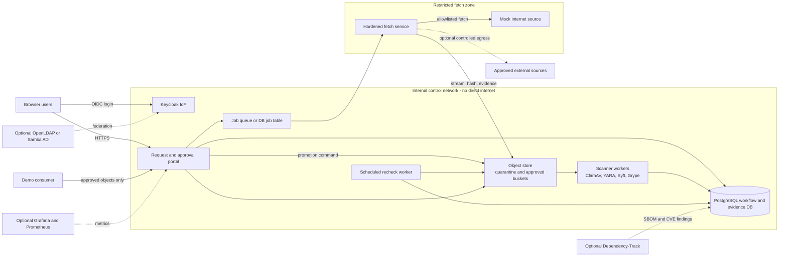
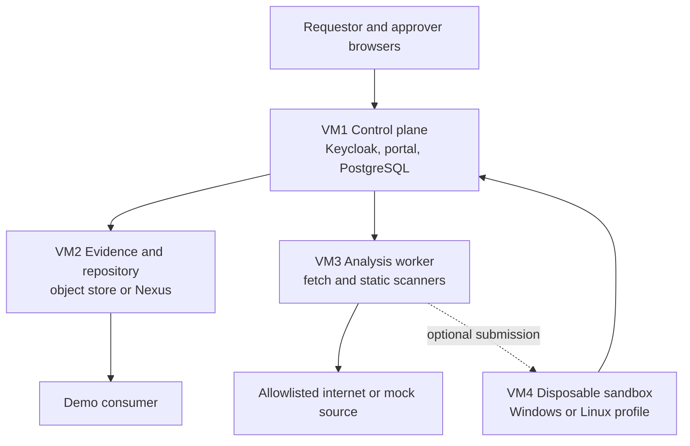

# Package Intake POC Deployment Plan

## Document purpose

This document turns the reference architecture into a demonstrable proof of concept (POC). It is intentionally smaller than the production target. The POC proves the control flow, identity boundaries, evidence model, artifact lifecycle, and recall behaviour without requiring every production product, licence, feed, sandbox, or high-availability feature.

The companion document, [`poc-build-runbook.md`](poc-build-runbook.md), contains the build steps, operating procedures, demo script, and reset actions.

## POC objectives

The POC should demonstrate that:

1. A requestor and approver authenticate through an identity provider and are assigned different roles.
2. A requestor can submit an artifact intake request but cannot approve their own request.
3. Only an approved request can trigger the controlled downloader.
4. The exact downloaded bytes, source details, hashes, scan results, approvals, and state transitions are retained as evidence.
5. An artifact can move from quarantine to approved distribution only after required gates pass.
6. A consumer can retrieve an approved artifact but cannot retrieve a quarantined, rejected, suspended, or recalled artifact.
7. Expected failure cases are visible and auditable: checksum mismatch, malware test signature, unsafe model format, SSRF-style destination, missing approval, and inconclusive analysis.
8. A previously approved artifact can later be suspended or recalled after a synthetic threat-intelligence or YARA update.
9. Optional services can be paused when not used, while the core request and evidence records remain available.

## Scope boundaries

### Included in the core POC

- OIDC login and role-based access through Keycloak.
- A lightweight request and approval portal.
- Separation of requestor, approver, security analyst, and platform administrator roles.
- A PostgreSQL evidence and workflow database.
- A controlled fetch worker with URL, DNS, redirect, size, and destination checks.
- Separate quarantine and approved object stores or buckets.
- SHA-256 hashing and expected-checksum comparison.
- ClamAV and YARA scanning.
- A basic open-source path with optional Syft and Grype execution.
- A proprietary-binary evidence path using a vendor checksum or signed manifest fixture.
- A model path that accepts a small safe-format fixture and rejects a pickle fixture.
- A configurable cooling-off gate shortened for demonstrations.
- Promotion, suspension, recall, and expiry lifecycle actions.
- An immutable evidence bundle for every run.
- A deterministic local "mock internet" source for repeatable demonstrations.
- Audit events and a simple evidence view in the portal.

### Optional POC profiles

- OWASP Dependency-Track for SBOM ingestion and vulnerability re-evaluation.
- Prometheus, Grafana, and Alertmanager.
- OpenLDAP or Samba AD federation behind Keycloak.
- A Windows sandbox or CAPE environment for a Windows-specific demonstration.
- A disposable Linux execution VM for behavioural analysis.
- An external commercial hash-reputation service.
- Nexus Repository Pro in place of the POC object store.

### Not required to prove the POC

- Production high availability.
- Full enterprise backup and disaster recovery.
- Production Microsoft update distribution through WSUS, Configuration Manager, or Intune.
- Production CMDB integration.
- Live submission of proprietary files to public analysis services.
- Detonation of real malware.
- GPU model execution.
- Every artifact ecosystem and repository format.
- A complete production control catalogue or procurement decision.

## Recommended implementation approach

### Preferred POC pattern: container-first modular stack

Use Docker Compose or Podman Compose with optional profiles. The portal, identity provider, database, object store, mock source, downloader, and scanners run as containers. Dynamic analysis remains outside the core Compose stack and is added as a VM profile only when required.

This approach is preferred because it is repeatable on a workstation or a single Linux VM, easy to start and stop by profile, suitable for a scripted demonstration, inexpensive compared with a full Nexus, GitLab, and CAPE deployment, and aligned with the target architecture without pretending that the POC products are final production selections.

### Recommended POC component map

| Capability | POC recommendation | Production-aligned alternative | Notes |
|---|---|---|---|
| Identity provider | Keycloak | Enterprise IdP, Entra ID, Okta, Ping, Keycloak | Local realm is sufficient for the core POC. |
| Optional directory | OpenLDAP or Samba AD | Active Directory or enterprise LDAP | Add only to demonstrate federation. |
| Request/approval portal | Small FastAPI or Django application | ServiceNow, Jira, GitLab Premium, OpenProject plus external policy gate | A purpose-built portal makes separation of duties and lifecycle states explicit. |
| Workflow engine | Portal API plus worker queue or database-backed jobs | Temporal, Camunda, ServiceNow workflow, CI/CD orchestration | Keep the core POC simple; use idempotent jobs and explicit states. |
| Evidence database | PostgreSQL | Managed PostgreSQL or enterprise database | System of record for workflow and rich evidence. |
| Quarantine and approved storage | S3-compatible object storage or filesystem-backed object service | Nexus Repository Pro plus evidence database/object store | Use two buckets and deny direct consumer access to quarantine. |
| Controlled downloader | Small hardened fetch service | Dedicated fetch service behind enterprise proxy | It should be the only core service with internet egress. |
| Static scanning | ClamAV, YARA, file/libmagic | Enterprise malware and content inspection | Use EICAR and synthetic YARA rules only. |
| SBOM/SCA | Syft and Grype | Dependency-Track, Sonatype Lifecycle, Anchore, other enterprise SCA | Optional in the smallest profile, recommended in the normal demo profile. |
| Model checks | Format allowlist, pickle static scan, resource limits | Dedicated model-security pipeline and model registry | Use tiny fixtures; no GPU required. |
| Audit/metrics | Portal audit log; optional Prometheus/Grafana | SIEM, enterprise observability | Keep JSON audit events for every state transition. |
| Dynamic analysis | Optional disposable VM | CAPE, isolated Linux VM, firmware lab, model load harness | Do not force all artifact types into a Windows sandbox. |

## Why a purpose-built portal is recommended for the POC

The reference design discusses GitLab CE as a possible request interface, but native advisory approvals do not by themselves demonstrate an enforceable production approval gate. A small portal is easier to use in a POC because it can make the required rules visible and testable:

- the requestor identity is captured from the OIDC token;
- the `approve` action is rejected when the approver equals the requestor;
- roles are checked server-side, not only hidden in the user interface;
- every state transition writes an append-only audit event;
- promotion is a separate action from approval-to-fetch;
- evidence requirements are checked before each transition;
- rejected and recalled artifacts cannot be downloaded.

The portal is a demonstration component, not a recommendation to build a bespoke enterprise service unless the organisation chooses that path after the POC.

## Identity and access design

### Keycloak realm

Create a realm named `package-intake-poc` with an OIDC client for the portal. Use local users for the default profile and optionally federate Keycloak to OpenLDAP or Samba AD.

### Demonstration users

| User | Role | Allowed actions |
|---|---|---|
| `requester1` | `requestor` | Submit and view own requests; download approved artifacts. |
| `approver1` | `approver` | Approve or reject fetch requests submitted by another user. |
| `analyst1` | `security_analyst` | Review evidence; accept or reject inconclusive results; suspend or recall. |
| `admin1` | `platform_admin` | Manage the POC and reset data; cannot act as the business approver in the normal demo. |
| `auditor1` | `auditor` | Read requests, evidence, and audit history; no workflow changes. |

### Role and policy rules

- A user must not approve a request they created.
- Approval-to-fetch and approval-to-promote are separate decisions.
- `platform_admin` does not automatically imply `approver`.
- A scanner or worker uses a non-human client credential and cannot log in interactively.
- Service identities receive only the API scopes needed for their job.
- The portal records the Keycloak subject identifier, username, role, token issuer, and authentication time for each decision.
- The optional directory federation profile should prove that groups can map to Keycloak roles without changing portal logic.

## Artifact lifecycle for the POC

Use explicit states rather than deriving state from repository location alone.

```text
DRAFT
  -> REQUESTED
  -> APPROVED_TO_FETCH | REJECTED
  -> FETCHING
  -> ACQUIRED | FETCH_FAILED
  -> ANALYSING
  -> ANALYSIS_PASSED | ANALYSIS_FAILED | INCONCLUSIVE
  -> COOLING
  -> READY_FOR_PROMOTION
  -> APPROVED | REJECTED
  -> SUSPENDED | RECALLED | EXPIRED
```

### Required evidence by transition

| Transition | Required evidence |
|---|---|
| `REQUESTED -> APPROVED_TO_FETCH` | Distinct approver identity, business justification, source URL, declared artifact type, risk tier. |
| `APPROVED_TO_FETCH -> ACQUIRED` | Resolved destination, redirect chain, TLS/source data, byte count, SHA-256, object-store version ID. |
| `ACQUIRED -> ANALYSIS_PASSED` | File type, checksum verdict, ClamAV verdict, YARA verdict, path-specific evidence, scanner versions. |
| `ANALYSIS_PASSED -> READY_FOR_PROMOTION` | Cooling-off completion or explicit demo override with reason. |
| `READY_FOR_PROMOTION -> APPROVED` | Promotion approver, immutable evidence bundle ID, approved object location, expiry date. |
| `APPROVED -> SUSPENDED/RECALLED` | Recheck finding, analyst decision, rule/feed version, affected object hash. |

## Deployment topology

### Containerized POC topology



### Network zones

| Network | Members | Egress policy |
|---|---|---|
| `front` | Reverse proxy, portal, Keycloak | User access only; no arbitrary outbound access. |
| `control` | Portal, PostgreSQL, queue, object store, scanners, recheck | Container internal network; no internet route. |
| `fetch` | Fetch service, mock source, optional Squid | Fetch service is the only component permitted external egress. |
| `sandbox` | Optional dynamic-analysis VM interface | No route to control network except a narrow result-return API; no credentials. |
| `management` | Administrator access | Restricted to the host or admin subnet. |

### VM-based topology

For stronger isolation or when container networking is not sufficient, use four VMs:



Recommended VM controls:

- VM1 has no general internet egress after images and packages are staged.
- VM2 has no internet egress.
- VM3 has controlled egress and cannot initiate connections to user networks.
- VM4 is disposable, has no secrets, and is reset to a snapshot after every run.
- Only VM1 may initiate workflow API calls to VM2 and VM3.

## Resource estimates

The figures below are planning estimates for a low-concurrency demonstration, not production capacity guarantees. Scanner memory and storage depend heavily on artifact size and whether Dependency-Track or a dynamic sandbox is enabled.

### Containerized all-in-one host

| Profile | vCPU | RAM | Storage | Suitable for |
|---|---:|---:|---:|---|
| Minimal core | 6-8 | 12-16 GB | 80-120 GB SSD | Identity, portal, database, object store, fetcher, ClamAV/YARA, small fixtures. |
| Recommended demo | 10-12 | 24-32 GB | 150-250 GB SSD | Adds Syft/Grype, optional Dependency-Track, observability, concurrent scans. |
| Extended lab | 16+ | 48-64 GB | 300-500 GB SSD | Adds larger artifacts, multiple workers, Linux sandbox, and more retained scan data. |

A laptop with 16 GB RAM can run the minimal profile if optional services are stopped and scans are serialized. A 24-32 GB host gives a substantially smoother demonstration.

### Component-level estimate

| Component | Typical active CPU | Typical RAM | Persistent storage | Can be paused? |
|---|---:|---:|---:|---|
| Keycloak | 0.5-1 vCPU | 1-2 GB | <2 GB plus DB data | Yes, but login is unavailable while stopped. |
| Portal/API | 0.5-1 vCPU | 0.5-1.5 GB | Logs only | Yes. |
| PostgreSQL | 1-2 vCPU | 2-4 GB | 10-30 GB POC | Prefer to keep running; safe to stop cleanly. |
| Object store | 1-2 vCPU | 1-3 GB | 50-200 GB | Yes after clean shutdown. |
| Fetch worker | 0.5-2 vCPU | 0.5-2 GB | Temporary only | Yes; start on demand. |
| ClamAV | 1-2 vCPU | 1.5-3 GB | Signature DB and temp files | Yes; signature update before demo. |
| YARA worker | 1-2 vCPU | 0.25-1 GB | Rules and temp files | Yes; start on demand. |
| Syft/Grype | 2-4 vCPU | 2-6 GB peak | Vulnerability DB plus temp files | Yes; run as ephemeral jobs. |
| Dependency-Track plus DB | 2-4 vCPU | 4-8 GB | 20-60 GB | Yes, provided database shutdown is clean. |
| Grafana/Prometheus | 1-2 vCPU | 1-3 GB | 5-20 GB | Yes. |
| Windows sandbox VM | 4-8 vCPU | 8-16 GB | 80-150 GB | Yes; use snapshots. |
| Linux sandbox VM | 2-4 vCPU | 4-8 GB | 20-60 GB | Yes; create on demand. |

### Recommended VM sizing

| VM | vCPU | RAM | Disk | Normal state |
|---|---:|---:|---:|---|
| VM1 control plane | 4 | 8 GB | 60 GB | Running during demo. |
| VM2 repository/evidence | 4 | 8 GB | 150-300 GB | Running during demo; may stop afterward. |
| VM3 analysis/fetch worker | 8 | 16 GB | 100 GB | Start only for intake and recheck demonstrations. |
| VM4 optional sandbox | 8 | 16 GB | 120 GB | Powered off except during dynamic-analysis segment. |

### Storage assumptions

For a small POC, reserve approximately:

- 10-20 GB for container images and scanner databases;
- 10-30 GB for PostgreSQL, logs, and evidence bundles;
- 50-150 GB for quarantine and approved artifacts;
- temporary free space equal to at least twice the largest artifact being scanned;
- an additional 80-150 GB for each dynamic-analysis VM.

Object retention can be reduced after demonstrations, but preserve at least one complete happy-path and one recalled-path evidence set.

## Start/stop and cost-saving strategy

Use Compose profiles or VM power states to keep the environment small.

### Always-on only when demonstrating

- Keycloak
- portal
- PostgreSQL
- object store

### Start on demand

- fetch worker
- ClamAV/YARA worker
- Syft/Grype worker
- Dependency-Track
- observability stack
- recheck scheduler
- dynamic-analysis VM

### Suggested profiles

| Profile | Services |
|---|---|
| `core` | Keycloak, portal, PostgreSQL, object store, mock source. |
| `scan` | Fetch worker, ClamAV, YARA, Syft, Grype. |
| `sca` | Dependency-Track and its supporting services. |
| `observe` | Prometheus, Grafana, Alertmanager. |
| `directory` | OpenLDAP or Samba AD federation. |
| `sandbox` | Integration adapter for an external disposable VM. |

After a demo, stop `scan`, `sca`, `observe`, and `sandbox` first. Keep database and object-store volumes. Shut down the remaining core services cleanly when the environment is no longer needed.

## POC data model

### Core entities

- `users`: OIDC subject, display name, roles, issuer.
- `requests`: request ID, requestor, source URL, declared artifact type, expected checksum, justification, target use, risk tier, expiry.
- `decisions`: request ID, decision type, decision maker, result, reason, timestamp.
- `artifacts`: SHA-256, byte count, detected file type, quarantine object version, approved object version.
- `acquisitions`: DNS result, destination IP, TLS information, redirect chain, HTTP headers, source timestamp.
- `scan_runs`: scanner, scanner version/digest, rules/database version, result, start/end time, raw-report object ID.
- `evidence_bundles`: canonical JSON document hash, signature or attestation reference, creation time.
- `state_events`: previous state, new state, actor, reason, correlation ID, timestamp.
- `recheck_runs`: artifact hash, rule/feed version, prior verdict, new verdict, disposition.
- `suppressions`: artifact hash, signal ID, analyst, justification, expiry.

### Evidence bundle contents

Each completed analysis should create a JSON evidence bundle containing:

- request and approval references;
- source URL and acquisition metadata;
- canonical SHA-256 and object-store version ID;
- declared and detected artifact types;
- all scan verdicts and tool versions;
- SBOM or path-specific metadata;
- cooling-off decision;
- promotion decision and expiry;
- lifecycle state at bundle creation;
- references to raw reports;
- a hash of the bundle itself.

For the POC, storing the bundle in the object store and its hash in PostgreSQL is sufficient. A production implementation should decide how to sign or attest bundles and how to provide append-only or tamper-evident storage.

## Use cases and demonstration mapping

### Use case 1: open-source package, happy path

**Fixture:** a small local package archive or container-layout fixture with a known checksum and no detections.

**Flow:**

1. `requester1` logs in and requests the package.
2. The portal records artifact type `open_source` and expected checksum.
3. `approver1` approves the fetch.
4. The fetcher downloads from the mock source, validates the destination, calculates SHA-256, and stores the bytes in quarantine.
5. ClamAV and YARA return pass.
6. Syft produces an SBOM; Grype returns no policy-blocking finding, or a preselected informational finding is displayed.
7. The shortened cooling period completes.
8. `approver1` or `analyst1` approves promotion.
9. The artifact is copied or server-side promoted into the approved bucket.
10. The consumer retrieves the approved object and verifies the returned hash.

**What this proves:** controlled acquisition, evidence, approval separation, SBOM path, promotion, and approved-only consumption.

### Use case 2: proprietary binary or installer evidence path

**Fixture:** a harmless synthetic vendor archive plus a vendor checksum file and optional detached demo signature.

**Flow:**

1. The request declares `proprietary_binary` and identifies the vendor and platform.
2. The fetcher retrieves the file and vendor manifest from the mock source.
3. The pipeline compares the checksum and records signature or manifest evidence.
4. Static scanning runs; SBOM coverage is recorded as `none`, `partial`, or `vendor_supplied`, not falsely represented as complete.
5. The artifact passes the same cooling and promotion gate.

**What this proves:** path-specific evidence without creating an empty or misleading open-source SBOM record.

### Use case 3: AI/ML model, safe-format path

**Fixture:** a tiny valid `safetensors` or GGUF test file and a model card fixture.

**Flow:**

1. The request declares `model` and records a mock hub namespace and immutable revision.
2. The pipeline validates the file extension and magic/header, enforces maximum size and resource limits, and captures model-card data.
3. It generates a small CycloneDX ML-BOM or equivalent model evidence record.
4. The load-test profile parses the fixture in a no-egress, resource-limited process.
5. The artifact proceeds to promotion.

**What this proves:** the model path is not treated as a normal package or Windows binary.

### Use case 4: checksum mismatch

**Fixture:** a valid harmless file with an intentionally incorrect expected SHA-256 in the request.

**Expected outcome:** acquisition completes, the checksum control fails, state becomes `ANALYSIS_FAILED` or `REJECTED`, the object remains in quarantine, and approved download is unavailable.

### Use case 5: malware-signature test

**Fixture:** the standard EICAR anti-malware test string in a file served by the mock source. Do not use live malware.

**Expected outcome:** ClamAV detects the test signature, the request is rejected, and the report and scanner-database version are retained.

### Use case 6: unsafe model serialization

**Fixture:** a harmless pickle file containing no malicious payload.

**Expected outcome:** policy rejects the artifact because pickle-based formats are default-deny for the POC. The rejection demonstrates policy, not malware detection.

### Use case 7: SSRF and unsafe destination

**Fixture:** a request URL targeting loopback, RFC1918, link-local, or a redirect from an allowlisted mock hostname to a blocked address.

**Expected outcome:** the fetch service blocks the request before retrieval and records the resolved address and rule that denied it.

### Use case 8: requestor attempts self-approval

**Expected outcome:** the portal returns an authorization error, leaves the request in `REQUESTED`, and records the denied action in the audit log.

### Use case 9: inconclusive or unavailable analysis

**Fixture:** stop the scanner service or configure a scanner timeout.

**Expected outcome:** the state becomes `INCONCLUSIVE`; normal promotion is blocked. An analyst may use an explicit POC exception action with a reason and expiry, making the fail-closed/default behaviour visible.

### Use case 10: post-approval compromise and recall

**Fixture:** a previously approved harmless file. Add its hash to a local synthetic compromise feed or add a YARA rule that deliberately matches a unique marker in the fixture.

**Flow:**

1. The scheduled recheck scans the approved inventory.
2. The new synthetic signal changes the verdict.
3. The artifact moves from `APPROVED` to `SUSPENDED` automatically.
4. `analyst1` reviews the signal and selects `RECALL`.
5. The approved download endpoint returns a denial for subsequent attempts.
6. The portal displays the affected request, object hash, rule/feed version, and recall event.

**What this proves:** the architecture can react to information learned after approval. No real malware or public threat-intelligence upload is required.

## Happy and compromised path design

### Happy path

Use a deterministic local fixture with a stable URL in the mock-source container, a known SHA-256 stored in the request template, no ClamAV or YARA match, a tiny SBOM output, a one-minute or manually advanced cooling period, a promotion decision by a different identity, and successful retrieval from the approved endpoint.

### Compromised path

Use one of these safe simulation methods:

1. **Synthetic IOC feed:** add the approved artifact hash to a local JSON feed consumed by the recheck job.
2. **YARA rule update:** add a rule matching a unique string embedded in the harmless fixture.
3. **Source drift:** change a mutable mock-source tag to point to a new hash while the approved artifact remains pinned to the original hash, then show a drift alert.
4. **Certificate/key policy change:** mark the fixture's demo signing identity as suspended in the local publisher registry.

The synthetic IOC feed is the clearest default because it shows the exact control without relying on external services.

## Security controls worth preserving even in the POC

- Do not put database, Keycloak, or object-store administrator passwords in source control.
- Use separate service credentials and roles.
- Keep the portal and scanners on an internal network.
- Give internet egress only to the controlled fetch service.
- Revalidate DNS and destination policy on every redirect.
- Block loopback, link-local, private, metadata-service, and internal-domain destinations.
- Stream downloads while hashing; do not execute from the download directory.
- Enforce maximum compressed and uncompressed size, archive depth, and file count.
- Mount artifacts read-only into static scanners.
- Run scanners without internet egress and without host credentials.
- Store raw reports and scanner versions.
- Default to fail closed for missing mandatory evidence.
- Preserve rejected and recalled evidence, while preventing consumer access.
- Do not upload demo or proprietary files to public scanning services.
- Use EICAR and synthetic indicators instead of live malware.

## Acceptance criteria

The POC is successful when all of the following can be demonstrated in a repeatable run:

| ID | Acceptance criterion |
|---|---|
| POC-01 | Requestor and approver authenticate through Keycloak. |
| POC-02 | The requestor cannot approve their own request. |
| POC-03 | A request cannot trigger a fetch before approval. |
| POC-04 | The fetch service blocks private/link-local/loopback destinations and unsafe redirects. |
| POC-05 | Exact bytes and SHA-256 are stored in quarantine with source evidence. |
| POC-06 | ClamAV and YARA results are visible with scanner/rule versions. |
| POC-07 | At least one path-specific analysis result is shown for open-source, proprietary, or model artifacts. |
| POC-08 | Promotion is blocked until required evidence and a separate promotion decision exist. |
| POC-09 | Approved artifacts can be consumed; quarantine/rejected artifacts cannot. |
| POC-10 | EICAR or checksum-mismatch fixture is rejected. |
| POC-11 | A synthetic post-approval signal suspends and recalls an approved artifact. |
| POC-12 | The audit view shows every state transition and actor. |
| POC-13 | Optional services can be stopped and restarted without losing the workflow or evidence records. |
| POC-14 | The environment can be reset and the full demo repeated from documented steps. |

## Delivery phases

### Phase 0: design decisions and fixtures

- Confirm container runtime and host platform.
- Select object store for the POC.
- Confirm whether external internet access is needed or the mock source is sufficient.
- Define the request schema, lifecycle states, and evidence schema.
- Prepare safe fixtures and expected results.

### Phase 1: core identity and portal

- Deploy PostgreSQL and Keycloak.
- Create realm, roles, users, and service clients.
- Deploy portal with request, approve, reject, evidence, promote, suspend, and recall actions.
- Implement server-side separation-of-duties checks and audit events.

### Phase 2: acquisition and evidence storage

- Deploy object store and create quarantine/approved buckets.
- Deploy mock source and controlled fetcher.
- Implement URL policy, redirect validation, size limits, streaming hash, and acquisition evidence.

### Phase 3: static analysis and promotion

- Add file-type detection, checksum verification, ClamAV, and YARA.
- Add optional Syft and Grype jobs.
- Add cooling gate, evidence-bundle generation, and approved-object promotion.
- Add consumer download endpoint that checks lifecycle state.

### Phase 4: unhappy paths and recall

- Add EICAR, checksum-mismatch, unsafe-model, and SSRF fixtures.
- Add scanner-unavailable simulation.
- Add synthetic IOC feed and scheduled recheck.
- Demonstrate suspension, analyst review, recall, and denied consumption.

### Phase 5: optional enterprise-alignment profiles

- Add Dependency-Track.
- Add directory federation.
- Replace object store with Nexus where licences and time permit.
- Add a disposable VM analysis profile.
- Add SIEM or observability integration.

## Alternatives

### Alternative A: GitLab-centered POC

Use GitLab issues for requests and a pipeline for analysis. Keep approval evidence in a separate service or database, and enforce the promotion gate through a protected-branch pipeline status and restricted service identity. This is useful when GitLab is already available, but it is heavier and less direct for a short demonstration.

### Alternative B: ServiceNow or Jira workflow POC

Use an existing enterprise request platform and call the fetch/scan APIs after approval. This demonstrates closer integration with operating processes but may require licences, administration access, and longer configuration time.

### Alternative C: Kubernetes namespace POC

Deploy the same services into namespaces for `identity`, `control`, `fetch`, and `analysis`, with network policies and jobs. This is useful when the production target is Kubernetes, but it increases setup effort and can obscure the core workflow during an early demonstration.

### Alternative D: VM-only lab

Use separate Linux VMs for control, repository, and analysis. This provides clear network boundaries and is appropriate for organisations that do not permit Docker Desktop, but repeatability and reset speed are lower than a Compose-based POC.

### Alternative E: workflow automation platform

Use Camunda, Temporal, n8n, or a similar engine for lifecycle orchestration while keeping Keycloak, PostgreSQL, object storage, and scanners. This can make workflow visualization strong, but it adds another product before the core control model has been validated.

## Recommendation

Build the first demonstration as a containerized, offline-first POC using Keycloak, a small portal, PostgreSQL, an S3-compatible object store, a hardened fetch worker, ClamAV, YARA, and optional Syft/Grype. Serve all demonstration artifacts from a local mock source. Add Dependency-Track and a disposable sandbox only after the core request-to-recall loop is reliable.

This gives the fastest path to a credible demonstration while preserving the reference architecture's most important ideas: independent identities, controlled acquisition, exact-byte evidence, path-specific analysis, fail-closed promotion, approved-only consumption, and post-approval recall.
