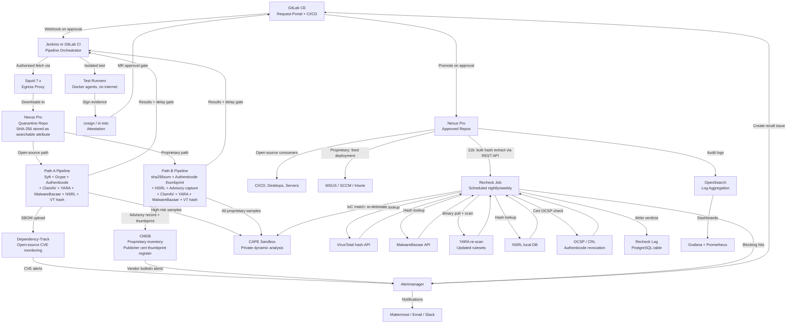

# Solution Architecture: Tooling and Implementation Guide
## Enterprise Package Intake and Approved Repository

## Document control

| Field | Value |
|---|---|
| Document title | Solution Architecture: Tooling and Implementation Guide |
| Version | 1.3 |
| Status | Draft for review |
| Owner | Security Architecture |
| Last updated | 2026-04-23 |

### Revision history

| Version | Date | Author | Summary of changes |
|---|---|---|---|
| 1.0 | 2026-04-15 | Security Architecture | Initial draft — tooling mapped to all eleven stages; Sonatype feature map; phased implementation plan |
| 1.1 | 2026-04-18 | Security Architecture | Added paid and cloud alternatives table; integration wiring diagram |
| 1.2 | 2026-04-22 | Security Architecture | Added proprietary binary tooling path; added CMDB options; added inventory data flow summary; split Stage 5 into 5a/5b |
| 1.3 | 2026-04-23 | Security Architecture | Added Stage 11b retroactive binary recheck tooling; added binary authentication tools (Authenticode, NSRL, MalwareBazaar, VirusTotal hash); updated Stage 4 to split 4a/4b; updated tooling summary table; updated integration wiring diagram; added publisher certificate thumbprint register to CMDB requirements; updated phased rollout |

> **Scope:** This document identifies the specific tools, packages, and integration points required to implement the controlled package intake architecture. It is organised by workflow stage and includes a recommended stack, alternatives, licensing notes, and integration guidance.
>
> **Preference:** Free, self-hosted tools are the primary recommendation. Paid and commercial options are noted separately where they offer meaningful capability advantages.
>
> **Key distinction — three concerns, three toolsets:**
> - Stages 4a/5a/11a: Open-source SBOM path — Syft, Grype, Dependency-Track.
> - Stages 4b/5b: Proprietary binary vendor-advisory path — sha256sum, Authenticode verification, NSRL, vendor advisory scripts, CMDB.
> - Stage 6 and 11b: Binary recheck for all artifact types — ClamAV, YARA, MalwareBazaar, VirusTotal hash API, NSRL, CAPE sandbox. This stage addresses supply chain attacks where a trojanised binary has a correct version string and no published CVE — a class of threat invisible to SBOM-based tools.

---

## Tooling summary by stage

| Stage | Primary tool (self-hosted free) | Sonatype / Nexus Pro capability | Paid / cloud alternative |
|---|---|---|---|
| 1 · Request and approval | GitLab CE or OpenProject | Nexus IQ policy intake via API | Jira Cloud, ServiceNow |
| 2 · Restricted egress proxy | Squid 7.x + iptables/nftables | Nexus proxy repositories | Zscaler Internet Access, Palo Alto NGFW |
| 3 · Quarantine repository | Nexus Pro (quarantine capability) | **Native: Firewall Quarantine** | Artifactory Pro |
| 4a · Integrity — open source | cosign, sigstore, sha256sum, Authenticode check | Nexus IQ provenance checks | Chainguard, Sigstore Public Good |
| 4b · Integrity — proprietary | sha256sum, osslsigncode / signtool, NSRL lookup | Nexus component hash attributes | — |
| 5a · SBOM and SCA — open source | Syft + Grype + Dependency-Track | Sonatype Lifecycle (IQ Server) | FOSSA, Anchore Enterprise |
| 5b · Vendor advisory — proprietary | Custom pipeline script + Nexus tags + CMDB | Nexus Pro custom metadata API | ServiceNow CMDB integration |
| 6 · Malware and sandbox | ClamAV + YARA + MalwareBazaar + NSRL + CAPE Sandbox | Nexus IQ malware intelligence | Recorded Future Sandbox, ANY.RUN |
| 7 · Cooling-off delay | Custom Jenkins/GitLab pipeline gate | IQ Server policy age rules | — |
| 8 · Test pipeline | Jenkins or GitLab CI, isolated runners | — | GitHub Actions (private runners) |
| 9 · Promotion review | GitLab MR approvals or Jenkins gates | IQ Server promotion workflows | — |
| 10 · Consumption and inventory | Nexus Pro + Dependency-Track (open source) + CMDB (proprietary) | **Native: approved repositories** | Artifactory Pro |
| 11a · CVE recheck — open source | Dependency-Track + Prometheus/Grafana/Alertmanager | Sonatype Lifecycle continuous scan | Snyk, JFrog Xray |
| 11a · CVE recheck — proprietary | Vendor bulletin RSS + NVD CPE watches + WSUS/Intune | — | Microsoft Sentinel, Splunk |
| 11b · Binary recheck — all types | Scheduled job: VT hash API + MalwareBazaar + YARA + NSRL + Authenticode OCSP + CAPE on IOC | — | ReversingLabs TitaniumCloud, Recorded Future |

---

## Stage 1 · Request and approval portal

The portal is the primary interface for teams to submit intake requests and for security reviewers to approve, reject, escalate, or set expiry on approvals. The artifact type field drives which pipeline path is executed downstream and which Stage 11b recheck controls apply.

### Recommended self-hosted free option

**GitLab Community Edition (CE)** is the preferred choice. GitLab CE is free under the MIT licence, fully self-hosted, and provides issue templates, approval rules, label-based workflow state, webhooks, and a REST API.

Key capabilities used:
- Issue templates with required fields: package name, version, source URL, checksum if available, **artifact type** (open-source / proprietary binary / firmware), justification, owner, target environment, review date.
- The artifact type field determines Path A (SBOM) or Path B (vendor advisory) and the applicable 11b recheck schedule.
- Label-based state machine for workflow stages.
- Milestone or due-date field for expiry tracking.
- RBAC for separation of duties — requestor cannot self-approve for production.
- LDAP or SSO integration via Keycloak.

**Alternative self-hosted free:** OpenProject (GNU GPL v3).

**Paid alternatives:** Jira Cloud (note: Jira Server EOL February 2024; Data Center EOL March 2029), ServiceNow.

---

## Stage 2 · Restricted egress proxy

**Squid 7.x** (open source, GPL) deployed on a hardened Linux host. Do not use the deprecated pfSense Squid package.

For proprietary binary downloads, allowlist specific vendor domains individually (e.g. `catalog.update.microsoft.com`, `download.adobe.com`) rather than broad TLD rules.

Dependency-confusion prevention for open-source: allowlist required upstream registry domains; block requests where URL path matches an internal namespace directed at a public registry; log all denied requests to OpenSearch.

**Complementary:** iptables or nftables on all endpoints blocking direct outbound TCP 443 and TCP 80 except to the Squid proxy IP.

**Alternative:** OPNsense (BSD, free) with built-in Squid proxy.

**Paid alternative:** Zscaler Internet Access or Palo Alto Networks NGFW.

---

## Stage 3 · Quarantine repository

**Nexus Repository Pro** with the Firewall Audit and Quarantine capability enabled per proxy repository.

The SHA-256 hash stored as a component attribute in Nexus is the primary key used by the Stage 11b retroactive recheck job to query VirusTotal, MalwareBazaar, and NSRL. It is critical that hashes are stored as searchable component attributes, not only as file checksums, so the recheck job can retrieve them in bulk via the Nexus REST API without downloading every binary.

Lifecycle repository groups:
- `intake-quarantine` — initial staging, no consumer access.
- `intake-dev-approved` — cleared for development use.
- `intake-prod-approved` — cleared for production use.

---

## Stage 4a · Integrity and authenticity — open-source path

**cosign** (Sigstore, Apache 2.0): sign and verify container images and arbitrary blobs; attach SLSA provenance attestations.

**sha256sum / sha512sum** (GNU Coreutils): checksum verification against publisher-provided hashes.

**in-toto** (Apache 2.0): supply chain attestation recording who fetched, scanned, and approved each artifact.

**Sigstore Rekor** (Apache 2.0): transparency log for signed attestations.

**Authenticode verification for Windows PE binaries (open-source tools):** Even open-source Windows tools such as Notepad++ publish Authenticode-signed releases. Verify the signature and compare the certificate thumbprint against the expected publisher thumbprint stored in the CMDB. Use `osslsigncode verify` (Linux) or `signtool verify` (Windows) in the pipeline.

```bash
# Linux pipeline — verify Authenticode signature using osslsigncode
osslsigncode verify -in notepadplusplus_installer.exe
# Returns exit code 0 if valid, non-zero if invalid or unsigned
```

**Dependency-confusion check scripts:** Python or Bash scripts blocking promotion on namespace collision.

**GPG / GnuPG**: verifying PGP-signed apt/rpm packages and Maven artifacts.

---

## Stage 4b · Integrity and authenticity — proprietary binary path

**sha256sum:** Compare the downloaded SHA-256 against the vendor's published catalog hash. Hard block on mismatch.

**Authenticode / code signing verification:** All Windows PE binaries must have their Authenticode signatures verified and certificate thumbprints compared against the expected publisher value stored in the CMDB publisher certificate register.

```powershell
# PowerShell — verify Authenticode on test Windows host in isolated pipeline
$sig = Get-AuthenticodeSignature -FilePath $artifactPath
if ($sig.Status -ne "Valid") { throw "Authenticode invalid: $($sig.Status)" }
$actual = $sig.SignerCertificate.Thumbprint
$expected = Get-CMDBThumbprint -Publisher $publisherName
if ($actual -ne $expected) { throw "Cert thumbprint mismatch. Expected $expected, got $actual" }
```

For Linux pipeline use `osslsigncode verify -in binary.exe` to check signature validity without a Windows host.

**NSRL positive-assertion lookup (Stage 4b):** Load the NIST NSRL dataset into a local PostgreSQL database and query it as part of the pipeline. A match provides positive confirmation that the hash corresponds to a known legitimate release. Absence from NSRL is not a block — niche or internal tools may not be indexed — but the result is recorded in Nexus metadata.

```python
def check_nsrl(sha256_hash: str, nsrl_db) -> dict:
    cursor = nsrl_db.execute(
        "SELECT FileName, ProductName, ProductVersion FROM NSRLFile WHERE SHA256 = ?",
        (sha256_hash.upper(),)
    )
    row = cursor.fetchone()
    if row:
        return {"known_good": True, "product": row[1], "version": row[2]}
    return {"known_good": False}
```

**Vendor catalog integration scripts:** Python scripts that query the Microsoft Update Catalog API or vendor download manifests to retrieve the expected hash for a given KB number or product version.

---

## Stage 5a · SBOM generation and SCA analysis — open-source path

**Syft** (Anchore, Apache 2.0): recommended SBOM generator. Supports 20+ language ecosystems. As of March 2026, Trivy experienced two supply chain compromises and is not recommended for production CI/CD use; use Syft instead.

```bash
syft packages /path/to/artifact.tar.gz -o cyclonedx-json > artifact-sbom.json
```

**Grype** (Anchore, Apache 2.0): recommended vulnerability scanner. Accepts Syft SBOMs. Risk scoring combines CVSS severity, EPSS exploit probability, and KEV catalog status.

```bash
grype sbom:artifact-sbom.json --output json > grype-results.json
```

**OWASP Dependency-Track** (Apache 2.0): continuous SBOM management and CVE monitoring platform. Minimum 8 GB RAM. Provides portfolio-wide visibility, where-used analysis, policy enforcement, and notifications. Used only for artifacts that have a meaningful SBOM.

```bash
docker pull dependencytrack/bundled
docker volume create --name dependency-track
docker run -d -m 8192m -p 8080:8080 --name dependency-track \
  -v dependency-track:/data dependencytrack/bundled
```

**License analysis:** Grant (Anchore, Apache 2.0), FOSSology (GPL, self-hosted), or FOSSA (paid).

### Sonatype Lifecycle for open-source SBOM

When Sonatype Lifecycle (IQ Server) is licensed, it handles SBOM generation, SCA, and license analysis natively against 140M+ components, replacing Syft + Grype + Dependency-Track for the open-source path.

---

## Stage 5b · Vendor advisory capture — proprietary binary path

There is no SBOM tool for this path. A custom pipeline script captures structured vendor advisory metadata and stores it in Nexus and the CMDB.

### Pipeline script responsibilities

1. Read artifact type and vendor reference (KB number, product version) from the GitLab intake ticket.
2. Query the vendor advisory source — Microsoft MSRC API, vendor release notes — to retrieve CVEs addressed, vendor severity, and affected product scope.
3. Structure data as a JSON advisory record.
4. Write summary fields as Nexus component metadata tags: `advisory.kb_number`, `advisory.cves`, `advisory.vendor_severity`, `advisory.vendor_name`.
5. Write the Authenticode thumbprint verification result and the NSRL result as additional Nexus tags.
6. Attach the full advisory JSON to the artifact in Nexus.
7. Create or update the CMDB entry, including the expected Authenticode thumbprint for this publisher.

### Nexus Pro custom metadata API

```bash
curl -u user:pass -X PUT \
  "https://nexus.internal/service/rest/v1/components/{id}/tags" \
  -H "Content-Type: application/json" \
  -d '{
    "advisory.kb_number":"KB5034441",
    "advisory.cves":"CVE-2024-21338,CVE-2024-21345",
    "advisory.vendor_severity":"Critical",
    "auth.authenticode_status":"Valid",
    "auth.cert_thumbprint_match":"true",
    "auth.nsrl_result":"known_good",
    "auth.malwarebazaar_result":"not_found"
  }'
```

### CMDB tooling options

**ServiceNow (paid):** Full CMDB with CI records, relationship mapping, SLA, and automated discovery. Best option if already deployed.

**GitLab CE structured database (free, self-hosted):** PostgreSQL table populated via GitLab API at promotion time. The CMDB publisher certificate thumbprint register is a table in this database mapping publisher names to expected thumbprints.

**OpenProject (free, self-hosted):** Work packages with custom fields including expected thumbprint.

**Ralph (Apache 2.0, self-hosted):** Purpose-built CMDB with REST API and Docker deployment. Suitable for organisations wanting a dedicated asset management system without ServiceNow costs.

The minimum CMDB record for a proprietary artifact: artifact name and version, Nexus reference URL, GitLab ticket reference, named owner, approval expiry, **expected Authenticode certificate thumbprint for this publisher**, vendor advisory subscription reference or NVD CPE string, deployment scope, and next review date.

---

## Stage 6 · Malware and sandbox screening

### Static screening — all artifact types

**ClamAV** (GPL): open-source antivirus daemon applied to all artifact types.

**YARA** (BSD / VirusTotal) with community rulesets: pattern matching applied to all artifact types. Update YARA rulesets from community feeds on a regular schedule — new rules published in response to discovered campaigns are the foundation of the Stage 11b re-scan.

**MalwareBazaar** (abuse.ch, free API): hash lookup at intake. A `hash_found` result is a hard block. Not finding a hash does not confirm the file is clean.

```python
def check_malwarebazaar(sha256: str) -> bool:
    resp = requests.post("https://mb-api.abuse.ch/api/v1/",
                         data={"query": "get_info", "hash": sha256}, timeout=10)
    return resp.json().get("query_status") == "hash_found"
```

**NSRL lookup** (Stage 6 cross-check): record result in Nexus metadata. Not a blocking control on its own — absence from NSRL is not malicious — but a positive match adds confidence.

**VirusTotal hash lookup** (free tier: 500 lookups/day; no file submission): safe for all artifact types including proprietary because only the SHA-256 is transmitted. Permitted for open-source at intake; also used in Stage 11b recheck for all artifact types.

```python
def check_vt_hash(sha256: str, api_key: str) -> int:
    url = f"https://www.virustotal.com/api/v3/files/{sha256}"
    resp = requests.get(url, headers={"x-apikey": api_key}, timeout=10)
    if resp.status_code == 404:
        return -1  # Not in VT — unknown, not confirmed clean
    return resp.json()["data"]["attributes"]["last_analysis_stats"]["malicious"]
```

### Dynamic sandbox — all proprietary artifact types

**CAPE Sandbox** (GPL): recommended open-source dynamic analysis sandbox. Derived from Cuckoo v1 with automatic payload unpacking, config extraction, and YARA-based classification. Supports Windows 10 and 11 guests.

CAPE architecture: Ubuntu LTS host with KVM; Windows 10 or 11 23H2 VMs; REST API for submission and report retrieval; reports attached to Nexus artifact records.

Data handling policy defines: artifacts eligible for CAPE (all proprietary binaries, high-risk open-source); artifacts restricted to private CAPE only (proprietary ISV software); artifacts ineligible for any external sandbox (classified content).

**Paid cloud alternatives:** ANY.RUN (paid tiers for private analysis), Joe Sandbox, Recorded Future Sandbox — only for artifacts cleared for external submission.

---

## Stage 7 · Cooling-off delay

**Jenkins Pipeline** or **GitLab CI/CD** delay gate:

```python
def check_delay_gate(artifact_id, risk_tier):
    quarantine_date = nexus_api.get_quarantine_timestamp(artifact_id)
    delay_days = {"tier1": 30, "tier2": 14, "tier3": 7}[risk_tier]
    if (today - quarantine_date).days < delay_days:
        raise GateFailure(f"Cooling-off period not met: {delay_days} days required")
```

Risk tier delays: Tier 1 (privileged binaries, drivers, base images, proprietary by default): 30 days. Tier 2 (runtime dependencies, unknown publishers, commercial ISV): 14 days. Tier 3 (well-established open-source, Microsoft Patch Tuesday — by explicit policy only): 7 days.

Emergency override requires a signed exception record with a named approver, justification, and expiry date.

---

## Stage 8 · Test pipeline

**Jenkins** (MIT) or **GitLab CI/CD runners** (self-managed): isolated Docker agents or VM snapshots with no internet access.

Test steps: pull artifact from quarantine; install in isolated environment; for proprietary installers log all file system changes, registry writes, network connection attempts, and service registrations; run functional tests; sign evidence with cosign; report to Jenkins/GitLab and Dependency-Track (open-source only); block promotion if evidence cannot be produced.

---

## Stage 9 · Promotion review

**GitLab CE Merge Request approvals**: MR requires sign-off from security reviewer and named artifact owner.

For proprietary path the MR description confirms: vendor advisory record complete in Nexus; CMDB entry created including expected Authenticode thumbprint; vendor bulletin subscription reference documented.

Custom promotion script: verifies approval expiry; copies artifact within Nexus (not a re-download); attaches all metadata; signs promotion record with cosign; triggers CMDB update.

---

## Stage 10 · Consumption and inventory

### Open-source — Nexus Pro plus Dependency-Track

```ini
# pip
[global]
index-url = https://nexus.internal/repository/pypi-approved/simple/
trusted-host = nexus.internal

# npm
registry=https://nexus.internal/repository/npm-approved/

# Maven (settings.xml)
<mirror>
  <id>nexus-approved</id>
  <mirrorOf>*</mirrorOf>
  <url>https://nexus.internal/repository/maven-approved/</url>
</mirror>

# apt
deb https://nexus.internal/repository/apt-approved focal main
```

Enforce lockfiles and digest pinning. Dependency-Track provides deployment inventory via where-used SBOM analysis.

### Proprietary — Nexus Pro plus CMDB plus WSUS/SCCM/Intune

Nexus stores the approved binary. CMDB holds deployment inventory and the publisher certificate thumbprint register. WSUS, SCCM, or Intune handles deployment and compliance for Microsoft patches.

---

## Stage 11a · Continuous CVE recheck

### Open-source artifacts

**OWASP Dependency-Track** continuously re-evaluates stored SBOMs against NVD, GitHub Advisories, OSV, and other feeds. New CVE matches trigger notifications via Alertmanager to Mattermost, email, or Slack, and create GitLab recall issues.

**Prometheus + Grafana + Alertmanager** (all Apache 2.0): operational dashboards and alert routing.

### Proprietary artifacts

**Microsoft MSRC RSS feed** and **vendor security bulletin subscriptions**: primary monitoring channel. CMDB entries must record the subscription reference for each approved product.

**NVD CPE watches**: configure product watches for each approved proprietary product. Route new CVE alerts via webhook to Alertmanager.

**WSUS / SCCM / Intune compliance dashboards**: show which systems are running unpatched versions.

---

## Stage 11b · Retroactive binary recheck

This stage is new as of v1.3 of this document. It addresses supply chain attacks where a binary approved months ago is later identified as malicious — a class of threat that Dependency-Track and SBOM-based tools cannot detect because they rely on CVE matching against component version strings.

The recheck job is a scheduled Python or Bash script deployed alongside the pipeline infrastructure. It runs nightly for Tier 1 artifacts (developer toolchain, privileged binaries) and weekly for all others.

### Required tooling

**Nexus REST API:** The recheck job uses the Nexus component search API to extract all stored SHA-256 hashes in bulk without downloading the binaries:

```bash
# Retrieve all component hashes from Nexus approved repositories
curl -u user:pass \
  "https://nexus.internal/service/rest/v1/search?repository=intake-prod-approved" \
  | jq -r '.items[] | {name: .name, version: .version, sha256: .assets[0].checksum.sha256}'
```

**VirusTotal hash API** (free tier: 500 lookups/day; paid tier: higher rate limits for bulk queries):

```python
def recheck_vt(hashes: list, api_key: str) -> dict:
    results = {}
    for sha256 in hashes:
        url = f"https://www.virustotal.com/api/v3/files/{sha256}"
        resp = requests.get(url, headers={"x-apikey": api_key}, timeout=10)
        if resp.status_code == 200:
            malicious = resp.json()["data"]["attributes"]["last_analysis_stats"]["malicious"]
            results[sha256] = malicious
        else:
            results[sha256] = -1  # Not in VT database
    return results
```

**MalwareBazaar bulk query** (free API):

```python
def recheck_malwarebazaar(sha256: str) -> bool:
    resp = requests.post("https://mb-api.abuse.ch/api/v1/",
                         data={"query": "get_info", "hash": sha256}, timeout=10)
    return resp.json().get("query_status") == "hash_found"
```

**YARA re-scan with updated rulesets:** Pull binaries from Nexus and re-scan with the latest community YARA rules. Update rulesets from Elastic YARA rules, VirusTotal community rules, and other feeds on a weekly basis. A YARA rule published today for a campaign discovered this week will match binaries approved six months ago if those binaries were part of the same campaign.

```bash
# Update YARA rulesets
git pull https://github.com/elastic/protections-artifacts /etc/yara/elastic/
# Pull approved binaries and re-scan
nexus-cli download-all --repo intake-prod-approved --dest /tmp/recheck/
yara -r /etc/yara/ /tmp/recheck/ > /var/log/yara-recheck-$(date +%Y%m%d).log
rm -rf /tmp/recheck/  # Clean up after scan
```

**NSRL recheck** (local PostgreSQL database, free): update the NSRL dataset periodically from NIST. Recheck all hashes against the updated dataset.

**Authenticode OCSP recheck for Windows PE binaries:** Verify that the Authenticode signing certificate used on each approved Windows binary has not been subsequently revoked. Certificate revocation is a strong signal of a compromised build infrastructure or signing key.

```bash
# Check certificate revocation status via OCSP using OpenSSL
openssl ocsp \
  -issuer issuer.pem \
  -cert signing_cert.pem \
  -url http://ocsp.digicert.com \
  -text
# Extract signing cert from PE binary first using osslsigncode:
osslsigncode extract -in binary.exe -certs signing_certs.pem
```

**Targeted CAPE recheck on IOC alerts:** When a threat intelligence report publishes IoCs (file hashes, process names, network indicators), the recheck job cross-references the IoCs against the Nexus inventory. Any artifact matching an IoC is submitted to the private CAPE sandbox for re-detonation before the recall decision is made.

### Recheck job result handling

| Signal | Automated action | Human action required |
|---|---|---|
| MalwareBazaar hash_found | Immediate block in Nexus (403); GitLab recall issue opened | Confirm block; notify affected system owners; remediate |
| VirusTotal 2+ engine detections | GitLab recall issue opened; artifact flagged but not yet blocked | Security analyst reviews; decides block or false-positive |
| VirusTotal 1 engine detection | Nexus tag updated; logged | Low priority human review |
| YARA rule match on updated ruleset | GitLab recall issue opened; flagged for review | Security analyst reviews rule context; decides action |
| Authenticode certificate revoked (OCSP) | Immediate block in Nexus; GitLab recall issue opened | Confirm block; notify affected systems; obtain clean replacement |
| Authenticode certificate thumbprint changed | GitLab recall issue opened | Analyst verifies whether publisher legitimately rotated their cert |
| NSRL status changed | Log entry created | Low priority human review |
| CAPE IOC match on targeted recheck | Immediate block; GitLab recall issue opened | Confirm block; incident response process initiated |
| No signals | Recheck timestamp updated in Nexus tag | No action required |

### Recheck job datastore

All recheck verdicts are written to a dedicated PostgreSQL table:

```sql
CREATE TABLE artifact_recheck_log (
    id              SERIAL PRIMARY KEY,
    sha256          TEXT NOT NULL,
    nexus_artifact  TEXT NOT NULL,
    recheck_date    TIMESTAMP NOT NULL,
    vt_malicious    INTEGER,       -- -1 = not in VT, 0 = clean, N = engine count
    mb_found        BOOLEAN,
    yara_match      TEXT,          -- rule name if matched, NULL if clean
    nsrl_status     TEXT,          -- known_good / not_indexed / status_changed
    auth_ocsp       TEXT,          -- Good / Revoked / Unknown
    cape_ioc_match  BOOLEAN,
    action_taken    TEXT,          -- blocked / flagged_review / clean / false_positive
    analyst_notes   TEXT
);
```

This table is queryable for audit purposes: "show me all artifacts that have been rechecked in the last 30 days and their verdicts" or "show me everything that was blocked by the recheck job in the last year."

---

## Supporting infrastructure tools

| Tool | Purpose | Licence | Deployment |
|---|---|---|---|
| **HashiCorp Vault** (BSL 1.1) or **OpenBao** (MPL 2.0) | Secrets management: Nexus credentials, API tokens, signing keys, VirusTotal API key | Free self-hosted | Docker / Kubernetes |
| **Keycloak** | SSO / OIDC identity provider | Apache 2.0 | Docker / Kubernetes |
| **OpenLDAP** | LDAP directory | OpenLDAP Public Licence | Linux package |
| **OpenSearch** | Log aggregation: Squid access logs, Nexus audit logs, pipeline events, sandbox reports, recheck job logs | Apache 2.0 | Docker Compose |
| **Mattermost** | Self-hosted team messaging for alerts and recall notifications | MIT (free tier) | Docker |
| **Cosign / Sigstore** | Artifact and SBOM signing, attestation | Apache 2.0 | CLI, Docker |
| **MinIO** | S3-compatible object storage for SBOM archive, test evidence, sandbox reports, YARA ruleset archive | AGPL 3.0 | Docker / Kubernetes |
| **PostgreSQL** | Backing database for Dependency-Track, GitLab, Jenkins, Keycloak, NSRL dataset, recheck log | PostgreSQL Licence | Docker / system package |
| **Ralph** | Open-source CMDB for proprietary software inventory including publisher cert thumbprint register | Apache 2.0 | Docker |
| **osslsigncode** | Cross-platform Authenticode signature verification (Linux pipeline use) | GPL | Linux package (`apt install osslsigncode`) |

---

## Inventory data flow summary

### At intake time (written by pipeline)

```
GitLab intake ticket created by requestor
    → Approval granted by security reviewer (expiry date set)
    → Webhook fires to GitLab CI / Jenkins
    → Squid proxy fetches artifact from allowlisted source
    → Artifact lands in Nexus quarantine repo with SHA-256 stored as component attribute
    → Pipeline writes initial Nexus tags:
          requestor, approver, expiry, GitLab ticket ref, risk tier, artifact type

    For open source (Path A):
        Syft generates SBOM → uploaded to Dependency-Track + attached to Nexus artifact
        Grype scans SBOM → findings uploaded to Dependency-Track
        Authenticode checked if Windows PE → result tagged in Nexus
        ClamAV + YARA + MalwareBazaar + NSRL + VT hash lookup → results tagged in Nexus
        CAPE for high-risk samples → report attached to Nexus artifact

    For proprietary (Path B):
        sha256sum verified against vendor catalog → result tagged
        Authenticode validity checked → result tagged
        Authenticode thumbprint extracted and compared against CMDB expected value → result tagged
        NSRL lookup → result tagged
        MalwareBazaar hash lookup → result tagged
        VirusTotal hash lookup → result tagged
        Advisory record fetched → KB/CVE/severity tagged in Nexus + advisory JSON attached
        CMDB record created including expected thumbprint, advisory reference
        ClamAV + YARA → results tagged
        CAPE private sandbox (mandatory) → report attached to Nexus artifact

    → Delay gate enforced (checks quarantine timestamp against risk tier policy)
    → Test pipeline runs in isolated environment; signed evidence attached to Nexus
    → Promotion MR raised in GitLab; both reviewers must approve
    → On approval: artifact promoted in Nexus repo groups; CMDB entry updated
```

### During Stage 11b recheck (scheduled job)

```
Nightly / weekly recheck job:
    → Nexus REST API: extract all SHA-256 hashes from approved repo groups
    → For each hash:
        VirusTotal hash API: check current detection count
        MalwareBazaar API: check if now indexed as malicious
        Pull binary from Nexus to temp storage
        YARA re-scan with updated rulesets
        NSRL recheck with updated dataset
        For Windows PE: extract cert, check OCSP revocation status
        Delete temp binary after scan
    → Compare against known IoCs from latest threat intel reports
    → For any hits: trigger CAPE targeted recheck
    → Write all verdicts to recheck_log PostgreSQL table
    → Update Nexus component tags with latest recheck timestamp and result
    → For any blocking signals: call Nexus API to block artifact; open GitLab recall issue
    → Alertmanager routes recall notifications to named owners
```

### During incident response (queried by security team)

```
CVE found in open-source component (Stage 11a):
    Dependency-Track: which projects use affected component?
    Nexus: download specific approved version; view intake metadata

Post-approval compromise detected by recheck job (Stage 11b):
    recheck_log table: when was this artifact last checked; what triggered the alert?
    Nexus component tags: what were the intake-time verdicts for comparison?
    GitLab recall issue: who is the named owner; which systems are affected?
    For open source: Dependency-Track where-used analysis
    For proprietary: CMDB deployment list + WSUS/Intune compliance status

Specific threat intel received about a tool in use:
    Query Nexus by tool name and version for stored SHA-256
    Cross-reference against published IoC hash list
    If match: trigger immediate CAPE recheck; open GitLab recall issue
    Query CMDB or Dependency-Track for deployment scope
```

---

## Complete recommended self-hosted free stack

```
Stage 1    GitLab CE                    — request portal, approval workflow, MR promotion gates
Stage 2    Squid 7.x + nftables         — egress proxy, dep-confusion enforcement, access logging
Stage 3    Nexus Repository Pro         — quarantine repo (Pro licence); SHA-256 stored as searchable attribute
Stage 4a   cosign + sha256sum + in-toto + osslsigncode  — open-source integrity, Authenticode, attestation
Stage 4b   sha256sum + osslsigncode + NSRL + vendor catalog scripts  — proprietary hash, Authenticode, NSRL
Stage 5a   Syft + Grype + Dependency-Track  — SBOM, SCA, continuous CVE monitoring
Stage 5b   Custom pipeline script + Nexus tags + CMDB  — vendor advisory capture and inventory
Stage 6    ClamAV + YARA + MalwareBazaar + NSRL + VT hash + CAPE Sandbox  — all artifact types
Stage 7    Jenkins / GitLab CI gate     — cooling-off delay enforcement
Stage 8    Jenkins / GitLab CI + Docker isolated runners  — test pipeline
Stage 9    GitLab CE MR approvals + cosign  — promotion review gate with sign-off
Stage 10   Nexus Pro + Dependency-Track (open source) + CMDB + WSUS/Intune (proprietary)
Stage 11a  Dependency-Track + vendor bulletin RSS + NVD CPE watches + Alertmanager
Stage 11b  Scheduled recheck job: VT hash API + MalwareBazaar + YARA + NSRL + OCSP + CAPE on IoC
           Recheck log: PostgreSQL table for audit history of all verdicts

Supporting:
           Keycloak (SSO), OpenBao (secrets), OpenSearch (logs), Mattermost (notifications),
           MinIO (artifact storage), PostgreSQL (databases + NSRL + recheck log),
           Ralph or ServiceNow (CMDB with publisher cert thumbprint register),
           osslsigncode (Authenticode verification on Linux)
```

---

## Sonatype platform feature map (Nexus Pro + Lifecycle)

| Architecture control | Sonatype native capability | Replaces / complements |
|---|---|---|
| Quarantine (Stage 3) | Repository Firewall Quarantine (IQ Server + Nexus Pro) | Replaces custom quarantine scripts |
| Dep-confusion prevention (Stage 2/4a) | IQ Server namespace confusion analysis | Complements Squid ACL rules |
| SBOM generation (Stage 5a) | Sonatype SBOM Manager (IQ Server) | Complements or replaces Syft |
| SCA / CVE analysis (Stage 5a) | Sonatype Lifecycle — 140M+ component database, EPSS, KEV | Complements or replaces Grype + Dependency-Track |
| License analysis (Stage 5a) | Sonatype Lifecycle — 2,000+ license threat categorisations | Replaces Grant / FOSSology |
| Vendor advisory capture (Stage 5b) | Not natively supported — custom script always required | Custom script required regardless |
| Malware intelligence (Stage 6) | IQ Server malware intelligence (AI + human threat intel) | Complements ClamAV/YARA; does not replace sandbox or hash lookups |
| Continuous CVE recheck (Stage 11a) | Sonatype Lifecycle continuous evaluation and notifications | Complements Dependency-Track |
| Retroactive binary recheck (Stage 11b) | Not provided — custom scheduled job always required | Custom job always required regardless of commercial tooling |
| Policy engine | IQ Server — 18 default policies + 30+ customisable rules | Unifies Stages 3–9 for open-source path |

Note: Stage 11b retroactive binary recheck is not provided by any current commercial repository or SCA platform. It requires a custom scheduled job regardless of whether Sonatype Lifecycle, JFrog Xray, or another commercial tool is deployed.

---

## Paid and cloud tool options

| Control area | Paid tool | Differentiator vs. free option |
|---|---|---|
| Repository + SCA | **JFrog Artifactory Pro + Xray** | Multi-site replication, SBOM policy engine, native SCA |
| SCA / SBOM | **FOSSA** | Attorney-reviewed license database, SBOM export for procurement |
| SCA / SBOM | **Anchore Enterprise** | Commercial Syft + Grype with policy management and SSO |
| SCA / SBOM | **Snyk** | Developer-first IDE and CI integration, strong remediation guidance |
| Binary recheck / threat intel | **ReversingLabs TitaniumCloud** | Hash reputation, file analysis, and supply chain attack intelligence at commercial scale; replaces or augments VT + MalwareBazaar |
| Binary recheck / threat intel | **Recorded Future** | Threat intelligence correlation including supply chain attack campaigns; IoC feeds for Stage 11b targeted recheck |
| Dynamic sandbox | **ANY.RUN** | Interactive browser-based sandbox; paid tiers for private analysis |
| Dynamic sandbox | **Joe Sandbox** | Deep static and dynamic analysis with YARA integration |
| Egress proxy / CASB | **Zscaler Internet Access** | Cloud-native zero-trust proxy, dep-confusion rules, DLP |
| Egress proxy | **Palo Alto Networks NGFW** | On-premises NGFW with URL filtering and App-ID |
| CMDB | **ServiceNow** | Full CMDB with ITSM integration, SLA, automated discovery, publisher cert management |
| SIEM | **Splunk** | Centralised log analysis, correlation rules, and recall alerting |
| SIEM | **Microsoft Sentinel** | Cloud-native SIEM; integrates with Defender for DevOps and Intune |

---

## Integration wiring summary



---

## Minimum viable implementation order

**Phase 1 — Foundation (weeks 1–4)**
1. Deploy GitLab CE. Create intake issue templates with artifact type field.
2. Deploy Squid 7.x with deny-by-default egress. Allowlist vendor domains for proprietary downloads.
3. Enable Nexus Pro Firewall Quarantine. Configure SHA-256 stored as searchable component attribute.
4. Configure RBAC, SSO (Keycloak), and MFA.

**Phase 2 — Open-source scanning (weeks 5–8)**
5. Deploy Syft + Grype as pipeline steps.
6. Deploy OWASP Dependency-Track. Upload initial SBOMs for existing approved open-source packages.
7. Deploy ClamAV + YARA. Integrate MalwareBazaar and VirusTotal hash lookups.
8. Enable cosign for artifact signing.
9. Set up NSRL local PostgreSQL database with initial dataset download.

**Phase 3 — Proprietary binary pipeline (weeks 9–12)**
10. Deploy osslsigncode on pipeline hosts. Write Stage 4b Authenticode verification script.
11. Stand up CMDB (Ralph or GitLab PostgreSQL table). Create publisher certificate thumbprint register with initial entries for known publishers (Microsoft, Adobe, Oracle, internal tooling).
12. Write Stage 4b vendor hash verification script with Microsoft Update Catalog API integration.
13. Write Stage 5b vendor advisory capture script with Microsoft MSRC API integration.
14. Configure WSUS / SCCM / Intune to pull from Nexus approved repository.

**Phase 4 — Full pipeline (weeks 13–18)**
15. Deploy CAPE Sandbox on dedicated KVM host. Integrate with pipeline for mandatory proprietary artifact detonation.
16. Implement cooling-off delay gate.
17. Configure isolated Docker test runners.
18. Implement GitLab MR promotion review workflow.
19. Deploy Prometheus + Grafana + Alertmanager. Configure Dependency-Track and vendor bulletin RSS alert routing.

**Phase 5 — Stage 11b recheck job (weeks 19–22)**
20. Build the Stage 11b recheck job script. Connect to Nexus REST API for bulk hash extraction.
21. Integrate VirusTotal hash API, MalwareBazaar API, and local NSRL database.
22. Deploy updated YARA ruleset pull from community feeds on weekly schedule.
23. Implement Authenticode OCSP recheck using osslsigncode and OpenSSL.
24. Create the `artifact_recheck_log` PostgreSQL table. Wire verdict writes and Nexus tag updates.
25. Configure Alertmanager rules for MalwareBazaar hits and OCSP revocation events (immediate auto-block) and VT/YARA hits (flagged for human review).
26. Set recheck schedules: nightly for Tier 1 and developer toolchain artifacts; weekly for all others.

**Phase 6 — Hardening (ongoing)**
27. Tune YARA rules and Grype thresholds to reduce noise.
28. Conduct the first emergency recall drill covering both CVE-triggered (11a) and binary recheck-triggered (11b) scenarios.
29. Review and tighten Squid ACLs based on access log analysis.
30. Implement MinIO for long-term SBOM, sandbox report, and recheck log archiving.
31. Review CMDB publisher thumbprint register quarterly — update when publishers rotate certificates.
32. Review all CMDB entries quarterly to confirm owner, expiry, and deployment scope are current.
