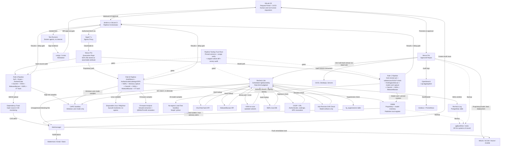

# Solution Architecture: Tooling and Implementation Guide
## Enterprise Package Intake and Approved Repository

## Document control

| Field | Value |
|---|---|
| Document title | Solution Architecture: Tooling and Implementation Guide |
| Version | 1.7 |
| Status | Draft for review |
| Owner | Security Architecture |
| Last updated | 2026-08-02 |

### Revision history

| Version | Date | Author | Summary of changes |
|---|---|---|---|
| 1.0 | 2026-04-15 | Security Architecture | Initial draft — tooling mapped to all eleven stages; Sonatype feature map; phased implementation plan |
| 1.1 | 2026-04-18 | Security Architecture | Added paid and cloud alternatives table; integration wiring diagram |
| 1.2 | 2026-04-22 | Security Architecture | Added proprietary binary tooling path; added CMDB options; added inventory data flow summary; split Stage 5 into 5a/5b |
| 1.3 | 2026-04-23 | Security Architecture | Added Stage 11b retroactive binary recheck tooling; added binary authentication tools (Authenticode, NSRL, MalwareBazaar, VirusTotal hash); updated Stage 4 to split 4a/4b; updated tooling summary table; updated integration wiring diagram; added publisher certificate thumbprint register to CMDB requirements; updated phased rollout |
| 1.4 | 2026-08-01 | Security Architecture | Added Stage 4c/5c tooling for AI/ML model artifacts (Path C); added macOS and Linux platform signing tools alongside Authenticode; added pipeline tooling supply-chain pinning practices; added push-remediation tooling for Stage 10; added Stage 11b rate-limit budgeting, false-positive suppression schema, and pipeline-admin segregation of duties; added backup/DR tooling; added Phase 7 for Path C rollout; added "Open issues for internal review" section mirrored from the architecture document |
| 1.5 | 2026-08-02 | Security Architecture | Scoped macOS code-signing tooling as optional/build-on-demand based on confirmed enterprise estate (Windows desktops, mixed Windows/Linux servers, Linux developer IDEs); moved the macOS rollout item out of the Phase 7 critical path; Windows (Authenticode) and Linux (GPG/RPM/DEB) tooling remain baseline |
| 1.6 | 2026-08-02 | Security Architecture | Addressed `architecture-tooling-review.md` findings: added licensing/edition decision matrix; corrected NSRL, VirusTotal, Repository Firewall/evidence-database, WSUS/Update Catalog, and Dependency-Track claims; replaced blanket CAPE mandate with per-platform analysis profiles; fixed the trust-root section's own `curl \| sh` install pattern; added ML-BOM tooling for models; added model-sandbox resource limits and Stage 2 SSRF hardening; added signature-verification nuance |
| 1.7 | 2026-08-02 | Security Architecture | Replaced the inline "Open issues for internal review" section with a pointer to the new `adr/` directory per ADR-0002 |

> **9 architecture decisions are still open** and are not yet reflected as final in this document, including whether the tool choices below should be built as described, bought from commercial vendors, or partially replaced under a hybrid sourcing strategy — see [ADR-0012](adr/0012-build-vs-buy-vs-hybrid-sourcing-strategy.md) and [`enterprise-build-vs-buy-evaluation.md`](enterprise-build-vs-buy-evaluation.md). See [`adr/README.md`](adr/README.md) for the full register, or jump to [Open decisions](#open-decisions) at the bottom of this document.
>
> **Scope:** This document identifies the specific tools, packages, and integration points required to implement the controlled package intake architecture. It is organised by workflow stage and includes a recommended stack, alternatives, licensing notes, and integration guidance.
>
> **Preference:** Free, self-hosted tools are the primary recommendation *within this document*. Paid and commercial options are noted separately where they offer meaningful capability advantages. This is a tooling-selection preference for a "build" implementation, not a claim that building is the right sourcing strategy — that prior question is evaluated in [`enterprise-build-vs-buy-evaluation.md`](enterprise-build-vs-buy-evaluation.md), which reaches a *hybrid* recommendation (buy mature commercial capability where it exists, build only the thin enterprise-specific control plane) still pending decision as [ADR-0012](adr/0012-build-vs-buy-vs-hybrid-sourcing-strategy.md). Read this document as "how to build the build portion," not as an argument that building is preferable to buying.
>
> **Platform scope:** The confirmed enterprise estate is Windows desktops, a mix of Windows and Linux servers, and Linux developer IDEs — no macOS fleet has been confirmed. Windows (Authenticode) and Linux (GPG/RPM/DEB) tooling in Stage 4b are baseline requirements. macOS (`codesign`/notarization) tooling is documented for completeness wherever it appears in this guide but is **optional, build-on-demand** — implement it only if a macOS artifact or endpoint population actually enters scope.
>
> **Key distinction — four concerns, four toolsets:**
> - Stages 4a/5a/11a: Open-source SBOM path — Syft, Grype, Dependency-Track.
> - Stages 4b/5b: Proprietary binary vendor-advisory path — sha256sum, platform signature verification (Authenticode/GPG as baseline, codesign as optional), NSRL, vendor advisory scripts, CMDB.
> - Stages 4c/5c: AI/ML model artifact path — hub revision pinning, `safetensors`/GGUF format enforcement, pickle static-scan exception handling, model card capture, CMDB/model registry.
> - Stage 6 and 11b: Binary recheck for all artifact types — ClamAV, YARA, MalwareBazaar, VirusTotal hash API, NSRL, CAPE sandbox or model load-test sandbox. This stage addresses supply chain attacks where a trojanised binary, or a model resolved through a drifted mutable source reference, has a correct version string and no published CVE — a class of threat invisible to SBOM-based tools.
>
> A fifth, cross-cutting concern — the integrity of the scanning tooling itself — is addressed under "Pipeline tooling supply chain" rather than folded into any single stage.

---

## Tooling summary by stage

| Stage | Primary tool (self-hosted free) | Sonatype / Nexus Pro capability | Paid / cloud alternative |
|---|---|---|---|
| 1 · Request and approval | GitLab CE or OpenProject | Nexus IQ policy intake via API | Jira Cloud, ServiceNow |
| 2 · Restricted egress proxy | Squid 7.x + iptables/nftables | Nexus proxy repositories | Zscaler Internet Access, Palo Alto NGFW |
| 3 · Quarantine repository | Nexus Pro (quarantine capability) | **Native: Firewall Quarantine** | Artifactory Pro |
| 4a · Integrity — open source | cosign, sigstore, sha256sum, Authenticode check | Nexus IQ provenance checks | Chainguard, Sigstore Public Good |
| 4b · Integrity — proprietary | sha256sum, osslsigncode / signtool (baseline), gpg / rpm --checksig (baseline), codesign (optional, on demand), NSRL lookup | Nexus component hash attributes | — |
| 4c · Integrity — AI/ML model | huggingface_hub API (revision pinning) + fickling / picklescan + safetensors validator | Nexus component hash attributes | — |
| 5a · SBOM and SCA — open source | Syft + Grype + Dependency-Track | Sonatype Lifecycle (IQ Server) | FOSSA, Anchore Enterprise |
| 5b · Vendor advisory — proprietary | Custom pipeline script + Nexus tags + CMDB | Nexus Pro custom metadata API | ServiceNow CMDB integration |
| 5c · ML-BOM and model card capture — AI/ML | cyclonedx-python-lib (ML-BOM) + custom pipeline script + evidence DB + CMDB/model registry | Nexus Pro custom metadata API | MLflow Model Registry |
| 6 · Malware and sandbox | ClamAV + YARA + MalwareBazaar + NSRL, plus per-platform profile: CAPE (Windows), disposable syscall-monitored Linux VM/gVisor, binwalk/QEMU (firmware), model load-test harness | Nexus IQ malware intelligence | Recorded Future Sandbox, ANY.RUN (Windows-scope only) |
| 7 · Cooling-off delay | Custom Jenkins/GitLab pipeline gate | IQ Server policy age rules | — |
| 8 · Test pipeline | Jenkins or GitLab CI, isolated runners | — | GitHub Actions (private runners) |
| 9 · Promotion review | GitLab MR approvals or Jenkins gates | IQ Server promotion workflows | — |
| 10 · Consumption and inventory | Nexus Pro + Dependency-Track (open source) + CMDB (proprietary and model) + push-remediation via WSUS/Intune/Ansible | **Native: approved repositories** | Artifactory Pro |
| 11a · CVE recheck — open source | Dependency-Track + Prometheus/Grafana/Alertmanager | Sonatype Lifecycle continuous scan | Snyk, JFrog Xray |
| 11a · CVE recheck — proprietary | Vendor bulletin RSS + NVD CPE watches + WSUS/Intune | — | Microsoft Sentinel, Splunk |
| 11a · CVE recheck — AI/ML model | Hub API revision-drift poll + model-card watch | — | — |
| 11b · Binary recheck — all types | Scheduled job: VT hash API + MalwareBazaar + YARA + NSRL + platform signature OCSP/revocation + CAPE on IOC + model hub-revision drift; rate-limit budgeted, false-positive suppression aware | — | ReversingLabs TitaniumCloud, Recorded Future |
| Pipeline tooling trust root | Pinned tool versions + cosign signature verification on updates + canary-sample self-audit job | — | — |

---

## Licensing and edition decision matrix

This document's "self-hosted free" framing is a starting point, not a guarantee that every mandatory control in the architecture is enforceable on a free/community-edition tier. Several tools recommended below have a free edition that covers day-to-day use but omits the specific feature this architecture treats as a *mandatory* control — most importantly, GitLab CE does not actually enforce the required-approval promotion gate the architecture depends on. Before procurement, walk every row below and confirm which side of the line the organisation is choosing to stand on, deliberately rather than by default.

**Decision framework:** for each tool, ask (1) does the free/CE tier fully implement every *mandatory* control this architecture assigns to it, not just the workflow in general; (2) if not, is there a free/CE-native workaround (e.g., a scripted gate) that closes the gap without a licence; (3) if the workaround is itself a meaningful engineering investment, is that investment cheaper than the licence over the planning horizon; (4) does the paid tier unlock capabilities (HA, SSO federation, staging, vulnerability intelligence) that this architecture will need regardless of the specific control gap. Licence terms and feature boundaries change — verify current feature-tier placement against the vendor's own documentation before final procurement, don't rely on this table's specifics as of any date after publication.

| Tool | Free / CE tier limitation relevant to this architecture | What the paid tier unlocks | Recommendation |
|---|---|---|---|
| **GitLab CE** (request portal, promotion gate) | Merge request approvals are optional and advisory — CE does not block a merge for missing approvals, does not prevent an author approving their own change, and does not reset approvals on new commits. This architecture's Stage 9 promotion gate and segregation-of-duties requirement are **not enforced** on CE as literally described. | GitLab Premium/Ultimate adds required approval rules, protected-branch approval enforcement, prevention of author self-approval, and approval reset after new commits — a native, vendor-supported enforcement path. | Choose one deliberately: (a) licence Premium/Ultimate and configure required approvals as a true gate, or (b) stay on CE and replace "GitLab MR approval" with a protected-branch CI status check that calls an external approval-record service and only allows a restricted service account to merge after it passes (see Stage 9 and control C1-equivalent fix below). Do not describe native CE approvals as a production control either way. |
| **Nexus Repository** (quarantine repo, approved repos) | Nexus Repository OSS covers basic hosted/proxy/group repositories but lacks staging workflows, several blob store and HA options, and enterprise identity integration that this architecture's Stage 3/9/10 promotion and replication requirements assume. Exact feature boundaries between OSS and Pro should be verified against Sonatype's current edition comparison, not assumed from this table. | Nexus Repository Pro adds staging repositories, additional blob store backends, LDAP/SAML integration, and HA clustering. | Nexus Pro is effectively required for this architecture's promotion-state and HA requirements regardless of the quarantine question below — budget for it as a baseline cost, not an optional upgrade. |
| **Sonatype Repository Firewall** (component quarantine and intelligence) | Not included with Nexus Repository Pro. Repository Firewall is a separately licensed capability (via IQ Server) that quarantines components fetched through *proxy* repositories against Sonatype's component intelligence. It does not, by itself, provide a generic immutable evidence store for arbitrary installers, firmware, or model files that don't come through an ecosystem proxy — see "Repository Firewall vs. the enterprise intake evidence store" below. | Automated quarantine-on-fetch and component risk intelligence for proxied open-source ecosystems. | Licence Repository Firewall only if automated proxy-layer quarantine for open-source ecosystems is in scope; it is not a substitute for, and should not be budgeted as covering, the custom intake evidence store this architecture needs for proprietary/firmware/model artifacts. |
| **VirusTotal** (hash reputation lookups) | Public API: 500 lookups/day, and its terms restrict commercial/automated business-workflow use — see the VirusTotal-specific caveats above and [ADR-0004](adr/0004-virustotal-public-api-usage-and-licensing.md). | Premium API: higher/bulk rate limits, licensed for commercial automation. | Budget for Premium once inventory growth or the ToS question forces the issue — track both triggers, not just the rate limit. |
| **CAPE Sandbox** | Free/GPL and self-hosted, but it detonates samples inside Windows guest VMs — those guest OS licences are a real, easy-to-miss cost that "free tooling" framing can obscure. Confirm Windows guest licensing (volume licensing, MSDN/Visual Studio subscription, or equivalent) is budgeted before treating CAPE as a zero-cost control. | N/A — CAPE itself has no paid tier; commercial sandboxes (ANY.RUN, Joe Sandbox) are the paid alternative, priced to include guest OS licensing. | Budget Windows guest OS licensing explicitly alongside CAPE infrastructure costs; do not list CAPE as "free" without that caveat. |
| **OWASP Dependency-Track** | Fully free (Apache 2.0) at every tier; no feature gate relevant to this architecture. | Sonatype Lifecycle is the commercial alternative, not a paid tier of Dependency-Track — it replaces rather than upgrades it. | No licensing decision needed unless evaluating Sonatype Lifecycle as a full replacement for Syft + Grype + Dependency-Track. |

---

## Stage 1 · Request and approval portal

The portal is the primary interface for teams to submit intake requests and for security reviewers to approve, reject, escalate, or set expiry on approvals. The artifact type field drives which pipeline path is executed downstream and which Stage 11b recheck controls apply.

### Recommended self-hosted free option

**GitLab Community Edition (CE)** is the preferred choice. GitLab CE is free under the MIT licence, fully self-hosted, and provides issue templates, approval rules, label-based workflow state, webhooks, and a REST API.

Key capabilities used:
- Issue templates with required fields: package name, version, source URL, checksum if available, **artifact type** (open-source / proprietary binary / firmware), justification, owner, target environment, review date.
- The artifact type field determines Path A (SBOM) or Path B (vendor advisory) and the applicable 11b recheck schedule.
- Label-based state machine for workflow stages.
- Milestone or due-date field for expiry tracking.
- RBAC for separation of duties — requestor cannot self-approve for production.
- LDAP or SSO integration via Keycloak.

**Alternative self-hosted free:** OpenProject (GNU GPL v3).

**Paid alternatives:** Jira Cloud (note: Jira Server EOL February 2024; Data Center EOL March 2029), ServiceNow.

---

## Stage 2 · Restricted egress proxy

**Squid 7.x** (open source, GPL) deployed on a hardened Linux host. Do not use the deprecated pfSense Squid package.

For proprietary binary downloads, allowlist specific vendor domains individually (e.g. `catalog.update.microsoft.com`, `download.adobe.com`) rather than broad TLD rules.

Dependency-confusion prevention for open-source: allowlist required upstream registry domains; block requests where URL path matches an internal namespace directed at a public registry; log all denied requests to OpenSearch.

### SSRF hardening

A domain allowlist alone does not stop an allowlisted domain from redirecting to an internal address, or a hostname resolving to an internal IP at fetch time (DNS rebinding) even though it resolved externally when the domain was allowlisted. This proxy is a server-side fetcher acting on requestor-supplied URLs — treat it as an SSRF-relevant component and add these controls on top of the domain allowlist:

```
# Squid ACLs — block RFC1918/link-local/loopback/metadata-service destinations
# regardless of the requested hostname, so a rebound or redirected DNS answer
# can't route the fetch to an internal target.
acl internal_dst dst 10.0.0.0/8 172.16.0.0/12 192.168.0.0/16 127.0.0.0/8 169.254.0.0/16
http_access deny internal_dst

# Cap redirects and enforce TLS verification
follow_x_forwarded_for deny all
```

Squid's ACLs operate on resolved destination IPs per-request, which covers the DNS-rebinding case as long as `internal_dst` is evaluated on every hop of a redirect chain, not only the initial request — verify this against the deployed Squid version's redirect-handling behaviour, since default configurations vary. Where stronger guarantees are needed, front the actual download with a small custom fetch service (rather than relying on Squid alone) that: resolves the hostname, validates the resolved IP against the same internal-range denylist, connects directly to that validated IP while still presenting the original hostname for TLS SNI/hostname verification (preventing a rebind between validation and connection), and re-validates on every redirect hop rather than only the initial URL. Log DNS resolution, TLS certificate details, the full redirect chain, and response headers as acquisition evidence for every fetch, not just the final destination.

**Complementary:** iptables or nftables on all endpoints blocking direct outbound TCP 443 and TCP 80 except to the Squid proxy IP.

**Alternative:** OPNsense (BSD, free) with built-in Squid proxy.

**Paid alternative:** Zscaler Internet Access or Palo Alto Networks NGFW.

---

## Stage 3 · Quarantine repository

**Two separately licensed capabilities are in play here, and one product does not automatically provide both:**

**Sonatype Repository Firewall** (via IQ Server, licensed separately from Nexus Repository Pro — see the licensing matrix above) quarantines components requested through *proxy* repositories (npm, PyPI, Maven, apt/yum) against Sonatype's component intelligence. It covers Path A's ecosystem-proxied artifacts. It does not provide a generic quarantine/evidence capability for proprietary binaries, firmware, or model files fetched as raw/hosted downloads rather than through an ecosystem proxy — those need capability 2 below regardless of whether Repository Firewall is licensed.

**Nexus Repository Pro hosted/raw repositories** provide the immutable intake evidence store used by every artifact type, including everything Repository Firewall's proxy-layer quarantine doesn't reach. This is the capability the rest of this section, and the SHA-256 indexing requirement below, describes.

The SHA-256 hash stored as a component attribute in Nexus is the primary key used by the Stage 11b retroactive recheck job to query VirusTotal, MalwareBazaar, and NSRL. It is critical that hashes are stored as searchable component attributes, not only as file checksums, so the recheck job can retrieve them in bulk via the Nexus REST API without downloading every binary. Reserve Nexus tags for compact lookup/lifecycle values only — see "Per-artifact evidence database" below for where the full provenance record lives.

Lifecycle repository groups:
- `intake-quarantine` — initial staging, no consumer access.
- `intake-dev-approved` — cleared for development use.
- `intake-prod-approved` — cleared for production use.

### Per-artifact evidence database

Nexus's Tags API applies compact key-value tags at the **component** level — it is not a strongly typed per-asset database, and one Nexus component can contain multiple assets (a Maven component's jar/pom/sources, a multi-arch container image's per-platform manifests). Do not model the full provenance record — requestor, approver, every scan verdict, every recheck-history entry — as ad hoc Nexus tags invented per pipeline script. Stand up a separate evidence database (a PostgreSQL schema is sufficient) keyed by repository, format, component coordinates, asset path, and SHA-256, and treat it as the authoritative store for everything except the small set of compact tags (`intake-ticket-ref`, `lifecycle-state`, `risk-tier`, and similar) that Nexus tags are actually suited for. Define this schema once, formally, rather than letting each pipeline stage's script invent its own tag names — the examples elsewhere in this document showing `PUT .../components/{id}/tags` with rich JSON payloads are illustrative of *what* to capture, not a literal recommended implementation against Nexus's real Tags API; validate the real call shape against the Swagger specification generated by the deployed Nexus instance before implementing.

---

## Stage 4a · Integrity and authenticity — open-source path

**cosign** (Sigstore, Apache 2.0): sign and verify container images and arbitrary blobs; attach SLSA provenance attestations.

**sha256sum / sha512sum** (GNU Coreutils): checksum verification against publisher-provided hashes.

**in-toto** (Apache 2.0): supply chain attestation recording who fetched, scanned, and approved each artifact.

**Sigstore Rekor** (Apache 2.0): transparency log for signed attestations.

**Authenticode verification for Windows PE binaries (open-source tools):** Even open-source Windows tools such as Notepad++ publish Authenticode-signed releases. Verify the signature and compare the certificate thumbprint against the expected publisher thumbprint stored in the CMDB. Use `osslsigncode verify` (Linux) or `signtool verify` (Windows) in the pipeline.

```bash
# Linux pipeline — verify Authenticode signature using osslsigncode
osslsigncode verify -in notepadplusplus_installer.exe
# Returns exit code 0 if valid, non-zero if invalid or unsigned
```

**Dependency-confusion check scripts:** Python or Bash scripts blocking promotion on namespace collision.

**GPG / GnuPG**: verifying PGP-signed apt/rpm packages and Maven artifacts.

---

## Stage 4b · Integrity and authenticity — proprietary binary path

**sha256sum:** Compare the downloaded SHA-256 against the vendor's published catalog hash. Hard block on mismatch.

**Authenticode / code signing verification (Windows):** All Windows PE binaries must have their Authenticode signatures verified and certificate thumbprints compared against the expected publisher value stored in the CMDB publisher certificate register.

```powershell
# PowerShell — verify Authenticode on test Windows host in isolated pipeline
$sig = Get-AuthenticodeSignature -FilePath $artifactPath
if ($sig.Status -ne "Valid") { throw "Authenticode invalid: $($sig.Status)" }
$actual = $sig.SignerCertificate.Thumbprint
$expected = Get-CMDBThumbprint -Publisher $publisherName
if ($actual -ne $expected) { throw "Cert thumbprint mismatch. Expected $expected, got $actual" }
```

For Linux pipeline use `osslsigncode verify -in binary.exe` to check signature validity without a Windows host.

**Code signing and notarization verification (macOS) — optional, build on demand:** not part of the baseline rollout given the confirmed enterprise estate (Windows desktops, Windows/Linux servers, Linux developer IDEs). Documented here so the pipeline has a ready-made path if a macOS artifact or endpoint population is ever confirmed in scope; until then, skip Phase 7 item 33 below and let a submitted macOS artifact fall back to hash verification plus Tier 1 cooling-off, the same fallback already used for any unsigned vendor artifact. If built, `.pkg`, `.dmg`, and `.app` artifacts are verified with the native `codesign` and `spctl` tools, run on a macOS build agent in the pipeline (a Linux-only pipeline cannot fully verify Apple notarization tickets — a macOS build agent is itself new infrastructure this estate does not currently need).

```bash
# Verify signature validity and extract Team ID
codesign --verify --deep --strict --verbose=2 "$artifactPath"
actual_team_id=$(codesign -dv --verbose=4 "$artifactPath" 2>&1 | grep "TeamIdentifier" | cut -d= -f2)
expected_team_id=$(get_cmdb_team_id "$publisherName")
if [ "$actual_team_id" != "$expected_team_id" ]; then
    echo "Team ID mismatch. Expected $expected_team_id, got $actual_team_id"; exit 1
fi

# Verify notarization
spctl --assess --type execute --verbose "$artifactPath"
```

**Package and binary signature verification (Linux):** the correct mechanism depends on how the artifact was obtained, not one universal Linux tool. RPM packages carry their own embedded signature. DEB packages fetched through a repository are trusted via the repository's signed `InRelease`/`Release.gpg` metadata — most individual DEB packages are not signed with `dpkg-sig` at all, so treat that as the exception path for standalone vendor `.deb` downloads that happen to be signed that way, not the default. Standalone ELF binaries or tarballs are verified with a detached GPG signature where the vendor provides one.

```bash
# RPM: the package's own embedded signature
rpm --checksig vendor-package.rpm

# APT repository metadata — the actual trust root for repo-installed DEB packages
gpg --verify InRelease  # or the modern keyring-based apt verification equivalent

# Standalone DEB (uncommon to be signed this way — check for a detached GPG
# signature instead if dpkg-sig verification isn't applicable)
dpkg-sig --verify vendor-package.deb

# Standalone ELF binary or tarball distributed with a detached GPG signature
gpg --verify vendor-binary.tar.gz.sig vendor-binary.tar.gz
```

**NSRL reference-corpus lookup (Stage 4b):** NIST distributes the current NSRL Reference Data Set as RDSv3 SQLite files. Query the SQLite file directly, or ETL it into a shared PostgreSQL instance via a documented, versioned import job if consolidating with other reference data — verify the exact table/column names against the RDSv3 schema documentation for the release in use, since it has changed across NSRL versions. A match is evidence supporting identification and provenance, not proof the file is currently safe — treat it the same as any other reference-corpus hit, not a security clearance. Absence from NSRL is not a block — niche or internal tools may not be indexed — and the result (including the dataset version used) is recorded in Nexus metadata regardless of outcome.

```python
def check_nsrl(sha256_hash: str, nsrl_db, dataset_version: str) -> dict:
    # Table/column names must be verified against the current RDSv3 schema — illustrative only.
    cursor = nsrl_db.execute(
        "SELECT file_name, product_name, product_version FROM file_entry WHERE sha256 = ?",
        (sha256_hash.upper(),)
    )
    row = cursor.fetchone()
    if row:
        return {"status": "present_in_nsrl", "product": row[1], "version": row[2], "dataset_version": dataset_version}
    return {"status": "not_present", "dataset_version": dataset_version}
```

**Vendor catalog integration scripts:** the Microsoft Update Catalog does not expose a documented, supported public REST API — do not build this integration by scraping the Catalog website. Use the supported channels instead: the **MSRC CVRF/CSAF API** for machine-readable advisory data (CVEs addressed, severity, affected products) keyed by KB number, and **WSUS's own catalog synchronisation** (via the WSUS API or PowerShell `Get-WsusUpdate`/`Approve-WsusUpdate` cmdlets) to resolve and import a specific Update ID — WSUS, not this pipeline, is the system that actually fetches and validates update content from Microsoft. For non-Microsoft vendors, use whatever documented vendor interface exists (a published manifest, advisory feed, or partner API); if none exists, capture the hash from the vendor's published download page manually as part of the intake ticket rather than scripting fragile scraping against an unsupported page.

---

## Stage 4c · Integrity and authenticity — AI/ML model artifact path

Model artifacts have no code-signing equivalent. The authenticity control is provenance pinning against the source hub plus a mandatory serialization-format check, since the primary risk is deserialization code execution, not a tampered binary evading a signature check.

**huggingface_hub (or equivalent hub client library):** resolves and pins the exact commit SHA for a model reference at intake, rather than accepting a mutable branch or tag.

```python
from huggingface_hub import HfApi

def resolve_pinned_revision(repo_id: str, requested_ref: str) -> str:
    api = HfApi()
    info = api.model_info(repo_id, revision=requested_ref)
    return info.sha  # exact commit SHA — this is what gets pinned, not requested_ref

def get_hub_file_hashes(repo_id: str, revision: str) -> dict:
    api = HfApi()
    files = api.model_info(repo_id, revision=revision, files_metadata=True).siblings
    return {f.rfilename: f.lfs["sha256"] for f in files if f.lfs}
```

**safetensors validator:** confirms the file is a well-formed `safetensors` container with no embedded executable payload — the format's header is JSON metadata followed by raw tensor bytes, so validation is a structural parse rather than a signature check.

```python
from safetensors import safe_open

def validate_safetensors(path: str) -> bool:
    try:
        with safe_open(path, framework="numpy") as f:
            list(f.keys())  # forces header parse; raises on malformed container
        return True
    except Exception:
        return False
```

**fickling (Trail of Bits, GPL) or picklescan:** static scanners for legacy pickle-based checkpoints (`.pt`, `.pth`, `.bin`, `.ckpt`) that flag opcodes capable of arbitrary code execution (`__reduce__`, `GLOBAL` imports of `os`/`subprocess`/`eval`) rather than plain tensor-construction calls. Required whenever a checkpoint is not `safetensors` or GGUF, regardless of file extension.

```bash
# fickling — static pickle safety scan
fickling --check-safety model_checkpoint.pt

# picklescan — alternative, scans for known-dangerous globals
picklescan --path model_checkpoint.pt
```

A scan finding any code-execution-capable opcode is a hard block, not a flagged-for-review finding — this mirrors the hash-mismatch hard block in Stage 4b, not the "flag for review" pattern used for lower-confidence signals elsewhere in this pipeline.

---

## Stage 5a · SBOM generation and SCA analysis — open-source path

**Syft** (Anchore, Apache 2.0): recommended SBOM generator. Supports 20+ language ecosystems. As of March 2026, Trivy experienced two supply chain compromises and is not recommended for production CI/CD use; use Syft instead.

```bash
syft packages /path/to/artifact.tar.gz -o cyclonedx-json > artifact-sbom.json
```

**Grype** (Anchore, Apache 2.0): recommended vulnerability scanner. Accepts Syft SBOMs. Risk scoring combines CVSS severity, EPSS exploit probability, and KEV catalog status.

```bash
grype sbom:artifact-sbom.json --output json > grype-results.json
```

**OWASP Dependency-Track** (Apache 2.0): continuous SBOM management and CVE monitoring platform. Minimum 8 GB RAM. Provides portfolio-wide visibility, where-used analysis, policy enforcement, and notifications. Used only for artifacts that have a meaningful SBOM.

**Deployment note:** Dependency-Track 5.x is container-only (no WAR/executable-JAR distribution) and requires an external PostgreSQL 14+ database — the legacy `dependencytrack/bundled` single-container image with an embedded database is a 4.x-era pattern and is not the supported 5.x architecture. Deploy the API server and frontend as separate pinned-version containers against an externally managed Postgres instance, and follow Dependency-Track's documented migration procedure when upgrading between major versions:

```yaml
# docker-compose.yml — pinned Dependency-Track 5.x, separate API server/frontend, external Postgres
services:
  dtrack-postgres:
    image: postgres:16.4
    environment:
      POSTGRES_DB: dtrack
      POSTGRES_USER: dtrack
      POSTGRES_PASSWORD_FILE: /run/secrets/dtrack_db_password
    volumes:
      - dtrack-postgres-data:/var/lib/postgresql/data
    secrets:
      - dtrack_db_password

  dtrack-apiserver:
    image: dependencytrack/apiserver:5.6.0
    depends_on:
      - dtrack-postgres
    environment:
      ALPINE_DATABASE_MODE: external
      ALPINE_DATABASE_URL: jdbc:postgresql://dtrack-postgres:5432/dtrack
      ALPINE_DATABASE_USERNAME: dtrack
      ALPINE_DATABASE_PASSWORD_FILE: /run/secrets/dtrack_db_password
    volumes:
      - dtrack-apiserver-data:/data
    secrets:
      - dtrack_db_password

  dtrack-frontend:
    image: dependencytrack/frontend:5.6.0
    depends_on:
      - dtrack-apiserver
    ports:
      - "8080:8080"

secrets:
  dtrack_db_password:
    file: ./dtrack_db_password.txt

volumes:
  dtrack-postgres-data:
  dtrack-apiserver-data:
```

Pin the `postgres`, `apiserver`, and `frontend` image tags to specific tested versions (or digests, per the pipeline-tooling pinning practice above), maintain a documented backup and migration procedure for the Postgres volume, and route version upgrades through the same tool-intake/approval control as any other pipeline dependency change.

**License analysis:** Grant (Anchore, Apache 2.0), FOSSology (GPL, self-hosted), or FOSSA (paid).

### Sonatype Lifecycle for open-source SBOM

When Sonatype Lifecycle (IQ Server) is licensed, it handles SBOM generation, SCA, and license analysis natively against 140M+ components, replacing Syft + Grype + Dependency-Track for the open-source path.

---

## Stage 5b · Vendor advisory capture — proprietary binary path

Syft-class tools cannot generate SBOM data from a closed-source binary, but that doesn't mean zero component data is ever available — accept a vendor-published SBOM where one exists (an increasingly common vendor practice under regulatory/procurement pressure), and where binary composition analysis can technically extract a partial inventory (e.g., detecting statically linked open-source libraries), capture it labeled as partial rather than dropping it. Record `coverage`, `generator`, `source`, and `confidence` fields on any such record so it's never presented as more complete than it is. A custom pipeline script captures this alongside structured vendor advisory metadata and stores the full record in the evidence database, the CMDB, and a compact pointer in Nexus.

### Pipeline script responsibilities

1. Read artifact type and vendor reference (KB number, product version) from the GitLab intake ticket.
2. Query the vendor advisory source — Microsoft MSRC API, vendor release notes — to retrieve CVEs addressed, vendor severity, and affected product scope.
3. Structure data as a JSON advisory record; write it to the evidence database (see "Per-artifact evidence database" under Stage 3), keyed by Nexus component coordinates and SHA-256.
4. Write a small number of compact Nexus tags for search/lifecycle purposes only — e.g. `advisory-kb`, `lifecycle-state` — not the full advisory record.
5. Attach the full advisory JSON to the artifact in Nexus as well, for convenience, but treat the evidence database as authoritative.
6. Create or update the CMDB entry, including the expected Authenticode thumbprint for this publisher.

### Illustrative Nexus tag example — validate against the deployed instance's Swagger spec

The example below is illustrative of *which fields* matter, not a literal recommended call — verify the actual request shape against the Tags API exposed by the Nexus Swagger UI (`/service/rest/swagger.json`) on the deployed instance, since the Tags API applies at component level and its exact schema can vary by Nexus version. Keep the tag payload itself compact; put the rich, per-field record (CVE list, full advisory text, per-signal recheck results) in the evidence database instead.

```bash
curl -u user:pass -X PUT \
  "https://nexus.internal/service/rest/v1/components/{id}/tags" \
  -H "Content-Type: application/json" \
  -d '{
    "advisory-kb": "KB5034441",
    "lifecycle-state": "intake-quarantine"
  }'
# Full record — CVE list, vendor severity, Authenticode/NSRL/MalwareBazaar results —
# goes to the evidence database keyed by component coordinates + SHA-256, not here.
```

### CMDB tooling options

**ServiceNow (paid):** Full CMDB with CI records, relationship mapping, SLA, and automated discovery. Best option if already deployed.

**GitLab CE structured database (free, self-hosted):** PostgreSQL table populated via GitLab API at promotion time. The CMDB publisher certificate thumbprint register is a table in this database mapping publisher names to expected thumbprints.

**OpenProject (free, self-hosted):** Work packages with custom fields including expected thumbprint.

**Ralph (Apache 2.0, self-hosted):** Purpose-built CMDB with REST API and Docker deployment. Suitable for organisations wanting a dedicated asset management system without ServiceNow costs.

The minimum CMDB record for a proprietary artifact: artifact name and version, Nexus reference URL, GitLab ticket reference, named owner, approval expiry, **expected platform signing identity for this publisher (Authenticode thumbprint, Apple Team ID, or GPG key fingerprint)**, vendor advisory subscription reference or NVD CPE string, deployment scope, and next review date.

---

## Stage 5c · ML-BOM and model card capture — AI/ML model path

Dependency-Track's SBOM/CVE model doesn't fit model weights, but that does not mean models have no capturable provenance data — CycloneDX defines an **ML-BOM** extension specifically for this. A custom pipeline script generates the ML-BOM and captures model card, license, and lineage metadata, mirroring the Stage 5b pattern for proprietary binaries.

### CycloneDX ML-BOM generation

CycloneDX's Python library supports authoring ML-BOM components directly; there is no single off-the-shelf "Syft for models" yet, so the pipeline script constructs the ML-BOM from the same data it already collects at Stage 4c/5c:

```python
from cyclonedx.model.bom import Bom
from cyclonedx.model.component import Component, ComponentType
from cyclonedx.model.license import License, LicenseExpression
from cyclonedx.output.json import JsonV1Dot6

def build_model_mlbom(model_repo_id: str, pinned_sha: str, sha256: str,
                       license_id: str, base_model: str | None) -> str:
    bom = Bom()
    component = Component(
        name=model_repo_id.split("/")[-1],
        type=ComponentType.MACHINE_LEARNING_MODEL,
        version=pinned_sha[:12],
        licenses=[License(license=LicenseExpression(license_id))],
    )
    # model_card, datasets, and base-model lineage fields use CycloneDX's
    # modelCard structure — see the CycloneDX ML-BOM spec for the full schema.
    bom.metadata.component = component
    bom.components.add(component)
    return JsonV1Dot6(bom).output_as_string()
```

Attach the resulting ML-BOM JSON to the Nexus artifact and the model registry entry. **Do not upload it to Dependency-Track** — Dependency-Track's vulnerability engine correlates PURLs against CVE feeds, and model weights have no equivalent CVE ecosystem to correlate against; an ML-BOM entry there would sit permanently at zero findings and misrepresent coverage the same way an empty SBOM would for a proprietary binary.

### Pipeline script responsibilities

1. Read the model repo ID and requested reference from the GitLab intake ticket.
2. Fetch the model card (README/metadata) from the hub API. Parse declared license, base-model lineage (for fine-tunes and adapters), and any declared training data provenance.
3. Record the hub's verified-organisation status for the publishing namespace.
4. Generate the CycloneDX ML-BOM as shown above.
5. Structure the model card, license, and lineage data as a JSON record; write it to the evidence database keyed by Nexus component coordinates and SHA-256, and to the model registry metadata store.
6. Write a small number of compact Nexus tags for search/lifecycle purposes only — e.g. `model-pinned-revision`, `lifecycle-state` — not the full model card record.
7. Attach the full model card JSON and ML-BOM to the artifact in Nexus as well, for convenience, but treat the evidence database / model registry as authoritative.
8. Create or update the CMDB (or model registry) entry, keyed to the pinned hub revision.

### Illustrative Nexus tag example — validate against the deployed instance's Swagger spec

As with Stage 5b, verify the actual Tags API call shape against the deployed Nexus instance's own Swagger UI before implementing — this example shows which fields matter, not a literal recommended request:

```bash
curl -u user:pass -X PUT \
  "https://nexus.internal/service/rest/v1/components/{id}/tags" \
  -H "Content-Type: application/json" \
  -d '{
    "model-pinned-revision": "a1b2c3d4e5f6...",
    "lifecycle-state": "intake-quarantine"
  }'
# Full record — hub repo ID, license, base-model lineage, publisher verification,
# serialization format, pickle-scan result — goes to the evidence database and
# model registry, keyed by component coordinates + SHA-256, not here.
```

### License classification note

Model licenses are a distinct compliance surface from OSS SPDX/CycloneDX license scanning — variants such as research-only, non-commercial, and custom "responsible AI license" (RAIL) terms are common and are not always machine-readable the way an SPDX identifier is. The Stage 5c script flags any license string it cannot map to a pre-approved list for manual legal/compliance review before Stage 9 promotion, rather than defaulting to approve.

### Model registry tooling options

**Nexus tags plus CMDB (default, no new system):** consistent with the Path B pattern; sufficient for organisations primarily consuming pre-trained models rather than doing extensive in-house fine-tuning.

**MLflow Model Registry (Apache 2.0, self-hosted):** if the organisation already runs a fine-tuning or training pipeline, a dedicated model registry gives native lineage graphs (which fine-tune came from which base model, which experiment produced which checkpoint) that Nexus tags cannot represent well. This is an implementation decision — see [ADR-0007](adr/0007-model-registry-tooling-choice.md).

---

## Stage 6 · Malware and sandbox screening

### Static screening — all artifact types

**ClamAV** (GPL): open-source antivirus daemon applied to all artifact types.

**YARA** (BSD / VirusTotal) with community rulesets: pattern matching applied to all artifact types. Update YARA rulesets from community feeds on a regular schedule — new rules published in response to discovered campaigns are the foundation of the Stage 11b re-scan.

**MalwareBazaar** (abuse.ch, free API): hash lookup at intake. A `hash_found` result is a hard block. Not finding a hash does not confirm the file is clean.

```python
def check_malwarebazaar(sha256: str) -> bool:
    resp = requests.post("https://mb-api.abuse.ch/api/v1/",
                         data={"query": "get_info", "hash": sha256}, timeout=10)
    return resp.json().get("query_status") == "hash_found"
```

**NSRL lookup** (Stage 6 cross-check): record result in Nexus metadata, including the RDSv3 dataset version used. Not a blocking control on its own — absence from NSRL is not malicious, and presence does not certify the file is currently safe — a match is provenance evidence to weigh alongside the other Stage 6 signals, not a standalone confidence booster.

**VirusTotal hash lookup** (Public API, free tier: 500 lookups/day; no file submission): safe for all artifact types including proprietary because only the SHA-256 is transmitted. Used for open-source at intake and in Stage 11b recheck for all artifact types. **Capacity flag:** Stage 11b rechecks the whole approved inventory on a recurring schedule, so the number of hashes competing for this 500/day budget only grows as more artifacts get promoted — this is not a fixed cost. The Public API's terms also restrict use in commercial/automated business workflows, which this pipeline's unattended nightly recheck arguably is, independent of whether the rate limit is ever actually hit. See [ADR-0004](adr/0004-virustotal-public-api-usage-and-licensing.md) for the procurement/licensing decision this implies.

```python
def check_vt_hash(sha256: str, api_key: str) -> int:
    url = f"https://www.virustotal.com/api/v3/files/{sha256}"
    resp = requests.get(url, headers={"x-apikey": api_key}, timeout=10)
    if resp.status_code == 404:
        return -1  # Not in VT — unknown, not confirmed clean
    return resp.json()["data"]["attributes"]["last_analysis_stats"]["malicious"]
```

### Dynamic and specialised analysis, by platform profile

Earlier revisions of this guide recommended "mandatory CAPE detonation for all proprietary binaries, drivers, and firmware." CAPE is a Windows-guest sandbox and cannot meaningfully execute Linux packages, firmware images, or kernel-mode drivers — it covers exactly one of the profiles below, not all artifact types. Select tooling by the profile the artifact actually matches, and record a PASS/FAIL/INCONCLUSIVE/UNAVAILABLE outcome for every run (see the architecture document's Stage 6 for the outcome-state definitions and fail-closed rules for INCONCLUSIVE/UNAVAILABLE).

**Windows user mode (EXE, MSI, DLL, scripts) — CAPE Sandbox** (GPL): recommended open-source dynamic analysis sandbox. Derived from Cuckoo v1 with automatic payload unpacking, config extraction, and YARA-based classification. Supports Windows 10 and 11 guests.

CAPE architecture: Ubuntu LTS host with KVM; Windows 10 or 11 23H2 VMs (budget the guest OS licence explicitly — see the licensing matrix); REST API for submission and report retrieval; reports attached to Nexus artifact records.

Data handling policy defines: artifacts eligible for CAPE (Windows user-mode proprietary binaries, high-risk open-source); artifacts restricted to private CAPE only (proprietary ISV software); artifacts ineligible for any external sandbox (classified content).

**Paid cloud alternatives (Windows user mode only):** ANY.RUN (paid tiers for private analysis), Joe Sandbox, Recorded Future Sandbox — only for artifacts cleared for external submission.

**Windows kernel mode (drivers)** — CAPE's user-mode guest does not exercise kernel-mode code paths. Use Authenticode/catalog signature verification (already mandatory at Stage 4b), static driver analysis (e.g. checking for known-dangerous IOCTLs or unsigned kernel modules), and an isolated test VM or physical test hardware where the organisation has the capacity to load and exercise the driver safely. Where none of that capacity exists, the profile outcome is **UNAVAILABLE** and the artifact fails closed per the architecture's Stage 6 rule, rather than silently skipping dynamic analysis.

**Linux (ELF, RPM, DEB, shell installers)** — reuse the same disposable, no-egress, syscall-monitored isolation pattern built for model load-testing below, with a Linux-appropriate detonation harness in place of the model loader:

```bash
# Disposable Linux detonation: no network, syscall/file/process monitoring via auditd
firejail --net=none --private --seccomp --noroot \
  auditd-wrapper.sh /tmp/sandbox-run/install-or-execute.sh
# Alternative: gVisor (runsc) or Kata Containers runtime with a Falco or eBPF-based
# syscall monitor attached, for stronger isolation than firejail's namespace sandboxing.
```

Report the same signals as the model load-test harness: child-process spawns, filesystem writes outside the sandboxed working directory, and outbound network attempts, mapped to PASS/FAIL/INCONCLUSIVE.

**Firmware (images, update capsules)** — static extraction and inspection, not full detonation in the general case:

```bash
# Static firmware extraction and inspection
binwalk -e firmware_image.bin
# Inspect extracted filesystem for embedded credentials, known-vulnerable component
# versions, and unexpected network-facing binaries.
```

Follow with vendor signature verification (already mandatory at Stage 4b) and, where the organisation has the capacity, QEMU-based emulation (the FirmAE project provides a starting point for automating firmware emulation) or dedicated test hardware to observe boot-time behaviour. Where extraction fails or emulation/test hardware isn't available, record **INCONCLUSIVE** or **UNAVAILABLE** rather than treating a successful static scan alone as a PASS.

**Containers (OCI images)** — Syft/Grype layer and SBOM analysis (Path A tooling) plus a sandboxed runtime behaviour test (run the container in an isolated namespace/network and monitor for unexpected outbound connections or privilege-escalation attempts) before promotion.

### Isolated load-test sandbox — AI/ML model artifacts

CAPE's Windows-guest design does not fit the model threat model. Instead, the model is loaded inside a disposable, no-egress container with syscall monitoring, and the pipeline asserts that loading did not spawn a child process, write outside the working directory, or attempt an outbound connection.

```python
import resource, subprocess

# Hard resource ceilings — a malicious or malformed model file can be a resource-
# exhaustion vector (decompression bomb, absurd declared tensor shape) independent
# of whether it also triggers code execution. Tune these to the largest legitimate
# model this pipeline expects to approve, not to accommodate any submitted file.
MAX_RSS_BYTES = 32 * 1024**3       # 32 GB RAM ceiling for the load process
MAX_CPU_SECONDS = 300              # 5 minutes CPU time
MAX_FILE_BYTES = 100 * 1024**3     # 100 GB max artifact size accepted for load-test
MAX_ARCHIVE_DEPTH = 3              # reject nested archives beyond this depth
MAX_COMPRESSION_RATIO = 100        # flag decompressed:compressed ratios beyond this

def _apply_resource_limits():
    resource.setrlimit(resource.RLIMIT_AS, (MAX_RSS_BYTES, MAX_RSS_BYTES))
    resource.setrlimit(resource.RLIMIT_CPU, (MAX_CPU_SECONDS, MAX_CPU_SECONDS))

def isolated_model_load_test(model_path: str, loader_script: str) -> dict:
    result = subprocess.run(
        ["firejail", "--net=none", "--private", "--seccomp",
         "--rlimit-as=" + str(MAX_RSS_BYTES),
         "--rlimit-cpu=" + str(MAX_CPU_SECONDS),
         "python3", loader_script, model_path],
        capture_output=True, timeout=MAX_CPU_SECONDS + 30,
        preexec_fn=_apply_resource_limits,
    )
    syscall_report = parse_seccomp_audit_log()
    return {
        "load_succeeded": result.returncode == 0,
        "resource_limit_exceeded": result.returncode in (-9, 137),  # SIGKILL from rlimit/OOM
        "child_process_spawned": syscall_report.get("fork_exec_count", 0) > 0,
        "filesystem_writes_outside_workdir": syscall_report.get("oob_writes", []),
        "network_attempts": syscall_report.get("connect_attempts", []),
    }

def check_archive_resource_limits(archive_path: str) -> dict:
    depth, ratio = inspect_archive_structure(archive_path)  # implementation-specific
    return {
        "archive_depth_exceeded": depth > MAX_ARCHIVE_DEPTH,
        "compression_ratio_exceeded": ratio > MAX_COMPRESSION_RATIO,
    }
```

`firejail` (self-hosted, GPL) or a disposable gVisor/Kata Containers sandbox both work; the requirement is no-egress networking, syscall auditing, and enforced resource ceilings, not a specific tool. A Docker container with `--network none`, `--memory`/`--cpus` limits, and a seccomp profile logging `execve`/`connect` syscalls is a lighter-weight equivalent if `firejail` is not already in the stack. Apply the archive-depth and compression-ratio checks before the load-test even starts, as a cheap static pre-filter against decompression bombs.

### Handling packed, obfuscated, or nested-archive samples

Static scanners cannot always fully unpack a sample — commercial packers/protectors (Themida, VMProtect) on proprietary installers, or model bundles distributed as nested archives. When ClamAV/YARA/Syft cannot complete a full static pass, the pipeline records the outcome as **INCONCLUSIVE**, not PASS, and this status forces mandatory profile-appropriate dynamic analysis (CAPE, the Linux detonation harness, firmware emulation, or the model load-test harness, as applicable) regardless of artifact type or hash reputation — an INCONCLUSIVE static result removes static scanning as a basis for skipping or de-prioritising dynamic analysis, but does not by itself block promotion the way a FAIL does.

---

## Pipeline tooling supply chain

Syft, Grype, YARA, CAPE, `fickling`/`picklescan`, and the NSRL/MalwareBazaar client code are themselves internet-sourced software that every other stage depends on for a trustworthy verdict. This section is the tooling-level implementation of the trust-root control described in the architecture document.

**Version pinning and verified installation:** every tool is installed at a pinned version, never `latest`, and **never by piping a remote install script into a shell** — including the trust-root tooling that exists specifically to prevent exactly this class of supply-chain risk. Download the release artifact and its checksum/signature as separate files from the vendor's release infrastructure, verify the signature, verify the checksum, and only then extract and install:

```bash
# Verified install — no curl | sh. Download artifact, checksum, and signature
# as separate files; verify signature and checksum; then extract.
SYFT_VERSION=1.19.0
curl -sSfLO "https://github.com/anchore/syft/releases/download/v${SYFT_VERSION}/syft_${SYFT_VERSION}_linux_amd64.tar.gz"
curl -sSfLO "https://github.com/anchore/syft/releases/download/v${SYFT_VERSION}/syft_${SYFT_VERSION}_checksums.txt"
curl -sSfLO "https://github.com/anchore/syft/releases/download/v${SYFT_VERSION}/syft_${SYFT_VERSION}_checksums.txt.sig"

# Verify the checksum file's cosign signature before trusting it
cosign verify-blob --key anchore-cosign.pub \
  --signature "syft_${SYFT_VERSION}_checksums.txt.sig" \
  "syft_${SYFT_VERSION}_checksums.txt"

# Verify the downloaded artifact against the now-trusted checksum file
sha256sum --check --ignore-missing "syft_${SYFT_VERSION}_checksums.txt"

# Only now extract and install
tar -xzf "syft_${SYFT_VERSION}_linux_amd64.tar.gz" -C /usr/local/bin syft
```

Apply the same download-verify-install pattern to Grype and every other scanner/sandbox dependency. Where a tool does not publish signed releases or checksums, pin to a specific commit hash and diff-review the change before bumping, per the version-pinning requirement above — do not fall back to an unverified pipe-to-shell installer as a convenience.

**Pin by digest, not just version tag:** container base images and GitHub Actions used anywhere in the pipeline (scanner build images, CI runner images, reusable Actions) should be pinned by immutable digest (`image@sha256:...`) or commit SHA rather than a mutable version tag, so a tag being silently repointed upstream can't change what the pipeline actually runs.

**Ruleset staging:** YARA and CAPE community rule feeds (Elastic, VirusTotal community rules) are pulled into a staging directory and diffed before promotion into the production ruleset, so a rule change is reviewable the same way a code change is.

```bash
git -C /etc/yara-staging/elastic pull
diff -r /etc/yara-staging/elastic /etc/yara/elastic > ruleset-diff-$(date +%Y%m%d).txt
# Manual or automated review of the diff gates promotion into /etc/yara/elastic
```

**Canary self-audit job:** a small, fixed set of known-malicious (from a public malware research corpus, handled per the CAPE data-handling policy) and known-clean reference samples is re-run through the full Stage 6 and Stage 11b pipeline on a schedule. A canary sample that stops flagging as malicious pages the pipeline-admin on-call rotation — it means the scanning tooling regressed or was tampered with, not that the sample changed.

```bash
# Nightly canary run, alerts via Alertmanager on any unexpected verdict change
python3 canary_audit.py --canary-set /opt/canary-samples/manifest.json \
  --expect-results /opt/canary-samples/expected-verdicts.json
```

---

## Stage 7 · Cooling-off delay

**Jenkins Pipeline** or **GitLab CI/CD** delay gate:

```python
def check_delay_gate(artifact_id, risk_tier):
    quarantine_date = nexus_api.get_quarantine_timestamp(artifact_id)
    delay_days = {"tier1": 30, "tier2": 14, "tier3": 7}[risk_tier]
    if (today - quarantine_date).days < delay_days:
        raise GateFailure(f"Cooling-off period not met: {delay_days} days required")
```

Risk tier delays: Tier 1 (privileged binaries, drivers, base images, proprietary by default): 30 days. Tier 2 (runtime dependencies, unknown publishers, commercial ISV): 14 days. Tier 3 (well-established open-source, Microsoft Patch Tuesday — by explicit policy only): 7 days.

Emergency override requires a signed exception record with a named approver, justification, and expiry date.

---

## Stage 8 · Test pipeline

**Jenkins** (MIT) or **GitLab CI/CD runners** (self-managed): isolated Docker agents or VM snapshots with no internet access.

Test steps: pull artifact from quarantine; install in isolated environment; for proprietary installers log all file system changes, registry writes, network connection attempts, and service registrations; run functional tests; sign evidence with cosign; report to Jenkins/GitLab and Dependency-Track (open-source only); block promotion if evidence cannot be produced.

---

## Stage 9 · Promotion review

**This is the control most affected by the GitLab CE licensing gap described above.** Native GitLab CE merge request approvals are optional and do not block a merge — they cannot be described as a promotion gate as written in earlier revisions of this guide. Choose one enforceable pattern:

**Option A — GitLab Premium/Ultimate:** configure required approval rules on the promotion merge request, enable "prevent approval by author," and enable "remove approvals on new commits." This is the vendor-supported path and needs no custom tooling.

**Option B — GitLab CE with a scripted enforcement gate:** since CE cannot block on approval state natively, move enforcement into a required CI status check on a protected branch:

```yaml
# .gitlab-ci.yml — required status check that blocks merge until two independent
# signed approvals exist in the external approval-record service (not GitLab's
# own approval widget, which CE does not enforce)
promotion-gate:
  stage: gate
  script:
    - approvals=$(curl -sf -H "Authorization: Bearer $APPROVAL_SVC_TOKEN" \
        "$APPROVAL_SVC_URL/artifacts/${CI_MERGE_REQUEST_IID}/approvals")
    - count=$(echo "$approvals" | jq '[.[] | select(.independent==true and .signature_valid==true)] | length')
    - if [ "$count" -lt 2 ]; then echo "Need 2 independent signed approvals, have $count"; exit 1; fi
  rules:
    - if: '$CI_MERGE_REQUEST_TARGET_BRANCH_NAME == "promotion"'
```

Protect the `promotion` branch so only a restricted service account (not individual engineers) can merge, and make `promotion-gate` a required status check on that branch. This reproduces the enforcement Premium/Ultimate provides natively, at the cost of building and maintaining the approval-record service and CI check yourself — weigh that engineering cost against a Premium/Ultimate licence per the decision framework above.

For proprietary path the promotion record confirms: vendor advisory record complete in Nexus; CMDB entry created including expected Authenticode thumbprint; vendor bulletin subscription reference documented.

Custom promotion script: verifies approval expiry; copies artifact within Nexus (not a re-download); attaches all metadata; signs promotion record with cosign; triggers CMDB update.

---

## Stage 10 · Consumption and inventory

### Open-source — Nexus Pro plus Dependency-Track

```ini
# pip
[global]
index-url = https://nexus.internal/repository/pypi-approved/simple/
trusted-host = nexus.internal

# npm
registry=https://nexus.internal/repository/npm-approved/

# Maven (settings.xml)
<mirror>
  <id>nexus-approved</id>
  <mirrorOf>*</mirrorOf>
  <url>https://nexus.internal/repository/maven-approved/</url>
</mirror>

# apt
deb https://nexus.internal/repository/apt-approved focal main
```

Enforce lockfiles and digest pinning. Dependency-Track's where-used analysis identifies which projects and release manifests reference a component — useful for scoping which teams to notify of a CVE — but it is a build/BOM relationship, not a runtime deployment inventory. Pair it with CMDB, EDR, or container/orchestration telemetry when the actual question is "which running systems have this installed right now."

### Proprietary — Nexus Pro plus CMDB plus WSUS/SCCM/Intune

**Microsoft patches specifically do not flow "WSUS pulls from Nexus."** That is not a supported Microsoft distribution pattern. The supported flow is: this pipeline's intake workflow approves the Update ID (from the Microsoft Update Catalog) and captures its catalog metadata; independent hash/signature verification happens against the catalog-published values at Stage 4b as already described; and the actual import, approval, and deployment of that Update ID happens **inside WSUS/Configuration Manager/Intune itself**, which fetch the update content directly from Microsoft — not from Nexus. Nexus stores an archival copy and the intake evidence record for audit purposes when policy requires it, but is not in the content-delivery path for Microsoft patches. See "Vendor catalog integration scripts" under Stage 4b and the corrected WSUS import step under Phase 3 below.

For non-Microsoft proprietary software (commercial ISV, drivers, firmware), Nexus does serve as the actual distribution point, and CMDB holds deployment inventory and the publisher signing-identity register.

### AI/ML model — Nexus Pro plus CMDB/model registry, keyed to pinned revision

CMDB (or a dedicated model registry) records deployment scope keyed to the pinned hub revision SHA, so a consuming application running the reviewed revision can be distinguished from one that resolved the model directly against the hub outside this pipeline.

### Push remediation tooling on recall

Recall workflows query deployment records to find systems with a recalled artifact already installed, then trigger remediation through whichever deployment tool already manages that system, rather than stopping at a notification.

```bash
# WSUS/SCCM: query compliance for the specific KB, then trigger removal/patch task
Get-WsusComputer -UpdateApprovalAction NotApproved -UpdateId $recalledKbGuid

# Intune: targeted script push to devices reporting the recalled app installed
az rest --method post --uri "https://graph.microsoft.com/beta/deviceManagement/..." \
  --body '{"deviceIds": ["..."], "scriptId": "remediate-recalled-artifact"}'

# Configuration-managed fleets (Ansible): targeted playbook against the CMDB-reported host list
ansible-playbook remediate-recalled-artifact.yml -i recalled_hosts.ini \
  -e "artifact_hash=$RECALLED_SHA256"
```

Where no push mechanism reaches a given system class (unmanaged workstations, air-gapped segments), the recall workflow still opens a tracked remediation ticket against the named owner with an SLA — this residual gap is tracked in [ADR-0005](adr/0005-push-remediation-coverage-boundary.md).

---

## Stage 11a · Continuous CVE recheck

### Open-source artifacts

**OWASP Dependency-Track** continuously re-evaluates stored SBOMs against NVD, GitHub Advisories, OSV, and other feeds. New CVE matches trigger notifications via Alertmanager to Mattermost, email, or Slack, and create GitLab recall issues.

**Prometheus + Grafana + Alertmanager** (all Apache 2.0): operational dashboards and alert routing.

### Proprietary artifacts

**Microsoft MSRC RSS feed** and **vendor security bulletin subscriptions**: primary monitoring channel. CMDB entries must record the subscription reference for each approved product.

**NVD CPE watches**: configure product watches for each approved proprietary product. Route new CVE alerts via webhook to Alertmanager.

**WSUS / SCCM / Intune compliance dashboards**: show which systems are running unpatched versions.

### AI/ML model artifacts

There is no CVE-equivalent feed for model weights. Monitoring relies on the Stage 11b hub-revision-drift recheck (below) plus, where the hub exposes one, a poll of the model card's own revision history or community discussion feed for the repo. This is a thinner monitoring channel than CVE/NVD, and is called out explicitly as a residual limitation rather than implied to have equivalent coverage.

---

## Stage 11b · Retroactive binary recheck

This stage is new as of v1.3 of this document. It addresses supply chain attacks where a binary approved months ago is later identified as malicious — a class of threat that Dependency-Track and SBOM-based tools cannot detect because they rely on CVE matching against component version strings.

The recheck job is a scheduled Python or Bash script deployed alongside the pipeline infrastructure. It runs nightly for Tier 1 artifacts (developer toolchain, privileged binaries) and weekly for all others.

### Required tooling

**Nexus REST API:** The recheck job uses the Nexus component search API to extract all stored SHA-256 hashes in bulk without downloading the binaries:

```bash
# Retrieve all component hashes from Nexus approved repositories
curl -u user:pass \
  "https://nexus.internal/service/rest/v1/search?repository=intake-prod-approved" \
  | jq -r '.items[] | {name: .name, version: .version, sha256: .assets[0].checksum.sha256}'
```

**VirusTotal hash API** (Public API free tier: 500 lookups/day; Premium tier: higher rate limits for bulk queries and licensed for commercial/business-workflow automation). This recheck runs against the *entire* approved inventory every scheduled run, not a fixed sample — the daily budget this competes for grows every time the pipeline promotes a new artifact, so treat this as an ongoing capacity trend to monitor, not a one-time sizing decision:

```python
def recheck_vt(hashes: list, api_key: str) -> dict:
    results = {}
    for sha256 in hashes:
        url = f"https://www.virustotal.com/api/v3/files/{sha256}"
        resp = requests.get(url, headers={"x-apikey": api_key}, timeout=10)
        if resp.status_code == 200:
            malicious = resp.json()["data"]["attributes"]["last_analysis_stats"]["malicious"]
            results[sha256] = malicious
        else:
            results[sha256] = -1  # Not in VT database
    return results
```

**MalwareBazaar bulk query** (free API):

```python
def recheck_malwarebazaar(sha256: str) -> bool:
    resp = requests.post("https://mb-api.abuse.ch/api/v1/",
                         data={"query": "get_info", "hash": sha256}, timeout=10)
    return resp.json().get("query_status") == "hash_found"
```

**YARA re-scan with updated rulesets:** Pull binaries from Nexus and re-scan with the latest community YARA rules. Update rulesets from Elastic YARA rules, VirusTotal community rules, and other feeds on a weekly basis. A YARA rule published today for a campaign discovered this week will match binaries approved six months ago if those binaries were part of the same campaign.

```bash
# Update YARA rulesets
git pull https://github.com/elastic/protections-artifacts /etc/yara/elastic/
# Pull approved binaries and re-scan
nexus-cli download-all --repo intake-prod-approved --dest /tmp/recheck/
yara -r /etc/yara/ /tmp/recheck/ > /var/log/yara-recheck-$(date +%Y%m%d).log
rm -rf /tmp/recheck/  # Clean up after scan
```

**NSRL recheck** (RDSv3 SQLite or ETL'd PostgreSQL, free): update the local NSRL dataset periodically from NIST and record the new `dataset_version`. Recheck all hashes against the updated dataset and log any `present_in_nsrl` / `not_present` status change for provenance history — this is not a recall signal by itself; NSRL has no malicious/benign verdict to change.

**Authenticode OCSP recheck for Windows PE binaries:** Verify that the Authenticode signing certificate used on each approved Windows binary has not been subsequently revoked. Certificate revocation is a strong signal of a compromised build infrastructure or signing key — **but a bare "revoked" OCSP response is not sufficient grounds for an automated block by itself.** A validly timestamped signature (RFC 3161) that predates the revocation is normal, expected behaviour — vendors rotate and revoke certificates routinely — not evidence of compromise. Extract and evaluate the trusted timestamp and the revocation reason code alongside the raw revocation status before deciding whether to auto-block or route to human review.

```bash
# Check certificate revocation status via OCSP using OpenSSL
openssl ocsp \
  -issuer issuer.pem \
  -cert signing_cert.pem \
  -url http://ocsp.digicert.com \
  -text
# Extract signing cert from PE binary first using osslsigncode:
osslsigncode extract -in binary.exe -certs signing_certs.pem

# Extract the RFC 3161 trusted timestamp and compare it against the revocation
# effective date — a signature timestamped before revocation should not
# auto-block on that basis alone.
osslsigncode verify -in binary.exe -verbose  # reports timestamp info alongside signature status
```

Recheck result handling for this signal (see the result-handling table below): auto-block only when the revocation reason is key-compromise **and** no valid trusted timestamp predates the revocation date; route routine-reason revocations, or revocations postdated by a valid timestamp, to human review instead.

**Targeted re-detonation on IOC alerts:** When a threat intelligence report publishes IoCs (file hashes, process names, network indicators), the recheck job cross-references the IoCs against the Nexus inventory. Any artifact matching an IoC is submitted to its platform-appropriate private analysis profile for re-detonation — CAPE for Windows samples, the disposable Linux VM for Linux samples, the load-test harness for models — before the recall decision is made.

**Model hub revision-drift recheck:** For Path C artifacts, re-resolve the current commit SHA for the reference the artifact was originally pinned from and compare it to the pinned SHA stored at intake.

```python
from huggingface_hub import HfApi

def check_revision_drift(repo_id: str, original_ref: str, pinned_sha: str) -> dict:
    api = HfApi()
    current_sha = api.model_info(repo_id, revision=original_ref).sha
    return {
        "drifted": current_sha != pinned_sha,
        "pinned_sha": pinned_sha,
        "current_hub_sha": current_sha,
    }
```

A drift result does not itself indicate the artifact stored in Nexus has changed — Nexus holds the immutable pinned file — but it flags that anything resolving the model directly against the hub (bypassing this pipeline) would now get a different, unreviewed file.

### Rate-limit budgeting

VirusTotal's free tier caps at 500 lookups/day; MalwareBazaar and NSRL have their own practical bulk-query limits. The recheck job allocates its daily query budget by risk tier so coverage degrades predictably as inventory grows, instead of silently dropping artifacts from coverage.

```python
def build_recheck_batch(inventory: list, daily_vt_budget: int = 500) -> dict:
    tier1 = [a for a in inventory if a["risk_tier"] == "tier1"]
    remaining_budget = daily_vt_budget - len(tier1)
    tier2_3 = sorted(
        [a for a in inventory if a["risk_tier"] != "tier1"],
        key=lambda a: a["last_recheck_date"]  # oldest-checked-first rotation
    )
    return {
        "vt_this_run": tier1 + tier2_3[:max(remaining_budget, 0)],
        "deferred_to_next_run": tier2_3[max(remaining_budget, 0):],
    }
```

Whether this budgeting is sufficient long-term, or the paid VT tier becomes necessary at a given inventory size, is an implementation decision — see [ADR-0004](adr/0004-virustotal-public-api-usage-and-licensing.md).

### False-positive suppression

A finding an analyst dispositions as a confirmed false positive is written to the recheck datastore with that disposition and a suppression key (hash + signal type). Subsequent runs check the suppression table before opening a new GitLab issue for the same hash/signal combination.

```python
def should_suppress(sha256: str, signal_type: str, rule_version: str, suppression_db) -> bool:
    row = suppression_db.execute(
        """SELECT rule_version_at_disposition FROM fp_suppressions
           WHERE sha256 = ? AND signal_type = ?""",
        (sha256, signal_type)
    ).fetchone()
    if row is None:
        return False
    # Suppression only holds while the matching rule/signature is unchanged
    return row[0] == rule_version
```

### Segregation of duties for the recheck job itself

Scheduling configuration, rate-limit budget allocation, false-positive disposition authority, and YARA ruleset promotion (from the staging diff described under "Pipeline tooling supply chain") are restricted to a role distinct from artifact approvers. The recommended enforcement mechanism is routing all changes to this configuration through a GitLab merge request in the recheck-job's own repository, requiring a second approver — this gives a uniform, auditable trail regardless of how granular each underlying tool's native RBAC is. Whether native per-tool RBAC should additionally be configured is an implementation decision — see [ADR-0006](adr/0006-segregation-of-duties-enforcement-mechanism.md).

### Recheck job result handling

| Signal | Automated action | Human action required |
|---|---|---|
| MalwareBazaar hash_found | Immediate block in Nexus (403); GitLab recall issue opened | Confirm block; notify affected system owners; remediate |
| VirusTotal 2+ engine detections | GitLab recall issue opened; artifact flagged but not yet blocked | Security analyst reviews; decides block or false-positive |
| VirusTotal 1 engine detection | Nexus tag updated; logged | Low priority human review |
| YARA rule match on updated ruleset | GitLab recall issue opened; flagged for review | Security analyst reviews rule context; decides action |
| Authenticode certificate revoked for key-compromise reason, no valid timestamp predating revocation | Immediate block in Nexus; GitLab recall issue opened | Confirm block; notify affected systems; obtain clean replacement |
| Authenticode certificate revoked, but valid trusted timestamp predates revocation, or reason is routine | GitLab recall issue opened; not auto-blocked | Analyst confirms this is a routine cert rotation, not a compromise indicator |
| Authenticode / codesign / GPG signing identity changed | GitLab recall issue opened | Analyst verifies whether publisher legitimately rotated their cert/key |
| NSRL presence status changed since intake | Log entry created for provenance history | Not a recall trigger — NSRL asserts identification, not current safety; informational only |
| CAPE IOC match on targeted recheck | Immediate block; GitLab recall issue opened | Confirm block; incident response process initiated |
| Model hub pinned revision drifted from current hub HEAD | GitLab recall issue opened | Analyst confirms whether the Nexus-pinned file remains the intended reviewed version |
| Finding matches a suppressed confirmed-false-positive | Recheck timestamp updated; no new issue opened | None — re-evaluates automatically if hash or rule changes |
| No signals | Recheck timestamp updated in Nexus tag | No action required |

### Recheck job datastore

All recheck verdicts are written to a dedicated PostgreSQL table:

```sql
CREATE TABLE artifact_recheck_log (
    id              SERIAL PRIMARY KEY,
    sha256          TEXT NOT NULL,
    nexus_artifact  TEXT NOT NULL,
    recheck_date    TIMESTAMP NOT NULL,
    vt_malicious    INTEGER,       -- -1 = not in VT, 0 = clean, N = engine count
    mb_found        BOOLEAN,
    yara_match      TEXT,          -- rule name if matched, NULL if clean
    nsrl_status     TEXT,          -- present_in_nsrl / not_present (informational only, not a recall signal)
    nsrl_dataset_version TEXT,     -- RDSv3 dataset version used for this recheck
    auth_signature  TEXT,          -- Good / Revoked / Unknown / Mismatch (Authenticode, codesign, or GPG)
    cape_ioc_match  BOOLEAN,
    model_hub_drift BOOLEAN,       -- NULL for non-model artifacts
    action_taken    TEXT,          -- blocked / flagged_review / clean / false_positive
    analyst_notes   TEXT
);

CREATE TABLE fp_suppressions (
    sha256                      TEXT NOT NULL,
    signal_type                 TEXT NOT NULL,   -- e.g. 'yara', 'vt', 'nsrl'
    rule_version_at_disposition TEXT NOT NULL,
    dispositioned_by            TEXT NOT NULL,
    dispositioned_date          TIMESTAMP NOT NULL,
    justification               TEXT NOT NULL,
    PRIMARY KEY (sha256, signal_type)
);
```

These tables are queryable for audit purposes: "show me all artifacts that have been rechecked in the last 30 days and their verdicts," "show me everything that was blocked by the recheck job in the last year," or "show me every suppressed false positive and who dispositioned it."

---

## Supporting infrastructure tools

| Tool | Purpose | Licence | Deployment |
|---|---|---|---|
| **HashiCorp Vault** (BSL 1.1) or **OpenBao** (MPL 2.0) | Secrets management: Nexus credentials, API tokens, signing keys, VirusTotal API key | Free self-hosted | Docker / Kubernetes |
| **Keycloak** | SSO / OIDC identity provider | Apache 2.0 | Docker / Kubernetes |
| **OpenLDAP** | LDAP directory | OpenLDAP Public Licence | Linux package |
| **OpenSearch** | Log aggregation: Squid access logs, Nexus audit logs, pipeline events, sandbox reports, recheck job logs | Apache 2.0 | Docker Compose |
| **Mattermost** | Self-hosted team messaging for alerts and recall notifications | MIT (free tier) | Docker |
| **Cosign / Sigstore** | Artifact and SBOM signing, attestation | Apache 2.0 | CLI, Docker |
| **MinIO** | S3-compatible object storage for SBOM archive, test evidence, sandbox reports, YARA ruleset archive | AGPL 3.0 | Docker / Kubernetes |
| **PostgreSQL** | Backing database for Dependency-Track, GitLab, Jenkins, Keycloak, NSRL dataset, recheck log | PostgreSQL Licence | Docker / system package |
| **Ralph** | Open-source CMDB for proprietary software inventory including publisher cert thumbprint register | Apache 2.0 | Docker |
| **osslsigncode** | Cross-platform Authenticode signature verification (Linux pipeline use) | GPL | Linux package (`apt install osslsigncode`) |
| **fickling** | Static safety scanner for pickle-based model checkpoints (Path C exception path) | GPL / LGPL (Trail of Bits) | `pip install fickling` |
| **safetensors** | Reference library for validating and reading the required model serialization format | Apache 2.0 | `pip install safetensors` |
| **firejail** or **gVisor** | No-egress, syscall-audited sandbox for the AI/ML model load-test harness | GPL / Apache 2.0 | Linux package / container runtime |
| **pgBackRest** or **restic** | Backup tooling for PostgreSQL-backed systems of record (CMDB, recheck job datastore, NSRL DB) and Nexus blob storage respectively | MIT / BSD-2 | Cron-scheduled job |
| **MLflow Model Registry** (optional) | Dedicated model lineage tracking if in-house fine-tuning volume justifies a system beyond Nexus tags plus CMDB | Apache 2.0 | Docker / Kubernetes |

---

## Inventory data flow summary

### At intake time (written by pipeline)

```
GitLab intake ticket created by requestor
    → Approval granted by security reviewer (expiry date set)
    → Webhook fires to GitLab CI / Jenkins
    → Squid proxy fetches artifact from allowlisted source
    → Artifact lands in Nexus quarantine repo with SHA-256 stored as component attribute
    → Pipeline writes initial evidence database record (compact lookup tags mirrored to Nexus):
          requestor, approver, expiry, GitLab ticket ref, risk tier, artifact type

    For open source (Path A):
        Syft generates SBOM → uploaded to Dependency-Track + attached to Nexus artifact
        Grype scans SBOM → findings uploaded to Dependency-Track
        Authenticode checked if Windows PE → result tagged in Nexus
        ClamAV + YARA + MalwareBazaar + NSRL + VT hash lookup → results tagged in Nexus
        CAPE for high-risk samples → report attached to Nexus artifact

    For proprietary (Path B):
        sha256sum verified against vendor catalog → result tagged
        Platform signature validity checked (Authenticode/codesign/GPG) → result tagged
        Signing identity extracted and compared against CMDB expected value → result tagged
        NSRL lookup → result tagged
        MalwareBazaar hash lookup → result tagged
        VirusTotal hash lookup → result tagged
        Advisory record fetched → KB/CVE/severity tagged in Nexus + advisory JSON attached
        CMDB record created including expected signing identity, advisory reference
        ClamAV + YARA → results tagged
        Profile-appropriate private dynamic analysis (mandatory) → PASS/FAIL/INCONCLUSIVE/UNAVAILABLE outcome and report attached to Nexus artifact

    For AI/ML model (Path C):
        Hub commit SHA resolved and pinned (not a mutable branch/tag) → result tagged
        Downloaded SHA-256 compared against hub-published file hash → result tagged
        Serialization format validated (safetensors/GGUF) or routed to pickle exception scan → result tagged
        fickling/picklescan static scan run on any non-safetensors/GGUF file → hard block on unsafe opcodes
        Model card, license, and base-model lineage fetched → JSON attached + summary tagged
        Publisher/org verification status recorded
        MalwareBazaar hash lookup → result tagged
        ClamAV + YARA → results tagged
        Isolated no-egress load-test sandbox (mandatory) → report attached to Nexus artifact
        CMDB/model registry record created including pinned revision SHA

    → Delay gate enforced (checks quarantine timestamp against risk tier policy)
    → Test pipeline runs in isolated environment; signed evidence attached to Nexus
    → Promotion MR raised in GitLab; both reviewers must approve
    → On approval: artifact promoted in Nexus repo groups; CMDB entry updated
```

### During Stage 11b recheck (scheduled job)

```
Nightly / weekly recheck job:
    → Nexus REST API: extract all SHA-256 hashes from approved repo groups
    → Build recheck batch: Tier 1 every run, Tier 2/3 rotated within remaining rate-limit budget
    → For each hash in this run's batch:
        Check fp_suppressions table: skip alerting (but still record check) if suppressed and rule unchanged
        VirusTotal hash API: check current detection count (within daily budget)
        MalwareBazaar API: check if now indexed as malicious
        Pull binary from Nexus to temp storage
        YARA re-scan with updated rulesets
        NSRL recheck with updated dataset
        For signed binaries: extract signing identity, check revocation status (OCSP/CRL by platform)
        For model artifacts: re-resolve hub HEAD for original reference, compare to pinned SHA
        Delete temp binary after scan
    → Compare against known IoCs from latest threat intel reports
    → For any hits: trigger CAPE targeted recheck (or model load-test re-run)
    → Write all verdicts to recheck_log PostgreSQL table
    → Update Nexus component tags with latest recheck timestamp and result
    → For any unsuppressed blocking signals: call Nexus API to block artifact; open GitLab recall issue
    → Query CMDB/WSUS/Intune/Dependency-Track for known-deployed instances of blocked artifact
    → Trigger push remediation via available deployment tool; open manual-follow-up ticket where none exists
    → Alertmanager routes recall notifications to named owners
```

### During incident response (queried by security team)

```
CVE found in open-source component (Stage 11a):
    Dependency-Track: which projects use affected component?
    Nexus: download specific approved version; view intake metadata

Post-approval compromise detected by recheck job (Stage 11b):
    recheck_log table: when was this artifact last checked; what triggered the alert?
    fp_suppressions table: was a prior related finding on this hash dispositioned, and by whom?
    Nexus component tags: what were the intake-time verdicts for comparison?
    GitLab recall issue: who is the named owner; which systems are affected?
    For open source: Dependency-Track where-used analysis
    For proprietary: CMDB deployment list + WSUS/Intune compliance status
    For model artifacts: CMDB deployment list keyed to pinned revision SHA

Specific threat intel received about a tool in use:
    Query Nexus by tool name and version for stored SHA-256
    Cross-reference against published IoC hash list
    If match: trigger immediate CAPE recheck; open GitLab recall issue
    Query CMDB or Dependency-Track for deployment scope

Suspected compromise of the pipeline tooling itself (Pipeline tooling supply chain):
    canary_audit job history: did a canary sample's verdict change unexpectedly?
    Tool version pin history (base image / provisioning script git log): what changed and when?
    cosign verification log: did any tooling update fail signature verification and get overridden?
```

---

## Complete recommended self-hosted free stack

```
Stage 1    GitLab CE                    — request portal, approval workflow, MR promotion gates
Stage 2    Squid 7.x + nftables         — egress proxy, dep-confusion enforcement, access logging
Stage 3    Nexus Repository Pro         — quarantine repo (Pro licence); SHA-256 stored as searchable attribute
Stage 4a   cosign + sha256sum + in-toto + osslsigncode  — open-source integrity, Authenticode, attestation
Stage 4b   sha256sum + osslsigncode + gpg/rpm --checksig (baseline) + codesign (optional, on demand) + NSRL + vendor catalog scripts  — proprietary hash, platform signature, NSRL
Stage 4c   huggingface_hub + safetensors + fickling/picklescan  — model revision pinning, format safety
Stage 5a   Syft + Grype + Dependency-Track  — SBOM, SCA, continuous CVE monitoring
Stage 5b   Custom pipeline script + Nexus tags + CMDB  — vendor advisory capture and inventory
Stage 5c   cyclonedx-python-lib (ML-BOM) + custom pipeline script + evidence DB + CMDB/MLflow  — ML-BOM, model card, license, lineage capture
Stage 6    ClamAV + YARA + MalwareBazaar + NSRL + VT hash (all types) + per-platform profile:
           CAPE Sandbox (Windows), disposable Linux VM/gVisor (Linux), binwalk/QEMU (firmware),
           firejail/gVisor load-test harness (models) — see analysis profiles table
Stage 7    Jenkins / GitLab CI gate     — cooling-off delay enforcement
Stage 8    Jenkins / GitLab CI + Docker isolated runners  — test pipeline
Stage 9    GitLab CE MR approvals + cosign  — promotion review gate with sign-off
Stage 10   Nexus Pro + Dependency-Track (open source) + CMDB + WSUS/Intune/Ansible (proprietary and model, incl. push remediation)
Stage 11a  Dependency-Track + vendor bulletin RSS + NVD CPE watches + hub revision poll + Alertmanager
Stage 11b  Scheduled recheck job: VT hash API + MalwareBazaar + YARA + NSRL + signature OCSP + CAPE on IoC + hub-revision drift
           Rate-limit budgeting and fp_suppressions table for coverage-at-scale and alert-fatigue control
           Recheck log: PostgreSQL tables for audit history of all verdicts and suppression dispositions
Trust root Pinned tool versions + cosign-verified updates + staged ruleset diffs + canary self-audit job

Supporting:
           Keycloak (SSO, incl. non-human service accounts), OpenBao (secrets), OpenSearch (logs),
           Mattermost (notifications), MinIO (artifact storage), PostgreSQL (databases + NSRL + recheck log),
           Ralph or ServiceNow (CMDB with publisher trust register), osslsigncode (Authenticode on Linux),
           pgBackRest/restic (backup for CMDB, recheck datastore, Nexus blob store)
```

---

## Sonatype platform feature map (Nexus Pro + Lifecycle)

| Architecture control | Sonatype native capability | Replaces / complements |
|---|---|---|
| Quarantine (Stage 3) | Repository Firewall Quarantine (IQ Server + Nexus Pro) | Replaces custom quarantine scripts |
| Dep-confusion prevention (Stage 2/4a) | IQ Server namespace confusion analysis | Complements Squid ACL rules |
| SBOM generation (Stage 5a) | Sonatype SBOM Manager (IQ Server) | Complements or replaces Syft |
| SCA / CVE analysis (Stage 5a) | Sonatype Lifecycle — 140M+ component database, EPSS, KEV | Complements or replaces Grype + Dependency-Track |
| License analysis (Stage 5a) | Sonatype Lifecycle — 2,000+ license threat categorisations | Replaces Grant / FOSSology |
| Vendor advisory capture (Stage 5b) | Not natively supported — custom script always required | Custom script required regardless |
| Model card and lineage capture (Stage 5c) | Not natively supported — custom script always required | Custom script or dedicated model registry (MLflow) required regardless |
| Malware intelligence (Stage 6) | IQ Server malware intelligence (AI + human threat intel) | Complements ClamAV/YARA; does not replace sandbox, hash lookups, or the model load-test harness |
| Continuous CVE recheck (Stage 11a) | Sonatype Lifecycle continuous evaluation and notifications | Complements Dependency-Track; does not cover model artifacts |
| Retroactive binary recheck (Stage 11b) | Not provided — custom scheduled job always required | Custom job always required regardless of commercial tooling |
| Pipeline tooling supply-chain integrity | Not provided — the platform vendor's own tooling is a separate trust question | Applies equally to Sonatype's own scanning components; canary self-audit still recommended |
| Policy engine | IQ Server — 18 default policies + 30+ customisable rules | Unifies Stages 3–9 for open-source path; does not cover Path C |

Note: Stage 11b retroactive binary recheck and the AI/ML model artifact path (Stages 4c/5c) are not provided by any current commercial repository or SCA platform surveyed for this document. Both require a custom scheduled job or pipeline script regardless of whether Sonatype Lifecycle, JFrog Xray, or another commercial tool is deployed.

---

## Paid and cloud tool options

**This table is a tactical "paid upgrade for one control area" list**, written from the build-first perspective of this document — it predates and is narrower than [`enterprise-build-vs-buy-evaluation.md`](enterprise-build-vs-buy-evaluation.md), which evaluates whole-platform commercial alternatives (JFrog's full Curation/AppTrust/Evidence suite, Sonatype Repository Firewall, OPSWAT MetaDefender, ReversingLabs Spectra Assure, ServiceNow, Palo Alto Prisma AIRS) against the complete lifecycle rather than one stage at a time. Two rows below (repository/SCA and CMDB) name products that document also covers in far more depth — treat that document as authoritative on vendor capability and this table as authoritative on "which specific paid tier plugs into which specific stage of the build-path pipeline described in this guide." The other rows (dynamic sandbox, SIEM, egress proxy/CASB) are control areas the build-vs-buy evaluation doesn't cover in the same depth, since they're general security infrastructure rather than artifact-ingress-specific.

| Control area | Paid tool | Differentiator vs. free option |
|---|---|---|
| Repository + SCA | **JFrog Artifactory Pro + Xray**, or the fuller **JFrog Curation/AppTrust/Evidence** platform | Multi-site replication, SBOM policy engine, native SCA; Curation adds pre-download policy blocking at the proxy stage — see `enterprise-build-vs-buy-evaluation.md` § 7.1 |
| Repository + SCA | **Sonatype Repository Firewall + Nexus + Lifecycle** | Proxy-stage quarantine and component intelligence for open-source ecosystems — see `enterprise-build-vs-buy-evaluation.md` § 7.2 |
| SCA / SBOM | **FOSSA** | Attorney-reviewed license database, SBOM export for procurement |
| SCA / SBOM | **Anchore Enterprise** | Commercial Syft + Grype with policy management and SSO |
| SCA / SBOM | **Snyk** | Developer-first IDE and CI integration, strong remediation guidance |
| Binary recheck / threat intel | **ReversingLabs TitaniumCloud** | Hash reputation, file analysis, and supply chain attack intelligence at commercial scale; replaces or augments VT + MalwareBazaar |
| Binary recheck / threat intel | **Recorded Future** | Threat intelligence correlation including supply chain attack campaigns; IoC feeds for Stage 11b targeted recheck |
| Proprietary final-binary assurance | **ReversingLabs Spectra Assure** | Analyses the final compiled binary without source, independent of the hash-reputation lookup above — a different ReversingLabs product line covering tampering/composition analysis and ServiceNow-integrated onboarding; see `enterprise-build-vs-buy-evaluation.md` § 7.4 |
| General file/software ingress | **OPSWAT MetaDefender MFT / Core** | Multi-engine scanning, supervised release workflow, and archive/DLP handling for arbitrary files this guide's ClamAV/YARA path doesn't natively cover at enterprise scale — see `enterprise-build-vs-buy-evaluation.md` § 7.3 |
| AI/ML model security | **Palo Alto Prisma AIRS AI Model Security** | Deserialization/backdoor/format scanning across Hugging Face, S3, and registry sources, beyond this guide's format-allowlist-plus-pickle-scan approach — see `enterprise-build-vs-buy-evaluation.md` § 7.6 |
| Dynamic sandbox | **ANY.RUN** | Interactive browser-based sandbox; paid tiers for private analysis |
| Dynamic sandbox | **Joe Sandbox** | Deep static and dynamic analysis with YARA integration |
| Egress proxy / CASB | **Zscaler Internet Access** | Cloud-native zero-trust proxy, dep-confusion rules, DLP |
| Egress proxy | **Palo Alto Networks NGFW** | On-premises NGFW with URL filtering and App-ID |
| CMDB / ITSM | **ServiceNow** | Full CMDB with ITSM integration, SLA, automated discovery, publisher cert management; also the request/approval/business-onboarding role described in `enterprise-build-vs-buy-evaluation.md` § 7.5, well beyond CMDB alone |
| SIEM | **Splunk** | Centralised log analysis, correlation rules, and recall alerting |
| SIEM | **Microsoft Sentinel** | Cloud-native SIEM; integrates with Defender for DevOps and Intune |

---

## Integration wiring summary


```mermaid
flowchart TB
    GL[GitLab CE\nRequest Portal + CI/CD\nHuman and non-human requestors] -->|Webhook on approval| JK[Jenkins or GitLab CI\nPipeline Orchestrator]
    JK -->|Authorised fetch via| SQ[Squid 7.x\nEgress Proxy]
    SQ -->|Downloads to| NQ[Nexus Pro\nQuarantine Repo\nSHA-256 stored as searchable attribute]
    NQ -->|Open-source path| SCA[Path A Pipeline\nSyft + Grype + Authenticode\n+ ClamAV + YARA + MalwareBazaar + NSRL + VT hash]
    NQ -->|Proprietary path| SCB[Path B Pipeline\nsha256sum + Authenticode/codesign/GPG\n+ NSRL + Advisory capture\n+ ClamAV + YARA + MalwareBazaar + VT hash]
    NQ -->|Model path| SCC[Path C Pipeline\nHub revision pin + safetensors/GGUF check\n+ fickling/picklescan + model card capture\n+ ClamAV + YARA + MalwareBazaar]
    SCA -->|SBOM upload| DT[Dependency-Track\nOpen-source CVE monitoring]
    SCB -->|Advisory record + signing identity| CM[CMDB\nProprietary + model inventory\nPublisher trust register]
    SCC -->|Model card + pinned revision| CM
    SCA -->|High-risk samples| CS[CAPE Sandbox\nWindows user-mode only]
    SCB -->|Windows user-mode samples| CS
    SCB -->|Linux samples| LX[Disposable Linux VM/gVisor\nSyscall-monitored, no-egress]
    SCB -->|Firmware samples| FW[Firmware Analysis\nbinwalk extraction + QEMU/FirmAE emulation]
    SCC -->|All model samples| MLT[No-egress Load-Test Sandbox\nfirejail / gVisor]
    SCA -->|Results + delay gate| JK
    SCB -->|Results + delay gate| JK
    SCC -->|Results + delay gate| JK
    JK -->|Isolated test| TRN[Test Runners\nDocker agents, no internet]
    TRN -->|Sign evidence| COS[cosign / in-toto\nAttestation]
    COS -->|MR approval gate| GL
    GL -->|Promote on approval| NP[Nexus Pro\nApproved Repos]
    NP -->|Open-source consumers| CO[CI/CD, Desktops, Servers]
    NP -->|Proprietary/model: feed deployment| WS[WSUS / SCCM / Intune / Ansible]
    DT -->|CVE alerts| AM[Alertmanager]
    CM -->|Vendor bulletin / hub advisory alerts| AM

    TT[Pipeline Tooling Trust Root\nPinned versions + cosign verify\n+ staged ruleset diff + canary audit] -.->|gates| SCA
    TT -.->|gates| SCB
    TT -.->|gates| SCC
    TT -.->|gates| RJ

    NP -->|11b: bulk hash extract via REST API| RJ[Recheck Job\nScheduled nightly/weekly\nRate-limit budgeted]
    RJ -->|Hash lookup| VT[VirusTotal hash API]
    RJ -->|Hash lookup| MB[MalwareBazaar API]
    RJ -->|Binary pull + scan| YR[YARA re-scan\nUpdated rulesets]
    RJ -->|Hash lookup| NS[NSRL local DB]
    RJ -->|Signature check| OC[OCSP / CRL\nAuthenticode, codesign, GPG revocation]
    RJ -->|Revision check| HD[Hub Revision-Drift Check\nModel artifacts only]
    RJ -->|IoC match: re-detonate| CS
    RJ -->|Suppression check| FP[fp_suppressions table]
    VT --> RJ
    MB --> RJ
    YR --> RJ
    NS --> RJ
    OC --> RJ
    HD --> RJ
    RJ -->|Write verdicts| RL[Recheck Log\nPostgreSQL table]
    RJ -->|Unsuppressed blocking hits| AM
    AM -->|Notifications| MM[Mattermost / Email / Slack]
    AM -->|Create recall issue| GL
    AM -->|Push remediation task| WS
    NP -->|Audit logs| OS[OpenSearch\nLog Aggregation]
    OS -->|Dashboards| GR[Grafana + Prometheus]

    RL -.->|Backup| BK[pgBackRest / restic\nDR for systems of record]
    CM -.->|Backup| BK
    NP -.->|Backup| BK
```

---

## Minimum viable implementation order

**Phase 1 — Foundation (weeks 1–4)**
1. Deploy GitLab CE. Create intake issue templates with artifact type field.
2. Deploy Squid 7.x with deny-by-default egress. Allowlist vendor domains for proprietary downloads.
3. Enable Nexus Pro Firewall Quarantine. Configure SHA-256 stored as searchable component attribute.
4. Configure RBAC, SSO (Keycloak), and MFA.

**Phase 2 — Open-source scanning (weeks 5–8)**
5. Deploy Syft + Grype as pipeline steps.
6. Deploy OWASP Dependency-Track. Upload initial SBOMs for existing approved open-source packages.
7. Deploy ClamAV + YARA. Integrate MalwareBazaar and VirusTotal hash lookups.
8. Enable cosign for artifact signing.
9. Set up NSRL local PostgreSQL database with initial dataset download.

**Phase 3 — Proprietary binary pipeline (weeks 9–12)**
10. Deploy osslsigncode on pipeline hosts. Write Stage 4b Authenticode verification script.
11. Stand up CMDB (Ralph or GitLab PostgreSQL table). Create publisher certificate thumbprint register with initial entries for known publishers (Microsoft, Adobe, Oracle, internal tooling).
12. Write Stage 4b vendor hash verification script with Microsoft Update Catalog API integration.
13. Write Stage 5b vendor advisory capture script with Microsoft MSRC API integration.
14. Configure the intake-to-WSUS handoff: on promotion of a Microsoft Update ID, the pipeline calls the WSUS/Configuration Manager API to import and approve that specific Update ID, which then downloads its content directly from Microsoft — WSUS is not configured to fetch from Nexus.

**Phase 4 — Full pipeline (weeks 13–18)**
15. Deploy CAPE Sandbox on a dedicated KVM host for Windows user-mode artifacts (budget the Windows guest OS licence). Stand up the disposable Linux VM/gVisor detonation harness for Linux artifacts and the binwalk/QEMU firmware analysis path for firmware artifacts. Integrate all profiles with the pipeline so every proprietary artifact resolves to a PASS/FAIL/INCONCLUSIVE/UNAVAILABLE outcome via the profile matching its platform, not CAPE alone.
16. Implement cooling-off delay gate.
17. Configure isolated Docker test runners.
18. Implement GitLab MR promotion review workflow.
19. Deploy Prometheus + Grafana + Alertmanager. Configure Dependency-Track and vendor bulletin RSS alert routing.

**Phase 5 — Stage 11b recheck job (weeks 19–22)**
20. Build the Stage 11b recheck job script. Connect to Nexus REST API for bulk hash extraction.
21. Integrate VirusTotal hash API, MalwareBazaar API, and local NSRL database.
22. Deploy updated YARA ruleset pull from community feeds on weekly schedule.
23. Implement Authenticode OCSP recheck using osslsigncode and OpenSSL.
24. Create the `artifact_recheck_log` PostgreSQL table. Wire verdict writes and Nexus tag updates.
25. Configure Alertmanager rules for MalwareBazaar hits and OCSP revocation events (immediate auto-block) and VT/YARA hits (flagged for human review).
26. Set recheck schedules: nightly for Tier 1 and developer toolchain artifacts; weekly for all others.

**Phase 6 — AI/ML model artifact pipeline (weeks 23–26)**
27. Deploy `huggingface_hub` (or equivalent hub client) integration for revision resolution and pinning at Stage 4c.
28. Deploy `safetensors` validator and `fickling`/`picklescan` for the legacy-checkpoint exception path.
29. Write the Stage 5c model card/license/lineage capture script and wire it to Nexus tags and the CMDB (or MLflow, per the "Open issues" decision).
30. Stand up the no-egress load-test sandbox (`firejail` or gVisor) for Stage 6 model detonation.
31. Add the model hub-revision-drift check to the Stage 11b recheck job.
32. Populate the pre-approved model license allowlist for the Stage 5c compliance check.

**Phase 7 — Cross-platform authentication, trust root, and remediation (weeks 27–30)**
33. *(Optional — build only if a macOS artifact or endpoint population is confirmed in scope; not required for this estate)* Deploy `codesign`/`spctl` verification on a macOS build agent for Path B macOS artifacts.
34. Deploy `gpg`/`rpm --checksig`/`dpkg-sig` verification and the publisher key register for Path B Linux artifacts — baseline, given the mixed Windows/Linux server estate and Linux developer IDEs.
35. Pin all scanner/sandbox tool versions in the base pipeline image; wire cosign signature verification into the tool-update job.
36. Stand up the canary self-audit job with an initial known-good/known-bad reference sample set.
37. Implement the Stage 11b rate-limit budgeting logic and the `fp_suppressions` table.
38. Wire push-remediation integrations (WSUS/Intune/Ansible) into the recall workflow for managed fleets; document the manual-follow-up SLA for unmanaged systems.
39. Route pipeline-admin configuration changes (ruleset promotion, trust register edits, recheck job config) through a required-second-approver GitLab merge request.
40. Configure `pgBackRest`/`restic` backup jobs for Nexus, the CMDB, and the recheck job datastore; run a test restore.

**Phase 8 — Hardening (ongoing)**
41. Tune YARA rules and Grype thresholds to reduce noise.
42. Conduct the first emergency recall drill covering CVE-triggered (11a), binary recheck-triggered (11b), and model hub-drift scenarios, including a push-remediation dry run.
43. Review and tighten Squid ACLs based on access log analysis.
44. Implement MinIO for long-term SBOM, sandbox report, and recheck log archiving.
45. Review CMDB publisher trust register quarterly — update when publishers rotate certificates or keys.
46. Review all CMDB entries quarterly to confirm owner, expiry, and deployment scope are current.
47. Review false-positive suppression counts and canary-audit history monthly, per [ADR-0009](adr/0009-alert-tuning-ownership-and-cadence.md).

---

## Open decisions

Undecided questions are tracked as **Architecture Decision Records** in [`adr/README.md`](adr/README.md), which is the single register for both this guide and `package-intake-architecture.md` — status and titles are not repeated here to avoid the two-copies problem ADR-0002 exists to solve. As of this revision: **9 open, 3 decided.**

What this table adds beyond the register is purely tooling-specific: which rollout item each open ADR blocks, so Phase 6/7 execution doesn't get ahead of a decision it depends on.

| Open ADR | Blocks |
|---|---|
| [0004](adr/0004-virustotal-public-api-usage-and-licensing.md) VirusTotal licensing | Phase 7, item 37 |
| [0005](adr/0005-push-remediation-coverage-boundary.md) Push-remediation reach | Phase 7, item 38 |
| [0006](adr/0006-segregation-of-duties-enforcement-mechanism.md) SoD enforcement mechanism | Phase 7, item 39 |
| [0007](adr/0007-model-registry-tooling-choice.md) Model registry tooling | Phase 6, item 29 |
| [0008](adr/0008-export-control-and-legal-review-routing.md) Export control routing | Stage 1 intake (no rollout item yet) |
| [0009](adr/0009-alert-tuning-ownership-and-cadence.md) Alert-tuning cadence | Phase 8 Hardening |
| [0010](adr/0010-control-id-taxonomy-and-traceability-matrix.md) Control-ID taxonomy | Whole document — explicitly deferred, blocks nothing currently scheduled |
| [0011](adr/0011-backup-rpo-rto-targets.md) Backup RPO/RTO targets | Phase 1 rollout (Nexus, CMDB, recheck datastore backup config) |
| [0012](adr/0012-build-vs-buy-vs-hybrid-sourcing-strategy.md) Build-vs-buy-vs-hybrid sourcing strategy | **Every phase in this document.** If Buy or Hybrid is selected, the tool-by-tool recommendations below (Syft/Grype, ClamAV/YARA, CAPE, GitLab CE, and most of the "Recommended stack") are candidates to be partially replaced by commercial product, not a settled implementation plan — see `enterprise-build-vs-buy-evaluation.md`. |

Close these out with a recorded decision (updating the ADR's `Status` to `Accepted` and filling in its Decision Outcome, then moving it to the "Decided" table in `adr/README.md`) before or during the rollout window it blocks. **Resolve ADR-0012 first** — it's the only one that can invalidate rather than just refine the rollout plan below.
